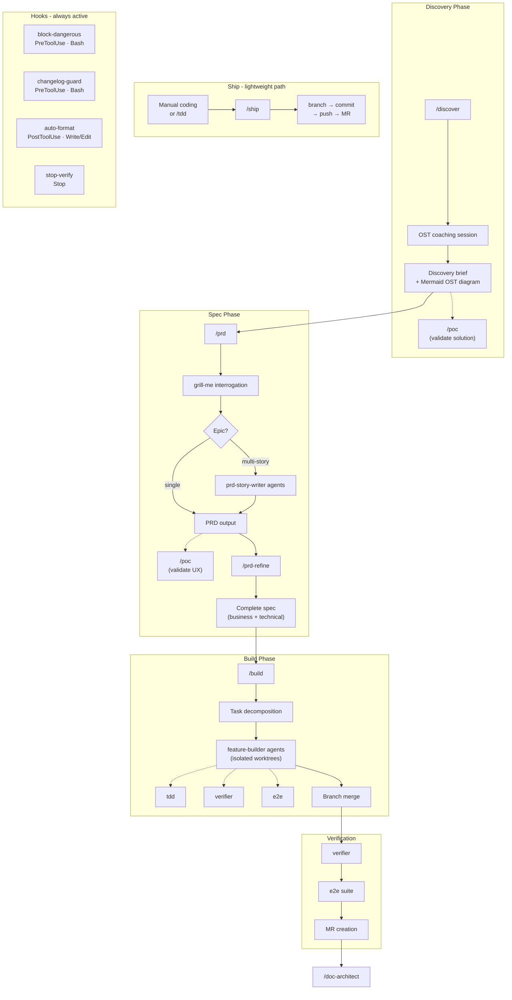

# DID Claude Plugin

Internal Claude Code plugin marketplace. Gives every repo in the org the same autonomous workflow: safety hooks, auto-format, stack-aware verification, spec-driven feature building.

## Prerequisites

- [Claude Code](https://claude.ai/code) installed and authenticated
- Git access to `https://gitlab.com/ssambar/did/did-claude-plugin.git` (ensure you are able to git clone any DID projects). If not, please refer to [configuring access](#configure-git-access)

## Quickstart

**1. Allow skills to run without permission prompts** — add to `~/.claude/settings.json` (one-time, global):

```json
{
  "permissions": {
    "allow": [
      "Read(~/.claude/plugins/marketplaces/**)",
      "Bash(bash ~/.claude/plugins/marketplaces/**)"
    ]
  }
}
```

**2. Run claude code cli** — Run in the terminal

```bash
claude
```

**3. Add the marketplace** — inside Claude Code:

```
/plugin
```

Navigate to `Marketplace` and select "Add marketplace", then paste in the Git repo:

```
git@gitlab.com:ssambar/did/did-claude-plugin.git
```

Press enter to install. It will take a while.

**4. Restart claude code cli**

As /reload-plugin does not work, we need to exit and launch Claude Code CLI again.

**4. Start using skills:**

```
/discover            # structured product discovery (optional, before /prd)
/poc my-feature      # clickable prototype (optional, after /discover or /prd)
/prd my-feature
/build my-feature
/ship                # or after manual coding
```

## Configure Git Access

### Create SSH key

1. Create SSH key in your terminal
   ```
   ssh-keygen -t ed25519 -C "give-a-name"
   ```
2. Leave all the values blank and keep pressing enter until the key is created.

3. Copy your key
   ```
   cat ~/.ssh/id_ed5519.pub
   ```
4. Go to GitLab user settings > Access
   ```
   https://gitlab.com/-/user_settings/ssh_keys
   ```
5. Add in the new SSH key and save.

### Update Port for git

1. Create a new file at ~/.ssh/config
2. In the config, paste this in:
   ```
   Host gitlab.com
     Hostname altssh.gitlab.com
     Port 443
     User git
     IdentityFile ~/.ssh/id_ed25520
   ```

### Test

1. Clone a repo and it should be successful.

## Workflow

The plugin drives a spec-to-MR pipeline with automatic safety checks running throughout.



## Plugin Contents

### Skills

| Skill               | Trigger                                                | Description                                                                                                                                                                                                                                                                                                            |
| ------------------- | ------------------------------------------------------ | ---------------------------------------------------------------------------------------------------------------------------------------------------------------------------------------------------------------------------------------------------------------------------------------------------------------------- |
| `product-discovery` | `/discover`                                            | Structured discovery using the Opportunity Solution Tree framework. Coaches outcome framing, opportunity mapping, and experiment design. Outputs a discovery brief to `docs/discovery/` that feeds into `/prd`.                                                                                                        |
| `poc`               | `/poc <name>`                                          | Generates a clickable HTML/CSS/JS prototype from a discovery brief or PRD. Tailwind-styled, realistic mock data, supports static / interactive / simulated-flow levels. Outputs to `docs/poc/{name}/`. Run after `/discover` to validate solution direction, or after `/prd` to validate UX before engineering starts. |
| `prd`               | `/prd <name>`                                          | Generates PRDs from business perspective. Runs grill-me interrogation, outputs to `docs/specs/`. Spawns `prd-story-writer` agents for epics. Optional Jira integration to create tickets and back-fill spec files with real issue keys.                                                                                |
| `prd-refine`        | `/prd-refine <name>`                                   | Enriches PRD with technical detail — API design, data model, implementation plan. Works standalone too.                                                                                                                                                                                                                |
| `build`             | `/build <name>`                                        | Executes approved spec: context → decomposition → parallel feature-builder agents → verification → MR.                                                                                                                                                                                                                 |
| `verifier`          | Auto (Stop hook) / `/verifier`                         | Stack-aware verification: format, lint, type check, tests. Node/Jest, Node/Vitest, Python, Java.                                                                                                                                                                                                                       |
| `tdd`               | Auto (feature-builder) / `/tdd`                        | Red-green-refactor TDD with vertical slicing.                                                                                                                                                                                                                                                                          |
| `grill-me`          | `/grill-me`                                            | Interactive interrogation on a plan/design until shared understanding.                                                                                                                                                                                                                                                 |
| `e2e`               | Auto (build Phase 4) / `/e2e`                          | Stack-agnostic E2E runner. Detects Playwright/Cypress/custom, reports PASS/FAIL/ERROR.                                                                                                                                                                                                                                 |
| `ship`              | `/ship` / "ship it"                                    | Lightweight branch → commit → push → MR. Detects git state, picks up from the right step.                                                                                                                                                                                                                              |
| `doc-architect`     | `/doc-architect` / auto post-build                     | Generates/updates `docs/architecture.md` with Mermaid diagrams.                                                                                                                                                                                                                                                        |
| `e2e-create`        | Auto (feature-builder) / `/e2e-create`                 | Authors E2E tests (Playwright/Cypress/other) from the spec's E2E Tests table or caller description. Stack-agnostic — matches the project's exemplar. Does not run the suite (that's `/e2e`).                                                                                                                           |
| `learn`             | `/learn` / "remember for next time" / "from now on..." | Captures per-repo lessons (conventions, blockers, patterns, skill-quality) to `docs/learnings/` with a Why. Dedupes, syncs high-confidence rules into the repo's CLAUDE.md. Modes: capture (default), update, audit, remove.                                                                                           |

### Agents

| Agent               | Description                                                                                                                                                                                                     |
| ------------------- | --------------------------------------------------------------------------------------------------------------------------------------------------------------------------------------------------------------- |
| `feature-builder`   | Implements a single sub-task in an isolated worktree. Follows TDD, conventional commits. Spawned by `/build`.                                                                                                   |
| `reviewer`          | Scope-check agent. Reviews a diff against the original task spec. Reserved for future auto-wiring.                                                                                                              |
| `prd-story-writer`  | Writes one story PRD for multi-story epics. Spawned by `/prd` in parallel, one per story.                                                                                                                       |
| `learning-capturer` | Proposes learning candidates from a session's diff, verifier output, and user corrections. Runs at the end of `/build` and (optionally) `/ship`. Never writes — hands approved candidates to the `learn` skill. |

### Hooks

| Hook              | Trigger                            | Script                       | Description                                                                         |
| ----------------- | ---------------------------------- | ---------------------------- | ----------------------------------------------------------------------------------- |
| `block-dangerous` | PreToolUse (Bash)                  | `scripts/block-dangerous.sh` | Blocks destructive commands, network access, and credential reads before execution. |
| `changelog-guard` | PreToolUse (Bash)                  | `scripts/changelog-guard.sh` | Blocks commits when `CHANGELOG.md` exists but is not staged.                        |
| `auto-format`     | PostToolUse (Write/Edit/MultiEdit) | `scripts/auto-format.sh`     | Runs prettier/eslint/black/ruff on every file write.                                |
| `stop-verify`     | Stop                               | `scripts/stop-verify.sh`     | Runs type check, lint, and tests before any agent task completes.                   |

### Scripts

| Script                                    | Description                                                     |
| ----------------------------------------- | --------------------------------------------------------------- |
| `scripts/block-dangerous.sh`              | Enforces the dangerous command blocklist.                       |
| `scripts/changelog-guard.sh`              | Guards CHANGELOG.md — blocks commits when it isn't staged.      |
| `scripts/auto-format.sh`                  | Detects stack and runs the appropriate formatter.               |
| `scripts/stop-verify.sh`                  | Delegates to the verifier skill scripts.                        |
| `skills/verifier/scripts/detect-stack.sh` | Detects the project stack (Node/Python/Java).                   |
| `skills/verifier/scripts/verify.sh`       | Entry point for verification — calls the stack-specific script. |

### User Guides

Detailed usage guides for each role:

- [Product Owner Guide](docs/guides/product-owner.md) — `/discover`, `/prd`, `/grill-me`
- [Engineer Guide](docs/guides/engineer.md) — `/prd-refine`, `/build`, `/tdd`, `/verifier`, `/e2e`, `/doc-architect`

## Per-Repo Learnings Contract

The `learn` skill and `learning-capturer` agent write to a standard location in **each target repo** so the team's accumulated judgment travels with the code rather than with a person or a tool:

```
<target-repo>/
├── CLAUDE.md                       # active ruleset — gains a `## Learnings` section for high-confidence rules
└── docs/
    └── learnings/
        ├── INDEX.md                # one-line-per-file pointer; scanned first
        ├── convention-*.md         # team decisions ("we use CSS modules")
        ├── blocker-*.md            # dead-ends + what was tried
        ├── pattern-*.md            # reusable project-specific building blocks
        └── skill-*.md              # recurring corrections to a did-workflow skill
```

Each learning file carries `name`, `description`, `type`, `captured` date, and `source` in frontmatter, plus `Why:` and `How to apply:` in the body. Commit these files alongside code — they're team artifacts, not tool state. High-confidence rules (user said "always", "never", "from now on", or explicitly approved) are also surfaced as a bullet in CLAUDE.md's `## Learnings` section so every session picks them up with zero extra reads.

This is distinct from Claude's **personal auto-memory** (per-user, cross-repo — lives under `~/.claude/projects/.../memory/`). Personal preferences ("I always want to see diffs before committing") go there; team/repo conventions go in `docs/learnings/`. Rule of thumb: **follows the human → auto-memory; follows the code → `docs/learnings/`.**

## Updating the Plugin

For auto update:

1. In Claude CLI, go to plugins.
2. Select `Marketplaces`
3. Select `did-claude-plugins`
4. Select `Enable auto-update`

To force update:

1. In Claude CLI, go to plugins.
2. Select `Marketplaces`
3. Select `did-claude-plugins`
4. Select `Update marketplace`

## Contributing

Improvements go through PRs to this repo. The plugin is versioned — teams can pin to a version in their settings.

See `docs/did-claude-plugin-workflow.md` for full design documentation.
