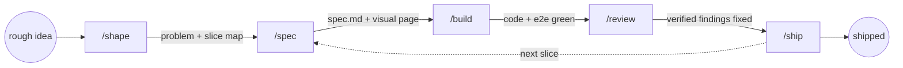
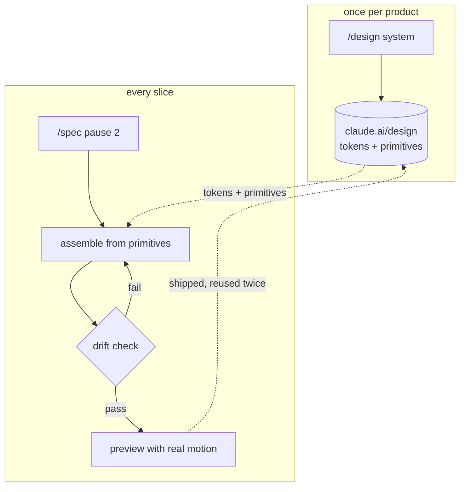

# dzafran-claude-plugins

Personal Claude Code plugin marketplace. One plugin: **zuko**.

## zuko

Idea to shipped, one vertical slice at a time.


```mermaid
flowchart LR
    I((rough idea)) --> SH["/shape"]
    SH -- "problem + slice map" --> SP["/spec"]
    SP -- "spec.md + visual page" --> B["/build"]
    B -- "code + e2e green" --> R["/review"]
    R -- "verified findings fixed" --> S["/ship"]
    S --> P((shipped))
    S -. "next slice" .-> SP
```

Five stages in the line, five helpers reached whenever needed.

| Command | What it does |
| ------- | ------------ |
| `/shape` | Rough idea to a stated problem and an ordered list of shippable slices |
| `/spec` | One slice, three pauses: scope and acceptance, the interface, the technical and ship plan. Publishes a visual page. |
| `/build` | Test-first, scenario by scenario, parallel chunks in isolated worktrees, ends with the slice's e2e test green |
| `/review` | Correctness, security, and quality in one pass. Every finding re-judged blind. |
| `/ship` | Checks the gates, opens the PR, watches CI to green, confirms the signal that proves it works |
| `/design` | `system` builds the product's one design system through Claude Design; `{thing}` designs a screen from it, no spec needed |
| `/poc` | A timeboxed spike answering one risky question. Code dies, answer stays. |
| `/debug` | Reproduce, find the root cause, fix it if small or route to `/spec` if it is design |
| `/status` | Where every slice sits: version, status, open items, next command |
| `/learn` | Audit, consolidate, and remove lessons. Capture is automatic. |

## One spec = one vertical slice

A spec is one thin cut through every layer it touches — interface, logic,
data — complete enough to work on its own. It passes only if all four hold:

1. It cuts every layer it needs. No "backend now, UI later".
2. One end-to-end test can walk it start to finish.
3. If it shipped tomorrow alone, someone is better off.
4. It fits: no more than about five acceptance scenarios, no more than two
   areas of the system.

Too big fails the test, so it splits into sibling slices. The spec never
widens to make itself pass.

On an empty repo the first slice is a **walking skeleton**: one screen, one
endpoint, one row, one e2e test, deployed, CI running. It does almost nothing
on purpose — its job is to prove the rails exist.

## Nothing unresolved reaches the build

Every spec carries an **open-items ledger** that can only grow. Rows are
resolved, never deleted, so a resolved row is the decision record.

Any moment a stage would assume something, it writes the assumption down
instead of making it silently. `/build` refuses to start while a row is still
`Open` — each becomes `Resolved`, or `Accepted risk` with a stated reason. A
Stop hook enforces it, because prompt rules drift and grep does not.

## Every plan carries diagrams

| Stage | Required |
| ----- | -------- |
| `/shape` | context diagram, slice map |
| `/spec` pause 1 | user or caller flow; state diagram when it has states |
| `/spec` pause 2 | screen flow or interface map |
| `/spec` pause 3 | architecture, one runtime sequence; plus data flow, ER, or deployment when they apply |
| `/debug` | the traced path from symptom to root cause |

Mermaid in the Markdown is the source of truth — it renders in the terminal
and diffs in git. Each spec also publishes one page with the same diagrams
rendered properly, for reading away from the terminal.

## One design system per product

The design system is the product's identity. Slices refer to it; a slice never
has its own.


```mermaid
flowchart TB
    subgraph once["once per product"]
        A["/design system"] --> B[("claude.ai/design<br/>tokens + primitives")]
    end
    subgraph each["every slice"]
        C["/spec pause 2"] --> D["assemble from primitives"] --> E{"drift check"}
        E -- fail --> D
        E -- pass --> F["preview with real motion"]
    end
    B -. "tokens + primitives" .-> D
    F -. "shipped, reused twice" .-> B
```

`/design system` starts with a brief, because a system built without one fills
its gaps with the model's defaults, and those defaults are the slop. Every
token traces back to an answer in the brief.

After that, screens are **assembled**, never invented. Needs something the
system lacks → it is added to the system deliberately, or the screen is
reworked. `check-design-drift.sh` catches raw hex, arbitrary values, layout
animation, emoji, placeholder text, generated-UI copy, and unknown tokens
before a preview ever reaches you.

## Pause 2 is the interface stage, not the pixels stage

| Project type | Pause 2 designs | Design system | Proven by |
| --- | --- | --- | --- |
| Web app with UI | screens, states, motion | required | browser e2e |
| API / service | endpoint shape, payloads, status codes | skipped | API e2e |
| CLI / library | command surface, output, help, errors | skipped | invoking the built artifact |
| Data / LLM app | input and output contract, prompt shape | skipped | fixture run, plus evals |

Detected from the repo, never asked twice.

## Verified reviews, sized to the diff

No raw finding reaches you. Each one is re-judged by a `finding-verifier` that
sees only the bare claim — never the finder's reasoning, because a verifier
shown the reasoning agrees with it — and defaults to false-positive.

Diffs of five files or fewer get one reviewer and one verifier per finding.
Larger diffs get a reviewer per chunk and three verifiers per finding with a
2-of-3 majority. Breadth scales with the diff. The verification bar never does.

## Guardrails

| Hook | Blocks |
| ---- | ------ |
| block-dangerous | force pushes, `rm -rf` on top-level or home paths, commits on main |
| secret-scan | commits whose staged diff contains key, token, or password patterns |
| auto-format | nothing — runs the repo's own formatter after edits, only if configured |
| verify-gates | turns ending with an invalid spec status, a versioned spec outside `archive/`, or a missing ledger |
| check-open-items | turns ending with a spec marked Built or Shipped while an item is still Open |

## Voice

One shared reference every stage loads. No consultant vocabulary, no emojis,
no summary of a three-line thing, no compliment before an answer. Say the
thing first, say the number, and say "I don't know" when that is the truth.

## Learning

Lessons are captured without being asked — your corrections, blockers,
recurring review findings — into the target repo's `docs/learnings/`. A
SessionStart hook replays the index every session. `/learn consolidate` merges
duplicates, drops stale entries, and promotes real conventions into
`CLAUDE.md`, so the store does not rot.

## Install

```
/plugin marketplace add dzaffren/claude-plugin
/plugin install zuko@dzafran-claude-plugins
```

Optional, and used when present: `frontend-design`, `design-taste-frontend`,
`shadcn`, `webapp-testing`, and Trail of Bits' `static-analysis` and
`differential-review`.

Docs land in `docs/specs/`, `docs/design/`, and `docs/learnings/` of whatever
repo you run the workflow in.

## Replaces shipwright

zuko is a clean rebuild of the former `shipwright` plugin. The marketplace
carries a rename, so an existing install migrates. `/spec` reads an old
shipwright spec and offers to migrate it rather than choking on it.
