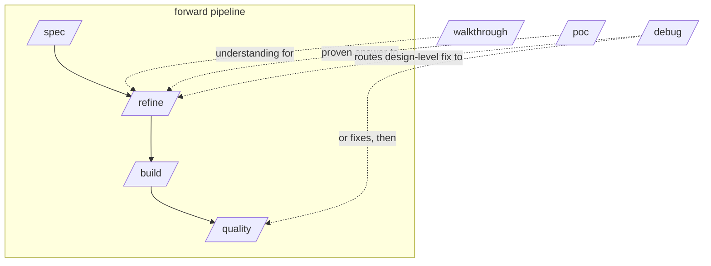

# dzafran-claude-plugins

Personal Claude Code plugin marketplace. One plugin: **shipwright**.

## shipwright

An end-to-end delivery workflow. Each stage is a skill you can invoke as a
slash command; each documentation stage produces one Markdown file — diagrams
included, as Mermaid — that you review before approving the next stage.


```mermaid
flowchart LR
    D[/discover/] -- brief.md --> S[/spec/]
    S -- spec.md, approval gate --> R[/refine/]
    R -- technical plan, approval gate --> B[/build/]
    B -- code + tests green --> Q[/quality/]
    Q -- findings fixed --> X[/security/]
    X -- no criticals --> P[/ship/]
```

The line above is the forward assembly line — each stage gated, moving one
piece of work from idea to shipped. The rest are **reactive** skills you invoke
whenever the situation calls for it; they hand their result *into* the pipeline
rather than being a step on it:


```mermaid
flowchart TB
    subgraph line["forward pipeline"]
        direction LR
        S[/spec/] --> R[/refine/] --> B[/build/] --> Q[/quality/]
    end
    W[/walkthrough/] -. understanding for .-> R
    P[/poc/] -. proven answer to .-> R
    DBG[/debug/] -. routes design-level fix to .-> R
    DBG -. or fixes, then .-> Q
```

`/status` and `/learn` cut across every stage — checking where work sits and
capturing lessons — so they aren't tied to any point in the line.

| Command     | What it does                                                        |
| ----------- | ------------------------------------------------------------------- |
| `/discover` | Product discovery session → discovery brief                         |
| `/spec`     | Requirements doc with diagrams, stops for your approval             |
| `/design`   | UI specs only: rendered HTML component previews built on the Claude Design system — read-only if one exists, founded first if not; defers to official frontend-design skill when installed |
| `/refine`   | Technical plan appended to the spec, stops for your approval        |
| `/build`    | Implements scenario by scenario with tests, on a branch             |
| `/quality`  | Fresh-eyes code review of the diff, safe fixes applied              |
| `/security` | Security review of the diff: secrets, injection, authz, deps        |
| `/ship`     | Verifies all gates, tidies branch, prepares (never pushes) the PR   |
| `/learn`    | Lesson store — but capture is automatic, see below                  |
| agents      | feature-builder (parallel chunk builds), quality-reviewer, security-reviewer, finding-verifier |
| `/status`   | Table of every spec: version, stage, next command                   |
| `/poc`      | Throwaway spike answering one risky assumption; code dies, answer stays |
| `/walkthrough` | Explains existing code: traced path with file:line refs, diagram, saved as .md |
| `/debug`    | Reproduces, finds the root cause, then fixes if small and safe or routes to `/refine`; reactive, standalone |

`/discover continue {name}` and `/spec continue {name}` resume a session
without re-litigating settled decisions.

## Spec lifecycle and versioning

Status flows `Draft → Refined → Built → Shipped`. Starting a new iteration of
a shipped feature moves the old spec to `docs/specs/archive/{name}-v{N}.md`
and starts `v{N+1}` with a Supersedes link — one live spec per feature, ever.
`/status` prints every spec with its version and status.

## Guardrail hooks

- **block-dangerous** — refuses force pushes, `rm -rf` on top-level/home
  paths, and commits made directly on main/master.
- **secret-scan** — before any `git commit`, greps the staged diff for key,
  token, and password patterns and blocks the commit on a hit.
- **auto-format** — after every file edit, runs the repo's own formatter
  (prettier / ruff / black) if — and only if — the repo has it configured.
- **verify-gates** — before a turn ends, mechanically checks the doc gates:
  spec statuses are valid and no versioned spec lives outside `archive/`.
  Fails the stop until fixed.

## Automatic learning

Lessons are picked up without being asked:

- **Capture** — build, quality, security, and ship each end by silently
  recording lessons (your corrections, blockers, recurring review findings)
  to the target repo's `docs/learnings/`. Mid-session corrections
  ("from now on…", "never do X here") are captured the moment they happen.
- **Recall** — a SessionStart hook prints `docs/learnings/INDEX.md` into
  context at the start of every session in that repo, so past lessons are
  applied automatically.

`/learn audit` lists lessons; `/learn remove <slug>` deletes one.

Docs land in `docs/discovery/` and `docs/specs/` of whatever repo you run the
workflow in.

## Verified reviews, sized to the diff

No raw finding reaches you or gets fixed. Every `/quality` and `/security`
finding is re-judged by `finding-verifier` agents that see only the bare
claim (never the finder's reasoning) and default to false-positive. Small
diffs (≤5 files, ≤300 lines) get one reviewer and one verifier per finding;
larger diffs get reviewers per chunk and a three-lens panel (reachability /
impact / defenses) with 2-of-3 majority. Breadth scales with the diff — the
verification bar never does.

## Routing

A SessionStart hook claims the development workflow for shipwright and maps
plain requests ("build it", "why is this broken", "review this") onto stages.
Without it, another installed workflow plugin that announces itself at session
start wins the routing before a shipwright stage ever starts.

## Self-contained stages

Every stage carries its own procedure for brainstorming, planning, testing,
debugging, and verification. Nothing is delegated to a general-purpose
workflow plugin — remove any of them and shipwright behaves identically.

The exception is domain tooling a stage can't do itself, which it uses when
installed and works around when not:

| Stage       | Uses when installed                                | Install from |
| ----------- | -------------------------------------------------- | ------------ |
| `/design`   | `frontend-design` → `design-taste-frontend` (taste-skill) → built-in fallback; shadcn skill on shadcn projects; jezweb `design-review`/`design-loop` for preview audits | official marketplace; `Leonxlnx/taste-skill`; `shadcn/ui`; `jezweb/claude-skills` |
| `/security` | `static-analysis`, `differential-review`           | `trailofbits/skills` |
| `/build`    | `webapp-testing` for UI e2e                        | `anthropics/skills` |

## Install

```
/plugin marketplace add <this repo path or git URL>
/plugin install shipwright@dzafran-claude-plugins
```
