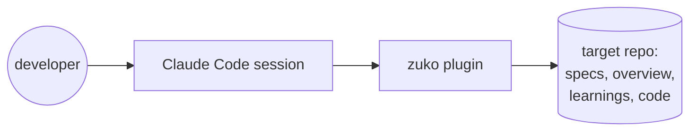
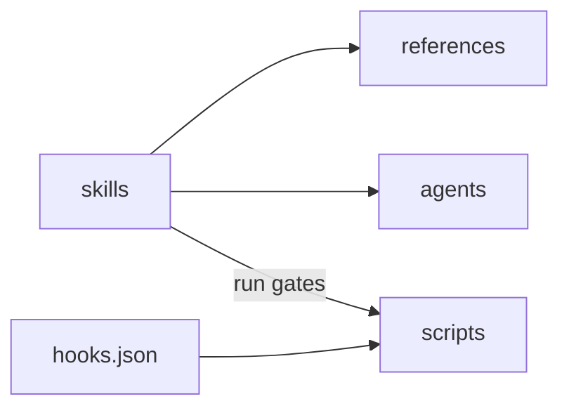

# dzafran-claude-plugins · architecture

**Status:** Active · **Updated:** 2026-09-26 by /ship owasp-lens

## Context

## Components

| Component  | Folder                     | Does                                                                  |
| ---------- | -------------------------- | --------------------------------------------------------------------- |
| skills     | `plugins/zuko/skills/`     | the stages a user runs: shape, spec, build, review, ship, release, helpers |
| references | `plugins/zuko/references/` | shared rules the stages read: voice, slicing, ledger, onboarding, OWASP |
| agents     | `plugins/zuko/agents/`     | subagents for parallel build chunks and blind review verification     |
| hooks      | `plugins/zuko/hooks/`      | binds scripts to Claude Code events (SessionStart, PreToolUse, Stop)  |
| scripts    | `plugins/zuko/scripts/`    | guards and gates in bash and Python, with a bash test harness         |
