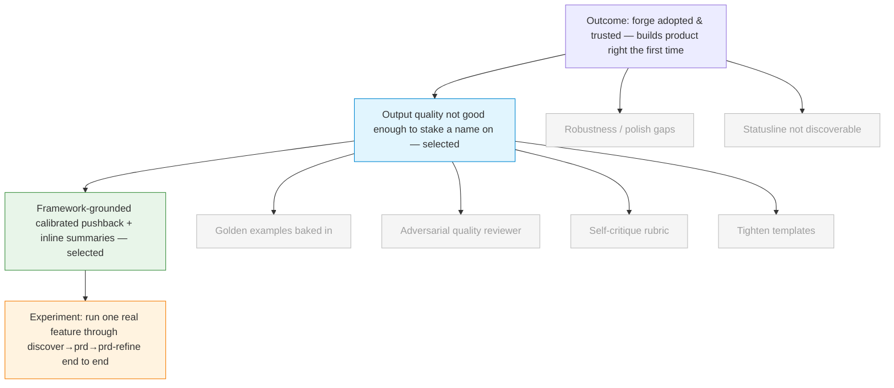

# Discovery Brief: Build-Once Quality

## Desired Outcome

Grow adoption of the forge plugin once it goes public — measured by installs /
new users who run it at least once — by making its output trustworthy enough
that people rely on it and recommend it. The deeper outcome behind adoption:
forge is used to **build product right the first time** — near-zero bugs, no
need to rebuild multiple times, high-standard UI/UX and code, and no
over-engineering.

> Context: forge is **pre-launch**. It hasn't been shared publicly yet. The
> owner wants to raise quality _before_ sharing, so the "users" below are
> anticipated first-time adopters and the evidence is the owner's own
> judgement — a hunch, which the first share (and the experiment below) will
> test.

## Opportunity Map

| #   | Opportunity (user problem)                                                                                   | Evidence                    | Strength | Size                         |
| --- | ------------------------------------------------------------------------------------------------------------ | --------------------------- | -------- | ---------------------------- |
| 1   | Output quality — the PRDs/specs/PRs forge produces aren't consistently good enough to stake a name on        | Owner judgement, pre-launch | Hunch    | Every first-time adopter     |
| 2   | Robustness / polish — edge cases, broken steps, rough errors that work for the owner but embarrass in public | Owner judgement, pre-launch | Hunch    | Every first-time adopter     |
| 3   | Statusline isn't discoverable — the feature exists but users won't obviously find or adopt it                | Owner judgement, pre-launch | Hunch    | Subset who'd benefit from it |

## Selected Opportunity

**#1 — Output quality.** Selected because it's the core value proposition: if
the specs/PRDs/PRs are genuinely excellent, people adopt forge and evangelise
it, which is the highest-ceiling path to adoption. Robustness (#2) is table
stakes but has diminishing returns once the core is proven, and statusline
discoverability (#3) is concrete but narrow — a single feature's visibility.

#2 and #3 are **deferred, not dropped** — they remain on the list for a later
cycle. #2 is a natural polish pass once the output-quality work is proven; #3
is a quick, self-contained fix.

## Solution Candidates

| #   | Solution                                                                                                                                                                                                                                                                                   | Riskiest Assumption                                                                                                              | PRD                                                                                       |
| --- | ------------------------------------------------------------------------------------------------------------------------------------------------------------------------------------------------------------------------------------------------------------------------------------------ | -------------------------------------------------------------------------------------------------------------------------------- | ----------------------------------------------------------------------------------------- |
| 1   | **Framework-grounded calibrated spine + inline summaries** (SELECTED) — discovery/prd/prd-refine push back using recognised product frameworks where it matters, without nagging; all skills surface rich inline summaries of specs/stories/PRDs so the user decides without opening files | **Calibration is achievable** — pushback can be challenging enough to catch bad decisions yet restrained enough not to frustrate | [docs/specs/thinking-skills-quality/spec.md](../../specs/thinking-skills-quality/spec.md) |
| 2   | Golden examples baked in — embed hand-picked excellent PRDs/specs into each skill so the model anchors on great output                                                                                                                                                                     | Anchoring on exemplars raises the quality floor more than instructions do                                                        | —                                                                                         |
| 3   | Adversarial quality reviewer — a critic agent flags thin/vague output before the user sees it (extends the existing reviewer / security-review pattern)                                                                                                                                    | An independent critic catches what the author misses, and the added step/latency is worth it                                     | —                                                                                         |
| 4   | Self-critique rubric — each skill grades its own artifact against an explicit rubric and revises before showing                                                                                                                                                                            | Self-grading isn't blind to its own gaps                                                                                         | —                                                                                         |
| 5   | Tighten the templates — make artifact templates more opinionated so there's less room for thin output                                                                                                                                                                                      | Structure pushes substance up, not just length                                                                                   | —                                                                                         |

The selected solution is a synthesis the owner defined directly: it goes beyond
any single candidate by combining framework-grounding, _calibrated_ pushback
(not a yes-man, but not frustrating), and inline summaries — in service of
build-once quality. Candidates 2–5 are complementary techniques that could be
folded in during the build.

## Opportunity Solution Tree

## Recommended Experiment

**Run one real feature through, end to end.** Take one genuine product idea and
hand-tune the discovery → prd → prd-refine prompts for (a) framework-grounded,
calibrated pushback and (b) rich inline summaries. Run it through and judge three
things:

1. **Did the pushback feel right?** Challenging where it mattered, not nagging.
2. **Did inline summaries kill file-opening?** Could the owner decide at each
   step without opening the spec/story files?
3. **Is the resulting spec build-once?** Could it go to `/build` and produce
   high-quality output without rebuilds — no over-engineering, high UI/UX bar.

This is the cheapest real signal: it tests the riskiest assumption (calibration)
on a real artifact before committing to rewriting the skills. "Good" = pushback
felt calibrated, summaries removed the need to open files, and the spec was one
the owner would confidently hand to `/build` without rework.

## Recommendation

Proceed to `/prd` for Solution #1 (framework-grounded calibrated pushback +
inline summaries) targeting Opportunity #1 (output quality). Scope the first
PRD around the experiment: improve the discovery → prd → prd-refine chain and
run it on one real feature. Fold in candidates #2–#5 (golden examples, quality
reviewer, self-critique rubric, tighter templates) as concrete tactics where
they help — they're complementary, not competing.

## Decision Log

- **Goal = adoption (installs / first-time users)**, chosen over funnel
  completion, repeat usage, or successful-ship rate — but reframed mid-session
  when the owner clarified forge is **pre-launch**: the real near-term goal is
  raising quality _before_ sharing so adoption follows.
- **Selected "output quality" over "robustness/polish" and "statusline
  discoverability"** because it's the core value prop with the highest ceiling
  on adoption; the other two are deferred (polish has diminishing returns;
  statusline is narrow).
- **Leading solution is the owner's own synthesis** — framework-grounded,
  _calibrated_ pushback (not a yes-man, not frustrating) plus inline summaries —
  chosen over any single brainstormed idea because it directly serves the
  build-once quality goal. The four brainstormed ideas become supporting tactics.
- **Riskiest assumption = calibration of pushback**, not the framework-grounding
  or summaries (those are more mechanical). The experiment targets it directly.
- **Experiment = run one real feature end to end**, chosen over a hand-written
  pushback dry-run or a before/after spec diff, because it's the cheapest way to
  get real signal on all three sub-goals at once.

## Open Questions

- Which **product frameworks** should ground the pushback (e.g. JTBD, RICE,
  Opportunity Solution Tree, North Star)? Decide per skill in the PRD.
- What's the right **inline-summary format** — how much detail before it becomes
  noise, and where does "open the file" still make sense?
- How is **calibration measured** beyond gut feel — is there a lightweight signal
  (e.g. user can override pushback in one step) that keeps it from frustrating?
- "**No over-engineering**" and "**high-standard UI/UX and code**" mostly land in
  prd-refine and build — does this cycle touch those skills too, or stay focused
  on the thinking skills first?
