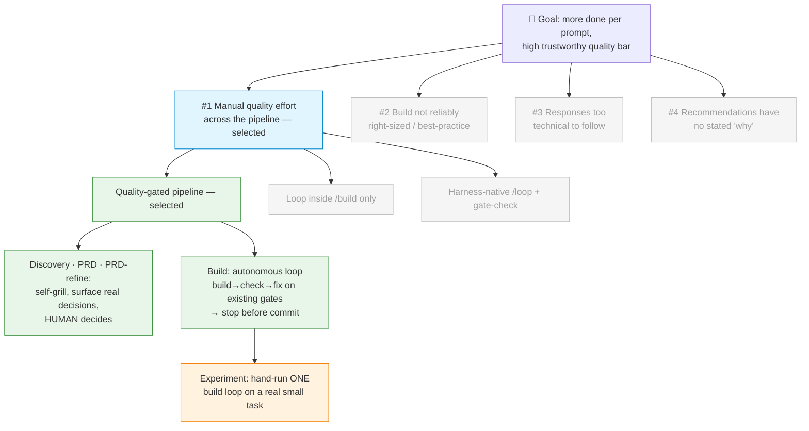

# Discovery Brief: Quality-Gated Pipeline (Loop Engineering)

## Desired Outcome

Forge takes a feature from fuzzy idea to a ship-ready PR with **fewer human
prompts** and a **consistently high, trustworthy quality bar** — secure,
best-practice, right-sized, minimal bugs.

This is a personal maker tool, so the success signals are effort and
first-pass quality rather than a SaaS metric:

1. **Less hand-holding** — human input drops to genuine decision points plus a
   single pre-commit approval. No more manually re-invoking `/grill-me` at each
   stage, and no manual re-running of review → fix after a build.
2. **The loop finishes the job** — the build stage reaches "all gates green" on
   its own (security, lint/type/test, code review), without manual iteration.
3. **Trustworthy, not just done** — every recommendation arrives in plain
   language with a stated "why," and the build is right-sized to the task (a
   bike when a bike was asked for, not a rocket).

## Opportunity Map

| #   | Opportunity (what the user feels)                                                                                              | Evidence                                                                              | Strength | Size                                |
| --- | ------------------------------------------------------------------------------------------------------------------------------ | ------------------------------------------------------------------------------------- | -------- | ----------------------------------- |
| 1   | **Manual quality effort across the whole pipeline** — hand-invokes `/grill-me` at discovery/prd/prd-refine, and hand-re-runs review→fix after build; nothing self-continues to a quality bar | Direct daily experience; `/build` runs once then stops, `/grill-me` is a manual call  | Strong   | Every feature, every session        |
| 2   | **Build isn't reliably right-sized or best-practice** — may over- or under-engineer                                            | Direct experience; known LLM tendency to over/under-build                             | Moderate | Every build                         |
| 3   | **Responses/questions are too technical to follow**                                                                            | Direct experience ("sometimes too complicated to understand")                         | Moderate | Every interaction (non-technical user) |
| 4   | **Recommendations have no stated basis** → user trusts them blindly; over-engineering slips through                            | Direct experience ("I might just believe that is the right answer")                   | Moderate | Every recommendation                |

## Selected Opportunity

**#1 — Manual quality effort across the pipeline.** It has the strongest
evidence (it's simply how the tool works today), it's hit on every single
feature, and it's the direct engine of the goal ("less prompts, more work").

The key realisation: **#2, #3, and #4 are not separate builds — they are
properties of the same solution.** Opportunity #1's solution is a quality-gated
loop, and:

- **#2 (right-sized / best-practice)** becomes the loop's **exit criteria** —
  "done" = forge's existing quality gates pass.
- **#3 (too technical)** becomes a **plain-language reporting** property of
  every stage.
- **#4 (no stated 'why')** becomes a **justified-recommendation** property — the
  self-grill forces each recommendation to carry its rationale.

So nothing is deferred except the "rocket" (full hands-off autonomy), which is
parked deliberately.

## Solution Candidates

| #        | Solution                                                                                                                                                                                                                                                  | Riskiest Assumption                                                                                                                | PRD |
| -------- | --------------------------------------------------------------------------------------------------------------------------------------------------------------------------------------------------------------------------------------------------------- | --------------------------------------------------------------------------------------------------------------------------------- | --- |
| 1        | **Quality-gated pipeline** — (a) embed a **self-grill** at discovery / prd / prd-refine: the AI stress-tests its *own* output, surfaces only the genuine decisions in plain language, and humans make those calls; (b) make **build** an autonomous loop — build → check → fix on forge's *existing* gates until green or a cap, then **stop before commit** for approval | "All gates green = **genuinely done and right-sized**, not over-built." Stronger upstream specs (from the grills) make the loop's finish line trustworthy. | [Epic PRD](../../specs/quality-gated-pipeline/spec.md) (3 stories) |
| 2        | **Loop inside `/build` only** — no upstream grills; just make `/build` self-check and self-fix                                                                                                                                                            | The build loop alone lifts quality enough, without strengthening the spec first                                                   | —   |
| 3        | **Harness-native `/loop` + a gate-check** — forge only exposes an "are we done?" check; the user drives repetition with the built-in loop                                                                                                                  | A generic loop + gate-check is enough; no need for plain-language reporting or forge orchestration                                 | —   |
| (parked) | **Fully autonomous discovery → ship agent**, no checkpoints                                                                                                                                                                                              | Humans don't need to make the discovery/prd/refine calls — **false** for this user, who explicitly wants those human-in-the-loop  | —   |

**Right-sizing note (the "bike, not rocket" principle in action):** forge
already ships every gate the loop needs — `/security-review` (secure),
`/verifier` (lint/type/test → minimal bugs), the `code-reviewer` agent (good
design / best practices), `/e2e` and `/tdd` (tests). The missing piece is the
*loop that drives them*, not the gates. Solution #1 builds only that spine plus
the plain-language layer. We reuse `/grill-me` rather than reinventing a
critique engine.

## Opportunity Solution Tree

*(Greyed opportunities #2–#4 are addressed as properties of the selected
solution — exit criteria, plain-language reporting, justified recommendations —
not dropped.)*

## Recommended Experiment

**Test the riskiest assumption before building the loop controller:**
*does "all gates green" actually equal "genuinely done and right-sized"?*

- **What:** Hand-run one full loop on a real, small, representative task. Run
  `/build` once, then manually run `/verifier`, `/security-review`, and the
  `code-reviewer` agent. Paste the FAIL findings back as a fix prompt, re-run
  the gates, and repeat until green.
- **Effort:** ~1 hour, no code, this week.
- **Watch three things:** (1) how many rounds it takes to converge; (2) whether
  "all green" matched *your* judgement of "actually done"; (3) anywhere it tried
  to over-build.
- **Success looks like:** converges in **≤ 3 iterations** **and** "all green"
  matched your sense of done with **no over-building**.
- **If green ≠ done:** the loop needs a stronger finish line — add the
  acceptance criteria from `/prd-refine` as an explicit gate *before* automating.
  This is the single most important thing to learn before writing the loop.

## Recommendation

**Next step: run the 1-hour experiment above this week** to confirm the finish
line is trustworthy. Then run **`/prd` for Solution #1**, scoped as a small,
vertically-sliced epic (it spans the pipeline), in this order:

1. **Story 1 — the build loop** (highest value, the missing spine; reuses every
   existing gate). Ship this first.
2. **Story 2 — self-grill embedded in discovery / prd / prd-refine** (surface
   only real decisions, plain language, human decides).
3. **Story 3 — plain-language + justified-recommendation layer** across the
   pipeline.

Build the bike: reuse forge's existing gates and `/grill-me`; don't rebuild them.

## Decision Log

- **Goal reframed** from "trust the output" to "more done per prompt at a high
  quality bar, via loop engineering" — the user's own framing, which ties
  autonomy and quality into one outcome.
- **Selected Opportunity #1** (manual quality effort) as the spine; folded #2/#3/#4
  in as *properties* of the solution rather than separate builds, because they
  compose into a single quality-gated loop.
- **Chose Solution #1 (loop over existing gates) over rebuilding gates** — forge
  already has `/security-review`, `/verifier`, `code-reviewer`, `/e2e`, `/tdd`.
  Right-sizing principle: bike, not rocket.
- **Autonomy boundary set deliberately:** discovery / prd / prd-refine stay
  human-in-the-loop (they capture the user's intent → humans decide); the build
  loop runs autonomously but **stops before commit** for approval. Honours the
  user's "don't trust blindly" concern.
- **Grill style = self-grill + surface only genuine decisions in plain language**
  — reconciles "higher quality" with "fewer prompts / less technical," which
  otherwise pull against each other.
- **Parked full autonomy** (no checkpoints) — it is the "rocket" the user
  explicitly wants to avoid.

## Open Questions

Carry these forward to `/prd` and `/prd-refine` — they are design details, not
discovery blockers:

- **Iteration cap & budget** — how many rounds (and/or what token budget) before
  the build loop stops and asks for help instead of churning?
- **Exit criteria precision** — is "done" all gates `PASS`, or `PASS` +
  user-accepted `WARN`s? How are `WARN`s surfaced in plain language?
- **"Real decision" threshold for the self-grill** — what makes a question worth
  surfacing to the human vs. auto-resolving? Risk of surfacing too many (back to
  interrogation) or too few (silent wrong calls).
- **Plain-language layer scope** — all forge skills or just the pipeline ones?
  Include a "show me the technical detail" escape hatch for when the user *does*
  want depth.
- **Commit boundary mechanics** — confirm the loop controller lives in the parent
  session, since worktree-isolated `feature-builder` agents can't commit (per the
  repo's own learnings). This is a `/prd-refine`-level note.
