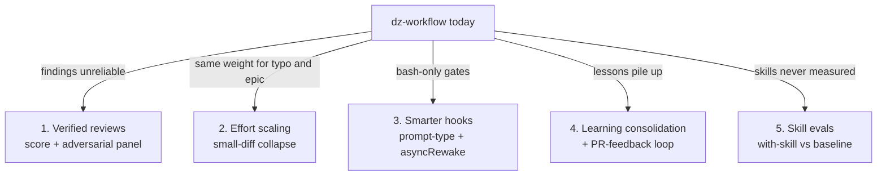

# Gap analysis: dz-workflow vs. the reference plugins

**Date:** 2026-08-02 · **Sources:** all 41 plugins in Anthropic's official marketplace (read from local cache), web research on Andrej Karpathy and Claude Code's creators. · **Status:** research — nothing below is built yet.

Two questions were asked: what do the best plugin authors have that dz-workflow doesn't, and what does Karpathy do. Short answer: Karpathy has published no plugin at all — his value is a diagnosis of agent failure modes. The official plugins are where the techniques are, and they cluster into five gaps.

## Karpathy: no plugin, one diagnosis

He published a single note on agent coding (Jan 2026). No CLAUDE.md, no skills, no repo — the viral "Karpathy skills" repos are third-party distillations he never endorsed, and an A/B test over 40 PRs found they cut cost 3–10% with no quality change.

His actual observations, which are a checklist of what our reviewers should hunt:

- Models make wrong assumptions and run with them without checking.
- They overcomplicate code, bloat abstractions, and don't clean up dead code.
- They make drive-by changes to code they weren't asked to touch.
- The one prescription: don't tell the agent what to do — give it **success criteria** and let it loop.

## Boris Cherny (Claude Code's creator)

Verified from interviews: 5 parallel worktree sessions, a slash command for every inner-loop workflow, a dedicated `/simplify` de-bloat pass after coding, Stop hooks gating completion on deterministic checks, and a learning loop where PR review feedback is written back into CLAUDE.md automatically. Anthropic's official best-practices doc adds: let Claude interview you until the spec is self-contained, then execute in a fresh session; and explicitly warn reviewer agents that they over-report — "correctness gaps only, not style."

## The five gaps

### 1. Verified reviews (highest value)

Our quality/security reviewers return raw finding lists. The official `code-review` and `claude-security` plugins never trust a raw finding:

- **Per-finding confidence scoring** — one cheap (Haiku) agent per finding scores 0–100 against a written false-positive rubric (pre-existing issues, linter-catchable, nitpicks, untouched lines); hard-filter below 80.
- **Adversarial verification panel** — 3 verifiers per surviving finding, each with a different lens (reachability / impact / defenses), each told to *default to false-positive* and only confirm a complete path they actually traced. Keep on 2-of-3 majority. Verify with **fresh context, stripped of the finder's reasoning** — a verifier that sees the reasoning agrees with it.
- **Reviewer scope discipline** — one line in the reviewer prompts: "correctness gaps only, not style; flag anything changed outside scope."

### 2. Effort scaling

Our pipeline runs the same weight for a typo and a feature. `claude-security` has an `effort` knob and, crucially, an auto-collapse: a diff ≤5 files / ≤300 lines runs a single-reviewer shape instead of the full panel — breadth scales, the verification bar doesn't. Makes `/quality` and `/security` usable on every change.

### 3. Smarter hooks

- **Prompt-type Stop hook** — hooks can be `{"type": "prompt"}`: an LLM reads the transcript and answers "were tests actually run after code changes?" Our bash gate checks file mtimes; a prompt hook checks *claims against actions*. Layer: cheap bash check first, prompt hook behind it.
- **asyncRewake** — `security-guidance` runs review hooks in the background on `git commit`/`git push` and re-wakes Claude with findings, so a real LLM security pass rides every commit without stalling the turn.
- **Session isolation for the stop-gate** — record the session id in state and compare, so a project-scoped gate can't hijack a second session in the same repo (from `ralph-loop`).

### 4. Learning hygiene

Our capture works; nothing prunes it. Boris consolidates memory periodically; Anthropic warns the over-specified CLAUDE.md is a real failure mode ("would removing this cause mistakes? If not, cut"). Add a consolidation mode to `/learn` (merge duplicates, drop stale, keep the index short) and — if work moves to MRs — pipe human review comments back into `docs/learnings/`.

### 5. Skill evals

We have 12 skills and zero evidence any triggers reliably or beats baseline. `skill-creator` ships the harness: for each test prompt, run with-skill and baseline agents in parallel, grade assertions, aggregate with mean ± stddev, and separately optimize the `description:` trigger with should-trigger / near-miss prompt sets scored on held-out data. Worth adopting once, for the two or three skills that misfire most.

## Smaller steals, noted for later

- **Pilot-first fan-out** (`code-modernization`) — before dispersing all builder chunks, run one representative chunk end-to-end, write a playbook of lessons, make remaining chunks read it; a circuit breaker stops the batch if the playbook stops working.
- **Extra review axes** (`pr-review-toolkit`) — silent-failure hunter (what could this catch-block hide?), comment-rot checker, git-blame/history-aware review.
- **Round-trip HTML review** (`playground`) — click-to-comment in the spec HTML that assembles a paste-back prompt; turns the visual plan into a two-way review surface.
- **Staleness stamps** (`claude-security`) — reports record the commit they describe (`-dirty` when the tree wasn't clean); `/status` and reviews should refuse to trust stale artifacts.
- **Model tiering** — cheap models for gates and scoring, big models for design and simplification; fan-out width as a function of model tier.
- **`!`cmd`` frontmatter preloading** — `/ship` could preload git status/diff/log in zero round trips.
- **Namespaced commands** — 5+ commands is the documented threshold for `commands/` namespacing; we're at 12 skills.

## Explicitly not worth stealing (solo plugin)

Publishing artifacts to claude.ai teams, `gh pr comment` ceremony, dual-review-at-2×-cost, blind A/B skill comparators, the LSP config plugins, domain content (COBOL, olympiad math), and marketplace packaging machinery.

## Recommendation

Build in this order: **verified reviews (1)** and **effort scaling (2)** first — they change the trustworthiness of every run; then the **prompt-type stop hook (3)**, then **learning consolidation (4)**. Evals (5) only when a skill demonstrably misfires. The smaller steals ride along whenever their host skill is next touched.
