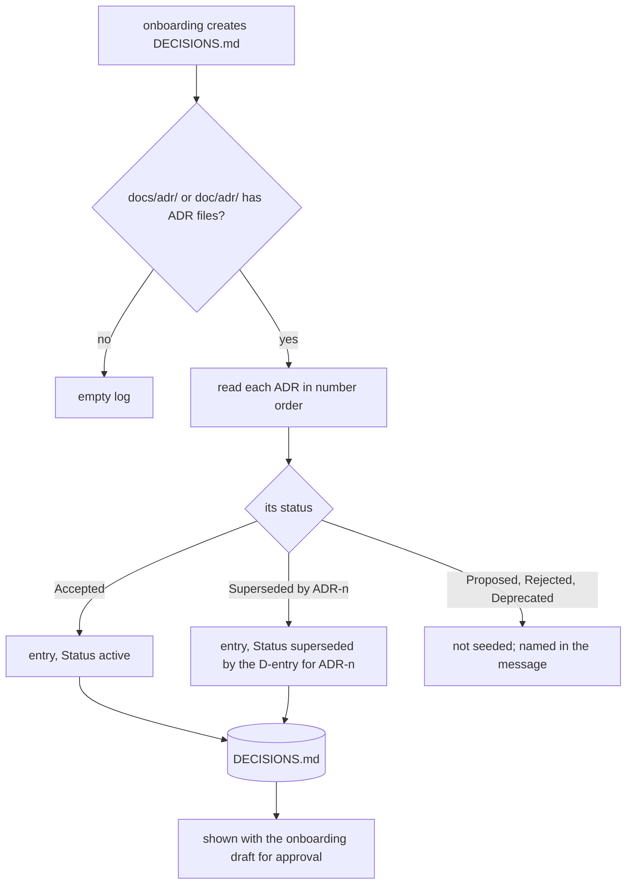
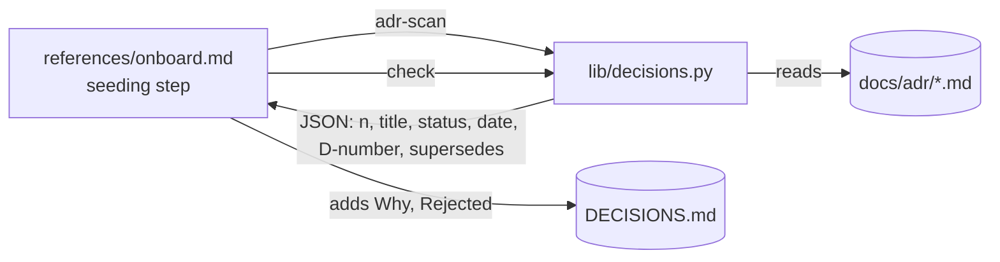
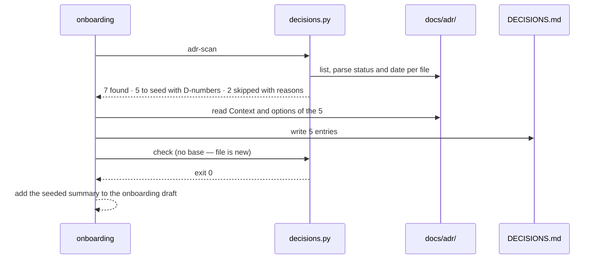

# ADR seeding

**Version:** v1 · **Status:** Built · **Type:** Feature · **Project type:** CLI/Library

**Shape doc:** docs/specs/v3-project-memory/shape.md — slice 2b
**Depends on:** `decision-log` — the file format and the gate this slice writes into
**Page:** https://claude.ai/artifact/Xh4g34k8RftqLVG11HfZX6

When onboarding creates `DECISIONS.md` in a repo that already keeps Architecture
Decision Records, each ADR still in force becomes a D-entry citing its file, so the
decisions made before zuko arrived load at session start and `/review` holds code to
them too.

## Problem

`decision-log` starts the log empty. A repo with `docs/adr/0001-…md` to `0014-…md`
already has fourteen decisions that nothing loads: a new session does not know them,
and `/review`'s decisions lens cannot enforce them. The user's other plugin writes
exactly these files (`/adr` writes `docs/adr/NNNN-title.md` in Nygard/MADR structure, per its skill description), so Personal repos may carry them.

## Slice test

| Check                         | Result                                                                                                                                                        |
| ----------------------------- | ------------------------------------------------------------------------------------------------------------------------------------------------------------- |
| Cuts every layer it needs     | yes — onboarding reads the ADRs, writes entries, and the existing gate and loader take them from there                                                        |
| One e2e test walks it         | yes — one scratch repo with seven fixture ADRs of every status → onboarding → DECISIONS.md holds the mapped entries → gate passes → loader lists the active ones |
| Worth shipping alone          | yes — a brownfield repo's past decisions are enforced from its first zuko session                                                                             |
| Fits (≤5 scenarios, ≤2 areas) | yes — 4 scenarios; two areas: `scripts/lib/decisions.py` (adr-scan) and `references/onboard.md`                                                                                  |

**Path:** full — new behaviour, not a bug fix, so the light path does not apply; small
enough that pause 2 is one mapping table.

## Flow



Seeding happens once, when onboarding creates the file, and the user approves it with
the rest of the onboarding draft.

## Acceptance criteria

```gherkin
Scenario: accepted ADRs become active entries citing their files
  Given "invoice-cli" with docs/adr/0001-record-architecture-decisions.md (Accepted,
    2025-03-02) and docs/adr/0002-use-postgres.md (Accepted, 2025-03-09) listing
    "SQLite" under Considered Options
  And no DECISIONS.md
  When onboarding runs
  Then DECISIONS.md holds D1 "Record architecture decisions" and D2 "Use Postgres"
  And D2 reads "Rejected: SQLite" with its reason from the ADR,
    "Source: docs/adr/0002-use-postgres.md", "Status: active", dated 2025-03-09

Scenario: an ADR with no alternatives is seeded with an honest gap
  Given docs/adr/0003-ship-as-pip-package.md in Nygard format with no options listed
  When onboarding seeds it
  Then its entry reads "Rejected: not recorded in docs/adr/0003-ship-as-pip-package.md"
  And the ship gate accepts the entry

Scenario: a superseded ADR keeps its link to the one that replaced it
  Given docs/adr/0004-cron-for-imports.md with status "Superseded by ADR-0006"
    and docs/adr/0006-queue-for-imports.md Accepted
  When onboarding seeds them
  Then the entry for 0004 reads "Status: superseded by" the D-number given to 0006
  And the entry for 0006 reads "Supersedes:" the D-number given to 0004
  And the ship gate's supersede-pair check passes

Scenario: undecided and retired ADRs are named, not seeded
  Given docs/adr/0005-graphql-api.md Proposed and docs/adr/0007-xml-export.md Deprecated
  When onboarding seeds the log
  Then neither appears in DECISIONS.md
  And the onboarding message says "Not seeded: 0005 (Proposed), 0007 (Deprecated)"
```

## Scope

**In:**

- ADR discovery in `docs/adr/`, `doc/adr/`, and `docs/decisions/` — the three
  locations adr-tools and MADR use.
- Reading Nygard (`## Status` section) and MADR (`status:` front matter) statuses.
- The status mapping above; dates from the ADR, else the file's first commit date.
- Rejected options from MADR "Considered Options" or any "Alternatives" section; the
  honest-gap line otherwise.
- The onboarding message's seeded / not-seeded summary.

**Out:**

- Seeding into a `DECISIONS.md` that already exists — seeding runs only when
  onboarding creates the file. Repos onboarded between `decision-log` and this slice
  shipping (in practice only this repo) seed by hand if they need it.
- Changing, moving or deleting the ADR files — they stay; entries cite them.
- A `deprecated` status in `DECISIONS.md` — the format keeps two states.

## Interface

### Status mapping

| ADR status (Nygard `## Status` or MADR `status:`)                            | D-entry                                                                                                        |
| ---------------------------------------------------------------------------- | -------------------------------------------------------------------------------------------------------------- |
| Accepted                                                                     | `Status: active`                                                                                               |
| Superseded by ADR-n                                                          | `Status: superseded by D<m>`, where D<m> is the entry seeded from ADR-n; that entry gets `Supersedes: D<this>` |
| Superseded by ADR-n, but ADR-n is not seeded (Proposed, Deprecated, missing) | treated as Deprecated — not seeded, named in the message                                                       |
| Proposed · Rejected · Deprecated                                             | not seeded, named in the message                                                                               |
| No status found                                                              | not seeded, named in the message as "(no status)"                                                              |

Case-insensitive. D-numbers follow ADR number order, starting at D1.

### Field mapping

| D-entry line  | From the ADR                                                                                                                          |
| ------------- | ------------------------------------------------------------------------------------------------------------------------------------- |
| Heading date  | the ADR's `Date:` line or `date:` front matter; else the file's first commit date (`git log --diff-filter=A --format=%as`)            |
| Heading title | the ADR's `#` title without its number prefix                                                                                         |
| `Why:`        | the first two sentences of Context (Nygard) or "Context and Problem Statement" (MADR)                                                 |
| `Rejected:`   | MADR "Considered Options" minus the chosen one, each with its listed con; or an "Alternatives" section; else `not recorded in <path>` |
| `Source:`     | the ADR's path                                                                                                                        |

### Onboarding message addition

```
Seeded DECISIONS.md from docs/adr/ (7 ADRs):
  D1  Record architecture decisions        0001  active
  D2  Use Postgres                         0002  active
  D3  Ship as a pip package                0003  active   (no alternatives recorded)
  D4  Cron for imports                     0004  superseded by D5
  D5  Queue for imports                    0006  active
Not seeded: 0005 (Proposed), 0007 (Deprecated)
```

It sits inside the existing onboarding draft, so the user approves it with the rest.

## Technical plan

### Approach

Split by what is mechanical and what is reading. The mechanical half — find the ADRs,
read each number, title, status, date and successor, assign D-numbers, resolve
supersede pairs, decide seeded or not — is a new `adr-scan` subcommand in
`decisions.py`, so the mapping table is enforced by code and tested. The reading half —
two sentences of Why, the rejected options and their reasons — is Claude's, guided by
`references/onboard.md`. The result then passes through the existing `decisions.py
check`, so a seeded log meets the same bar as a hand-grown one.





`adr-scan` output, one object per ADR file found:

```json
{
  "file": "docs/adr/0004-cron-for-imports.md",
  "adr": 4,
  "title": "Cron for imports",
  "status": "superseded",
  "successor_adr": 6,
  "date": "2025-04-01",
  "date_from": "adr",
  "seed": true,
  "d": 4,
  "superseded_by_d": 5,
  "supersedes_d": null,
  "skip_reason": null
}
```

### Changes

| File                                                    | What changes                                                                                                                                                                                                                                                  | Why                                      |
| ------------------------------------------------------- | ------------------------------------------------------------------------------------------------------------------------------------------------------------------------------------------------------------------------------------------------------------- | ---------------------------------------- |
| `plugins/zuko/scripts/lib/decisions.py`                 | New `adr-scan [--dir PATH]` subcommand: discover the three locations, parse Nygard and MADR statuses and dates, fall back to first-commit date, apply the mapping table, print JSON; exit 0 with `[]` when no ADRs                                            | scenarios 3, 4; mapping enforced by code |
| `plugins/zuko/references/onboard.md`                    | Seeding step, run only when creating `DECISIONS.md`: call `adr-scan`; for each `seed: true`, write the entry with Why and Rejected from the file (field table above), honest-gap line when no options; run `decisions.py check`; add the summary to the draft | scenarios 1, 2                           |
| `plugins/zuko/scripts/tests/test-adr-scan.sh` (new)     | Seven fixture ADRs (both formats, every status, one missing date) → expected JSON; empty and missing directories → `[]`                                                                                                                                       | scenarios 3, 4                           |
| `plugins/zuko/scripts/tests/fixtures/adr/` (new)        | The seven fixture ADR files                                                                                                                                                                                                                                   | test input                               |
| `plugins/zuko/scripts/tests/test-e2e-adr-seed.sh` (new) | The e2e walk below                                                                                                                                                                                                                                            | slice proof                              |
| `plugins/zuko/skills/ship/SKILL.md`                     | Added at build: its pointer to onboarding's README-block step moves from step 7 to step 8, because seeding became step 5                                                                                                                                     | O8                                       |

Reusing: `decisions.py`'s parser and `check` (from `decision-log`); the lib-plus-tests
layout.

### Earn-it

| Added                 | Triggered by                                                                                         |
| --------------------- | ---------------------------------------------------------------------------------------------------- |
| `adr-scan` subcommand | scenarios 3, 4 — renumbering and supersede pairs are where a prose-only seed would go wrong silently |
| Fixture ADR directory | scenario coverage across both templates and every status                                             |

No new file of code; no new dependency.

### Non-functionals

|                      |                                                                                                                                   |
| -------------------- | --------------------------------------------------------------------------------------------------------------------------------- |
| **Load**             | Once per repo, at onboarding; one read per ADR file                                                                               |
| **Breaks first**     | An ADR in a third template with neither a `## Status` section nor `status:` front matter — listed as "(no status)", never guessed |
| **Security surface** | Reads ADR files and git history; writes only the new `DECISIONS.md`; ADR text is data copied into Why lines, never run            |
| **Proof it works**   | The onboarding draft shows "Seeded DECISIONS.md from docs/adr/ (N ADRs)"                                                          |
| **Rollout**          | No flag. Rollback: revert the merge commit; already-seeded logs stay valid                                                        |

### Test plan

| Scenario                              | Test                                                                                                      | Command                                               |
| ------------------------------------- | --------------------------------------------------------------------------------------------------------- | ----------------------------------------------------- |
| 1 accepted → active with real options | real onboarding run on a scratch repo holding the fixture ADRs during `/build`, entries shown to the user | run a writing stage in that repo                      |
| 2 honest gap                          | same real run; the gate half by `test-e2e-adr-seed.sh`                                                    | `bash plugins/zuko/scripts/tests/run.sh e2e-adr-seed` |
| 3 supersede pair                      | `test-adr-scan.sh`                                                                                        | `bash plugins/zuko/scripts/tests/run.sh adr-scan`     |
| 4 skipped and named                   | `test-adr-scan.sh`                                                                                        | same                                                  |
| all                                   | the whole suite                                                                                           | `bash plugins/zuko/scripts/tests/run.sh`              |

**E2E:** `scripts/tests/test-e2e-adr-seed.sh` — scratch repo with the fixture ADRs →
`adr-scan` → a `DECISIONS.md` written from its JSON with honest-gap Rejected lines →
`decisions.py check` passes → `load-decisions.sh` lists the four active entries →
flipping one supersede pair by hand fails `check`.

### Chunks

`Single chunk` — one Python subcommand, one reference section, their tests. Builds
after `decision-log` is merged.

### Risks

| Risk                                                                                          | Mitigation                                                                                         |
| --------------------------------------------------------------------------------------------- | -------------------------------------------------------------------------------------------------- |
| An ADR's status line reads "Superseded by [ADR-0006](0006-queue.md)" and the number is missed | The parser takes the first number after "superseded by", link or not; a fixture uses the link form |
| Why lines copied from a long Context bloat the log                                            | Two sentences only, per the field table                                                            |
| Seeded entries misstate an old decision                                                       | They sit in the onboarding draft the user approves; each cites its ADR file                        |

## Open items

| ID  | What                                   | Type       | Raised at | Owner  | Status   | Answer                                                                                         |
| --- | -------------------------------------- | ---------- | --------- | ------ | -------- | ---------------------------------------------------------------------------------------------- |
| O1  | An ADR lists no alternatives           | question   | spec p1   | user   | Resolved | Seed with "Rejected: not recorded in" its file                                                 |
| O2  | Proposed, Rejected and Deprecated ADRs | assumption | spec p1   | claude | Resolved | Not seeded; named in the onboarding message. DECISIONS.md keeps two states                     |
| O3  | Seeding into an existing DECISIONS.md  | assumption | spec p1   | claude | Resolved | Only when onboarding creates the file; this repo has no ADRs (find over the repo returns none) |
| O4 | Why and Rejected wording is Claude reading the ADR, not code | flag | spec p3 | claude | Accepted risk | Mapping and numbering are tested in code; wording is proven by one real run on the fixture ADRs during /build and approved in the onboarding draft. Agreed 2026-09-24 |
| O5 | The /adr skill marks a superseded ADR `status: Superseded` and keeps the number in a separate `superseded-by:` front matter key | assumption | build | claude | Resolved | adr-scan reads the successor from the status text, then `superseded-by:`, then the `## Status` section. Without it every /adr-written supersede would be skipped |
| O6 | Two ADRs superseded by the same ADR; an entry supersedes exactly one | assumption | build | claude | Resolved | The lower-numbered ADR pairs; the other is not seeded, named "Superseded by N, which already supersedes M" |
| O7 | An ADR with no date in the file and no commit (untracked) | assumption | build | claude | Resolved | Not seeded, named "no date" — never given a guessed date, same as "(no status)" |
| O8 | Onboarding's `check` runs on a new, uncommitted file, but `check` required `--base` and a tracked file | question | build | claude | Resolved | `check <dir>` with no `--base` runs the structure checks only. Seeding is onboarding step 5; steps 5 to 7 became 6 to 8, and ship/SKILL.md's one pointer followed |
| O9 | Two ADR files with one number collided on a D-number and failed `check` | question | review | claude | Resolved | Every file sharing a number is not seeded, named "number 0002 is used by 2 files"; an ADR superseded by that number follows |
| O10 | Onboarding resumed after step 5 committed seeded entries the user never saw | question | review | claude | Resolved | The Draft resume path reruns the scan and check and shows the seeded summary again; a failing check reruns step 5 from the header |

## Glossary

- **ADR** — Architecture Decision Record: one short file per decision, numbered, with a
  status such as Accepted or Superseded.
- **MADR / Nygard** — the two common ADR templates; MADR lists considered options,
  Nygard's original does not.
- **Seeding** — filling a new file with existing records once, at creation.
