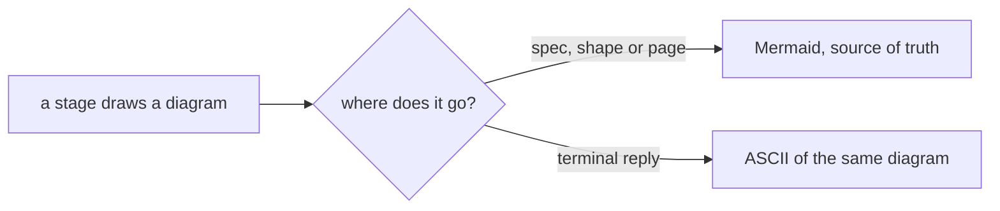
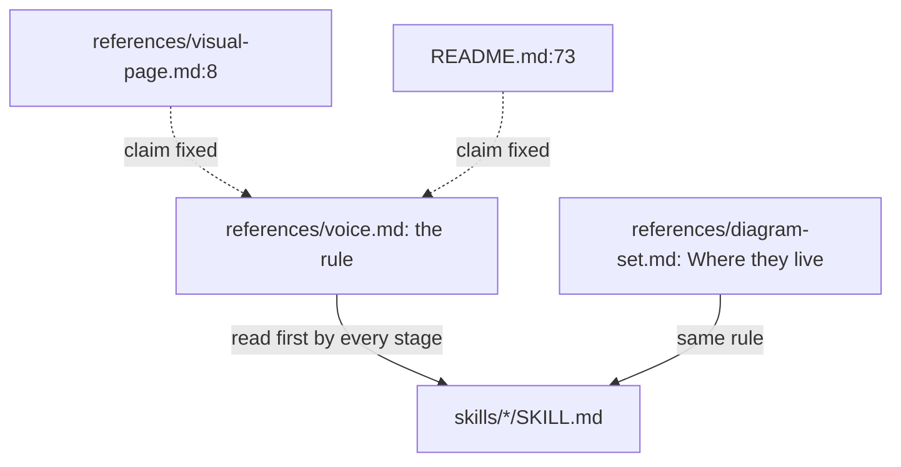
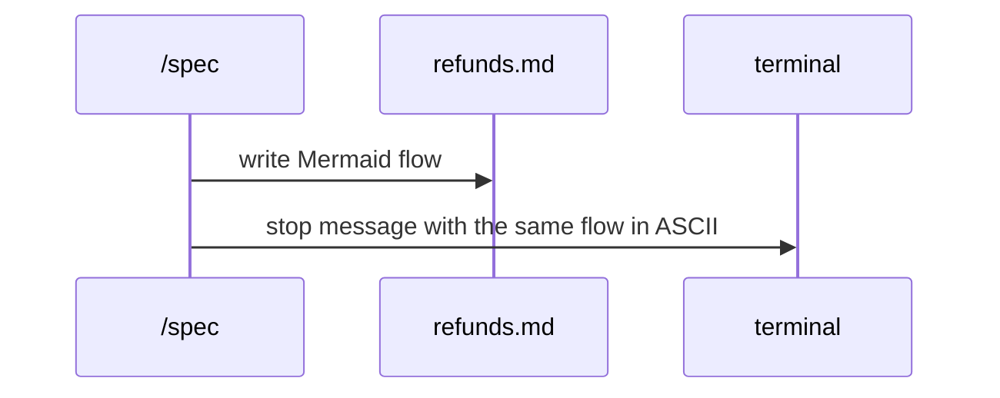

# ASCII terminal

**Version:** v1 · **Status:** Built · **Type:** Enhancement · **Project type:** CLI/Library

**Shape doc:** docs/specs/v3-release-and-hosts/shape.md — slice 8, part 6 of 9
**Depends on:** None
**Page:** https://claude.ai/artifact/TNetgs99avn7udEDAXJxhA

Diagrams zuko prints to the terminal are ASCII; Mermaid stays in files and on the
published pages. Now, because the terminal shows Mermaid as raw source, and three
references plus the README claim it renders there.

## Problem

Claude Code's terminal prints Markdown fences as text, so a Mermaid block in a
stage's reply arrives as `flowchart LR` source the user has to read in their head.
The user has already worked around this by hand: this machine's memory holds
"Terminal has no Mermaid — draw diagrams in ASCII in chat". The references say the
opposite: `README.md:73` ("it renders in the terminal"), `visual-page.md:8`
("Mermaid renders there fine") and `diagram-set.md:51` ("It renders in the terminal,
diffs in git"). `voice.md`'s "Visuals over prose" section says nothing about where
each form belongs.

## Slice test

| Check                         | Result                                                                                     |
| ----------------------------- | ------------------------------------------------------------------------------------------ |
| Cuts every layer it needs     | yes — the rule in `voice.md`, the three wrong claims, and a contract test                  |
| One e2e test walks it         | partly — a contract test proves the text; the behaviour shows in the next stage reply (O1) |
| Worth shipping alone          | yes — every stage's terminal diagram becomes readable                                      |
| Fits (≤5 scenarios, ≤2 areas) | yes — 3 scenarios; two areas: `references/` and `README.md`                                |

**Path:** full, by the rule only — it touches 4 files, over the light path's 3. No
new interface, data or dependency, so pause 2 is the rule's wording. Part 6 of slice
8's split; the full split is in `mermaid-placeholder.md`.

## User story

As someone reading zuko's replies in a terminal, I want diagrams drawn in ASCII
there, so I can read the picture without rendering Mermaid in my head.

## Flow



The same diagram is Mermaid in the file and ASCII in the reply, and both say the
same thing.

## Acceptance criteria

```gherkin
Scenario: a stage stop shows ASCII in the terminal
  Given /spec reaches pause 1 for refunds, with its flow written as Mermaid in
    docs/specs/refunds.md
  When it prints the stop message
  Then the flow in the terminal is drawn in ASCII, with the same boxes and labels
  And docs/specs/refunds.md still holds the Mermaid block

Scenario: no reference claims Mermaid renders in the terminal
  Given README.md, references/visual-page.md and references/diagram-set.md
  Then none says Mermaid renders in the terminal
  And diagram-set.md's "Where they live" says the terminal gets ASCII

Scenario: the rule is in voice.md
  Given references/voice.md, "Visuals over prose"
  Then it says terminal diagrams are ASCII and Mermaid lives in files and pages
```

## Scope

**In:** the rule in `voice.md`; the three claims fixed; a contract test.

**Out:** converting Mermaid to ASCII by script — no slice; the published pages (they
render Mermaid); the diagrams inside existing specs.

## Interface

The rule, added to `voice.md` under "Visuals over prose":

```text
Diagrams printed to the terminal are ASCII: boxes, arrows and labels in plain
characters, in a code block. The terminal shows Mermaid as source. Mermaid stays
the source of truth in specs, shapes and published pages, and the ASCII in the
reply draws the same diagram.
```

## Technical plan

### Approach

Text edits in four files and one contract test. Every stage already reads `voice.md`
first, so the rule reaches all of them without editing each skill.

Relies on: none





### Changes

| File                                                      | What changes                                                                                                                     | Why            |
| --------------------------------------------------------- | -------------------------------------------------------------------------------------------------------------------------------- | -------------- |
| `plugins/zuko/references/voice.md:67`                     | The rule from the Interface section                                                                                              | scenario 3     |
| `plugins/zuko/references/diagram-set.md:51`               | "Where they live": Mermaid in the Markdown (diffs in git, renders on pages); ASCII in terminal replies                           | scenario 2     |
| `plugins/zuko/references/visual-page.md:8`                | "The terminal is where the work happens, and it shows Mermaid as source."                                                        | scenario 2     |
| `README.md:73`                                            | Drop "it renders in the terminal"; say terminal replies draw ASCII                                                               | scenario 2     |
| `plugins/zuko/scripts/tests/test-ascii-terminal.sh` (new) | Greps for the rule in `voice.md` and `diagram-set.md`, and for no "renders in the terminal" / "renders there" in the three files | scenarios 2, 3 |

Reusing: `run.sh`'s `expect_match` and `expect_no_match`.

### Non-functionals

|                      |                                                           |
| -------------------- | --------------------------------------------------------- |
| **Load**             | None; text read at stage start                            |
| **Breaks first**     | Nothing                                                   |
| **Security surface** | None                                                      |
| **Proof it works**   | The next `/spec` or `/shape` stop draws its flow in ASCII |
| **Rollout**          | No flag. Rollback is `git revert`                         |

### Test plan

| Scenario | Test                     | Command                                                 |
| -------- | ------------------------ | ------------------------------------------------------- |
| 2, 3     | `test-ascii-terminal.sh` | `bash plugins/zuko/scripts/tests/run.sh ascii-terminal` |
| 1        | the next real stage stop | —                                                       |

**E2E:** none that runs the model. The contract test proves the text; scenario 1 is
checked on the next `/spec` stop (O1).

**Build result (2026-10-05):** `run.sh ascii-terminal`: 9 passed, 0 failed.
Scenario 1 stays with the next real `/spec` stop (O1).

### Chunks

Single chunk.

### Risks

| Risk                                                  | Mitigation                                                                                                  |
| ----------------------------------------------------- | ----------------------------------------------------------------------------------------------------------- |
| The ASCII drifts from the Mermaid it copies           | The rule says "the same diagram"; the file stays the source of truth                                        |
| README's zuko block is regenerated and loses the edit | Line 73 sits outside the zuko markers, so `render-readme-block.sh` never touches it — check before shipping |

### Decisions to record

Recorded as D23.

## Open items

| ID  | What                                                                                                                                                                                         | Type       | Raised at | Owner | Status | Answer |
| --- | -------------------------------------------------------------------------------------------------------------------------------------------------------------------------------------------- | ---------- | --------- | ----- | ------ | ------ |
| O1  | Assuming a contract test plus the next real stage stop is enough proof (default chosen autonomously; alternative: a headless `claude -p` stage run, as the owasp-lens spike proved possible) | assumption | spec p1   | user  | Resolved | Default accepted by the user, 2026-09-25 |

_Never delete this section or its rows. See references/ledger.md._

## Glossary

- **ASCII diagram** — boxes and arrows drawn with plain characters (`─ │ ▶`), which
  any terminal shows as intended.
- **Mermaid** — a text format for diagrams that renders on pages and in GitHub, but
  shows as source in a terminal.
