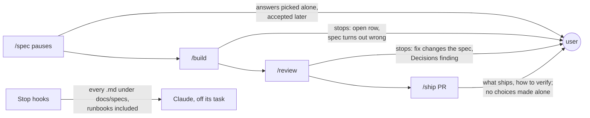
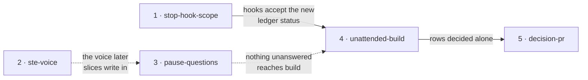

# Ask up front, decide at the PR

**Project type:** CLI/Library · **Status:** Shaped

## Problem

zuko asks the user at the wrong times. Spec pauses pass on answers that Claude
picked alone, and `/build` and `/review` stop in the middle of a run to ask. The
PR at the end does not show what Claude decided without the user. The Stop
hooks also pull Claude away from its task, onto Markdown files that are not
zuko docs. zuko's writing follows a house list of rules, not a published
standard that the user can check it against.

## Today

The user is asked during build and review, and is not asked enough during the
pauses.

| Evidence | Count | Source |
| --- | --- | --- |
| Ledger rows that say "default chosen autonomously" | 27 | `docs/specs/*.md` |
| Past sessions where a zuko Stop hook failed the turn | 18, in 7 projects | session logs |
| Places where `/build` or `/review` stops to ask | 5 | `skills/build/SKILL.md`, `skills/review/SKILL.md` |

The files that made the Stop hooks fail were mostly not zuko docs: runbooks
(`raslaw-rebuild/dns-cutover-runbook.md`), notes from other tools
(`GAO-1156-jad-structured-store/spec-reingest-cutover.md`), and experiment
notes. One was a `Built` spec with a row that `/build` raised, which the hook
then refused.

## Slices

The target: the user answers everything at the three pauses, nothing stops
`/build` or `/review`, and the user makes one informed decision at the PR.

| # | Slice | What ships | Why this order |
| --- | --- | --- | --- |
| 1 | stop-hook-scope | The Stop hooks fail a turn only for a zuko doc that the current work touched. Runbooks, other tools' notes and untouched specs never pull Claude off its task. | A live bug in 7 projects. Slice 4 adds a ledger status that the hooks must accept, so the hooks change first. |
| 2 | ste-voice | `references/voice.md` adopts the ASD-STE100 writing rules. Every stage reads it already. | Small. Slices 3 to 5 write the questions and the PR body, so they use the new voice from the start. |
| 3 | pause-questions | Each pause puts every question and assumption to the user in the question prompt, with a recommended answer first. A pause ends with zero Open rows. An unproven claim offers `/poc`. | Makes the spec complete before build, which slice 4 relies on. Ships alone: the pauses improve even if build still asks. |
| 4 | unattended-build | `/build` and `/review` never stop to ask. Each choice they make alone is a ledger row with a new status, which does not block. | Needs slice 1's hooks. Ships alone: the run finishes, and the rows are in the spec. |
| 5 | decision-pr | The PR body starts with the choices made without the user, then the review result, then what ships. It is short enough to read on one screen. | Reads slice 4's rows. Without them it has less to show. |

### Slice 1 · stop-hook-scope

The two Stop hooks are `scripts/verify-gates.sh` and
`scripts/check-open-items.sh`. Both read every `.md` file in `docs/specs/` to
depth 2, so any file in an idea folder counts as a spec. Both run at the end of
every turn, whatever the turn was for.

- A file that is not a zuko doc is never judged. zuko docs are
  `docs/specs/{slice}.md` and `docs/specs/{idea}/shape.md`.
- A breach in a doc that the current work did not touch does not fail the turn.
- A breach in a doc that the current work touched still fails it. The gate
  stays.

### Slice 2 · ste-voice

ASD-STE100 Issue 9 (January 2025) has 53 writing rules and a dictionary of
about 900 approved words. The rules that change zuko's writing most:

- No more than 20 words in an instruction, and 25 in a description.
- One instruction in each sentence. Put a condition before the instruction.
- Active voice.
- No noun cluster of more than three words.
- One topic in each paragraph, and no more than six sentences.
- Use an "-ing" form only as a technical noun.

`voice.md` keeps its ban list. The STE rules go next to it. zuko uses the rules
only, not the dictionary (O1). They apply to all new text that zuko writes (O2).

### Slice 3 · pause-questions

Today only pause 3 must end with zero Open rows. Pauses 1 and 2 can be approved
with rows still open. Claude also wrote 27 answers itself and asked later.

- Each pause asks with the question prompt, up to four questions at a time.
  Each question shows a recommended answer first.
- Each assumption Claude makes is shown as a question, not written down
  quietly.
- An `unproven` row offers `/poc` as the first answer (O4).
- No pause is approved while a row is Open.

### Slice 4 · unattended-build

| Where it stops today | After |
| --- | --- |
| `/build` gate: walks Open rows with the user | Cannot happen. A `Refined` spec has zero Open rows. A spec that is not `Refined` goes back to `/spec`. |
| `/build`: the spec turns out wrong | Decides, records a row, continues. The PR lists it first (O3) |
| `/build`: a file the plan did not name | Decides, records a row, continues |
| `/review`: a fix changes what the spec approved | Applies the fix, records a row |
| `/review`: a Decisions finding | Changes the code to obey the entry, records a row (O5) |

A recorded row says what was chosen, what the other choice was, and how to undo
it. `/ship` still asks before it pushes and before it merges.

### Slice 5 · decision-pr

Today's PR body has: what ships, the scenarios, how to verify, the flag. PR 78
was 337 words. It did not say what Claude chose without the user.

The new body, in order:

1. **Your call.** Each row decided without you: the choice, the other choice,
   how to undo it.
2. **Review.** Raw findings, fixed findings, and one line for each fix.
3. **What ships**, how to verify it, and how to roll it back.

## Not doing

- **Open a GitLab MR.** GitLab was dropped on 2026-09-25
  (`v3-release-and-hosts` O13). O8 asks what to do on a GitLab origin instead.
- **Stop asking before push and merge.** Your global rules say never push or
  open a PR without asking.
- **Rewrite old specs and docs into STE.** New text only.
- **Remove the Stop hooks.** They still catch a real breach in the doc being
  written.
- **Supersede a decision from `/review`.** A change to `DECISIONS.md` stays
  your call.

## Open items

| ID | What | Type | Raised at | Owner | Status | Answer |
| --- | --- | --- | --- | --- | --- | --- |
| O1 | ASD-STE100: use the 53 writing rules only, or the approved dictionary too? | question | shape | user | Resolved | Rules only. No dictionary, 2026-10-07 |
| O2 | Which text follows STE: everything zuko writes, or only the text you read to decide (pause summaries, reports, PR body)? | question | shape | user | Resolved | Everything zuko writes. New text only, 2026-10-07 |
| O3 | `/build` finds the spec wrong in the middle of a run. Decide, record a row and continue, or stop and go back to `/spec` as today? | question | shape | user | Resolved | Decide, record a row, continue. The PR lists it first, 2026-10-07 |
| O4 | A pause meets an unproven claim. Offer `/poc` as the first answer, or run `/poc` without asking? | question | shape | user | Resolved | Offer `/poc` first. You choose each time, 2026-10-07 |
| O5 | Assuming `/review` fixes a Decisions finding by changing the code to obey the entry. Superseding the entry stays your call at the PR. | assumption | shape | user | Handed to unattended-build | — |
| O6 | In auto mode the harness tells Claude not to ask questions. Does a skill rule to ask at each pause win over it? The 27 rows suggest that it does not today. | unproven | shape | poc | Handed to pause-questions | A headless run can settle it |
| O7 | Assuming "the Stop hooks must not block required work" means: they pull Claude onto files that the task did not touch, or that are not zuko docs. Taken from 18 logged sessions. | assumption | shape | user | Handed to stop-hook-scope | — |
| O8 | Two of your work repos are on gitlab.com, where `/ship` opens nothing. Print the PR body for you to paste there? | question | shape | user | Handed to decision-pr | — |

## Glossary

- **ASD-STE100** — Simplified Technical English. A controlled-language standard
  from ASD, the European aerospace and defence association. It has writing rules
  and a dictionary of approved words. Free on request; ASD owns the copyright.
- **Stop hook** — a script that Claude Code runs when Claude tries to end its
  turn. An exit code of 2 sends Claude back to work with the script's message.
- **Ledger** — the Open items table in a shape or spec. Rows are resolved, never
  deleted.
- **Question prompt** — Claude Code's multiple-choice question box, which the
  user answers with one key press or a typed reply.
- **Auto mode** — a Claude Code mode where Claude works without stopping for
  approval.
- **Headless run** — running Claude Code with `claude -p`, with no terminal UI,
  so a script can check what it did.
- **Decisions finding** — a `/review` finding where the code does something
  that an active entry in `DECISIONS.md` rejected.
- **MR** — merge request, GitLab's name for a pull request (PR).
