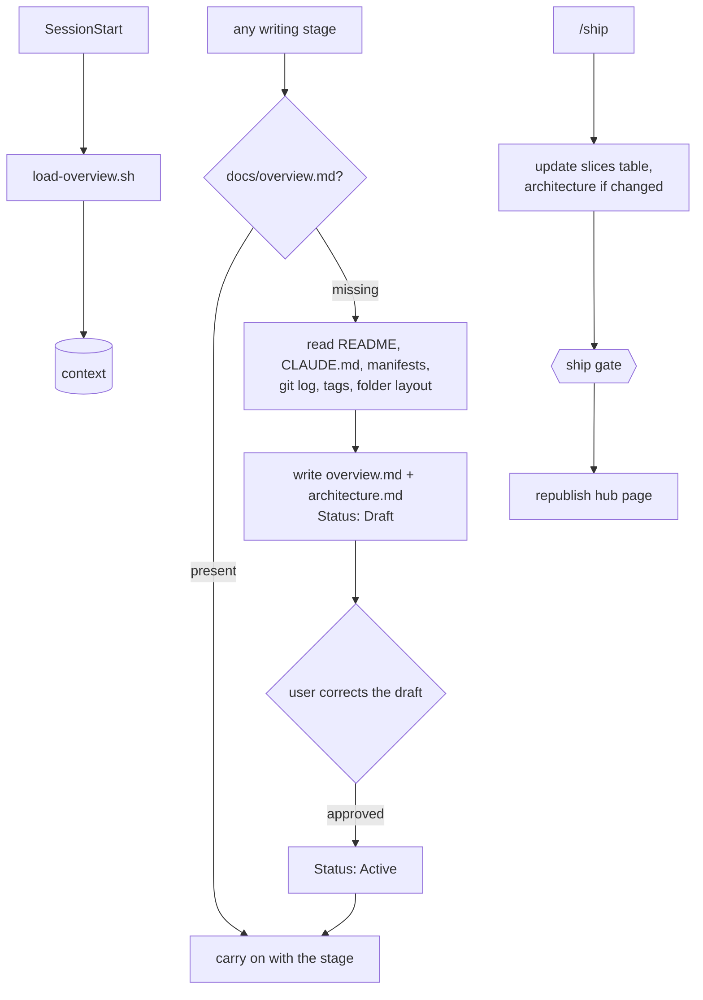
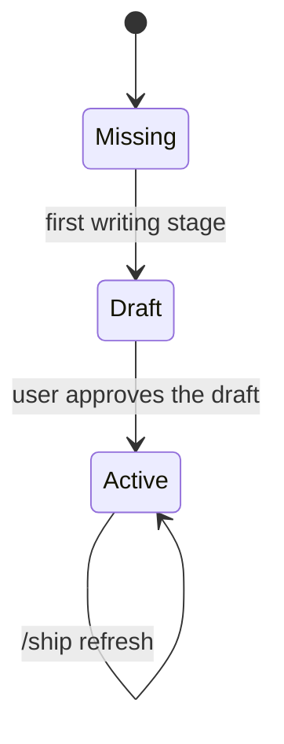
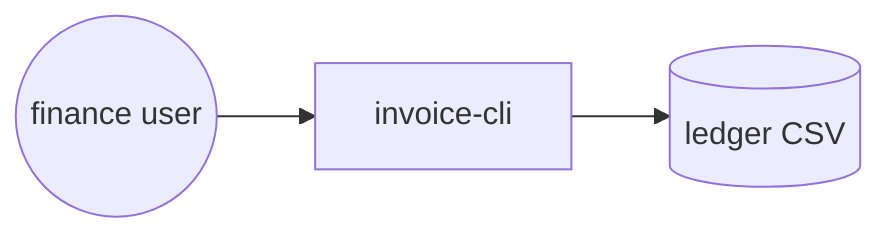
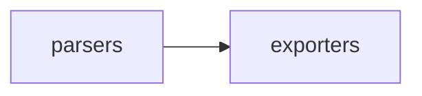
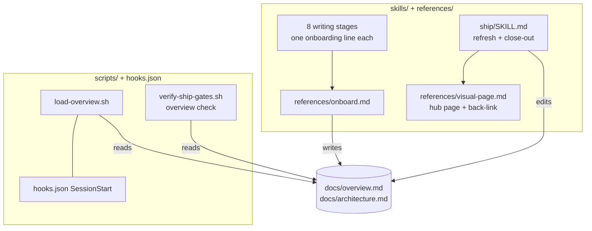
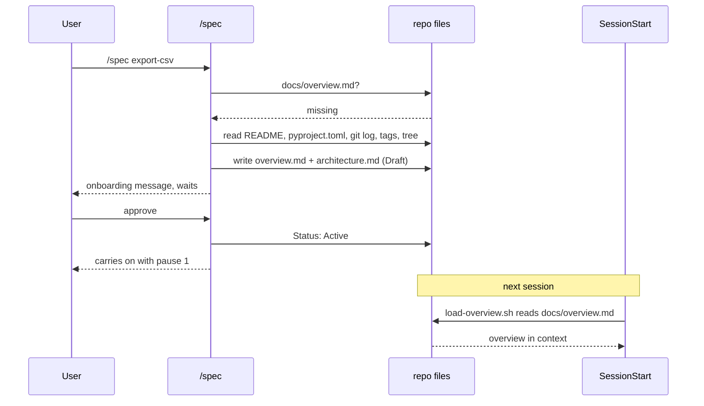

# Auto-onboard

**Version:** v1 · **Status:** Refined · **Type:** Feature · **Project type:** CLI/Library

**Shape doc:** docs/specs/v3-project-memory/shape.md — slice 1
**Depends on:** None
**Page:** https://claude.ai/artifact/6jGkvydEiefbEkuRQiiULA

The first zuko stage run in any repo writes a short living overview and an
architecture doc, has the user correct them once, and from then on every session
starts knowing what the project is. `/ship` keeps both current.

## Problem

Every new session starts blind: zuko loads the repo's lessons
(`scripts/load-learnings.sh`) but nothing that says what the product is, how to run
it, or what has shipped. On a repo zuko has never seen, `/shape` and `/spec` begin
by re-reading README, manifests and git log from scratch — and a person coming back
after weeks does the same by hand. There is no single current picture of the project.

## Slice test

| Check                         | Result                                                                                                                   |
| ----------------------------- | ------------------------------------------------------------------------------------------------------------------------ |
| Cuts every layer it needs     | yes — the onboarding step in each writing stage, the SessionStart loader, the `/ship` refresh and its gate, the hub page |
| One e2e test walks it         | yes — one scratch repo: not onboarded → onboard → session load → ship a slice → gate passes, then fails on a missing row |
| Worth shipping alone          | yes — the next session in any repo opens with the project's overview in context                                          |
| Fits (≤5 scenarios, ≤2 areas) | yes — 5 scenarios; two areas: `skills/` + `references/`, and `scripts/` + `hooks.json`                                   |

**Path:** full — adds a new script and a new reference and edits every writing stage,
so the light-path rules (≤3 files, nothing new) do not hold.

## Flow



A stage onboards once, before its own work; every later session loads the result, and
every ship keeps it current.

## States



## Acceptance criteria

```gherkin
Scenario: a brownfield repo is onboarded on its first zuko stage
  Given the repo "invoice-cli" with a README, a pyproject.toml declaring pytest
    and ruff, 43 commits, tags v0.1.0 and v0.2.0, and no docs/overview.md
  When the user runs /spec on "export-csv"
  Then zuko writes docs/overview.md and docs/architecture.md with Status: Draft
  And overview.md names the test command "pytest" and the lint command "ruff check ."
  And overview.md is no longer than 150 lines and contains no copied source code
  And zuko shows the draft and waits before starting the spec
  And after the user approves, both files say Status: Active and /spec continues

Scenario: a greenfield repo is onboarded with honest blanks
  Given an empty repo "habit-tracker" with one commit and no manifest
  When the user runs /shape
  Then docs/overview.md says "Nothing shipped yet"
  And its run, test and lint lines say "not set up yet" rather than guessing a command
  And docs/architecture.md holds a single-node context diagram and no components

Scenario: every session starts with the overview in context
  Given "invoice-cli" with an Active docs/overview.md of 96 lines
  When a new session starts
  Then the SessionStart output contains the overview in full
  And when the overview grows to 180 lines, only the first 150 are loaded,
    followed by a warning naming the file and its length
  And when the overview is still Draft, the output marks it "Draft — not yet confirmed"
  And when there is no overview, the output is one line saying the next zuko stage
    will onboard, and the script exits 0

Scenario: shipping a slice keeps the overview current
  Given "invoice-cli" with an Active overview whose slices table lists "export-csv"
    as Refined, and a spec whose pause 3 added the component "exporters/"
  When /ship prepares the branch for "export-csv"
  Then the slices table shows "export-csv" as Built with its page link
  And docs/architecture.md lists "exporters/" with one line saying what it does
  And the ship gate passes
  And after the merge, the close-out commit that marks the spec Shipped also
    marks the "export-csv" row Shipped
  But when the slices table has no "export-csv" row, the ship gate exits 1
    naming the missing slice

Scenario: the hub page links every slice page both ways
  Given "invoice-cli" with shipped slices "export-csv" and "import-csv", each with
    a published spec page
  When /ship republishes the hub page
  Then the hub page renders the architecture diagram and links to both spec pages
  And each spec page links back to the hub page
  And the hub page is republished to the same link it had before
```

## Scope

**In:**

- A shared reference for onboarding: what to read, what to write, the overview's
  fixed sections, the 150-line cap, the draft-then-approve step.
- One onboarding check at the top of each writing stage: `/shape`, `/spec`, `/poc`,
  `/design`, `/build`, `/review`, `/ship`, `/debug` (and `/design-system`, `/release`
  when their slices land). `/status` and `/learn` only report "not onboarded".
- A SessionStart script that loads the overview, wired in `hooks.json` next to
  `load-learnings.sh`.
- `/ship` close-out: update the slices table and `architecture.md`; a ship-gate check
  that the shipped slice is in the table; republish the hub page.
- The hub page reference, and a back-link line in `references/visual-page.md`.
- Tests in `scripts/tests/` for every script path, plus the e2e walk.

**Out:**

- `docs/decisions.md` and its session load — slice 2.
- `CHANGELOG.md` and its onboarding seed — slice 3.
- The latest-release line on the overview — `v3-release-and-hosts` slice 4.
- README — slice 1b `readme-block` adds a generated block between markers; content
  outside the markers stays the user's.
- Re-onboarding an already-onboarded repo from scratch — once Active, only `/ship`
  and hand edits change it.

## Interface

No new command. The surface is two files, one SessionStart output, one onboarding
message, one gate message, and one page.

### `docs/overview.md`

Fixed sections, in this order. `/ship` and the loader find them by heading.

```markdown
# invoice-cli

**Status:** Active · **Updated:** 2026-09-24 by /ship export-csv

Turns a folder of supplier invoices into one ledger CSV. Used by the finance team
at month end; about 400 invoices a run.

## Run it

| Task    | Command                     |
| ------- | --------------------------- |
| install | `pip install -e .`          |
| run     | `invoice-cli build ./inbox` |
| test    | `pytest`                    |
| lint    | `ruff check .`              |

## Where things are

- `invoice_cli/parsers/` — one parser per supplier format
- `invoice_cli/exporters/` — CSV and ledger writers
- `tests/` — pytest, fixtures in `tests/fixtures/`

## Slices

| Slice      | Status  | Page                  |
| ---------- | ------- | --------------------- |
| export-csv | Shipped | https://claude.ai/... |
| import-csv | Refined | https://claude.ai/... |

## More

README.md · docs/architecture.md · hub page: https://claude.ai/...
```

- **Status:** `Draft` or `Active`. Nothing else.
- **Greenfield:** description is one line from the user's first request; every
  command cell reads `not set up yet`; slices table has one row, `none yet`, under
  the heading line "Nothing shipped yet".
- **Hard rules:** ≤150 lines; paths as pointers, never pasted code; every command
  is one found in a manifest, script, or CI file — none invented.

### `docs/architecture.md`

````markdown
# invoice-cli · architecture

**Status:** Active · **Updated:** 2026-09-24 by /ship export-csv

## Context



## Components



| Component | Folder                   | Does                          |
| --------- | ------------------------ | ----------------------------- |
| parsers   | `invoice_cli/parsers/`   | read one supplier format each |
| exporters | `invoice_cli/exporters/` | write the ledger CSV          |
````

Greenfield: the context diagram has the one product node; the Components section says
"none yet".

### SessionStart output — `load-overview.sh`

| State                               | Output                                                                                                    | Exit |
| ----------------------------------- | --------------------------------------------------------------------------------------------------------- | ---- |
| Active, ≤150 lines                  | `Project overview (docs/overview.md):` then the file                                                      | 0    |
| Active, >150 lines                  | the first 150 lines, then `Warning: docs/overview.md is 180 lines; loaded the first 150. Trim it to 150.` | 0    |
| Draft                               | `Project overview (docs/overview.md) — Draft — not yet confirmed:` then the file                          | 0    |
| Missing                             | `No docs/overview.md — the next zuko stage will onboard this repo.`                                       | 0    |
| Unreadable or no `**Status:**` line | `docs/overview.md has no Status line — loaded as Draft.` then the file                                    | 0    |

A SessionStart hook never blocks a session, so every state exits 0; the message says
what happened.

### Onboarding message (terminal)

```
Not onboarded yet. Read: README.md, pyproject.toml, 43 commits, tags v0.1.0..v0.2.0.
Wrote (Draft):
  docs/overview.md       61 lines
  docs/architecture.md   2 components
Commands found: test "pytest" (pyproject.toml) · lint "ruff check ." (pyproject.toml)
Not found: run command — marked "not set up yet"

Check both files. Say what to change, or "approve" to mark them Active and carry on
with /spec export-csv.
```

Every command listed names the file it came from.

### Ship gate message

Added to `verify-ship-gates.sh`, same shape as its existing failures:

```
gates FAILED
  docs/overview.md  slices table has no row for "export-csv"
```

The gate also fails on `docs/overview.md` missing (`not onboarded — run any writing
stage first`) or at `Status: Draft` (`overview still Draft — approve it before
shipping`). It never passes on an overview it could not read.

### Hub page

Built per `references/visual-page.md` rules (Markdown wins, gitignored HTML, same path
each publish), at `docs/specs/.pages/_hub.html` — next to the spec pages, so one
ignore rule covers both; the underscore keeps it from colliding with a slice name. Sections in order: product line and
status strip · run commands · architecture diagrams · slices table with links to each
spec page · links to README and architecture. Each spec page gains one line at the
top, e.g. `Part of invoice-cli — hub page: https://claude.ai/...`.

## Technical plan

### Approach

Two deterministic pieces carry the guarantees — a loader script and a ship-gate check
— and everything else is stage prose pointing at one new reference. Onboarding itself
is Claude reading the repo and writing two files, so it lives in
`references/onboard.md` and each writing stage gets one line sending it there when
`docs/overview.md` is missing. Nothing parses the overview except by its fixed
headings and its `**Status:**` line.





**Slices-table timing.** Spec status reaches `Shipped` in a follow-up commit after the
merge (history: `b075026 docs(spec): mark ship-naming shipped`). The overview row
follows the spec: the PR carries the row at `Built`, the close-out commit flips it to
`Shipped` together with the spec. The gate checks the row exists, not its status.

### Changes

| File                                                                           | What changes                                                                                                                                                                                                                                                                                                | Why                                      |
| ------------------------------------------------------------------------------ | ----------------------------------------------------------------------------------------------------------------------------------------------------------------------------------------------------------------------------------------------------------------------------------------------------------- | ---------------------------------------- |
| `plugins/zuko/references/onboard.md` (new)                                     | What to read, in order; the two file templates from the Interface section; the rules (≤150 lines, pointers not code, every command sourced from a named file, `not set up yet` otherwise); the onboarding message; the Draft → approve → Active step; adding `docs/specs/.pages/` to `.gitignore` if absent | scenarios 1, 2 — one copy, eight readers |
| `skills/` shape, spec, poc, design, build, review, ship, debug — each `SKILL.md` | One line beside the existing `voice.md` line (e.g. `shape/SKILL.md:18`): "If `docs/overview.md` is missing, follow `references/onboard.md` first."                                                                                                                                                          | scenarios 1, 2                           |
| `plugins/zuko/skills/status/SKILL.md`, `learn/SKILL.md`                        | One line: report "not onboarded" when the overview is missing; never write it                                                                                                                                                                                                                               | read-only stages stay read-only          |
| `plugins/zuko/skills/ship/SKILL.md`                                            | Before "The gates" (`:26`): update the slices-table row to `Built` with the page link, update `architecture.md` if pause 3 added a component. Close-out (`:103`): flip the row to `Shipped` with the spec, republish the hub page                                                                           | scenarios 4, 5                           |
| `plugins/zuko/scripts/load-overview.sh` (new)                                  | The five states from the Interface table; head -150 plus warning over the cap; always exit 0                                                                                                                                                                                                                | scenario 3                               |
| `plugins/zuko/hooks/hooks.json`                                                | Add `load-overview.sh` to SessionStart after `load-learnings.sh`                                                                                                                                                                                                                                            | scenario 3                               |
| `plugins/zuko/scripts/verify-ship-gates.sh`                                    | New block after the ledger checks (`:30`): overview missing / Draft / no row for the spec's basename → problem; row found → a scope line `Overview: row for "{slice}" found`                                                                                                                                | scenario 4                               |
| `plugins/zuko/references/visual-page.md`                                       | Hub page section (sources, section order, path `docs/specs/.pages/_hub.html`); the back-link line on every spec page                                                                                                                                                                                        | scenario 5                               |
| `plugins/zuko/scripts/tests/test-load-overview.sh` (new)                       | One test per loader state                                                                                                                                                                                                                                                                                   | scenario 3                               |
| `plugins/zuko/scripts/tests/test-verify-ship-gates.sh`, `test-e2e-naming.sh`   | Fixtures gain an Active overview with the fixture's row — otherwise the new check fails every existing naming test                                                                                                                                                                                          | keeps the old tests testing naming       |
| `plugins/zuko/scripts/tests/test-e2e-onboard.sh` (new)                         | The e2e walk below                                                                                                                                                                                                                                                                                          | slice proof                              |

Reusing: `load-learnings.sh`'s shape for the loader; `verify-ship-gates.sh`'s
`problems` accumulator and message format; the `run.sh` helpers `expect_exit` /
`expect_match`; the spec-status grep idiom `\*\*Status:\*\*[[:space:]]*[A-Za-z]+`
from `check-open-items.sh`.

### Earn-it

| Added                           | Triggered by                                                                                     |
| ------------------------------- | ------------------------------------------------------------------------------------------------ |
| `load-overview.sh`              | scenario 3 — the cap and the five states need code; `load-learnings.sh` has no cap and no states |
| `references/onboard.md`         | scenarios 1, 2 — eight stages need the same steps; eight copies drift                            |
| Overview check in the ship gate | scenario 4 — prompt rules drift, grep does not (ledger rule 7)                                   |

No new dependency. No config option.

### Non-functionals

|                      |                                                                                                                                                                                                                                                                                           |
| -------------------- | ----------------------------------------------------------------------------------------------------------------------------------------------------------------------------------------------------------------------------------------------------------------------------------------- |
| **Load**             | One file read per session, ≤150 lines — roughly 2k tokens at most                                                                                                                                                                                                                         |
| **Breaks first**     | The overview outgrowing 150 lines; the loader truncates and warns, `/ship` is told to trim                                                                                                                                                                                                |
| **Security surface** | Reads repo files only, runs nothing it finds. The overview is repo text loaded into context — same trust as `CLAUDE.md`; the loader's header line labels it as project data. Onboarding never copies `.env` or secret-shaped values: `references/onboard.md` names `.env*` as not-to-read |
| **Proof it works**   | The next session in an onboarded repo shows `Project overview (docs/overview.md):` in its SessionStart output                                                                                                                                                                             |
| **Rollout**          | No flag — ships in the plugin. Rollback: revert the merge commit; existing `docs/overview.md` files stay and are simply no longer loaded                                                                                                                                                  |

### Test plan

| Scenario                                                 | Test                                                                 | Command                                                    |
| -------------------------------------------------------- | -------------------------------------------------------------------- | ---------------------------------------------------------- |
| 1 brownfield onboarding                                  | real run on this repo during `/build` — draft shown to the user (O7) | run `/spec` with zuko from the repo                        |
| 2 greenfield onboarding                                  | real run on a scratch empty repo during `/build` (O7)                | same, in a `mktemp -d` repo                                |
| 3 session load, five states                              | `scripts/tests/test-load-overview.sh`                                | `bash plugins/zuko/scripts/tests/run.sh load-overview`     |
| 4 ship gate, row present / missing / Draft / no overview | `scripts/tests/test-verify-ship-gates.sh`                            | `bash plugins/zuko/scripts/tests/run.sh verify-ship-gates` |
| 5 hub page                                               | real publish during `/build`, both links opened                      | Artifact publish, links checked by hand                    |
| all existing                                             | the whole suite                                                      | `bash plugins/zuko/scripts/tests/run.sh`                   |

**E2E:** `scripts/tests/test-e2e-onboard.sh` — one scratch repo: no overview → loader
prints the onboard hint and gate fails "not onboarded"; a Draft overview → loader flags
Draft and gate fails "still Draft"; Active with no row → gate fails naming the slice;
row added → gate passes; overview padded to 180 lines → loader warns.

### Chunks

Harness first (`docs/learnings/harness-before-the-chunks-it-proves.md`): each chunk
writes its failing tests before its code.

| Chunk | Scenarios | Files owned                                                                                                                                        |
| ----- | --------- | -------------------------------------------------------------------------------------------------------------------------------------------------- |
| A     | 3         | `scripts/load-overview.sh`, `hooks/hooks.json`, `scripts/tests/test-load-overview.sh`                                                              |
| B     | 4, e2e    | `scripts/verify-ship-gates.sh`, `scripts/tests/test-verify-ship-gates.sh`, `scripts/tests/test-e2e-naming.sh`, `scripts/tests/test-e2e-onboard.sh` |
| C     | 1, 2, 5   | `references/onboard.md`, `references/visual-page.md`, every `skills/*/SKILL.md` listed above                                                       |

The e2e test in chunk B calls `load-overview.sh` from chunk A, so B merges after A.

### Risks

| Risk                                                                                                                  | Mitigation                                                                                                                    |
| --------------------------------------------------------------------------------------------------------------------- | ----------------------------------------------------------------------------------------------------------------------------- |
| The new gate check breaks every existing ship-gate test, whose fixtures have no overview                              | Chunk B updates both fixtures first and runs the old tests red → green                                                        |
| Repos shipped with v2 have no overview and fail the gate                                                              | `/ship` is a writing stage, so it onboards before it reaches the gate                                                         |
| Onboarding invents a command that looks right                                                                         | Every command names its source file in the draft message; none found means `not set up yet`, which the greenfield test checks |
| The installed plugin cache runs old scripts during the real runs (`docs/learnings/installed-plugin-lags-the-repo.md`) | Real runs call `plugins/zuko/scripts/*` from the repo by path, and diff against the cache before trusting a result            |

## Open items

| ID  | What                                                                             | Type       | Raised at | Owner  | Status        | Answer                                                                                                                                                    |
| --- | -------------------------------------------------------------------------------- | ---------- | --------- | ------ | ------------- | --------------------------------------------------------------------------------------------------------------------------------------------------------- |
| O1  | Who is the overview for?                                                         | question   | shape     | user   | Resolved      | Both people and Claude (shape O1)                                                                                                                         |
| O2  | How does a brownfield repo start?                                                | question   | shape     | user   | Resolved      | Automatically on the first writing stage; draft shown once (shape O2)                                                                                     |
| O3  | Overview load cost                                                               | flag       | shape     | claude | Resolved      | 150-line cap, SessionStart hook, not `@` import (shape O7)                                                                                                |
| O4  | Does onboarding block the stage the user ran until the draft is approved?        | assumption | spec p1   | user   | Resolved      | Yes — the stage waits for approval; a wrong overview would load into every later session                                                                  |
| O5  | Is a Draft overview loaded at session start, or only an Active one?              | assumption | spec p1   | user   | Resolved      | Yes, marked "Draft — not yet confirmed"                                                                                                                   |
| O6  | Does the overview replace the README?                                            | assumption | spec p1   | user   | Resolved      | No. README keeps a zuko-managed block generated from the overview — slice 1b `readme-block`                                                               |
| O7  | Skill-prose behaviour (what the draft says) cannot be proven by the bash harness | flag       | spec p1   | claude | Accepted risk | Scripts, gates and file shape are tested; draft content is proven by one real run on this repo during /build, output shown to the user. Agreed 2026-09-24 |

## Glossary

- **Brownfield / greenfield** — an existing codebase / a new one.
- **Hub page** — the one project-level web page; each slice's page links from it.
- **SessionStart hook** — a script Claude Code runs as each session opens; its output
  becomes context.
- **Slices table** — the overview's list of every spec and its status.
