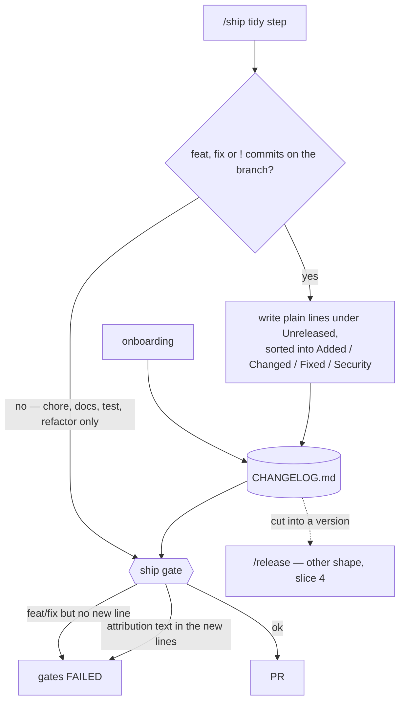
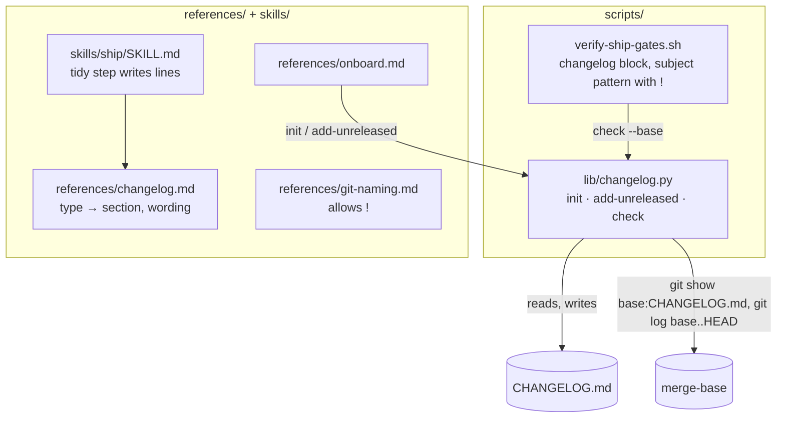
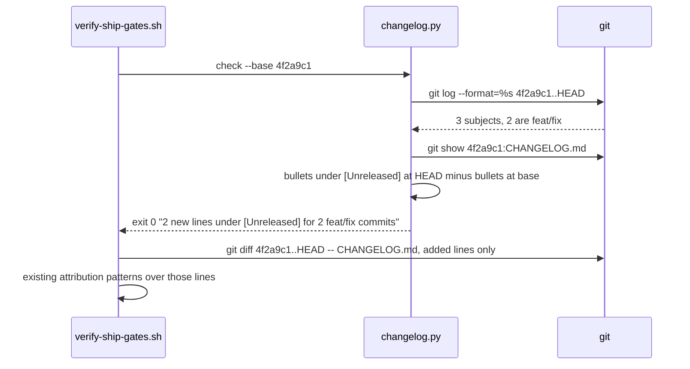

# Changelog

**Version:** v1 · **Status:** Refined · **Type:** Feature · **Project type:** CLI/Library

**Shape doc:** docs/specs/v3-project-memory/shape.md — slice 3
**Depends on:** `auto-onboard` — onboarding creates the file
**Page:** https://claude.ai/artifact/MhNNgxXonCgnAvfYyHQBdt

Every shipped slice adds plain-language lines under `## [Unreleased]` in a root
`CHANGELOG.md` (Keep a Changelog 1.1.0), and the ship gate refuses a `feat` or `fix`
branch that added none. `/release` (`v3-release-and-hosts` slice 4) later turns
`[Unreleased]` into a version.

## Problem

Nothing in zuko says what changed between one release and the next. The only record is
`git log`, which is written for developers, one line per commit, and mixes typo fixes
with features. A user of a repo built with zuko — or the user themself after a month —
cannot answer "what's new since 1.2?" without reading commits.

## Slice test

| Check                         | Result                                                                                                                                 |
| ----------------------------- | -------------------------------------------------------------------------------------------------------------------------------------- |
| Cuts every layer it needs     | yes — onboarding creates the file, `/ship` writes the lines, the ship gate enforces them                                               |
| One e2e test walks it         | yes — one scratch repo: feat branch with no line → gate fails → line added → gate passes; chore-only branch → gate passes with no line |
| Worth shipping alone          | yes — every repo gets a readable record of what shipped, from the next slice on                                                        |
| Fits (≤5 scenarios, ≤2 areas) | yes — 5 scenarios; two areas: `scripts/` (gate), and `references/` + `skills/ship`                                                     |

**Path:** full — a new gate check and a new file every repo gets.

## Flow



Lines are written for someone who uses the product, then checked by script.

## Acceptance criteria

```gherkin
Scenario: onboarding creates a changelog from the repo's existing tags
  Given "invoice-cli" with tags v0.1.0 (2025-03-02) and v0.2.0 (2025-05-19) and no
    CHANGELOG.md
  When onboarding runs
  Then CHANGELOG.md starts with "# Changelog", the Keep a Changelog 1.1.0 line, and an
    empty "## [Unreleased]"
  And it lists "## [0.2.0] - 2025-05-19" then "## [0.1.0] - 2025-03-02", each with the
    line "Released before this changelog was kept."
  And no feature lines are invented for those versions

Scenario: /ship writes plain lines for a feature slice
  Given branch "feat/export-csv" with commits "feat(exporters): write ledger csv" and
    "fix(parsers): keep leading zeros in invoice numbers"
  When /ship tidies the branch
  Then "## [Unreleased]" gains under "### Added" the line
    "- Export the ledger as one CSV file."
  And under "### Fixed" the line "- Invoice numbers keep their leading zeros."
  And neither line repeats a commit subject word for word

Scenario: a breaking change is called out
  Given branch "feat/config-v2" with a commit "feat(config)!: read settings from invoice.toml"
  When /ship tidies the branch
  Then "### Changed" gains a line starting "- BREAKING:" that says what users must do,
    e.g. "- BREAKING: Settings move from settings.ini to invoice.toml; rename the file."

Scenario: the ship gate refuses a feature branch with no changelog line
  Given branch "feat/export-csv" with a feat commit and no change to CHANGELOG.md
  When verify-ship-gates.sh runs
  Then it exits 1 with "CHANGELOG.md  no new line under [Unreleased] — this branch has
    feat or fix commits"
  And a branch with only "chore(deps): bump ruff" passes with no changelog change
  And a new line containing "Generated with Claude Code" fails the attribution check

Scenario: an existing changelog in another shape gets an Unreleased section
  Given "legacy-api" with a CHANGELOG.md whose newest heading is "v3.4 (June 2025)"
    and no "[Unreleased]" heading
  When onboarding runs
  Then it proposes adding "## [Unreleased]" above "v3.4 (June 2025)" and shows the diff
  And after approval nothing below the new section changes
```

## Scope

**In:**

- `CHANGELOG.md` at the repo root: header, `[Unreleased]`, sections Added, Changed,
  Deprecated, Removed, Fixed, Security (Keep a Changelog 1.1.0), used only when they
  have lines.
- Onboarding: create it with tag-seeded headings, or add `[Unreleased]` to an existing
  one with approval.
- `/ship`: write the lines on the branch before the gate. A repo onboarded before this
  slice gets the file from `/ship`'s refresh step — `init` when missing, `add-unreleased`
  with approval when it has no `[Unreleased]` (O8).
- Ship gate: new line required for `feat`, `fix` or `!` commits; attribution ban on the
  added lines.
- The naming convention accepts the breaking marker: `references/git-naming.md` and the
  ship gate's subject pattern allow `{type}({scope})!: {subject}` — today they reject it.

**Out:**

- Turning `[Unreleased]` into a version, compare links, tags — `/release`, slice 4.
- Rewriting an existing changelog into Keep a Changelog format — only `[Unreleased]` is
  added; old history stays as written.
- PR or issue links on each line — the PR number does not exist until after the gate.
- Commitizen — rejected (O7): changelog lines would be commit subjects, and every repo
  would need the `cz` Python tool.

## Interface

### `CHANGELOG.md`

```markdown
# Changelog

All notable changes to this project are documented in this file. The format is based
on [Keep a Changelog](https://keepachangelog.com/en/1.1.0/), and this project adheres
to [Semantic Versioning](https://semver.org/spec/v2.0.0.html).

## [Unreleased]

### Added

- Export the ledger as one CSV file.

### Changed

- BREAKING: Settings move from settings.ini to invoice.toml; rename the file.

### Fixed

- Invoice numbers keep their leading zeros.

## [0.2.0] - 2025-05-19

Released before this changelog was kept.

## [0.1.0] - 2025-03-02

Released before this changelog was kept.
```

The header's two links are the standard Keep a Changelog header and the only outside
URLs zuko writes into the file.

### Commit type to section

| Commit                                                     | Section  | Line                                                          |
| ---------------------------------------------------------- | -------- | ------------------------------------------------------------- |
| `feat`                                                     | Added    | what the user can now do, one sentence, ends with a full stop |
| `fix`                                                      | Fixed    | what now works that did not, in the user's words              |
| `fix` for a security finding from `/review` or the pentest | Security | what was exposed and that it no longer is — no exploit detail |
| any `!` or `BREAKING CHANGE:` footer                       | Changed  | starts `BREAKING:` and says what the user must do             |
| `feat` that removes something                              | Removed  | what is gone and what to use instead                          |
| `chore` `docs` `test` `refactor`                           | —        | no line                                                       |

Sections appear in Keep a Changelog order (Added, Changed, Deprecated, Removed, Fixed,
Security) and only when they have a line. A new line under an existing section is added
below that section's last line.

### Naming convention change

`references/git-naming.md`:

| Thing          | Format                                                                              | Example                                          |
| -------------- | ----------------------------------------------------------------------------------- | ------------------------------------------------ |
| Commit subject | `{type}({scope}): {subject}` or `{type}({scope})!: {subject}` for a breaking change | `feat(config)!: read settings from invoice.toml` |

The ship gate's subject pattern gains an optional `!` before the colon; every other rule
(types, 72 characters, no trailing period) is unchanged.

### Ship gate messages

```
gates FAILED
  CHANGELOG.md  no new line under [Unreleased] — this branch has feat or fix commits:
                a3f9c21 feat(exporters): write ledger csv
  CHANGELOG.md  new line carries Claude attribution: "- Generated with Claude Code"
  CHANGELOG.md  missing — /ship creates it
  CHANGELOG.md  has no "## [Unreleased]" heading
```

On a pass it prints one of two scope lines:
`Changelog: 2 new lines under [Unreleased] for 3 feat/fix commits` or
`Changelog: no feat or fix commits — no line needed`.

### Onboarding message addition

```
CHANGELOG.md: created with [Unreleased] and 2 past versions from tags (v0.2.0, v0.1.0)
```

or, for an existing file:

```
CHANGELOG.md exists without [Unreleased]. Proposed change:
  + ## [Unreleased]   (above line 5, "v3.4 (June 2025)")
Nothing else in the file changes. Approve, or reject to leave it — the ship gate will
then fail until [Unreleased] exists.
```

## Technical plan

### Approach

Code owns everything mechanical: creating the file from tags, adding `[Unreleased]` to
an existing file, and the gate's question "did this branch add a line under
`[Unreleased]`, and does it need to?". That lives in `scripts/lib/changelog.py`, the
same lib-plus-bash pattern as `decisions.py` and `readme_block.py`. Writing the lines
themselves is Claude's — turning `fix(parsers): keep leading zeros` into "Invoice
numbers keep their leading zeros." — guided by the type-to-section table in
`references/changelog.md`. The attribution check reuses the ship gate's existing
patterns on the added lines, so there is still one list of banned text.





**"New line" rule.** A bullet (`- …`) inside the `## [Unreleased]` section at HEAD that
is not a bullet inside `[Unreleased]` at the base. Moving or re-wording an existing
line does not count as new unless the text changed. A missing base file means every
bullet is new.

**"Needs a line" rule.** Any subject in `base..HEAD` matching
`^(feat|fix)(\(…\))?!?: ` or any `…!: ` subject, or a `BREAKING CHANGE:` footer in any
message.

### Changes

| File                                                                                                                  | What changes                                                                                                                                                                                                                                                                                        | Why                                   |
| --------------------------------------------------------------------------------------------------------------------- | --------------------------------------------------------------------------------------------------------------------------------------------------------------------------------------------------------------------------------------------------------------------------------------------------- | ------------------------------------- |
| `plugins/zuko/scripts/lib/changelog.py` (new)                                                                         | `init` (create file: header, empty `[Unreleased]`, one heading per semver tag newest first with its tag date and the pre-changelog line); `add-unreleased` (print the one-line diff for an existing file, `--write` applies it); `check --base <ref>` (the two rules above, messages per Interface) | scenarios 1, 4, 5                     |
| `plugins/zuko/scripts/verify-ship-gates.sh`                                                                           | Subject pattern (`:105`) gains an optional `!` before `:`; new changelog block after the merge-base is found: call `check`, then run the existing three attribution patterns over the added lines of `CHANGELOG.md`                                                                                 | scenarios 3, 4                        |
| `plugins/zuko/references/changelog.md` (new)                                                                          | Type-to-section table, one line per user-visible change, user wording, BREAKING wording, security lines without exploit detail                                                                                                                                                                      | scenarios 2, 3                        |
| `plugins/zuko/references/git-naming.md`                                                                               | Commit subject row gains the `!` form and its example                                                                                                                                                                                                                                               | scenario 3                            |
| `plugins/zuko/references/onboard.md`                                                                                  | Call `init` when the file is missing; `add-unreleased` and show its diff when it exists without the heading                                                                                                                                                                                         | scenarios 1, 5                        |
| `plugins/zuko/skills/ship/SKILL.md`                                                                                   | "Refresh the overview" (`:29`): create the file when missing (O8), then write the lines per `references/changelog.md` — before the gates, which "Tidy the branch" follows                                                                                                                                                                                                      | scenario 2                            |
| `plugins/zuko/scripts/tests/test-changelog.sh` (new)                                                                  | `init` with 0, 1, 2 tags and a non-semver tag; `add-unreleased` diff and write; `check` for every pass and fail                                                                                                                                                                                     | scenarios 1, 4, 5                     |
| `plugins/zuko/scripts/tests/test-verify-ship-gates.sh`                                                                | `feat(config)!: …` passes naming; changelog failures surface; attribution in a changelog line fails                                                                                                                                                                                                 | scenarios 3, 4                        |
| `plugins/zuko/scripts/tests/test-e2e-naming.sh`, `test-e2e-onboard.sh`, `test-e2e-readme.sh`, `test-e2e-decisions.sh` | Fixtures gain a valid `CHANGELOG.md`                                                                                                                                                                                                                                                                | old tests keep testing what they test |
| `plugins/zuko/scripts/tests/test-e2e-changelog.sh` (new)                                                              | The e2e walk below                                                                                                                                                                                                                                                                                  | slice proof                           |

Reusing: the three attribution patterns already in `verify-ship-gates.sh:117-127`; the
merge-base the naming block resolves; the `lib/` layout.

### Earn-it

| Added                      | Triggered by                                                                                  |
| -------------------------- | --------------------------------------------------------------------------------------------- |
| `lib/changelog.py`         | scenarios 1, 4, 5 — section-scoped comparison across two git versions, and tag-dated headings |
| `references/changelog.md`  | scenarios 2, 3 — the wording rules `/ship` follows                                            |
| `!` in the subject pattern | scenario 3 — today the gate rejects every breaking-change commit                              |

No new dependency.

### Non-functionals

|                      |                                                                                                                               |
| -------------------- | ----------------------------------------------------------------------------------------------------------------------------- |
| **Load**             | One `git log`, one `git show`, one `git diff` per gate run                                                                    |
| **Breaks first**     | A changelog with hundreds of versions — only the `[Unreleased]` section is parsed, so size does not matter                    |
| **Security surface** | Reads git history and one file; writes only `CHANGELOG.md` at onboarding. Security lines name the exposure, never the exploit |
| **Proof it works**   | Gate prints `Changelog: N new lines under [Unreleased] for M feat/fix commits`                                                |
| **Rollout**          | No flag. Rollback: revert the merge commit; `CHANGELOG.md` stays and stops being enforced                                     |

### Test plan

| Scenario                   | Test                                                                                  | Command                                                    |
| -------------------------- | ------------------------------------------------------------------------------------- | ---------------------------------------------------------- |
| 1 tag-seeded file          | `test-changelog.sh` (`init`)                                                          | `bash plugins/zuko/scripts/tests/run.sh changelog`         |
| 2 plain lines from commits | real `/ship` of this slice's own branch during `/build` — its lines shown to the user | run `/ship`                                                |
| 3 breaking change          | `test-verify-ship-gates.sh` (`!` passes naming) plus the wording rule in the real run | `bash plugins/zuko/scripts/tests/run.sh verify-ship-gates` |
| 4 gate                     | `test-changelog.sh` (`check`) plus `test-verify-ship-gates.sh`                        | both commands above                                        |
| 5 existing changelog       | `test-changelog.sh` (`add-unreleased`: diff, write, nothing else changes)             | `bash plugins/zuko/scripts/tests/run.sh changelog`         |
| all                        | the whole suite                                                                       | `bash plugins/zuko/scripts/tests/run.sh`                   |

**E2E:** `scripts/tests/test-e2e-changelog.sh` — scratch repo with tags v0.1.0 and
v0.2.0 → `init` → branch with a `feat` commit → gate fails naming the commit → add one
line under Added → gate passes → add a line reading "Generated with Claude Code" →
gate fails → `chore`-only branch → gate passes with no line → `feat(config)!:` subject
passes naming.

### Chunks

Harness first: each chunk writes its failing tests before its code.

| Chunk | Scenarios | Files owned                                                                                                 |
| ----- | --------- | ----------------------------------------------------------------------------------------------------------- |
| A     | 1, 4, 5   | `scripts/lib/changelog.py`, `scripts/tests/test-changelog.sh`                                               |
| B     | 3, 4, e2e | `scripts/verify-ship-gates.sh`, its tests and the other e2e fixtures, `scripts/tests/test-e2e-changelog.sh` |
| C     | 2, 3      | `references/changelog.md`, `references/git-naming.md`, `references/onboard.md`, `skills/ship/SKILL.md`      |

B merges after A. Builds after `adr-seeding` — the four project-memory slices take
turns on `verify-ship-gates.sh`.

### Risks

| Risk                                                                        | Mitigation                                                                                        |
| --------------------------------------------------------------------------- | ------------------------------------------------------------------------------------------------- |
| Lines drift back into commit-speak                                          | `references/changelog.md` gives before/after pairs; the user sees the lines in the PR diff        |
| A branch rebased onto a newer `main` counts lines that `main` already added | The base is the merge-base with `main`, so lines already on `main` are in the base version too    |
| Allowing `!` loosens the naming gate                                        | Only one character in one position; a test keeps `feat!!:` and `feat:!` failing                   |
| A repo with non-semver tags (`release-2025-05`)                             | `init` seeds only tags that parse as semver, and lists the skipped ones in the onboarding message |

## Open items

| ID  | What                                                              | Type       | Raised at           | Owner  | Status   | Answer                                                                                                                                                                                                              |
| --- | ----------------------------------------------------------------- | ---------- | ------------------- | ------ | -------- | ------------------------------------------------------------------------------------------------------------------------------------------------------------------------------------------------------------------- |
| O1  | Which branches need a line                                        | question   | shape               | user   | Resolved | Any with `feat`, `fix` or `!`; chore/docs/test/refactor-only exempt (shape O6)                                                                                                                                      |
| O2  | File name and place                                               | question   | spec p1 (decisions) | user   | Resolved | `CHANGELOG.md` at the repo root (shape O11)                                                                                                                                                                         |
| O3  | How many lines per slice                                          | assumption | spec p1             | claude | Resolved | One line per change a user would notice, usually 1 to 3 per slice; never one per commit                                                                                                                             |
| O4  | What a tag-seeded version says                                    | assumption | spec p1             | claude | Resolved | "Released before this changelog was kept." Nothing invented from commit messages                                                                                                                                    |
| O5  | An existing changelog in another format                           | assumption | spec p1             | claude | Resolved | Add [Unreleased] on top with the user's approval; old entries never reformatted                                                                                                                                     |
| O6  | The naming gate rejects `feat(config)!:` — its pattern has no `!` | flag       | spec p1             | claude | Resolved | In scope: the convention and the gate pattern accept `!` before the colon; a test proves it                                                                                                                         |
| O7  | Use commitizen (`cz bump`, `cz changelog`) instead?               | question   | spec p2             | user   | Resolved | No — native only, even where commitizen is configured. Its lines are commit subjects (developer wording) and it adds a Python dependency to every repo. Checked against commitizen-tools.github.io docs, 2026-09-24 |
| O8  | Repos onboarded before this slice have no `CHANGELOG.md`, and onboarding never reruns | flag | build | user | Resolved | `/ship`'s refresh step runs `init` when the file is missing and `add-unreleased` with approval when it lacks `[Unreleased]`, as it does for `DECISIONS.md`. The gate's missing message says "/ship creates it" |

## Glossary

- **Keep a Changelog** — a common format: newest first, an `[Unreleased]` section on
  top, changes grouped as Added, Changed, Deprecated, Removed, Fixed, Security.
- **Breaking change** — a change that makes existing users do something (rename a file,
  change a call) or their setup stops working; marked with `!` in the commit type.
