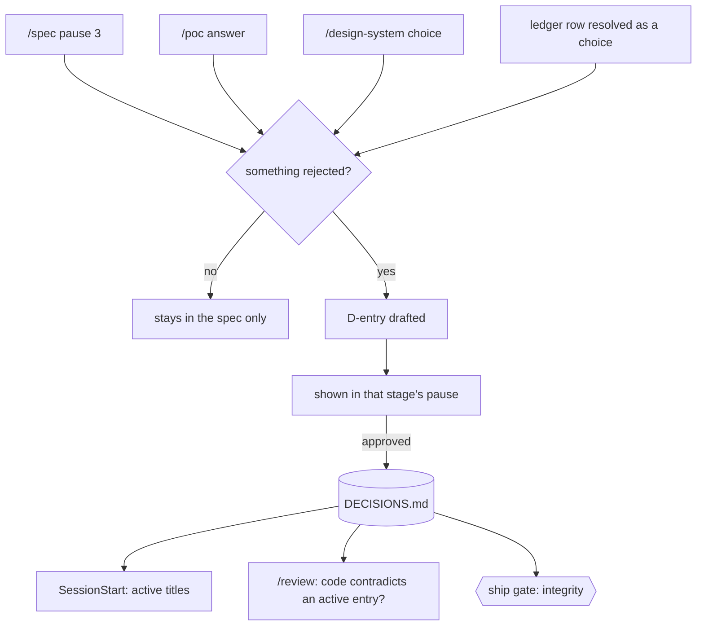
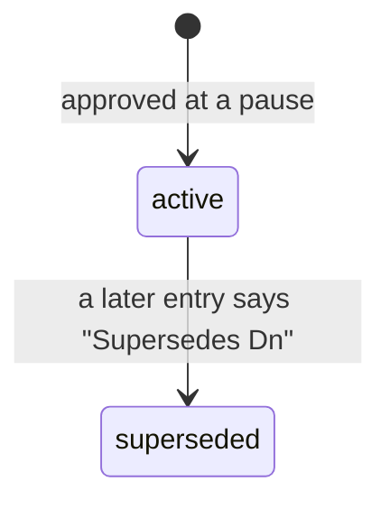
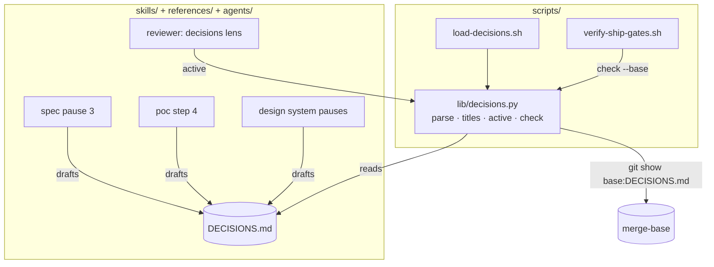
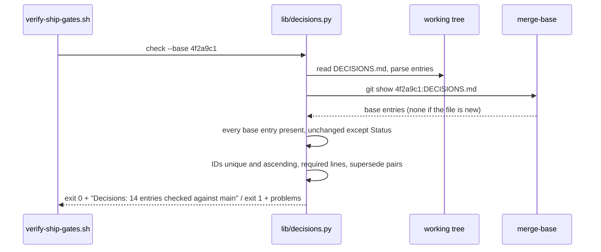

# Decision log

**Version:** v1 · **Status:** Refined · **Type:** Feature · **Project type:** CLI/Library

**Shape doc:** docs/specs/v3-project-memory/shape.md — slice 2
**Depends on:** `auto-onboard` — onboarding creates the file, the session loader gains its titles
**Page:** https://claude.ai/artifact/9hPyHKvyYczFPhbdBpJciM

Every real choice zuko makes with the user — one option picked, others rejected —
lands in one `DECISIONS.md` at the repo root. Later sessions see the active titles at
start, specs cite what they rely on, and `/review` flags code that contradicts an
active decision, so a build cannot quietly drift from what was agreed.

## Problem

Decisions today live in each spec's ledger (`references/ledger.md`: "a resolved row is
the decision record"). Three specs in, nobody can answer "what did we decide about X"
without opening every spec, and a new session has no way to know a choice was already
made — so it re-proposes the rejected option, or the build uses it. The user asked for
exactly this guard: a log so "future builds understand what was done and why, and
won't hallucinate and deviate".

## Slice test

| Check                         | Result                                                                                                                            |
| ----------------------------- | --------------------------------------------------------------------------------------------------------------------------------- |
| Cuts every layer it needs     | yes — the stages that draft entries, the session loader, the ship-gate integrity check, the review lens that enforces entries     |
| One e2e test walks it         | yes — one scratch repo: entry added → titles load at session start → supersede → gate passes → an edited old entry fails the gate |
| Worth shipping alone          | yes — from the next choice on, every session knows it and `/review` holds the code to it                                          |
| Fits (≤5 scenarios, ≤2 areas) | yes — 5 scenarios; two areas: `scripts/` (loader, gate), and `skills/` + `references/` + the reviewer agent                       |

**Path:** full — a new gate check, a new session load, and a new review check.

## Flow



A choice becomes an entry only when something was rejected; the user approves it with
the pause it came from.

## States



## Acceptance criteria

```gherkin
Scenario: a pause-3 choice with a rejected option becomes an entry
  Given "invoice-cli" with DECISIONS.md holding D1 to D6
  And /spec pause 3 for "import-csv" picks Postgres after rejecting SQLite for
    whole-file write locks
  When the pause summary is shown
  Then it includes a drafted "D7 · 2026-09-24 · Use Postgres, not SQLite" with Why,
    Rejected, Source "specs/import-csv.md" and Status active
  And the spec's Technical plan lists "Relies on: D7"
  And after the user approves the pause, D7 is appended to DECISIONS.md
  And a pause-3 choice with no rejected option writes no entry

Scenario: a changed decision supersedes the old one without editing it
  Given DECISIONS.md with D7 "Use Postgres, not SQLite" active
  When pause 3 for "offline-mode" chooses SQLite for a local cache and the user approves
  Then D12 is appended with "Supersedes: D7" and its own Why and Rejected lines
  And D7's status line reads "Status: superseded by D12"
  And no other line of D7 changes

Scenario: sessions start knowing the active decisions
  Given DECISIONS.md with 12 entries, 2 of them superseded
  When a new session starts
  Then the SessionStart output lists the 10 active entries as "D7  Use Postgres, not SQLite"
  And it prints no Why, Rejected, or Source lines
  And when /spec is about to propose SQLite for storage, it first cites D7 and asks
    whether to supersede it instead of proposing SQLite as new

Scenario: the ship gate refuses a rewritten history
  Given branch "feat/offline-mode" whose DECISIONS.md changed D3's Why line
  When verify-ship-gates.sh runs
  Then it exits 1 with "DECISIONS.md  D3 changed after it was recorded — only its
    Status line may change; supersede it with a new entry"
  And it also exits 1 for two entries numbered D12, and for "Supersedes: D9" when D9
    does not say "superseded by D12"

Scenario: /review flags code that contradicts an active decision
  Given D7 "Use Postgres, not SQLite" active
  And the "offline-mode" diff adds "import sqlite3" to invoice_cli/store.py
  And no entry supersedes D7
  When /review runs
  Then a finding reads "invoice_cli/store.py:3 contradicts D7 (Use Postgres, not
    SQLite) — supersede D7 or change the code"
  And the same import is not flagged once D12 supersedes D7
```

## Scope

**In:**

- `DECISIONS.md` format: the entry block, the Status line, `Supersedes:`, the rule
  "an entry needs a rejected option".
- Drafting at `/spec` pause 3, `/poc`, `/design-system`, and ledger resolutions; shown
  and approved with that stage's pause. Specs list `Relies on: Dn`.
- Onboarding creates `DECISIONS.md` (title line only) when it is missing.
- SessionStart: active titles, one line each.
- Ship gate: integrity against the merge-base.
- `/review`: the contradicts-an-active-decision check, verified like any finding.
- The link from `OVERVIEW.md` "More" and the README block's Docs list.

**Out:**

- Seeding entries from existing `docs/adr/*.md` — slice 2b.
- Converting old specs' resolved ledger rows into entries — done by hand, if ever; the
  ledgers stay the record for work before v3.
- A `/decide` command — entries only come from stages that made the choice.

## Interface

### `DECISIONS.md`

```markdown
# Decisions

Append-only. A changed decision is a new entry that supersedes the old one; only an
old entry's Status line ever changes.

## D7 · 2026-09-24 · Use Postgres, not SQLite

Why: two finance users import at month end at the same time; SQLite locks the whole
file on write.
Rejected: SQLite (whole-file write lock), DynamoDB (cost for under 1 GB of data).
Source: specs/import-csv.md
Status: superseded by D12

## D12 · 2026-11-02 · Postgres on the server, SQLite for the laptop cache

Why: offline mode needs a local store with transactions; the laptop never has a second
writer, while the server still has two month-end importers.
Rejected: IndexedDB (no Python client), JSON files (no transactions).
Supersedes: D7
Source: specs/offline-mode.md
Status: active
```

| Line          | Rule                                                                                             |
| ------------- | ------------------------------------------------------------------------------------------------ |
| Heading       | `## D<n> · <YYYY-MM-DD> · <title>` — n is one more than the highest so far                       |
| `Why:`        | required; the reason, with a number where one exists                                             |
| `Rejected:`   | required; at least one option with its reason — no rejected option, no entry                     |
| `Supersedes:` | optional; exactly one `D<n>`, replaced whole — the new entry restates any part that still stands |
| `Source:`     | required; the spec, spike or design doc that made the choice                                     |
| `Status:`     | required, last line; `active` or `superseded by D<n>`                                            |

A new entry always replaces the old one whole and restates whatever part of it still
stands, so every entry is either fully in force or fully history.

### In a pause summary

```
Decisions to record (approve with this pause):
  D7  Use Postgres, not SQLite
      Rejected: SQLite (whole-file write lock), DynamoDB (cost)
Relies on: D2, D5
```

### SessionStart output

```
Active decisions (DECISIONS.md) — check before proposing; supersede, don't contradict:
  D2   Ship as a pip package, not a binary
  D5   One parser per supplier format
  D12  Postgres on the server, SQLite for the laptop cache
```

No file → no output. A file with no entries → `DECISIONS.md has no entries yet.`

### Ship gate messages

```
gates FAILED
  DECISIONS.md  D3 changed after it was recorded — only its Status line may change;
                supersede it with a new entry
  DECISIONS.md  D12 appears twice
  DECISIONS.md  D12 supersedes D9, but D9 does not say "superseded by D12"
  DECISIONS.md  D8 has no Rejected line — a choice with nothing rejected is not an entry
```

On a pass it prints the scope line `Decisions: 14 entries checked against main`. A
removed entry fails like an edited one.

### Review finding

The existing reviewer format, with the entry named in the claim:

```
CLAIM: The diff stores imports in SQLite, which contradicts D7 (Use Postgres, not SQLite).
FILE: invoice_cli/store.py:3
FAILING CASE: D7 is active and nothing supersedes it; `import sqlite3` plus
  `sqlite3.connect("ledger.db")` puts month-end imports in the store D7 rejected.
```

The fix offered with a confirmed finding is always one of two: change the code, or
supersede D7 through `/spec`. `/review` never edits `DECISIONS.md` itself.

## Technical plan

### Approach

One Python module owns the file format — parse, list active titles, check integrity
against a base commit — and two thin bash scripts call it: a SessionStart loader and a
block in the ship gate. The same pattern as `lib/git-command.py` and slice 1b's
`lib/readme_block.py`. Drafting entries and judging contradictions are Claude's work,
so they are prose in the stages that make choices and in the reviewer. The gate never
trusts that prose: it re-checks the file's structure and history itself.





**Integrity rule.** For each entry in the base version, the branch version must exist
with byte-identical lines except the `Status:` line. That one comparison covers edits
and deletions. Everything else — duplicates, order, required lines, supersede pairs —
is checked on the branch version alone. No `DECISIONS.md` at the base means every
entry is new; no `DECISIONS.md` on the branch fails with "DECISIONS.md missing —
onboarding creates it".

### Changes

| File                                                                                                                      | What changes                                                                                                                                                                                                                  | Why                                                  |
| ------------------------------------------------------------------------------------------------------------------------- | ----------------------------------------------------------------------------------------------------------------------------------------------------------------------------------------------------------------------------- | ---------------------------------------------------- |
| `plugins/zuko/scripts/lib/decisions.py` (new)                                                                             | Parse entries by `## D<n> ·` headings; `titles` (active IDs and titles), `active` (full active entries, for the reviewer), `check --base <ref>` (the integrity rule and structure checks); messages per the Interface section | scenarios 2–5                                        |
| `plugins/zuko/scripts/load-decisions.sh` (new)                                                                            | Calls `decisions.py titles`, prints the header and lines; no file → silent; always exit 0                                                                                                                                     | scenario 3                                           |
| `plugins/zuko/hooks/hooks.json`                                                                                           | SessionStart gains `load-decisions.sh` after `load-overview.sh`                                                                                                                                                               | scenario 3                                           |
| `plugins/zuko/scripts/verify-ship-gates.sh`                                                                               | After the merge-base is found (`:85`), run `decisions.py check --base "$base"`; non-zero adds its output to `problems`, zero prints the scope line                                                                            | scenario 4                                           |
| `plugins/zuko/references/decisions.md` (new)                                                                              | The format table, the "rejected option or no entry" rule, whole-replacement supersede, drafting in a pause, `Relies on:`                                                                                                      | one copy for four stages                             |
| `plugins/zuko/skills/spec/SKILL.md`                                                                                       | Pause 3, after "Spot the unproven" (`:162`): grep active entries before proposing; a rejected option there → cite it and offer to supersede; draft entries for this plan's choices; add `Relies on:`                          | scenarios 1–3                                        |
| `plugins/zuko/skills/spec/references/spec-template.md`                                                                    | `Relies on:` line under Technical plan › Approach                                                                                                                                                                             | scenario 1                                           |
| `plugins/zuko/skills/poc/SKILL.md`                                                                                        | Step 4 Answer (`:53`): draft an entry when the spike picked one option over another                                                                                                                                           | stage coverage                                       |
| `plugins/zuko/skills/design/SKILL.md`                                                                                     | Pause B direction test (`:64`): draft an entry for the chosen direction and the rejected ones                                                                                                                                 | stage coverage                                       |
| `plugins/zuko/references/ledger.md`                                                                                       | Rule 2 (`:50`): a row resolved as a choice between options also drafts an entry                                                                                                                                               | stage coverage                                       |
| `plugins/zuko/references/onboard.md`                                                                                      | Create `DECISIONS.md` (title and the append-only line) when missing, on every writing stage                                                                                                                                   | gate never meets a missing file in an onboarded repo |
| `plugins/zuko/agents/reviewer.md`, `skills/review/SKILL.md`                                                               | A fourth lens, **Decisions**: read `decisions.py active`; flag diff lines that do what an active entry rejected; report in the existing format naming the entry                                                               | scenario 5                                           |
| `plugins/zuko/scripts/tests/test-decisions.sh` (new)                                                                      | Parser, titles, every `check` failure and pass, missing base file, missing branch file                                                                                                                                        | scenarios 2–4                                        |
| `plugins/zuko/scripts/tests/test-verify-ship-gates.sh`, `test-e2e-naming.sh`, `test-e2e-onboard.sh`, `test-e2e-readme.sh` | Fixtures gain a valid `DECISIONS.md`                                                                                                                                                                                          | old tests keep testing what they test                |
| `plugins/zuko/scripts/tests/test-e2e-decisions.sh` (new)                                                                  | The e2e walk below                                                                                                                                                                                                            | slice proof                                          |

Reusing: `lib/` plus bash entry pattern; `verify-ship-gates.sh`'s merge-base
resolution and `problems` accumulator — the check runs against the same base the
naming block already found, so there is one definition of "what this branch changed".

### Earn-it

| Added                          | Triggered by                                                                               |
| ------------------------------ | ------------------------------------------------------------------------------------------ |
| `lib/decisions.py`             | scenario 4 — comparing entries across two git versions is not a grep                       |
| `load-decisions.sh`            | scenario 3 — separate from `load-overview.sh` so each loader has one job and one test file |
| `references/decisions.md`      | four stages draft entries; one copy of the rules                                           |
| Decisions lens in the reviewer | scenario 5 — the anti-drift guarantee the user asked for                                   |

No new dependency.

### Non-functionals

|                      |                                                                                                                                                  |
| -------------------- | ------------------------------------------------------------------------------------------------------------------------------------------------ |
| **Load**             | Session start: one line per active entry — 50 entries is about 50 lines. Gate: two file reads and one `git show`                                 |
| **Breaks first**     | Hundreds of active entries crowd the session start; `/learn consolidate` is where old entries get superseded in bulk — noted, not built          |
| **Security surface** | Reads `DECISIONS.md` and one git object; writes nothing. `git show` gets the base SHA from the gate, never from user text                        |
| **Proof it works**   | The session start of an onboarded repo shows `Active decisions (DECISIONS.md)`; the ship gate prints `Decisions: N entries checked against main` |
| **Rollout**          | No flag. Rollback: revert the merge commit; `DECISIONS.md` stays as a plain document                                                             |

### Test plan

| Scenario                   | Test                                                                                                                              | Command                                                    |
| -------------------------- | --------------------------------------------------------------------------------------------------------------------------------- | ---------------------------------------------------------- |
| 1 entry drafted at pause 3 | real run during `/build`: this repo's next `/spec` pause 3 drafts its entries, shown to the user                                  | run `/spec` from the repo                                  |
| 2 supersede                | `test-decisions.sh` (supersede pair valid; D7 body untouched; dangling supersede fails)                                           | `bash plugins/zuko/scripts/tests/run.sh decisions`         |
| 3 session titles           | `test-decisions.sh` (12 entries, 2 superseded → 10 lines, no bodies); the `/spec` citation is prose — proven in the same real run | same                                                       |
| 4 gate integrity           | `test-decisions.sh` plus `test-verify-ship-gates.sh` (edited Why, removed entry, duplicate ID, missing Rejected)                  | `bash plugins/zuko/scripts/tests/run.sh verify-ship-gates` |
| 5 review contradiction     | real `/review` during `/build` on a scratch branch adding `import sqlite3` against a fixture D7                                   | run `/review` on that branch                               |
| all                        | the whole suite                                                                                                                   | `bash plugins/zuko/scripts/tests/run.sh`                   |

**E2E:** `scripts/tests/test-e2e-decisions.sh` — one scratch repo on `main` with D1–D7 →
branch → loader lists 7 → append D8 superseding D7 and flip D7's status → gate passes →
edit D3's Why → gate fails naming D3 → revert → delete D5 → gate fails naming D5.

### Chunks

Harness first: each chunk writes its failing tests before its code.

| Chunk | Scenarios | Files owned                                                                                                                                                                                                                                    |
| ----- | --------- | ---------------------------------------------------------------------------------------------------------------------------------------------------------------------------------------------------------------------------------------------- |
| A     | 2, 3      | `scripts/lib/decisions.py`, `scripts/load-decisions.sh`, `hooks/hooks.json`, `scripts/tests/test-decisions.sh`                                                                                                                                 |
| B     | 4, e2e    | `scripts/verify-ship-gates.sh`, its tests and the other e2e fixtures, `scripts/tests/test-e2e-decisions.sh`                                                                                                                                    |
| C     | 1, 5      | `references/decisions.md`, `references/ledger.md`, `references/onboard.md`, `skills/spec/SKILL.md`, `skills/spec/references/spec-template.md`, `skills/poc/SKILL.md`, `skills/design/SKILL.md`, `agents/reviewer.md`, `skills/review/SKILL.md` |

B merges after A. Builds after `readme-block` — all three slices edit
`verify-ship-gates.sh`.

### Risks

| Risk                                                                                              | Mitigation                                                                                                                                         |
| ------------------------------------------------------------------------------------------------- | -------------------------------------------------------------------------------------------------------------------------------------------------- |
| The reviewer flags code that only looks like a rejected option (a SQLite test fixture, a comment) | Findings go through the existing blind verifier, which needs a failing case where the rejected thing actually runs in the product                  |
| A formatter re-wraps a long `Why:` line in an old entry and the gate reads it as an edit          | The comparison joins each field's wrapped lines and collapses whitespace before comparing; a test re-wraps an entry and expects a pass             |
| Two branches each add D8                                                                          | The second to merge fails "D8 appears twice" on its next ship; renumbering its own new entry is allowed because base entries are what is protected |
| Stages over-produce entries                                                                       | The rejected-option rule, and the user approves each one in its pause                                                                              |

## Open items

| ID  | What                            | Type       | Raised at | Owner  | Status   | Answer                                                                                                    |
| --- | ------------------------------- | ---------- | --------- | ------ | -------- | --------------------------------------------------------------------------------------------------------- |
| O1  | Shape of the log                | question   | shape     | user   | Resolved | One file, D-entries, supersede never edit (shape O3)                                                      |
| O2  | Session load cost               | flag       | shape     | claude | Resolved | Active titles only (shape O9)                                                                             |
| O3  | What counts as an entry         | assumption | spec p1   | claude | Resolved | Only a choice with at least one rejected option; naming, style and reuse of existing helpers do not count |
| O4  | Who approves an entry, and when | assumption | spec p1   | claude | Resolved | The user, in the pause the choice came from; unapproved entries are dropped with the rest of that pause   |
| O5  | Too many scenarios              | flag       | spec p1   | user   | Resolved | ADR seeding moved to slice 2b                                                                             |
| O6  | File name and place             | question   | spec p1   | user   | Resolved | `DECISIONS.md` at the repo root (shape O11)                                                               |

## Glossary

- **D-entry** — one decision in `DECISIONS.md`, numbered D1, D2, … in order.
- **Merge-base** — the commit where a branch left `main`; the gate compares against it
  to see what the branch changed.
- **Supersede** — replace a decision with a new one while keeping the old one on record.
