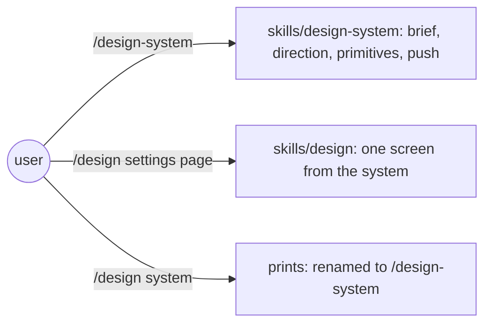
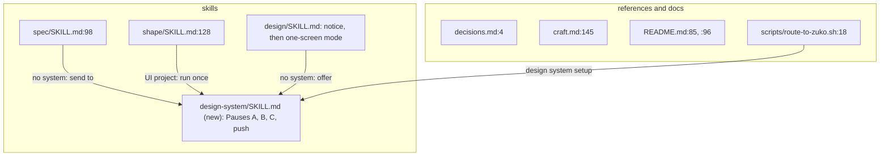
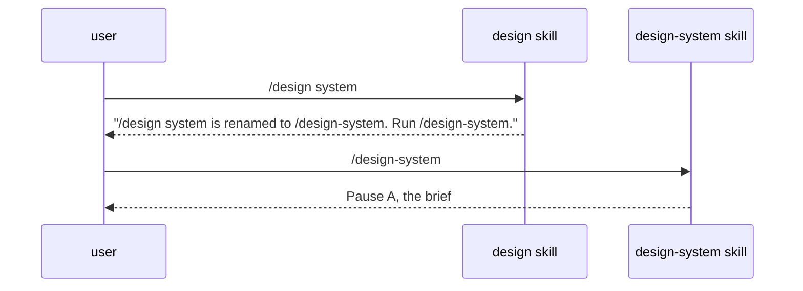

# Design system command

**Version:** v1 · **Status:** Refined · **Type:** Enhancement · **Project type:** CLI/Library

**Shape doc:** docs/specs/v3-release-and-hosts/shape.md — slice 8, part 7 of 9
**Depends on:** None
**Page:** https://claude.ai/artifact/M3tjreL4wLrQ1qxyWzEPCA

`/design-system` becomes its own command, holding what is today Mode 1 of `/design`.
`/design SCREEN` stays for screens, and `/design system` prints "renamed to
/design-system". Now, because one skill with two unrelated modes picks the mode from
its first word, and `figma-brief` (part 8) extends the design-system half only.

## Problem

`skills/design/SKILL.md` is two skills in one file: Mode 1, `/design system`, builds
the product's design system over three pauses (`:26`–`:139`); Mode 2,
`/design SCREEN`, designs one screen (`:143`–`:173`). The mode is chosen by whether
the argument is the word "system", so `/design system settings page` is ambiguous,
and a screen named "system" cannot be designed. Seven other places send the user to
`/design system` by that spelling: `decisions.md:4`, `craft.md:145`,
`spec/SKILL.md:98`, `shape/SKILL.md:128`, `design/SKILL.md:147` and `:167`, and
`README.md:85` and `:96`, plus the route line in `route-to-zuko.sh:18`.

## Slice test

| Check                         | Result                                                                                                              |
| ----------------------------- | ------------------------------------------------------------------------------------------------------------------- |
| Cuts every layer it needs     | yes — a new skill folder, the old skill trimmed with the rename notice, every pointer, the session route            |
| One e2e test walks it         | yes — a headless `claude -p "/zuko:design system"` prints the notice, and a contract test finds no old pointer left |
| Worth shipping alone          | yes — each command does one thing                                                                                   |
| Fits (≤5 scenarios, ≤2 areas) | yes — 4 scenarios; two areas: `skills/` and `references/` + README + the route line                                 |

**Path:** full — a new command. Part 7 of slice 8's split; the full split is in
`mermaid-placeholder.md`.

## User story

As someone setting up a product's look, I want a command whose name says it builds
the design system, so I never trigger the wrong mode of `/design`.

## Flow



Building the system and designing a screen are two commands. The old spelling only
prints the new name.

## Acceptance criteria

```gherkin
Scenario: /design-system runs the three pauses
  Given invoice-web with no design system
  When the user runs /design-system
  Then it starts Pause A, the brief, exactly as /design system does today

Scenario: the old spelling points at the new one
  When the user runs /design system
  Then it prints "/design system is renamed to /design-system. Run /design-system."
  And it does nothing else

Scenario: screens are unchanged
  When the user runs /design settings page
  Then it runs today's Mode 2 on "settings page"
  And with no design system it offers /design-system first

Scenario: no stale pointer remains
  Given every file under plugins/zuko and README.md
  Then none says "/design system" except the rename notice in skills/design/SKILL.md
```

## Scope

**In:** `skills/design-system/SKILL.md` with Mode 1's content moved as is;
`skills/design/SKILL.md` keeps Mode 2 plus the notice; every pointer listed in the
Problem; the route line.

**Out:** Figma links in the brief — `figma-brief`, next; changing what the three
pauses do — no slice; removing the notice — no slice (O1).

## Interface

| Command          | Does                                                                                               |
| ---------------- | -------------------------------------------------------------------------------------------------- |
| `/design-system` | Build or extend the product's one design system: Pause A brief, B direction, C primitive set, push |
| `/design SCREEN` | Design one screen or component from the system                                                     |
| `/design system` | Prints the line below and stops                                                                    |

```text
/design system is renamed to /design-system. Run /design-system.
```

`skills/design-system/SKILL.md` frontmatter: `name: design-system`, a description
naming "set up the design system", "design tokens", "extend the design system",
and `disable-model-invocation: false`, as `design` has today.

## Technical plan

### Approach

Move lines `:26`–`:139` of `skills/design/SKILL.md` into a new
`skills/design-system/SKILL.md` with the same header block (read `craft.md` and
`voice.md`, the onboarding check, "one design system per product"). What is left in
`design/SKILL.md` is Mode 2 and a first rule: an argument of exactly `system` prints
the notice and stops. Every pointer changes to `/design-system`.

Relies on: D22





### Changes

| File                                                                             | What changes                                                                                                       | Why            |
| -------------------------------------------------------------------------------- | ------------------------------------------------------------------------------------------------------------------ | -------------- |
| `plugins/zuko/skills/design-system/SKILL.md` (new)                               | Frontmatter per the Interface section; Mode 1 moved as is, headings one level up                                   | scenario 1     |
| `plugins/zuko/skills/design/SKILL.md:1`                                          | Description names screens only; the notice rule first; Mode 1 removed; `:147` and `:167` point at `/design-system` | scenarios 2, 3 |
| `plugins/zuko/skills/spec/SKILL.md:98`, `plugins/zuko/skills/shape/SKILL.md:128` | Point at `/design-system`                                                                                          | scenario 4     |
| `plugins/zuko/references/decisions.md:4`, `plugins/zuko/references/craft.md:145` | Point at `/design-system`                                                                                          | scenario 4     |
| `README.md:85`, `README.md:96`                                                   | The diagram node and the sentence name `/design-system`                                                            | scenario 4     |
| `plugins/zuko/scripts/route-to-zuko.sh:18`                                       | `design system setup -> zuko:design-system`; "design the UI" stays with `zuko:design`                              | scenario 1     |
| `plugins/zuko/scripts/tests/test-design-system.sh` (new)                         | The skill folder exists with `name: design-system`; no `/design system` outside the notice; the route line         | scenario 4     |

Reusing: Mode 1's text unchanged; `run.sh`'s helpers.

### Earn-it

| Added                 | Triggered by                                                          |
| --------------------- | --------------------------------------------------------------------- |
| a second skill folder | scenario 1: a command name is a skill folder in Claude Code plugins   |
| the rename notice     | scenario 2: the old spelling is in the user's habits and in old specs |

### Non-functionals

|                      |                                                                         |
| -------------------- | ----------------------------------------------------------------------- |
| **Load**             | None; skills load at session start                                      |
| **Breaks first**     | Nothing                                                                 |
| **Security surface** | None; no new tool                                                       |
| **Proof it works**   | `/design-system` in a new session starts "Pause A — the brief"          |
| **Rollout**          | No flag. Rollback is `git revert`; a new session picks up the old skill |

### Test plan

| Scenario | Test                                                                                                | Command                                                                                                                                      |
| -------- | --------------------------------------------------------------------------------------------------- | -------------------------------------------------------------------------------------------------------------------------------------------- |
| 4        | `test-design-system.sh`                                                                             | `bash plugins/zuko/scripts/tests/run.sh design-system`                                                                                       |
| 2        | headless run, recorded in this spec                                                                 | `claude -p "/zuko:design system" --plugin-dir plugins/zuko --add-dir plugins/zuko`, with the `--settings` key override `owasp-lens` O7 found |
| 1, 3     | the same headless run with `/zuko:design-system` and `/zuko:design settings page`, first reply only | same flags                                                                                                                                   |

**E2E:** the headless run for scenario 2, then scenario 1's, in a scratch repo; the
flags are the ones `owasp-lens` O7 proved. A skill edited in a session only takes
effect in a new one (the `skills-load-at-session-start` lesson), which the headless
run gives for free.

### Chunks

Single chunk. The move and the pointer edits have to land together or the contract
test is red in between.

### Risks

| Risk                                                           | Mitigation                                                                             |
| -------------------------------------------------------------- | -------------------------------------------------------------------------------------- |
| Model invocation picks `design` for "set up the design system" | The two descriptions split the trigger phrases; `design` no longer mentions the system |
| An old spec or lesson still says `/design system`              | The notice answers it; Shipped specs stay as written                                   |

### Decisions to record

Recorded as D22.

## Open items

| ID  | What                                                                                                                                                               | Type       | Raised at | Owner | Status | Answer |
| --- | ------------------------------------------------------------------------------------------------------------------------------------------------------------------ | ---------- | --------- | ----- | ------ | ------ |
| O1  | Assuming the rename notice stays until a later major version (default chosen autonomously; alternative: remove it at 3.1.0)                                        | assumption | spec p2   | user  | Resolved | Default accepted by the user, 2026-09-25 |
| O2  | Assuming the notice prints and stops, without running `/design-system` for the user (default chosen autonomously; alternative: print it and carry on into Pause A) | assumption | spec p2   | user  | Resolved | Default accepted by the user, 2026-09-25 |

_Never delete this section or its rows. See references/ledger.md._

## Glossary

- **Design system** — the product's one set of tokens and primitives that every
  screen is built from.
- **Mode** — one of the two jobs the current `/design` skill does, picked by its
  first word.
