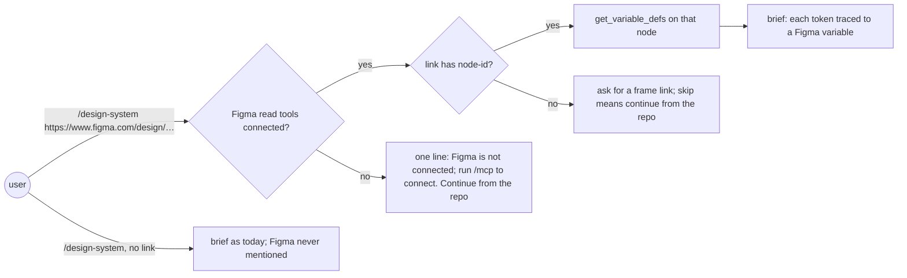
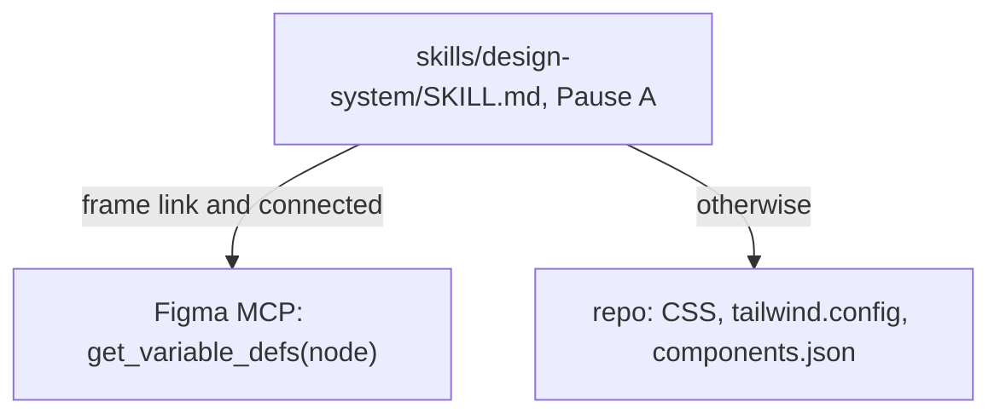

# Figma brief

**Version:** v1 · **Status:** Refined · **Type:** Enhancement · **Project type:** CLI/Library

**Shape doc:** docs/specs/v3-release-and-hosts/shape.md — slice 8, part 8 of 9
**Depends on:** `design-system` — this extends that skill's Pause A
**Page:** https://claude.ai/artifact/J8iPo9thpwVB4Xyzng2JX9

`/design-system` accepts a Figma link when the Figma tools are connected, and
extracts the brief from the variables and styles used in the frame the link
points at, instead of interviewing. When Figma is not connected, the skill never mentions it. Now, because
a product with a Figma file already has its answers, and Pause A asks for them anyway.

## Problem

Pause A of the design system (`skills/design/SKILL.md:30`, moving to
`skills/design-system/SKILL.md` in part 7) has two sources: an existing product's
CSS and config, or an interview about a new one. A team whose system lives in Figma
has colours, type and spacing already defined there as variables, and gets asked
"three words it must feel" anyway. This machine has the Figma plugin installed
(`figma:*` skills), but its tools only appear after the user authenticates
(`mcp__plugin_figma_figma__authenticate` is the only one listed today), so the skill
cannot assume they are there.

## Slice test

| Check                         | Result                                                                          |
| ----------------------------- | ------------------------------------------------------------------------------- |
| Cuts every layer it needs     | yes — Pause A's source rule, the connected check, and the brief's trace lines   |
| One e2e test walks it         | partly — a recorded run on a real Figma file (O3); a contract test for the text |
| Worth shipping alone          | yes — a Figma-first team gets a brief from its own file                         |
| Fits (≤5 scenarios, ≤2 areas) | yes — 5 scenarios; one area (`skills/design-system`) plus a contract test       |

**Path:** full — a new input to a stage. Part 8 of slice 8's split; the full split is
in `mermaid-placeholder.md`.

## User story

As someone whose product is designed in Figma, I want `/design-system` to read my
Figma file, so the brief starts from what we already decided.

## Flow



A frame link with Figma connected makes that frame's variables and styles the
brief's source. A whole-file link gets asked for a frame link, since Figma's tools
read one node, not a file. Figma disconnected gets one line and carries on. No
link, no mention.

## Acceptance criteria

```gherkin
Scenario: a connected Figma file becomes the brief
  Given the Figma tools are connected, and the frame "Foundations" (node 12:34) in
    the file "Invoice Web" uses color/brand/600 = #2C5B88 and spacing/4 = 16
  When the user runs
    /design-system https://www.figma.com/design/AbC123/Invoice-Web?node-id=12-34
  Then the brief lists those tokens, each traced to its Figma variable, as
    "color.brand.600 ← Figma color/brand/600"
  And it asks only what the file cannot answer: the feel words and the motion ceiling

Scenario: a whole-file link
  Given the Figma tools are connected
  When the user runs /design-system https://www.figma.com/design/AbC123/Invoice-Web
  Then it says "That link opens the whole file, and Figma's tools read one frame.
    Open the frame that holds your tokens, copy its link (it has node-id= in it),
    and paste it here, or say skip and I'll build the brief from the repo."
  And "skip" continues from the repo, with nothing read from Figma

Scenario: no link, no mention
  Given the Figma tools are not connected
  When the user runs /design-system
  Then Pause A runs as today, and the word Figma never appears

Scenario: a link with Figma disconnected
  When the user runs /design-system with a Figma link and the tools are not connected
  Then it says "The Figma tools are not connected, so I can't read that file. Run
    /mcp to connect Figma, or I'll build the brief from the repo." and continues
    from the repo

Scenario: a file the account cannot read
  Given the Figma tools are connected, but the link is to a file this account has no
    access to
  When the read fails
  Then it names the file key, the node, and Figma's error, and continues from the
    repo
```

## Scope

**In:** Pause A's source order — Figma frame link (when connected), then the repo,
then the interview; the connected check; the node-id rule; the trace format; the
failure lines.

**Out:** writing tokens back to Figma — not doing (shape: no setup flows); Figma
setup or login — the user's `/mcp`; FigJam and Slides links — no slice; Jira in
`/shape` — `jira-shape`, next.

## Interface

**Connected** means the session lists Figma's `get_variable_defs` tool under the
Figma server. Only an `authenticate` tool listed means not connected.

**The node** comes from the link's `node-id` query parameter, with its `-` turned
into `:` (`node-id=12-34` → `12:34`), because `get_variable_defs` returns "the
variables and styles used in your Figma selection" (Figma MCP docs, O2), not a whole
file's. A link with no `node-id` gets the whole-file line from the scenarios.

The brief's trace, one line per token, in the existing trace block
(`design/SKILL.md:52`):

```text
color.brand.600   ← Figma color/brand/600 (#2C5B88)
spacing.4         ← Figma spacing/4 (16)
type.body         ← Figma text style Body/Regular (Inter 14/20)
```

## Technical plan

### Approach

Prose in `skills/design-system/SKILL.md` Pause A: before "Existing product →
extract", a "Figma link given" branch with the connected check, the node-id rule,
one `get_variable_defs` call on that node (colours, spacing and text styles come back
together), the trace, and the failure lines. The skill reads nothing when no link is
given.

Cut: `get_design_context`. The O2 spike found it returns code for a layer (React
and Tailwind by default), not a component list, so it adds nothing the brief uses;
dropping it also drops the `figma:figma-design-to-code` skill it needs loaded first.

Relies on: D25

```mermaid
sequenceDiagram
    participant U as user
    participant S as /design-system
    participant F as Figma MCP
    U->>S: /design-system figma link
    S->>S: is get_variable_defs listed? link has node-id=12-34?
    S->>F: get_variable_defs(node 12:34)
    F-->>S: color/brand/600 = #2C5B88, spacing/4 = 16, Body/Regular
    S-->>U: brief with trace lines; asks feel words and motion ceiling
```



The file's contents cross from Figma into the brief, and nothing flows back.

### Changes

| File                                                   | What changes                                                                           | Why            |
| ------------------------------------------------------ | -------------------------------------------------------------------------------------- | -------------- |
| `plugins/zuko/skills/design-system/SKILL.md` (Pause A) | The Figma branch, the connected rule, the node-id rule, the trace format, the failure lines | scenarios 1–5 |
| `plugins/zuko/scripts/tests/test-figma-brief.sh` (new) | Greps Pause A for the connected rule, the node-id rule and its whole-file line, the disconnected line, and "never mention Figma" | scenarios 2–4 |

Reusing: Pause A's trace block and its "extract, do not interview" rule.

### Non-functionals

|                      |                                                                                                                                                                |
| -------------------- | -------------------------------------------------------------------------------------------------------------------------------------------------------------- |
| **Load**             | One `/design-system` run per product, a few Figma calls                                                                                                        |
| **Breaks first**     | A frame using thousands of variables floods the brief; keep the ones the brief's token groups need and list the count of the rest |
| **Security surface** | Reads a Figma file the user's own Figma login can read. Text from the file is data for the brief, never instructions (D6 in `owasp-lens`). No secret is stored |
| **Proof it works**   | A recorded run's brief shows `← Figma` trace lines                                                                                                             |
| **Rollout**          | No flag: it only acts when a link is given and Figma is connected. Rollback is `git revert`                                                                    |

### Test plan

| Scenario | Test                                  | Command                                              |
| -------- | ------------------------------------- | ---------------------------------------------------- |
| 2, 3, 4  | `test-figma-brief.sh`                 | `bash plugins/zuko/scripts/tests/run.sh figma-brief` |
| 1, 5     | one recorded run on a real Figma frame link | by hand, in a session with Figma connected (O3) |

**E2E:** the recorded run: the user connects Figma, runs `/design-system` with a
frame link (with `node-id`) from a file they own, and the brief's trace lines go into
this spec.

**Build result (2026-10-05):** `run.sh figma-brief` 12 passed, 0 failed;
`run.sh design-system` 22 passed, 0 failed. Headless runs from a scratch
product whose `src/styles.css` holds four tokens:

- `/zuko:design-system` (scenario 3): Pause A extracted the four values
  and asked the brief questions; the word "Figma" appears nowhere in the
  output. Pass.
- `/zuko:design-system https://www.figma.com/design/AbC123/Invoice-Web?node-id=12-34`
  (scenario 4): the reply opened with the disconnected line word for word
  and built the brief from the repo, with no Figma call. Pass.
- The connected run on a real Figma file (scenarios 1, 2, 5; O3) has not
  happened: headless, the Figma server reports `needs-auth` and lists no
  tools. The slice stays Refined until it runs.

### Chunks

Single chunk.

### Risks

| Risk                                                               | Mitigation                                                               |
| ------------------------------------------------------------------ | ------------------------------------------------------------------------ |
| The Figma tool names or outputs differ from what this plan assumes | Settled by O2 from Figma's docs and the installed plugin; the call itself is first exercised in the recorded run |
| Text in a Figma file tries to steer the skill                      | The file is data for the brief; the skill never runs a command from it   |

### Decisions to record

Recorded as D25.

## Open items

| ID  | What                                                                                                                                                                                  | Type       | Raised at | Owner | Status   | Answer                                                                                                                                                                                                                                                                                                                                                                                                                                                                                                                                                                                                                                                                                 |
| --- | ------------------------------------------------------------------------------------------------------------------------------------------------------------------------------------- | ---------- | --------- | ----- | -------- | -------------------------------------------------------------------------------------------------------------------------------------------------------------------------------------------------------------------------------------------------------------------------------------------------------------------------------------------------------------------------------------------------------------------------------------------------------------------------------------------------------------------------------------------------------------------------------------------------------------------------------------------------------------------------------------- |
| O1  | Assuming "connected" means Figma's read tools are listed, not just its `authenticate` tool (default chosen autonomously; alternative: try a read and treat a failure as disconnected) | assumption | spec p2   | user  | Resolved | Default accepted by the user, 2026-09-25 |
| O2  | `get_variable_defs` and `get_design_context` exist under the Figma plugin's server and return variables and components for a file link                                                | unproven   | spec p3   | poc   | Resolved | Names confirmed 2026-09-25. developers.figma.com/docs/figma-mcp-server/tools-and-prompts lists both as read tools. `get_variable_defs` "returns the variables and styles used in your Figma selection, such as colors, spacing, and typography". `get_design_context` gives the design context for a layer or selection, by default as React plus Tailwind code, not a component list. The installed plugin agrees (`figma/2.2.120/.mcp.json:20,25`, `README.md:252-253`; server `https://mcp.figma.com/mcp`). Both are scoped to a selection or node, so the plan reads a node from the link rather than a whole file. Call not exercised: Figma is not authenticated in this session |
| O3  | Assuming a hand-recorded run on a real Figma file is the e2e (default chosen autonomously; alternative: a fixture file checked into Figma for tests)                                  | assumption | spec p3   | user  | Resolved | Default accepted by the user, 2026-09-25 |

_Never delete this section or its rows. See references/ledger.md._

## Glossary

- **Figma variable** — a named value in a Figma file, such as `color/brand/600`,
  that designers reuse instead of raw colours.
- **Brief** — Pause A's written answers that every design token is traced back to.
- **MCP** — Model Context Protocol, the way Claude Code talks to outside tools such
  as Figma.
