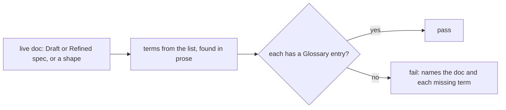
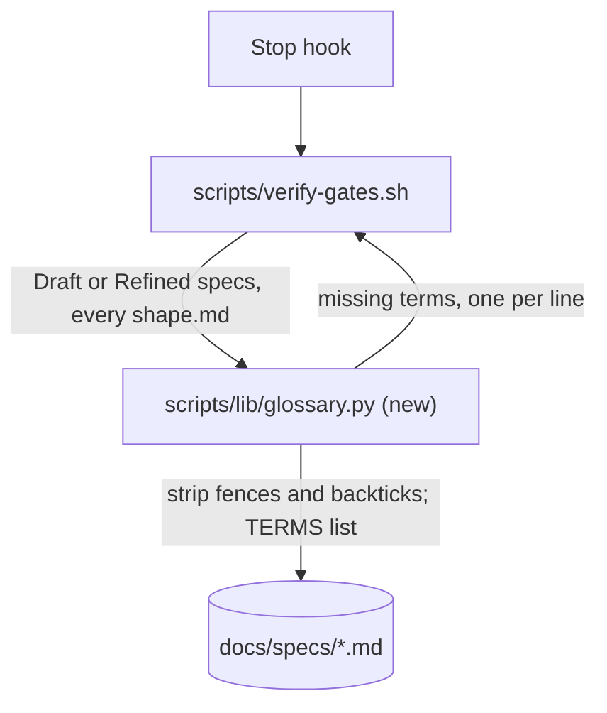

# Glossary gate

**Version:** v1 · **Status:** Refined · **Type:** Enhancement · **Project type:** CLI/Library

**Shape doc:** docs/specs/v3-release-and-hosts/shape.md — slice 8, part 5 of 9
**Depends on:** None
**Page:** https://claude.ai/artifact/LN5TASnzHBzZak1Ge8CvwK

Shape and spec templates end with `## Glossary`, and the spec gate fails a live doc
that uses a term from a short, named jargon list without a glossary entry for it.
Now, because `voice.md` rule 10 says "explain jargon, don't avoid it", and nothing
checks it.

## Problem

`voice.md:58` asks every stage to use the real term and define it. The two v3 shape
docs carry a `## Glossary` by hand; the spec template
(`skills/spec/references/spec-template.md`) and the shape template
(`skills/shape/SKILL.md:97`) have none, so most specs never define a word. A reader
meets "SSRF", "semver" or "fail-open" with no explanation, and the gate
(`verify-gates.sh`) checks only status, versioning and the ledger heading.

## Slice test

| Check                         | Result                                                                                          |
| ----------------------------- | ----------------------------------------------------------------------------------------------- |
| Cuts every layer it needs     | yes — both templates, the gate in `verify-gates.sh`, and its message                            |
| One e2e test walks it         | yes — one scratch `docs/specs/` tree: a Draft spec using "semver" fails, gains an entry, passes |
| Worth shipping alone          | yes — every live doc defines its jargon                                                         |
| Fits (≤5 scenarios, ≤2 areas) | yes — 4 scenarios; two areas: `scripts/` and `skills/` templates                                |

**Path:** full — a new gate check. Part 5 of slice 8's split; the full split is in
`mermaid-placeholder.md`.

## User story

As someone reading a zuko spec months later, I want every piece of jargon in it
defined at the bottom, so I can read the plan without looking terms up.

## Flow



The gate finds each listed term a live doc uses outside code, and fails when the
doc's `## Glossary` has no entry for it.

## Acceptance criteria

```gherkin
Scenario: an undefined term fails a live spec
  Given docs/specs/refunds.md at Draft, saying "the version bump follows semver"
    in prose, with no Glossary entry for semver
  When a turn ends
  Then verify-gates.sh exits 2 with
    "- docs/specs/refunds.md uses semver with no ## Glossary entry for it"
  And adding "- **Semver** — MAJOR.MINOR.PATCH …" under "## Glossary" passes

Scenario: code and paths do not count
  Given the same spec mentioning semver only inside backticks, a code fence or a
    path such as test-e2e-release.sh
  When a turn ends
  Then the glossary check passes

Scenario: shipped specs are not re-judged
  Given docs/specs/release.md at Shipped, using "annotated tag" with no glossary
  When a turn ends
  Then the glossary check skips it

Scenario: the templates carry the section
  Given a new spec copied from spec-template.md, or a shape written from shape's
    template
  Then its last section is "## Glossary"
```

## Scope

**In:** `## Glossary` as the last section of both templates; `verify-gates.sh` checks
specs at `Draft` or `Refined` and every `shape.md`; the closed term list in the
script.

**Out:** checking `Built` and `Shipped` specs — they are records (O2); growing the
list from usage — no slice; checking terms inside code — never.

## Interface

The closed list, in the script, matched case-insensitively as whole words:

```text
semver · e2e · fail-open · idempotent · lockfile · annotated tag · blind verifier ·
pentest · OWASP · SSRF · XSS · CVE · CVSS · ADR · SARIF · walking skeleton · backfill
```

A term counts as defined when a line under `## Glossary` starts with
`- **Term**` (any case). The message, one line per missing term, inside the existing
"Spec gate check failed:" block:

```text
- docs/specs/refunds.md uses semver with no ## Glossary entry for it.
```

## Technical plan

### Approach

A small Python helper beside the other libs reads a doc, strips fenced blocks and
inline code, finds list terms as whole words, reads the `## Glossary` entries, and
prints each missing term. `verify-gates.sh` calls it for each live spec (by status)
and each `shape.md`, adding its lines to `problems`.

Relies on: D25



```mermaid
sequenceDiagram
    participant V as verify-gates.sh
    participant G as glossary.py
    V->>G: missing docs/specs/refunds.md
    G->>G: drop fences, inline code; find TERMS as whole words
    G->>G: read "- **Term**" lines under ## Glossary
    G-->>V: "semver"
    V-->>V: problem line, exit 2
```

### Changes

| File                                                   | What changes                                                                                                         | Why            |
| ------------------------------------------------------ | -------------------------------------------------------------------------------------------------------------------- | -------------- |
| `plugins/zuko/scripts/lib/glossary.py` (new)           | `TERMS`, the closed list; `missing PATH` prints each undefined term                                                  | scenarios 1, 2 |
| `plugins/zuko/scripts/verify-gates.sh:14`              | For a spec at `Draft` or `Refined`, and for `shape.md` (skipped today at `:16`), add a problem line per missing term | scenarios 1, 3 |
| `plugins/zuko/skills/spec/references/spec-template.md` | `## Glossary` after `## Open items`, with `- **e2e** — end-to-end: one test that walks the whole slice as a user would` as its entry, since the template's Slice test row uses the term in every spec | scenario 4, O3 |
| `plugins/zuko/skills/shape/SKILL.md:97`                | The shape template gains `## Glossary` as its last section                                                           | scenario 4     |
| `plugins/zuko/scripts/tests/test-glossary.sh` (new)    | Scenarios 1–3 through the real `verify-gates.sh` on a scratch tree under `$work`; scenario 4 greps both templates    | all            |
| Live docs the new check fails (backfill) | One commit before the gate commit adds the missing `- **Term**` entries under `## Glossary`. Hand run on 2026-09-25: `ascii-terminal`, `design-system`, `figma-brief`, `jira-shape`, `mermaid-placeholder`, `pr-attribution`, `release-host-message` (e2e); `ledger-handoff` (e2e, backfill); `glossary-gate` (e2e, fail-open, SSRF, CVE, ADR, backfill); `owasp-lens` (e2e, pentest, OWASP, SSRF, XSS, SARIF); `pentest` (e2e, lockfile, OWASP); `pentest-live` (e2e, pentest, XSS); `regression-review` (e2e, pentest, CVE); `v3-project-memory/shape.md` (ADR); `v3-release-and-hosts/shape.md` (lockfile, SSRF, XSS, SARIF). `/build` reruns the check first, since specs move to Built in between | O3; the `a-new-gate-check-breaks-every-fixture` lesson |

Reusing: the status read at `verify-gates.sh:18`, the `find` at `:32`, and the
fixture pattern from `test-decisions.sh`.

### Earn-it

| Added           | Triggered by                                                                                       |
| --------------- | -------------------------------------------------------------------------------------------------- |
| `glossary.py`   | scenario 2: stripping fences and inline code in bash is where false positives come from            |
| the closed list | the `a-list-you-can-read-beats-a-parser-that-infers` lesson: no inference of what counts as jargon |

### Non-functionals

|                      |                                                                                                      |
| -------------------- | ---------------------------------------------------------------------------------------------------- |
| **Load**             | Every Stop, over the live docs — about 10 files                                                      |
| **Breaks first**     | One Python start per doc; at 10× that is about a second per Stop. Batch all paths into one call then |
| **Security surface** | None. Reads files under `docs/specs/`                                                                |
| **Proof it works**   | A turn that leaves a Draft spec using "semver" undefined ends with the new problem line              |
| **Rollout**          | No flag. Rollback is `git revert`. The backfill commit lands before the gate commit, so `main` never has a failing live doc (O3) |

### Test plan

| Scenario | Test               | Command                                           |
| -------- | ------------------ | ------------------------------------------------- |
| 1–4      | `test-glossary.sh` | `bash plugins/zuko/scripts/tests/run.sh glossary` |
| O3 (backfill) | the repo's own live docs pass the new check at the gate commit | `echo '{}' \| bash plugins/zuko/scripts/verify-gates.sh` exits 0 |

**E2E:** `test-glossary.sh` runs the real `verify-gates.sh` on one scratch tree
through the whole of scenario 1, then scenarios 2 and 3 on the same tree.

### Chunks

| Chunk | Scenarios | Files owned                                                                                 |
| ----- | --------- | ------------------------------------------------------------------------------------------- |
| A     | 1–3       | `scripts/tests/test-glossary.sh`, then the backfilled live docs, then `scripts/lib/glossary.py`, `scripts/verify-gates.sh` |
| B     | 4         | `skills/spec/references/spec-template.md`, `skills/shape/SKILL.md`                          |

A lands in three commits: the test, red; the backfill, so every live doc already has its entries; then the gate, with the repo check green on that commit. B is independent.

### Risks

| Risk                                            | Mitigation                                                                                                                                |
| ----------------------------------------------- | ----------------------------------------------------------------------------------------------------------------------------------------- |
| The gate fails live docs the moment it lands | Resolved by O3: the backfill commit lands first, and the test plan checks the repo passes at the gate commit |
| A mid-pause draft blocks the turn               | The message names the term; writing the entry takes one line. Pause 1 already writes the Glossary                                         |
| "ADR" or "CVE" appears as part of a longer word | Whole-word match only; one test uses `ADRs` as a plural that must still count                                                             |

### Decisions to record

Recorded as D25.

## Open items

| ID  | What                                                                                                                                                              | Type       | Raised at | Owner | Status | Answer |
| --- | ----------------------------------------------------------------------------------------------------------------------------------------------------------------- | ---------- | --------- | ----- | ------ | ------ |
| O1  | Assuming the 17-term list in the Interface section (default chosen autonomously; alternative: a shorter list of only terms already defined in the v3 glossaries)  | assumption | spec p2   | user  | Resolved | Default accepted by the user, 2026-09-25 |
| O2  | Assuming Built and Shipped specs are skipped (default chosen autonomously; alternative: check every spec and backfill old glossaries)                             | assumption | spec p1   | user  | Resolved | Default accepted by the user, 2026-09-25 |
| O3  | The new check will fail any live doc using a listed term without an entry — both v3 shapes and this batch of slice 8 specs must be checked before the gate commit | flag       | spec p3   | user  | Resolved | Backfill in the same build: a commit before the gate fixes every live doc it would fail (user, 2026-09-25). Hand run on 2026-09-25 over Draft/Refined specs and both shapes: 15 docs fail, 13 of them on e2e alone, which the template's Slice test row writes into every spec. List in the Changes backfill row |

_Never delete this section or its rows. See references/ledger.md._

## Glossary

- **ADR** — Architecture Decision Record: a short file that records one design
  choice and why it was made.
- **Backfill** — adding what older docs are missing so they pass a new check.
- **CVE** — Common Vulnerabilities and Exposures: the public ID, such as
  CVE-2025-1234, given to a known security hole.
- **e2e** — end-to-end: one test that walks the whole slice as a user would.
- **Fail-open** — on error, the code lets the request through instead of refusing it.
- **Jargon list** — the fixed set of terms the gate checks, kept in `glossary.py`.
- **Live doc** — a spec at Draft or Refined, or a shape; the ones still read to
  decide what to build.
- **Lockfile** — the file that pins every dependency's exact version, such as
  `package-lock.json`.
- **OWASP** — the Open Worldwide Application Security Project, which publishes the
  OWASP Top 10 list of web-app security risks.
- **Pentest** — penetration test: attacking your own app on purpose to find holes
  before someone else does.
- **SARIF** — a standard JSON format for static-analysis findings, which code hosts
  can show inline on a pull request.
- **Semver** — `MAJOR.MINOR.PATCH` version numbers; MAJOR changes break existing
  users.
- **SSRF** — server-side request forgery: tricking a server into fetching a URL the
  attacker chose.
- **XSS** — cross-site scripting: getting a page to run an attacker's script in
  another user's browser.
