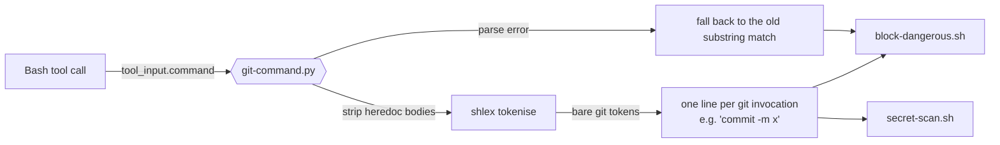
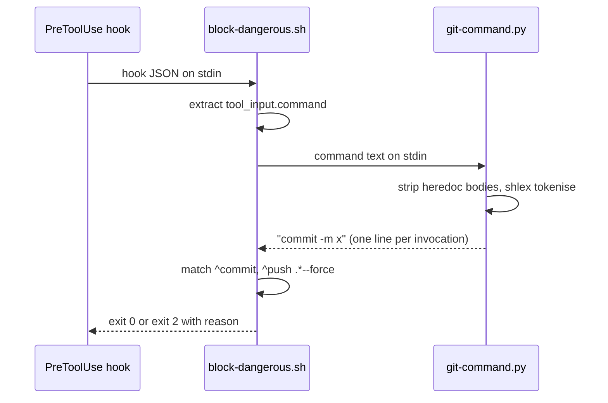

# Hook command match

**Version:** v1 · **Status:** Built · **Type:** Bug · **Project type:** CLI/Library

**Depends on:** None
**Blocks:** `ship-naming` — `block-attribution.sh` needs the same matcher, so this lands first

zuko's guard hooks decide what a command is by grepping its raw text, so a
command that merely *mentions* a blocked phrase is blocked. Writing a document
about git is currently impossible in this repo.

## Problem

`block-dangerous.sh:10` and `:18` match against the whole command string:

```bash
if printf '%s' "$cmd" | grep -qE '(^|[;&|[:space:]])git commit'; then
```

Anything after whitespace matches — including text inside a quoted argument or a
heredoc body. The phrase does not have to be a command. It has to be *present*.

Reproduced against the real script on branch `main`, 2026-09-12:

| Command | Expected | Actual |
| ------- | -------- | ------ |
| `cat > doc.md <<EOF prose about git commit here EOF` | allow | **exit 2, blocked** |
| `echo 'how to git commit properly'` | allow | **exit 2, blocked** |
| `cat > doc.md <<EOF never git push --force EOF` | allow | **exit 2, blocked** |
| `git commit -m x` on `main` | block | exit 2, blocked — correct |
| `grep -rn 'git commit' docs/` | allow | exit 0 — passes only because `'` is not whitespace |

That last row is the tell: the one false positive that *doesn't* fire is an
accident of quoting, not a rule.

This is not theoretical. It blocked the write of `docs/specs/ship-naming.md`
during this session, twice — the spec contains the phrase in prose — and then
blocked the commands written to demonstrate the bug, because those contain the
phrase too.

`secret-scan.sh:6` uses the same match. Its failure is milder: it scans the
staged diff when it need not, and blocks nothing that a real commit would not
also hit. Fixing it here costs one line and stops the third copy of the bug.

## Slice test

| Check | Result |
| ----- | ------ |
| Cuts every layer it needs | yes — the matcher, both hooks that call it, and the fallback when parsing fails |
| One e2e test walks it | yes — the five rows in the table above, run against the real scripts |
| Worth shipping alone | yes — documents mentioning git commands become writable again |
| Fits (≤5 scenarios, ≤2 areas) | yes — 4 scenarios, one area (`scripts/`) |

**Path:** light — a bug fix in three files, no new data, no new dependency
(`python3` is already required by both scripts). Pauses 1 and 3 are merged and
pause 2 is skipped, per `slicing.md`.

## Flow



Quoted arguments survive tokenising as a single token, so a phrase inside one can
never be read as a command word. That is the whole fix.

## Acceptance criteria

```gherkin
Scenario: prose mentioning a blocked command is allowed
  Given the current branch is "main"
  When the Bash tool is called with
    "cat > docs/specs/ship-naming.md <<EOF ... git commit ... EOF"
  Then block-dangerous.sh exits 0
  And the file is written

Scenario: a real commit on main is still blocked
  Given the current branch is "main"
  When the Bash tool is called with "git commit -m 'x'"
  Then block-dangerous.sh exits 2
  And stderr reads "Blocked: committing directly on main. Create a branch first."

Scenario: a force push named inside a quoted argument is allowed
  Given any branch
  When the Bash tool is called with "echo 'never git push --force on main'"
  Then block-dangerous.sh exits 0
  But when it is called with "git push --force origin main"
  Then it exits 2

Scenario: an unparseable command fails closed
  Given a command with an unbalanced quote, "git commit -m 'oops"
  When git-command.py cannot tokenise it
  Then it reports the parse failure on stderr
  And block-dangerous.sh applies the old substring match instead
  And the command is blocked, not allowed
```

## Scope

**In:** `scripts/lib/git-command.py` (new), `scripts/block-dangerous.sh`,
`scripts/secret-scan.sh`.

**Out:**

- Tests. This repo has no harness and the light path does not require one where
  none exists. `ship-naming` builds the harness and back-fills these four
  scenarios as its first fixtures — see O2.
- The `rm -rf` check at `block-dangerous.sh:14`. Same class of flaw, but it
  matches on flags and paths rather than a two-word English phrase, so it does
  not fire on prose. Its own slice if it ever bites.

## Technical plan

### Approach

One python3 filter reads the command on stdin and prints the `git` invocations
that are actually being run. Both hooks call it and match on its output instead
of on raw text. Python is already a hard dependency of both scripts — each one
parses the hook JSON with it — so this adds nothing new to install.



### Changes

| File | What changes | Why |
| ---- | ------------ | --- |
| `scripts/lib/git-command.py` | New. Reads a shell command on stdin, prints one line per bare `git` token — the arguments after it, unquoted, space-joined, with git's own options stripped so the subcommand is first. Exit 0 with output, exit 0 with no output when there are none, exit 3 on a parse error. | Scenarios 1–4 |
| `scripts/block-dangerous.sh:10` | Force-push check reads the helper's lines, matches `^push( .*)? (--force[^[:space:]]*\|-f)([[:space:]]\|$)` | Scenario 3 |
| `scripts/block-dangerous.sh:18` | Commit check matches a helper line `^commit([[:space:]]\|$)` instead of grepping `$cmd` | Scenarios 1, 2 |
| `scripts/block-dangerous.sh` | Calls the helper, then picks the subject and the pattern pair together: the helper's lines with the anchored patterns, or on exit 3 the raw command with the old substring patterns unchanged | Scenario 4 |
| `scripts/secret-scan.sh:6` | Same wrapper, same `^commit([[:space:]]\|$)` match | Third copy of the bug |

**Reusing:** the `python3 -c 'import json,sys; ...'` stdin-parsing idiom already
in `block-dangerous.sh:5`, `secret-scan.sh:5`, `check-open-items.sh:41` and
`verify-gates.sh:6`. The `deny()` helper at `block-dangerous.sh:8` is unchanged.

**The algorithm, in order:**

1. Remove heredoc bodies: for each `<<-?\s*(['"]?)(\w+)\1`, drop through to the
   line that is exactly the delimiter. Done before tokenising, because a heredoc
   body is raw text that `shlex` would happily read as command words.
2. Tokenise with `shlex.shlex(punctuation_chars=True)`, which keeps `;`, `&&`,
   `||` and `|` as their own tokens and collapses each quoted string into one.
3. Walk the tokens. Where a token is exactly `git`, emit the following tokens
   up to the next separator, with git's own options (`-C x`, `-c k=v`,
   `--git-dir x`) dropped so the subcommand comes first. A separator is any
   token made only of `;&|()`<>` and newline — `shlex` returns a run of
   punctuation as one token, so `&&\n` arrives whole.

   Bare is the whole test, and the reason it holds: quoting collapses
   `'how to git commit'` into one multi-word token, and heredoc bodies are
   already gone, so prose cannot produce a `git` token on its own. Tracking
   command position instead would miss `sudo git`, `VAR=x git` and `do git`
   — see O3.

### Earn-it

| Added | Triggered by |
| ----- | ------------ |
| `scripts/lib/` and a shared helper rather than the logic inlined twice | Three call sites, not two: `block-dangerous.sh`, `secret-scan.sh`, and `block-attribution.sh` in the `ship-naming` slice. One copy of a security matcher is the point. |

Nothing else is added. No config, no flags, no abstraction over the two hooks.

### Non-functionals

| | |
| --- | --- |
| **Load** | Once per Bash tool call. One `python3` start, ~30ms, on a path that already starts python3 once. |
| **Breaks first** | A shell construct `shlex` mis-parses. That is the fallback path: exit 3, old substring match, fail closed — a false block, never a false allow. |
| **Security surface** | This *is* a guard. It only ever loosens matching, so the risk is a real destructive command slipping past. Mitigated by fail-closed on parse error and by scenario 2 and 3's block-side assertions. Reads only the command string; touches no secrets, writes nothing. |
| **Proof it works** | Write a file whose body contains the phrase `git commit` in prose. It succeeds. Today it does not. |
| **Rollout** | No flag — a hook cannot be half-installed. Rollback is `git revert` of the one commit; the hooks return to substring matching, which is the current behaviour. |

### Test plan

No harness exists, so the four scenarios are verified by hand at build time with
the exact commands below, and the output pasted into the build report.

| Scenario | Command |
| -------- | ------- |
| 1 prose allowed | `printf '{"tool_input":{"command":"cat > d.md <<EOF\ngit commit\nEOF"}}' \| bash scripts/block-dangerous.sh; echo $?` → `0` |
| 2 real commit blocked | `printf '{"tool_input":{"command":"git commit -m x"}}' \| bash scripts/block-dangerous.sh; echo $?` → `2` |
| 3 quoted force-push allowed | `printf '{"tool_input":{"command":"echo \x27git push --force\x27"}}' \| bash scripts/block-dangerous.sh; echo $?` → `0` |
| 4 parse error fails closed | `printf '{"tool_input":{"command":"git commit -m \x27oops"}}' \| bash scripts/block-dangerous.sh; echo $?` → `2` |

Run each with `CLAUDE_PROJECT_DIR` set to the repo and `HEAD` on `main`, which is
what makes scenario 2 and 4 blockable.

**E2E:** scenario 1 through 4 run back to back in one shell session, against the
real scripts, not copies. `ship-naming` converts this table into the first
fixtures of the harness it builds.

### Chunks

`Single chunk` — three files, one behaviour.

### Risks

| Risk | Mitigation |
| ---- | ---------- |
| The matcher is now loose enough to let a real destructive command through | Scenarios 2 and 3 assert the block side, not just the allow side. Parse failure falls back to today's behaviour rather than to "allow". |
| Shipping a security guard with no automated test | O2. The fix is verified by hand and `ship-naming` back-fills the fixtures immediately after. |
| `shlex` behaves differently across Python versions | Only `punctuation_chars=True` is version-sensitive; it has been in `shlex` since 3.6. Build step confirms `python3 --version` in this environment. |

## Open items

| ID | What | Type | Raised at | Owner | Status | Answer |
| -- | ---- | ---- | --------- | ----- | ------ | ------ |
| O1 | Does the heredoc stripper need to handle `<<<` here-strings and nested heredocs? | question | spec p1 | user | Resolved | No. `<<<` is a here-string whose content is a single argument, so `shlex` already tokenises it as one token and no command position can appear inside it — only `<<` and `<<-` need stripping. Nested heredocs would need the stripper to track a delimiter stack; deferred until a real command needs it, and a parse failure there falls back to blocking anyway. Decided on the model's recommendation, 2026-09-12. |
| O3 | The spec's algorithm step 3 — "a token is at command position if it is first, or follows a separator" — is wrong, and shipped three false allows. `sudo git commit`, `GIT_AUTHOR_NAME=x git commit`, `do git commit` inside a loop and `eval git push --force` all put a word before `git`, so none were seen. Two more: `shlex` glues a run of punctuation into one token, so `&&\n` and a blank line were not recognised as separators; and `--force-with-lease=main` failed the trailing `[[:space:]]` anchor. | flag | review | model | Resolved | Command position was the wrong test. The rule is now: any **bare** `git` token is an invocation. Quoting collapses prose into a single multi-word token and heredoc bodies are already stripped, so prose still cannot produce one — which is all the original bug needed. Enumerating wrappers would always miss one. Cost: an unquoted `echo git commit` now blocks; `main` blocked it too, so nothing regresses. Force regex widened to `--force[^[:space:]]*`, and git's global options are stripped so `git -C path commit` matches — a hole `main` had as well. Fixed and verified against both script versions, 2026-09-12. |
| O2 | Shipping a security guard verified only by hand. | flag | spec p1 | user | Accepted risk | Unavoidable in this order: `ship-naming` chunk B needs `lib/git-command.py` from this slice, so this one lands first and the harness does not exist yet. `ship-naming` chunk D converts this spec's four-row test table into `tests/test-block-dangerous.sh` as its first fixtures. Risk window is one slice. Accepted on the model's recommendation, 2026-09-12. |

_Never delete this section or its rows. See references/ledger.md._
