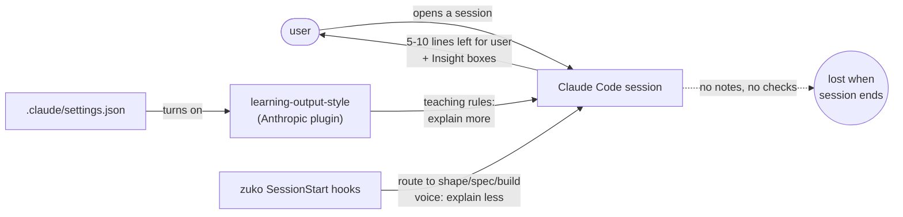
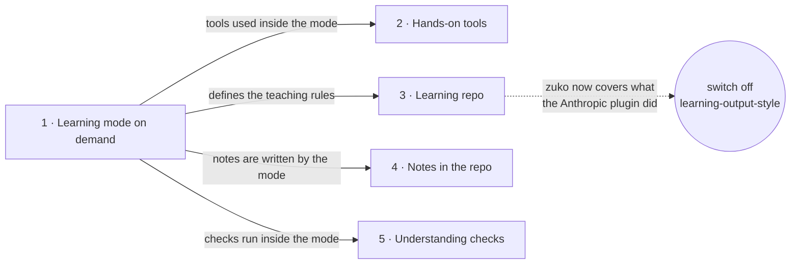

# Learning mode

**Project type:** CLI/Library · **Status:** Shaped

## Problem

When the user wants to learn something with Claude, the teaching rules come from
Anthropic's `learning-output-style` plugin, which sits outside zuko and argues in the
same session with zuko's routing and its "explain less" voice. What Claude teaches is
not written down anywhere, and nothing checks whether it stuck.

## Today

Both rule sets load into the same session today (this repo has both on), and the
only thing either leaves behind is the session transcript.

## Slices

| # | Slice | What ships | Why this order |
|---|-------|-----------|----------------|
| 1 | Learning mode on demand | `/study` puts the current session into learning mode, for any topic. Claude asks what the user already knows, leaves the key part for them to do by hand (for code, the 5-10 lines that matter; otherwise the key decision), explains at length in simple words, and stops routing work into shape/spec/build. | Smallest thing worth using on its own. Every later slice is a behaviour of this mode. |
| 2 | Hands-on tools | For topics with little or no code, learning mode works the key decision through in an emulator or notebook when one exists, so it gets tried rather than only talked about. | Split out of slice 1 at spec, where it pushed slice 1 past five scenarios. Next because the user wants learning to be hands-on. |
| 3 | Learning repo | The user marks a repo once as a learning repo. Every session there starts in learning mode without running the command. | Covers the second trigger. With 1 and 3 shipped, the Anthropic plugin can be switched off. |
| 4 | Notes in the repo | Learning mode keeps a notes file in the repo, written so it still makes sense weeks later without the session. | Needs only slice 1. Ahead of 5 because notes last past the session. |
| 5 | Understanding checks | Before moving on, Claude asks the user a question, so a gap shows up while it can still be fixed. | Needs only slice 1. Works with or without notes. |

## Not doing

- **Learning mode inside `/spec` and `/build`.** The user learns in plain sessions.
  `/build` hands all code to chunk-builder agents, which would leave nothing to write.
- **Running alongside the Anthropic plugin.** The point is one plugin carrying the
  user's preferences. Two teaching rule sets in one session already argue.

## Success

A month in: `learning-output-style` is off everywhere and not missed, old notes still
read clearly, the user can rebuild what they learned without Claude, and the checks
have caught at least one thing the user thought they knew.

## Open items

| ID | What | Type | Raised at | Owner | Status | Answer |
| -- | ---- | ---- | --------- | ----- | ------ | ------ |
| O1 | `/learn` is already zuko's lesson store, and `route-to-zuko.sh` sends "what have you learned" there. The new command needs another name, and "I want to learn Rust" must not route to the lesson store. | flag | shape | user | Resolved | Yes. The new command gets its own name, picked at slice 1's spec, and routing keeps "learn X" requests off the lesson store. Named `/study` at slice 1's spec, 2026-09-15. |
| O2 | Unproven that learning mode's rules win over two instructions already in the session: the global `CLAUDE.md` "explain less" and `route-to-zuko.sh` "route to a stage first". A skill rule has lost to a session-wide instruction before (`docs/specs/ship-naming.md`, attribution). | unproven | shape | poc | Accepted risk | No spike, user's call 2026-09-15. Slice 1's e2e is where it gets proven. |
| O3 | Assuming "learning something" means learning to code (a language, library, or tool), since "user writes key code" needs code. Non-code topics are not planned for. | assumption | shape | user | Resolved | No. Any topic: code, cloud, system design, and so on. |
| O4 | For topics with no code to write (cloud, system design), assuming the user's hands-on part is making the key decision themselves, like picking the design and saying why, instead of writing 5-10 lines. | assumption | shape | user | Resolved | Yes, and it must still be hands-on: use an emulator or notebook when one exists for the topic. |
