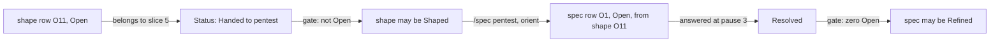
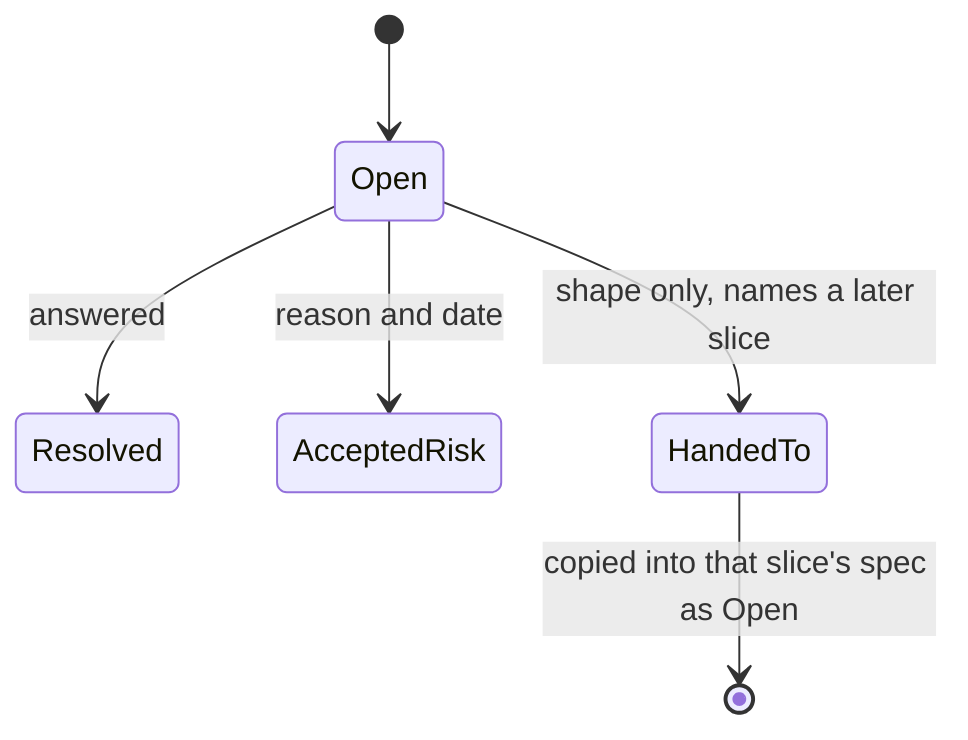
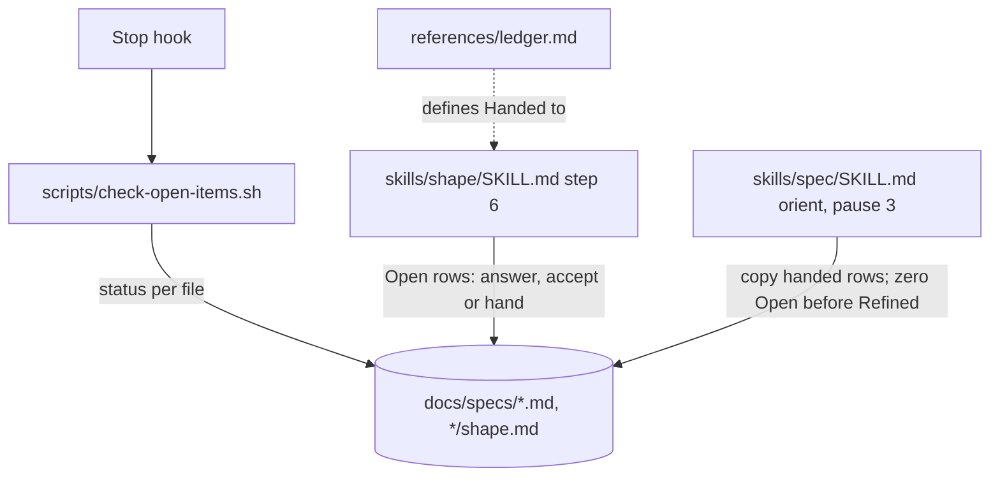
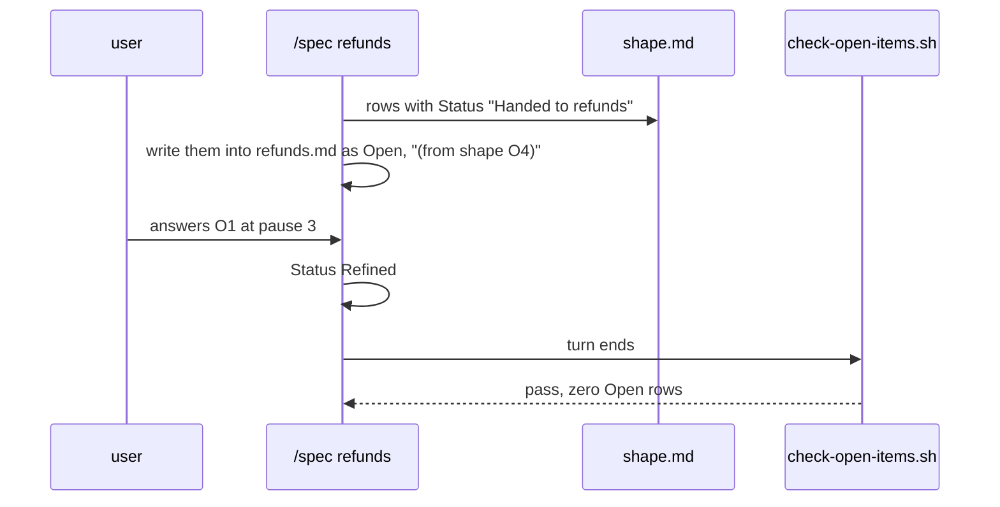

# Ledger handoff

**Version:** v1 · **Status:** Refined · **Type:** Enhancement · **Project type:** CLI/Library

**Shape doc:** docs/specs/v3-release-and-hosts/shape.md — slice 8, part 4 of 9
**Depends on:** None
**Page:** https://claude.ai/artifact/QzLUTiLTrGLMbzcLefV8P8

The ledger gains a `Handed to SLICE` status, and the Stop hook refuses a shape
marked `Shaped` or a spec marked `Refined` while a row is still `Open`. Now, because
the shape decided it (shape O8), and today a spec can reach `Refined` with open
questions that nothing surfaces until `/build`.

## Problem

`check-open-items.sh:51` only fails a spec at `Built` or `Shipped`. A shape at
`Shaped`, or a spec at `Refined`, can carry `Open` rows, and the next stage finds out
late: `/build` refuses to start, after the user has already approved pause 3. A
shape question that belongs to a later slice has no status of its own, so it is
either left `Open` (and blocks nothing) or forced into a false `Resolved`. The v3
shape invented `Handed to 6` by hand (shape O11); nothing defines it or copies it
forward.

## Slice test

| Check                         | Result                                                                                                                                |
| ----------------------------- | ------------------------------------------------------------------------------------------------------------------------------------- |
| Cuts every layer it needs     | yes — the status in `ledger.md`, the gate in `check-open-items.sh`, the rules in `/shape` and `/spec`                                 |
| One e2e test walks it         | yes — one scratch repo: a shape hands a row, the gate passes it, the spec picks it up, the gate blocks `Refined` until it is resolved |
| Worth shipping alone          | yes — nobody approves a plan that still has open questions                                                                            |
| Fits (≤5 scenarios, ≤2 areas) | yes — 4 scenarios; two areas: `scripts/` and `skills/` + `references/`                                                                |

**Path:** full — a new ledger status and a stricter gate. Part 4 of slice 8's split;
the full split is in `mermaid-placeholder.md`.

## User story

As someone approving a shape or a spec, I want the stage to refuse to mark it done
while a question is still open, so I never approve a plan built on a guess nobody
answered.

## Flow



A shape hands a later slice's question to that slice. The shape can then be
marked done. The slice's spec copies the row in as `Open`, and cannot be marked
`Refined` until it is answered.

## States



## Acceptance criteria

```gherkin
Scenario: a shape with an open row cannot be Shaped
  Given docs/specs/v3-billing/shape.md at "**Status:** Shaped" with row
    "| O4 | Who can refund? | question | shape | user | Open | — |"
  When a turn ends
  Then the Stop hook exits 2 naming the shape, 'Shaped' and row O4
  And the same row as "Handed to refunds" passes the gate

Scenario: a spec with an open row cannot be Refined
  Given docs/specs/refunds.md at "**Status:** Refined" with one Open row
  When a turn ends
  Then the Stop hook exits 2 naming the spec, 'Refined' and the row
  And at "**Status:** Draft" the same spec passes

Scenario: /spec picks up a handed row
  Given the v3-billing shape hands O4 to refunds
  When /spec refunds starts
  Then the new spec's ledger has an Open row "Who can refund? (from shape O4)"
  And the terminal lists it first among the open items

Scenario: Accepted risk and Resolved still pass
  Given a Refined spec whose rows are all Resolved or Accepted risk
  When a turn ends
  Then the gate passes, as today
```

## Scope

**In:** `Handed to SLICE` in `references/ledger.md`; `check-open-items.sh` hook mode
fails `Shaped` shapes and `Refined` specs with `Open` rows, as it already fails
`Built` and `Shipped`; `/shape` step 6 and `/spec` orient and pause 3 follow the rule;
a new test file for the gate, which has none today.

**Out:**

- A mechanical check that every handed row reached its spec — O2; no slice.
- `Handed to` inside a spec (a spec hands forward by splitting, not by status) —
  no slice.

## Interface

`references/ledger.md` status table gains one row:

| Status            | Means                                                                                                                                   |
| ----------------- | --------------------------------------------------------------------------------------------------------------------------------------- |
| `Handed to SLICE` | Shape only. The question belongs to a later slice. Does not block the shape. `/spec SLICE` copies it in as `Open`, naming the shape row |

The Stop hook's message, same shape as today's (`check-open-items.sh:64`):

```text
Open-items gate failed. A shape cannot be Shaped, and a spec cannot be Refined,
Built or Shipped, with unresolved items.
- docs/specs/refunds.md is 'Refined' but still has open ledger items:
98:| O3 | Assuming refunds over 500 need a second approver | assumption | ... | Open | — |

Resolve each row (write the answer into the row), mark it 'Accepted risk' with a
reason and a date, or in a shape hand it to a later slice. Never delete a row.
```

## Technical plan

### Approach

`check-open-items.sh`'s `case` at `:50` gains `Refined` for specs and `Shaped` for
files named `shape.md`. `open_rows` already matches only `| Open |`, so a
`Handed to …` row never counts. The skills gain the rule in prose, and `/spec`'s
orient step copies handed rows.

Relies on: D19





### Changes

| File                                                        | What changes                                                                                                                                                          | Why               |
| ----------------------------------------------------------- | --------------------------------------------------------------------------------------------------------------------------------------------------------------------- | ----------------- |
| `plugins/zuko/scripts/check-open-items.sh:50`               | `Refined\|Built\|Shipped)` for specs; `Shaped)` when the file is `shape.md`; header comment and message per the Interface section                                     | scenarios 1, 2, 4 |
| `plugins/zuko/references/ledger.md`                         | The `Handed to SLICE` status row; rule 4 extends to `Shaped` and `Refined`; rule 7 names both new statuses                                                            | scenarios 1, 3    |
| `plugins/zuko/skills/shape/SKILL.md:118`                    | Before `Shaped`: each Open row is answered, accepted, or handed to a named slice                                                                                      | scenario 1        |
| `plugins/zuko/skills/spec/SKILL.md`                         | Orient: copy rows handed to this slice as Open, naming the shape row. Pause 3: `Refined` only with zero Open rows; otherwise stay `Draft` and say which rows block it | scenarios 2, 3    |
| `plugins/zuko/scripts/tests/test-check-open-items.sh` (new) | Scenarios 1, 2, 4 on scratch `docs/specs/` trees under `$work`; direct mode unchanged                                                                                 | scenarios 1, 2, 4 |
| Every live spec or shape the new rule fails (backfill) | One commit before the gate commit. Found by running the new rule by hand over `docs/specs/*.md` and `docs/specs/*/shape.md`: each `Refined` spec or `Shaped` shape with an `Open` row gets it resolved with the user, or goes back to `Draft`/`Shaping`. On 2026-09-25 that is `owasp-lens.md` alone (O8, O9 on `feat/owasp-lens`); `/build` reruns the check, since the list changes as specs move | O3; the `a-new-gate-check-breaks-every-fixture` lesson |

Reusing: `open_rows` and `spec_status` (`check-open-items.sh:11`–`:17`), and
`run.sh`'s `expect_*` helpers.

### Earn-it

| Added                      | Triggered by                                                                   |
| -------------------------- | ------------------------------------------------------------------------------ |
| `Handed to SLICE` status   | scenario 1: a later slice's question needs a status that is not Open or false  |
| `test-check-open-items.sh` | scenarios 1, 2, 4: the gate has no test today, and it is about to get stricter |

### Non-functionals

|                      |                                                                                                                 |
| -------------------- | --------------------------------------------------------------------------------------------------------------- |
| **Load**             | Every Stop, over every live spec and shape — about 20 files here                                                |
| **Breaks first**     | At 10× files it is still one grep per file, well under a second                                                 |
| **Security surface** | None. Reads files under `docs/specs/`                                                                           |
| **Proof it works**   | A turn that leaves a `Refined` spec with an Open row ends with "Open-items gate failed"                         |
| **Rollout**          | No flag. Rollback is `git revert`. The backfill commit lands before the gate commit, so `main` never has a failing live doc (O3) |

### Test plan

| Scenario | Test                           | Command                                                   |
| -------- | ------------------------------ | --------------------------------------------------------- |
| 1, 2, 4  | `test-check-open-items.sh`     | `bash plugins/zuko/scripts/tests/run.sh check-open-items` |
| 3        | `/spec` prose; seen in the e2e | —                                                         |
| O3 (backfill) | the repo's own `docs/specs/` passes the new gate at the gate commit | `echo '{}' \| bash plugins/zuko/scripts/check-open-items.sh` exits 0 |

**E2E:** `test-check-open-items.sh` builds one scratch repo: a `Shaped` shape with a
`Handed to refunds` row passes; a `Refined` `refunds.md` holding that row as Open
fails; the row set to Resolved passes. Scenario 3 is prose in `/spec` and is proven
by the next real `/spec` run on a slice with a handed row (O1).

### Chunks

| Chunk | Scenarios | Files owned                                                                  |
| ----- | --------- | ---------------------------------------------------------------------------- |
| A     | 1, 2, 4   | `scripts/tests/test-check-open-items.sh`, then the backfilled specs and shapes, then `scripts/check-open-items.sh` |
| B     | 1, 3      | `references/ledger.md`, `skills/shape/SKILL.md`, `skills/spec/SKILL.md`      |

A lands in three commits: the test, red; the backfill, so every live doc already passes the new rule; then the gate, with the repo check in the test plan green on that commit. B is independent.

### Risks

| Risk                                                                                                                                                                           | Mitigation                                                                                                                                                                                                    |
| ------------------------------------------------------------------------------------------------------------------------------------------------------------------------------ | ------------------------------------------------------------------------------------------------------------------------------------------------------------------------------------------------------------- |
| The stricter gate fails every live spec already at `Refined` with Open rows | Resolved by O3: the backfill commit lands first, and the test plan checks the repo passes at the gate commit |
| A shape's status line reads `Shaped` but the file sits deeper than `maxdepth 2`                                                                                                | Shapes live at `docs/specs/IDEA/shape.md`, depth 2, which the existing `find` at `:60` covers                                                                                                                 |

### Decisions to record

Recorded as D19.

## Open items

| ID  | What                                                                                                                                                                                       | Type       | Raised at | Owner | Status | Answer |
| --- | ------------------------------------------------------------------------------------------------------------------------------------------------------------------------------------------ | ---------- | --------- | ----- | ------ | ------ |
| O1  | Assuming the copy of handed rows into a spec is a `/spec` prose rule with no script check (default chosen autonomously; alternative: a gate that matches handed rows to spec rows by text) | assumption | spec p1   | user  | Resolved | Default accepted by the user, 2026-09-25 |
| O2  | Assuming `Handed to` is valid in shapes only (default chosen autonomously; alternative: allow it in specs too)                                                                             | assumption | spec p1   | user  | Resolved | Default accepted by the user, 2026-09-25 |
| O3  | The stricter gate will fail every live spec at Refined with Open rows, including this batch of autonomously written slice 8 specs                                                          | flag       | spec p3   | user  | Resolved | Backfill in the same build: a commit before the gate fixes every live doc it would fail (user, 2026-09-25). Run by hand on 2026-09-25: with this row and glossary-gate O3 resolved, only `owasp-lens.md` fails (Refined on `feat/owasp-lens` with O8 and O9 Open) |
| O4  | The Changes table missed two lines the stricter gate makes false: `skills/build/SKILL.md:33` says hook mode only inspects `Built` or `Shipped`, and `README.md:135` says the same | flag | build | build | Resolved | Both updated in chunk B's commit (build, 2026-09-28); prose only, no behaviour change |

_Never delete this section or its rows. See references/ledger.md._

## Glossary

- **Stop hook** — a script Claude Code runs when a turn ends; exit 2 sends its
  message back and the turn continues.
- **Ledger** — the `## Open items` table every shape and spec carries.
