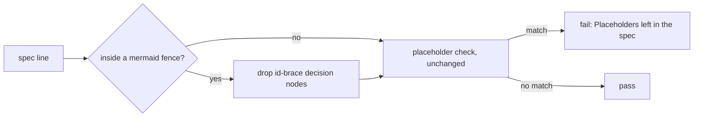
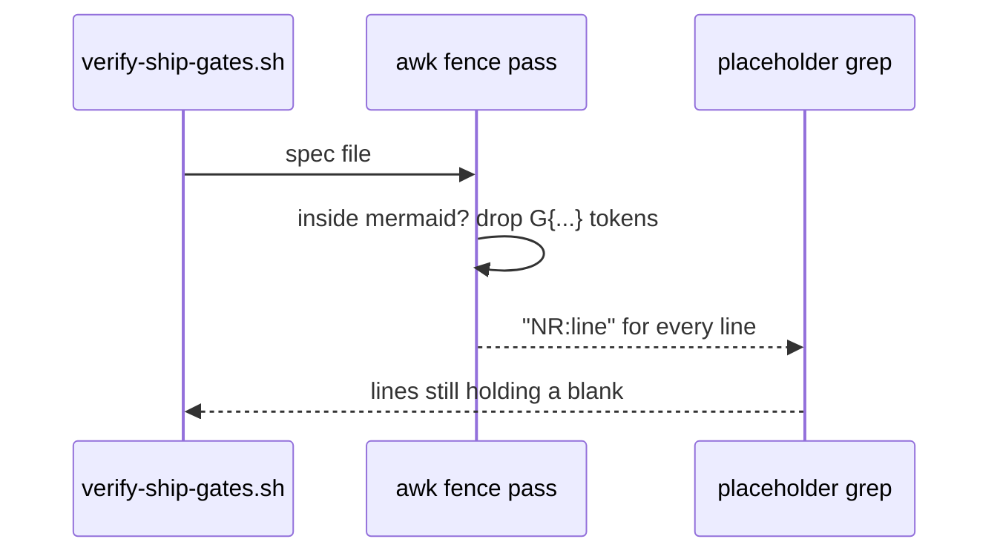

# Mermaid placeholder

**Version:** v1 · **Status:** Built · **Type:** Bug · **Project type:** CLI/Library

**Shape doc:** docs/specs/v3-release-and-hosts/shape.md — slice 8, part 1 of 9
**Depends on:** None
**Page:** https://claude.ai/artifact/AnCszTToZDaHLDVcsyevpu

The ship gate stops reading a Mermaid decision node with a lowercase label as an
unfilled placeholder. First of slice 8's parts, because every spec written until it
ships has to quote its node labels to get past `/ship` (shape O12).

## Problem

`verify-ship-gates.sh:105` greps every spec line for `\{[a-z][^}]*\}`. A Mermaid
decision node is an id followed by braces holding its label, so any flowchart
whose decision label starts with a lowercase letter fails `/ship` with "Placeholders left in the spec".
Specs work around it by quoting labels (`Q{"is it"}` passes, because `"` is not
`[a-z]`), and the shape records that workaround as O12. The gate's own comment
(`verify-ship-gates.sh:101`) says a brace inside a diagram is not a blank, but the
check is line-based and never looks at fences.

## Slice test

| Check                         | Result                                                                                     |
| ----------------------------- | ------------------------------------------------------------------------------------------ |
| Cuts every layer it needs     | yes — the gate and its test; nothing else reads the rule                                   |
| One e2e test walks it         | yes — `test-verify-ship-gates.sh` section 11 runs the real gate on a scratch repo per case |
| Worth shipping alone          | yes — specs can use plain decision labels, and O12's workaround ends                       |
| Fits (≤5 scenarios, ≤2 areas) | yes — 3 scenarios, one area (`scripts/`)                                                   |

**Path:** light — a bug fix in 2 files with no new interface, data or dependency.
Pauses 1 and 3 are merged; pause 2 is skipped.

Slice 8 as shaped failed the slice test: eight unrelated changes, four areas, about
25 scenarios. It is split along what the user can do, in this order:

| #   | Spec                   | Path  | What the user gets                                          |
| --- | ---------------------- | ----- | ----------------------------------------------------------- |
| 1   | `mermaid-placeholder`  | light | plain decision labels pass `/ship`                          |
| 2   | `release-host-message` | light | a GitLab origin is told the truth                           |
| 3   | `pr-attribution`       | full  | a PR body or title signed by Claude is blocked              |
| 4   | `ledger-handoff`       | full  | a shape or spec cannot be marked done with an Open row      |
| 5   | `glossary-gate`        | full  | every jargon term in a live doc has a glossary entry        |
| 6   | `ascii-terminal`       | full  | diagrams in the terminal are ASCII                          |
| 7   | `design-system`        | full  | `/design-system` is its own command                         |
| 8   | `figma-brief`          | full  | `/design-system` reads a Figma file when Figma is connected |
| 9   | `jira-shape`           | full  | `/shape` starts from a Jira key when Jira is connected      |

## Flow



Outside a Mermaid fence nothing changes. Inside one, decision-node braces are removed
before the same check runs, so a placeholder anywhere else on the line still fails.

## Acceptance criteria

```gherkin
Scenario: a real flowchart with decision nodes passes
  Given a spec on feat/export-csv holding the flowchart from docs/specs/release.md,
    with two decision nodes whose labels start lowercase: "gates: on main" and
    "origin host"
  When /ship runs verify-ship-gates.sh
  Then the placeholder check passes

Scenario: a blank inside a diagram still fails
  Given the same spec with a box node whose label is a lowercase word in braces,
    the template's own blank, inside the mermaid fence
  When the gate runs
  Then it fails with "Placeholders left in the spec" and names that line

Scenario: prose and other fences are unchanged
  Given a prose line and a gherkin line each holding a lowercase word in braces
  When the gate runs
  Then both lines fail it, exactly as today
```

## Scope

**In:** the placeholder check in `verify-ship-gates.sh:105` skips decision-node
braces (an id, then braces) inside ` ```mermaid ` fences; a test with a real flowchart.

**Out:** hexagon nodes `{{…}}` (already excluded at `:106`); quoting labels in older
specs (they pass either way); fence awareness for other checks — no slice.

## Technical plan

### Approach

Before the grep, an `awk` pass over the spec tracks ` ```mermaid ` … ` ``` ` fences
and, only inside one, deletes tokens matching `[A-Za-z0-9_]+\{[^{}]*\}`. It prints
`NR:line` so the output keeps `grep -n`'s shape for the existing message. The rest
of the pipeline (`:105`–`:110`) is unchanged.

Relies on: D20 (drafted below)



### Changes

| File                                                       | What changes                                                                                                         | Why           |
| ---------------------------------------------------------- | -------------------------------------------------------------------------------------------------------------------- | ------------- |
| `plugins/zuko/scripts/verify-ship-gates.sh:105`            | `grep -nE … "$spec"` becomes `awk` (fence pass, `NR:line`) piped into `grep -E` with the same pattern and exclusions | scenarios 1–3 |
| `plugins/zuko/scripts/tests/test-verify-ship-gates.sh:208` | Section 11 gains the three scenarios; the existing documented-placeholder and prose cases stay                       | scenarios 1–3 |

Reusing: section 11's `new_repo` and `gate` helpers.

### Non-functionals

|                      |                                                                           |
| -------------------- | ------------------------------------------------------------------------- |
| **Load**             | One spec per `/ship`, a few hundred lines                                 |
| **Breaks first**     | Nothing at 10×; one awk pass per spec                                     |
| **Security surface** | None. Reads a spec in the repo; no input from outside it                  |
| **Proof it works**   | The next `/ship` of a spec with an unquoted decision node passes the gate |
| **Rollout**          | No flag. Rollback is `git revert`                                         |

### Test plan

| Scenario | Test                                   | Command                                                    |
| -------- | -------------------------------------- | ---------------------------------------------------------- |
| 1–3      | `test-verify-ship-gates.sh` section 11 | `bash plugins/zuko/scripts/tests/run.sh verify-ship-gates` |

**E2E:** section 11, which runs the real gate on a scratch repo per case. Before
shipping, run the old and new check over every live spec and every fixture and diff
the hits: the only lines that may disappear are decision nodes inside a Mermaid
fence (the `tightening-a-matcher-trades-blocks-for-allows` lesson).

### Chunks

Single chunk.

### Risks

| Risk                                                                    | Mitigation                                                                                                                 |
| ----------------------------------------------------------------------- | -------------------------------------------------------------------------------------------------------------------------- |
| An unclosed fence makes everything below it count as Mermaid            | Only id-brace tokens are dropped there, so prose blanks on those lines still fail; scenario 3 covers prose after a diagram |
| The new rule allows a real blank written as a decision node, an id then a lowercase word in braces | Accepted: that is valid Mermaid syntax with a label, and the diagram renders it                                            |

### Decisions to record

```text
## D20 · 2026-09-25 · Inside a Mermaid fence, only decision-node braces are exempt from the placeholder check

Why: a decision node (an id, then its label in braces) is Mermaid syntax, not a
blank; any other brace in the fence, such as a blank in a box label, is still one
someone forgot.
Rejected: skipping every line inside a Mermaid fence (turns false blocks into false
allows for blanks in node labels), keeping the quote-the-label workaround (every
spec author has to know an undocumented rule).
Source: specs/mermaid-placeholder.md
Status: active
```

## Open items

| ID  | What                                                                        | Type | Raised at              | Owner | Status   | Answer                                                            |
| --- | --------------------------------------------------------------------------- | ---- | ---------------------- | ----- | -------- | ----------------------------------------------------------------- |
| O1  | Ship gate flags Mermaid decision nodes as unfilled placeholders (shape O12) | flag | spec p3 (auto-onboard) | user  | Resolved | This spec: decision nodes inside a Mermaid fence are exempt (D20) |
| O2  | The drafted decision was numbered D16, but D16 to D18 were recorded by regression-review and D19 is taken by ledger-handoff (in flight) | flag | build | build | Resolved | Renumbered D20 (build, 2026-09-28). If this ships before ledger-handoff, /ship takes the next free number |
| O3  | Scenario 1 names `origin host` as a node in release.md; it is in release-host-message.md:37 | flag | build | build | Resolved | The fixture is release.md's flowchart with its decision label unquoted, plus that `origin host` node (build, 2026-09-28) |

_Never delete this section or its rows. See references/ledger.md._

## Glossary

- **Decision node** — a Mermaid diamond, written as an id followed by braces:
  `G{Origin host}`.
- **Fence** — a ` ``` ` block in Markdown; ` ```mermaid ` marks a diagram.
