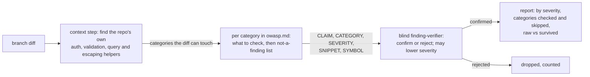
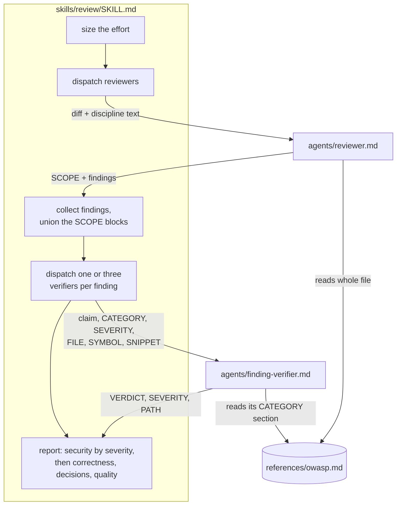

# OWASP lens

**Version:** v1 · **Status:** Refined · **Type:** Enhancement · **Project type:** CLI/Library

**Shape doc:** docs/specs/v3-release-and-hosts/shape.md — slice 7a
**Depends on:** None
**Page:** https://claude.ai/artifact/WGiEEvRnTmpzLGLUxtBTh2

`/review`'s security lens checks the diff against OWASP Top 10:2025, from one shared
`references/owasp.md` that says what to check and what is not a finding in each
category. Now, because the lens is seven bullets with no standard behind it, and
slice 5's pentest needs the same reference.

## Problem

The security lens in `/review` is a list of seven bullets
(`plugins/zuko/skills/review/SKILL.md:45`, copied in `agents/reviewer.md:26`). It
names no standard, so nobody can say which risks a review covered and which it
skipped. It has no list of what is not a finding, so the reviewer reports trusted
env vars and framework-escaped output, and the blind verifier spends a run
rejecting each one. Findings carry no category or severity, so the report cannot be
ordered by what matters, and slice 5 has nothing to block a release on. The skill
also points at Trail of Bits plugins (`SKILL.md:75`) that are not installed.

## Slice test

| Check                         | Result                                                                                                                                                     |
| ----------------------------- | ---------------------------------------------------------------------------------------------------------------------------------------------------------- |
| Cuts every layer it needs     | yes — the reference, the reviewer's lens and report format, the verifier's severity rule, and the skill's report                                           |
| One e2e test walks it         | yes — one `/review` run on a seeded vulnerable diff in a scratch copy of invoice-api walks all five scenarios; a contract test in `run.sh` guards the text |
| Worth shipping alone          | yes — every review names the categories it checked, and reports fewer false positives                                                                      |
| Fits (≤5 scenarios, ≤2 areas) | yes — 5 scenarios; two areas: the review stage (`skills/review`, `agents/reviewer.md`, `agents/finding-verifier.md`) and `references/`                     |

**Path:** full — a new reference and a changed finding format that slice 5 builds on.

## User story

As someone who runs `/review` before shipping, I want the security pass to follow a
named standard and tell me what it checked, so a clean review means something and a
finding tells me how bad it is.

## Flow



The reviewer first finds the repo's own defences and picks the categories this diff
can touch. It checks each one against `owasp.md` and reports findings with a
category and severity. The blind verifier keeps or drops each finding and may lower
its severity. The report lists what survived by severity and names the categories
it did not check.

## Acceptance criteria

```gherkin
Scenario: an injection is reported with its category and severity
  Given invoice-api's branch feat/ledger-export adds exporters/ledger.py with
    cursor.execute("SELECT * FROM invoices WHERE customer = '" + customer + "' ORDER BY " + order)
  And customer and order come from the query parameters of GET /export, which
    needs a logged-in user
  When the user runs /review
  Then the report has one finding with CATEGORY "A05:2025 Injection",
    SEVERITY high, SYMBOL "export_ledger", and a SNIPPET of that execute line
  And it gives exporters/ledger.py:31 and the fix: pass customer as a parameter,
    and check order against the list of column names

Scenario: context first, and only the categories the diff can touch
  Given invoice-api has invoice_api/db.py with run(sql, params), used by every
    other query
  When the diff above is reviewed
  Then the finding's claim says the new query bypasses db.run
  And the report lists the categories checked — A01, A05, A10 for this diff —
    and names the other seven as not checked, each with a one-line reason
  And a diff that only changes README.md checks no category and says so

Scenario: exclusions keep noise out of the report
  Given the diff reads INVOICE_DB_URL from the environment, renders a customer name
    through a Jinja template with autoescape on, and adds tests/test_export.py
    holding the fake token "sk_test_invoice_123"
  And the /export route has no rate limit
  When the user runs /review
  Then none of those four is a finding

Scenario: where an exclusion and OWASP disagree, OWASP wins, narrowed to the diff
  Given the diff changes uv.lock to add requests-toolbelt 0.10.1, which no code
    imports yet
  And removes log.warning("login failed for %s", username) from auth.py
  And is_admin() now returns True when the roles lookup raises
  And the new GET /export/all route lets only users is_admin() approves export
    every customer's invoices
  When the user runs /review
  Then it reports three findings: A03:2025 Software Supply Chain Failures for the
    new dependency, A09:2025 Security Logging and Alerting Failures for the removed
    log, and A10:2025 Mishandling of Exceptional Conditions for the fail-open check
  And a dependency already in uv.lock before the branch is not reported

Scenario: severity is lowered, never raised, and orders the report
  Given the reviewer reports the injection as high
  And the verifier finds that customer is checked against ^[A-Z0-9-]{1,12}$ before
    the query runs, so only order is injectable, and confirms that narrower case
  When the verifier returns medium
  Then the report shows it as medium
  And a verifier that returns critical for a finding reported as medium leaves it
    medium
  And the report lists security findings critical, then high, medium, low, and
    its header reads "Findings   7 raw, 3 survived"
  And every confirmed finding is fixed as today, whatever its severity
```

## Scope

**In:**

- `references/owasp.md`: the ten 2025 categories, A01 Broken Access Control to A10
  Mishandling of Exceptional Conditions. For each, what to check in a diff and what
  is **not a finding**.
- The not-a-finding lists start from Anthropic's `security-review` exclusions: env
  vars and CLI flags are trusted; SSRF only when the attacker controls host or
  protocol; framework XSS only through a raw-HTML escape hatch; no memory-safety
  findings in memory-safe languages; tests and docs are skipped; DoS and rate
  limiting are excluded.
- Where an exclusion contradicts OWASP, OWASP wins, narrowed to the diff: A03
  reports dependencies added or changed in the lockfile; A09 reports logging
  removed or never written on an auth or security event; A10 fail-open cases stay
  in.
- The context step: before judging, find the repo's own auth, validation,
  parameterised queries and escaping, and flag new code that bypasses them. The
  same step picks which categories the diff can touch. Only those are checked, and
  the report names the rest with a reason.
- The finding format gains `CATEGORY`, `SEVERITY`, `SNIPPET` and `SYMBOL`.
  Severity is exploitability × impact, on four tiers: critical, high, medium, low.
  Between two tiers, pick the lower. The verifier may lower it, never raise it.
- The report sorts by severity. Severity changes the order and the label only:
  every confirmed finding is still fixed, as `review/SKILL.md:137` says today.
- The reviewer, the skill and the verifier read `owasp.md`. The security bullets in
  `review/SKILL.md:45` and `agents/reviewer.md:26` are replaced by a pointer to it.
- Remove the Trail of Bits line, `review/SKILL.md:75`.
- A contract test in `run.sh` for the reference and the new format.

**Out:**

- Deleted guards and removed security code judged by history (`git log -S`,
  `git blame`); the verifier needing a located defence; silent failures as A10
  checks beyond fail-open; coverage findings — slice 7b.
- The pentest, and a release blocked on critical or high — slice 5, which reuses
  `owasp.md`.
- Severity changing what gets fixed — rejected at pause 1 (O1).
- An eval suite that re-runs the seeded diff on every change — rejected at pause 1
  (O2).
- SARIF output and numeric 0–100 scores — shape's Not doing list.

## Interface

Everything here is text: a reference file, two agent formats, and the report. No
design system applies.

### `references/owasp.md`

Four fixed sections, then one section per category, A01 to A10, in order.

```text
# OWASP Top 10:2025 for a diff

## Context first            the step that runs before any category
## Severity                 the grid below, and the pick-the-lower rule
## Never a finding          exclusions that hold in every category
## Where OWASP wins         A03, A09 and A10, narrowed to the diff

## A05:2025 Injection

**The diff can touch it when:** it builds a query, shell command, file path,
template or prompt from input.

**Check:**

- A query built by string formatting instead of the repo's parameterised helper.
- ...

**Not a finding:**

- A value from an env var or a CLI flag. Both are trusted.
- ...
```

The context step reads each "can touch it when" line to pick the categories. Slice
5 reads the same file, so the category headings are a contract: `## A01:2025
Broken Access Control` through `## A10:2025 Mishandling of Exceptional Conditions`,
exactly as top10.owasp.org/2025 names them.

### Severity

Exploitability × impact. Between two tiers, pick the lower.

| Exploitability ↓ · Impact →                                     | **Severe** — code runs, auth bypassed, every user's data | **Serious** — one other user's data, a secret, a privilege step | **Limited** — no secret, a missing log, own data only |
| --------------------------------------------------------------- | -------------------------------------------------------- | --------------------------------------------------------------- | ----------------------------------------------------- |
| **Direct** — anyone, one request, no login                      | critical                                                 | high                                                            | medium                                                |
| **Conditional** — a logged-in user, a setting, or a second step | high                                                     | medium                                                          | low                                                   |
| **Privileged** — an admin, or local access                      | medium                                                   | low                                                             | low                                                   |

A new or changed dependency (A03) with no known advisory is low. With one, it takes
the advisory's severity.

Only security findings carry a severity. Correctness, quality and decisions
findings stay as today.

### Reviewer output

A scope block first, once per review, then one block per finding:

```
SCOPE
DEFENCES: invoice_api/db.py run(sql, params) — parameterised queries
          invoice_api/auth.py login_required — session check on every route
CHECKED: A01, A05, A10
NOT CHECKED: A02 no config or deployment file changed
             A03 no lockfile changed
             A04 no hashing, signing or encryption touched
             A06 no new flow or trust boundary
             A07 no login, session or password code changed
             A08 no deserialisation, update or CI path changed
             A09 no auth or security event added or removed

CLAIM: The new query builds SQL by concatenating customer and order instead of calling db.run.
CATEGORY: A05:2025 Injection
SEVERITY: high
FILE: exporters/ledger.py:31
SYMBOL: export_ledger
SNIPPET: cursor.execute("SELECT * FROM invoices WHERE customer = '" + customer + "' ORDER BY " + order)
FAILING CASE: a logged-in user sends GET /export?customer=x' OR '1'='1 and gets
  every customer's invoices.
```

A correctness, quality or decisions finding has `CATEGORY: correctness` (or
`quality`, `decisions`), no `SEVERITY`, and `SNIPPET` and `SYMBOL` as above. With
several reviewers on a large diff, `CHECKED` is the union of theirs.

### Verifier input and output

The verifier sees the claim, `CATEGORY`, `SEVERITY`, `FILE`, `SYMBOL`, `SNIPPET`,
the code, and that category's section of `owasp.md`. It still never sees the
failing case or the reviewer's scope block.

```
VERDICT: CONFIRMED
SEVERITY: medium
PATH: customer is checked against ^[A-Z0-9-]{1,12}$ at routes/export.py:18, but
  order reaches ORDER BY unchecked; a CASE expression there leaks another table's
  values one bit per request.
```

`SEVERITY` appears only on a confirmed security finding. A tier above the one
reported is ignored and the reported one kept.

### Report

```
Security   checked A01 Broken Access Control, A05 Injection,
           A10 Mishandling of Exceptional Conditions
           not checked: 7 categories, listed at the end
Findings   7 raw, 3 survived

medium · A05:2025 Injection · exporters/ledger.py:31 in export_ledger
  The new query builds SQL from order instead of calling db.run.
  Failing case: GET /export?customer=ACME-01&order=CASE WHEN (SELECT ...) THEN total
    ELSE issued_at END sorts by a secret, one bit per request.
  Fix: db.run with customer as a parameter, and order checked against
    ("issued_at", "total", "customer").

low · A09:2025 Security Logging and Alerting Failures · auth.py:44 in login
  ...

correctness · exporters/ledger.py:52 in write_rows
  ...

Not checked
  A02 no config or deployment file changed
  ...
```

Security findings come first, critical to low. Then correctness, decisions and
quality, in that order. A diff that touches no category prints
`Security   no category checked — the diff changes README.md only`. Nothing
survived prints `Findings   7 raw, 0 survived — clean`.

**Preview:** this section. There is no UI to render.

## Technical plan

### Approach

All four parts are prompt text read by Claude, so nothing new runs as code. The
changes are one new reference, `references/owasp.md`, and edits to the review skill
and its two agents so they read it. The reviewer and the verifier cite
`${CLAUDE_PLUGIN_ROOT}/references/owasp.md` in their bodies. Claude Code
substitutes that path when it loads agent content (code.claude.com/docs/en/plugins-reference,
"Environment variables": "In skill, command, and agent content, write the `${...}`
reference in the Markdown body instead"). A contract test guards the text, and one
seeded `/review` run proves the behaviour.

Relies on: D4, D5, D6, D7



The skill hands the diff to the reviewer. The reviewer reads all of `owasp.md`,
runs the context step, and returns a scope block and findings. Each finding goes to
a verifier that reads only its category's section. The skill writes the report from
what the verifiers confirmed.

```mermaid
sequenceDiagram
    participant S as review skill
    participant R as reviewer
    participant O as owasp.md
    participant V as finding-verifier
    S->>R: diff, discipline text
    R->>O: read Context first, Severity, exclusions, A01–A10
    R->>R: find db.run, login_required; pick A01, A05, A10
    R-->>S: SCOPE + A05 finding, SEVERITY high
    S->>V: claim, CATEGORY A05, SEVERITY high, FILE, SYMBOL, SNIPPET
    V->>O: read "## A05:2025 Injection"
    V->>V: trace routes/export.py:18 regex, order unchecked
    V-->>S: CONFIRMED, SEVERITY medium, PATH
    S->>S: keep min(high, medium) = medium
    S-->>S: report "medium · A05:2025 Injection · exporters/ledger.py:31"
```

For a large diff, three verifiers judge each finding and two must confirm it. The
kept severity is the lowest tier any confirming verifier returned, and never above
the reported one.

### Changes

| File                                                    | What changes                                                                                                                                                                                                                                                                                                                                                                                                                                                                                                                                                                                                                                                                                         | Why               |
| ------------------------------------------------------- | ---------------------------------------------------------------------------------------------------------------------------------------------------------------------------------------------------------------------------------------------------------------------------------------------------------------------------------------------------------------------------------------------------------------------------------------------------------------------------------------------------------------------------------------------------------------------------------------------------------------------------------------------------------------------------------------------------- | ----------------- |
| `plugins/zuko/references/owasp.md` (new)                | The layout from the Interface section. **Never a finding** takes Anthropic's `security-review` hard exclusions 1–8, 10–13, 15, 16 and precedents 1–8, 10–12, from `anthropics/claude-code-security-review` commit c19afa7. Exclusion 14 is narrowed (D6). **Where OWASP wins** covers exclusion 9 (becomes A03, for lockfile changes on this branch only), exclusion 17 (becomes A09, for logging removed or never written on an auth or security event), exclusion 1 (DoS stays out, A10 fail-open stays in), and exclusion 14 (becomes A05, when untrusted prompt text can steer a tool call or file write). Precedent 9 and the confidence scoring are left out: the blind verifier does that job | scenarios 1–5     |
| `plugins/zuko/agents/reviewer.md:26`                    | The seven Security bullets become: read `${CLAUDE_PLUGIN_ROOT}/references/owasp.md`, run its Context first step, check only the categories it picks                                                                                                                                                                                                                                                                                                                                                                                                                                                                                                                                                  | scenarios 1, 2    |
| `plugins/zuko/agents/reviewer.md:60`                    | The report format gains the `SCOPE` block, `CATEGORY`, `SEVERITY`, `SYMBOL` and `SNIPPET`, with the invoice-api example from the Interface section. The Decisions example gains `CATEGORY: decisions`                                                                                                                                                                                                                                                                                                                                                                                                                                                                                                | scenarios 1, 2, 5 |
| `plugins/zuko/agents/finding-verifier.md:10`            | Input names the new fields. Before judging, read the finding's category section in `owasp.md`; a match on its **Not a finding** list or **Never a finding** → REJECT. Output gains `SEVERITY`, on a confirmed security finding only: the reported tier or lower, from the grid                                                                                                                                                                                                                                                                                                                                                                                                                       | scenarios 3, 5    |
| `plugins/zuko/skills/review/SKILL.md:45`                | Security bullets become a pointer to `owasp.md`                                                                                                                                                                                                                                                                                                                                                                                                                                                                                                                                                                                                                                                      | scenario 2        |
| `plugins/zuko/skills/review/SKILL.md:75`                | Delete the Trail of Bits line                                                                                                                                                                                                                                                                                                                                                                                                                                                                                                                                                                                                                                                                        | Problem           |
| `plugins/zuko/skills/review/SKILL.md:105`               | What the verifier sees: the claim plus `CATEGORY`, `SEVERITY`, `FILE`, `SYMBOL`, `SNIPPET`, never the failing case or the scope block. On a large diff, the kept severity is the lowest a confirming verifier returned, capped at the reported one                                                                                                                                                                                                                                                                                                                                                                                                                                                   | scenario 5        |
| `plugins/zuko/skills/review/SKILL.md:124`               | The report layout from the Interface section: the `Security` and `Findings` header lines, security first by tier, then correctness, decisions, quality; the no-category and clean lines; the Not checked list. Line 137's "fix what survived" stays as is                                                                                                                                                                                                                                                                                                                                                                                                                                            | scenarios 2, 5    |
| `plugins/zuko/scripts/tests/test-owasp-lens.sh` (new)   | The contract test, below                                                                                                                                                                                                                                                                                                                                                                                                                                                                                                                                                                                                                                                                             | all               |
| `plugins/zuko/scripts/tests/fixtures/owasp-lens/` (new) | `base/` (invoice-api on main: `invoice_api/db.py` with `run(sql, params)`, `invoice_api/auth.py` with `login_required` and the login-failure `log.warning`, `routes/export.py`, `uv.lock`), `branch.patch` (every scenario 1, 3, 4 and 5 seed) and `readme.patch` (README only)                                                                                                                                                                                                                                                                                                                                                                                                                      | the seeded run    |

Reusing: `run.sh`'s `expect_*` helpers and its `$work` temp dir (the
`test-temp-dirs-live-under-run-sh` lesson); the existing blind-verifier flow and
2-of-3 vote (`SKILL.md:101`); the reviewer's existing `Bash`, used for the context
step's greps.

### Earn-it

| Added                               | Triggered by                                                                                                              |
| ----------------------------------- | ------------------------------------------------------------------------------------------------------------------------- |
| `references/owasp.md`               | scenarios 1–5 need one list of checks and exclusions. Slice 5 reads the same file, so it cannot live inside `reviewer.md` |
| `SCOPE` block                       | scenario 2: the report names what was not checked. Also the `gate-scanned-nothing-is-not-a-pass` lesson                   |
| `SEVERITY` on the verifier's output | scenario 5: lower, never raise                                                                                            |
| `fixtures/owasp-lens/`              | O2: the seeded run needs a fixed diff. It is checked in so the run can be repeated by hand after a later prompt change    |
| `test-owasp-lens.sh`                | O2: the contract test                                                                                                     |

Cut: a per-category severity table (the grid plus the A03 rule covers every case),
a verifier model upgrade (no evidence yet that haiku misapplies the grid; the seeded
run is where that would show), and a second verifier pass for severity.

### Non-functionals

|                      |                                                                                                                                                                                                                                            |
| -------------------- | ------------------------------------------------------------------------------------------------------------------------------------------------------------------------------------------------------------------------------------------ |
| **Load**             | One `/review` per branch. Each reviewer reads `owasp.md` once (about 250 lines). Each verifier reads one category section (about 20 lines)                                                                                                 |
| **Breaks first**     | At 10× findings on a large diff, that is 30 verifier runs. Tokens grow with them, which is why each verifier reads one section, not the whole file. Nothing else scales                                                                    |
| **Security surface** | No new tool, permission, or secret. The reviewer's `Bash` and the verifier's `Read, Grep, Glob` are unchanged. The input stays the branch diff. New exposure: `owasp.md` is plugin text the agents obey, trusted the same as `reviewer.md` |
| **Proof it works**   | The next real `/review` in this repo (slice 7b's branch) prints a `Security   checked A0…` header line and a `Findings   N raw, M survived` line                                                                                           |
| **Rollout**          | No flag: zuko ships prompt changes by version, and a prompt has no runtime switch (as in every earlier zuko slice). Rollback is `git revert` of the slice's commits, then `/release` a patch                                               |

### Test plan

| Scenario            | Test                                                                                                                                                                                                                                                                                                                                                                                                                                                                                                                                                                                                                                                                                            | Command                                                             |
| ------------------- | ----------------------------------------------------------------------------------------------------------------------------------------------------------------------------------------------------------------------------------------------------------------------------------------------------------------------------------------------------------------------------------------------------------------------------------------------------------------------------------------------------------------------------------------------------------------------------------------------------------------------------------------------------------------------------------------------- | ------------------------------------------------------------------- |
| all (text is there) | `test-owasp-lens.sh`: `owasp.md` has the four fixed sections and exactly ten headings, `## A01:2025 Broken Access Control` to `## A10:2025 Mishandling of Exceptional Conditions`, in order, each with its three labelled parts. `reviewer.md` cites `${CLAUDE_PLUGIN_ROOT}/references/owasp.md` and carries `SCOPE`, `CATEGORY:`, `SEVERITY:`, `SYMBOL:`, `SNIPPET:`. `finding-verifier.md` cites `owasp.md` and carries `SEVERITY:`. `SKILL.md` has no `Trail of Bits`. The old bullet `Injection: SQL, command, template, path traversal` is gone from both files. `base/` plus `branch.patch`, and `base/` plus `readme.patch`, each apply with `git apply --check` in a repo under `$work` | `bash plugins/zuko/scripts/tests/run.sh owasp-lens`                 |
| 1–5 (behaviour)     | The seeded run, below                                                                                                                                                                                                                                                                                                                                                                                                                                                                                                                                                                                                                                                                           | `bash plugins/zuko/scripts/tests/run.sh` first, then the seeded run |

**E2E:** the seeded run. `/build` makes a scratch repo under the scratchpad from
`fixtures/owasp-lens/base/`, commits it on `main`, applies `branch.patch` on
`feat/ledger-export`, and runs, in it:

```
claude -p "/zuko:review" --plugin-dir <repo>/plugins/zuko --add-dir <repo>/plugins/zuko \
  --settings '{"env":{"ANTHROPIC_API_KEY":""}}' --output-format stream-json --verbose
```

This loads the repo's prompts, not the installed plugin cache (the
`installed-plugin-lags-the-repo` lesson). The O7 spike proved each flag.
`--add-dir` lets the agents read `owasp.md` from outside the scratch repo; without
it, `-p` mode denies the read. The `--settings` override blanks the API key that
`~/.claude/settings.json`'s `env` block sets, which otherwise fails the run with
"Invalid API key". `stream-json` records the reviewer's raw output as the Agent
tool's result, which the final report does not repeat. Writes are denied in `-p`
mode, so `/review` reports without fixing and the fixture stays clean. It passes
when:

- the raw reviewer output has an A05 finding at high, with `SYMBOL: export_ledger`
  (scenario 1), and a `SCOPE` block naming `db.run` and listing seven categories as
  not checked (scenario 2);
- none of the four decoys is reported (scenario 3);
- A03, A09 and A10 findings survive (scenario 4);
- the report shows A05 at medium, after the header lines (scenario 5).

The same run on `readme.patch` must print `Security   no category checked`. The
outputs go into this spec under `### Seeded run`, as O2 requires.

### Seeded run

Run 2026-09-25 at `f8f1aa2`, from scratch repos built from
`fixtures/owasp-lens/`, with the E2E command above (the key override passed as a
settings file). Both runs exited 0. The branch diff has 6 files, so the skill
took the large-diff path: two reviewers, three verifiers per finding. Writes are
denied in `-p`, so no fix was applied.

**Verdict: 4 of 5 scenarios pass, and the readme case passes. Scenario 4 fails.**

| Scenario | Result   | Evidence                                                                                                                                                                                                                                                                                                                                                                  |
| -------- | -------- | ------------------------------------------------------------------------------------------------------------------------------------------------------------------------------------------------------------------------------------------------------------------------------------------------------------------------------------------------------------------------- |
| 1        | pass     | Reviewer: `CATEGORY: A05:2025 Injection`, `SEVERITY: high`, `SYMBOL: export_ledger`, `SNIPPET: cursor.execute("SELECT * FROM invoices WHERE customer = '" + customer + "' ORDER BY " + order)`                                                                                                                                                                            |
| 2        | pass     | Reviewer's scope block: `DEFENCES: invoice_api/db.py run(sql, params) — parameterised queries; every existing query goes through it`; `CHECKED: A01, A05, A10`; seven categories under `NOT CHECKED`, each with a reason. The claim says the query goes around `db.run`. The report's union lists 6 checked and 4 not checked, as the union rule says for two reviewers   |
| 3        | pass     | No security finding on the env var, the template or the test token. The reviewer listed them under "Not findings, after checking" (`ledger.html` is autoescaped; customer is regex-checked). One _quality_ finding cites `os.environ["INVOICE_DB_URL"]`, but for skipping the settings default and leaking the connection, not as a security issue. No rate-limit finding |
| 4        | **fail** | A09 survived (`low · A09:2025 … auth.py:25 in login`). A10 (`is_admin` returns True on error) and A03 (`requests-toolbelt 0.10.1`) were each reported, then dropped 1 of 3: the verifiers rejected them because nothing calls `is_admin` and nothing imports the package (O8)                                                                                             |
| 5        | pass     | Verifiers on the A05 finding returned high, high and medium; the report kept medium (`medium · A05:2025 Injection · invoice_api/exporters/ledger.py:11 in export_ledger`). Header: `Findings   6 raw, 4 survived`. Security came first, then correctness, then quality                                                                                                    |
| readme   | pass     | `Security   no category checked — the diff changes README.md only` and `Findings   0 raw, 0 survived — clean`; the reviewer's scope block has `CHECKED: none` and all ten under `NOT CHECKED`                                                                                                                                                                             |

Also seen: 13 of the 18 verifier runs stopped at their 12-turn limit
(`maxTurns: 12`) with partial output. The skill counted those as not confirming
(O9).

#### Run 2

Run 2026-09-25 at `4b153bf`, after the O8 and O9 fixes (A03 needs no caller,
`GET /export/all` calls `is_admin()`, `maxTurns: 20`). Same command, fresh
scratch repos, both exit 0. There were two reviewers, and 21 verifier runs
across 7 findings.

**Verdict: all five scenarios and the readme case pass on the output. The
verification behind them was not blind (O10), so the slice is not marked Built.**

| Scenario | Result | Evidence                                                                                                                                                                                                                                               |
| -------- | ------ | ------------------------------------------------------------------------------------------------------------------------------------------------------------------------------------------------------------------------------------------------------ |
| 1        | pass   | Reviewer: `CATEGORY: A05:2025 Injection`, `SEVERITY: high`, `FILE: invoice_api/exporters/ledger.py:11`, `SYMBOL: export_ledger`, and the execute line as `SNIPPET`                                                                                     |
| 2        | pass   | Both scope blocks name `invoice_api/db.py run(sql, params)`; the claim says the query goes around `db.run`. One reviewer lists seven categories under `NOT CHECKED`, each with a reason. The union report checks 7 and lists 3 as not checked          |
| 3        | pass   | No security finding on the env var, the template (`ledger.html` "is not a finding": autoescape on) or the test token. A correctness finding cites `os.environ["INVOICE_DB_URL"]` for skipping the settings default, as in run 1. No rate-limit finding |
| 4        | pass   | All three survived: `low · A03:2025 … uv.lock:19` (3 of 3), `low · A09:2025 … auth.py:25 in login` (2 of 3), `medium · A10:2025 … auth.py:35 in is_admin` (3 of 3)                                                                                     |
| 5        | pass   | A05 verifiers returned high five times and medium once; the report kept medium. Header: `Findings   7 raw, 7 survived`. Security came first (medium, medium, low, low), then correctness                                                               |
| readme   | pass   | `Security   no category checked — the diff changes README.md only`, `Findings   1 raw, 0 survived — clean`, and `CHECKED: none`                                                                                                                        |

**Not clean.** 17 events in the stream mention a verifier hitting its turn limit,
even at 20. The orchestrating session resumed 13 verifier runs with
`SendMessage`, and those messages carried context the verifier should not see:
"its caller is invoice_api/routes/export.py export_all", and, for A09, a
description of the change ("main had `log.warning(...)` … and this branch deletes
that line"). The session's own diagnosis: "they have no shell and can't see the
diff". The verifier has only `Read, Grep, Glob`, so it cannot run `git diff` to
establish its rule 3 ("a line this diff actually changed"), and it spends its
turns looking for the base version (O10).

### Chunks

| Chunk | Scenarios  | Files owned                                                                  |
| ----- | ---------- | ---------------------------------------------------------------------------- |
| A     | all        | `scripts/tests/test-owasp-lens.sh`, `scripts/tests/fixtures/owasp-lens/`     |
| B     | 1–5        | `references/owasp.md`                                                        |
| C     | 1, 2, 3, 5 | `agents/reviewer.md`, `agents/finding-verifier.md`, `skills/review/SKILL.md` |

A goes first and lands red (the `harness-before-the-chunks-it-proves` lesson). B and
C run in parallel from A's commit: the only thing C needs from B is the ten heading
strings, and this spec fixes those. The seeded run goes after all three merge. No
shared files.

### Risks

| Risk                                                                                                                 | Mitigation                                                                                                                                                    |
| -------------------------------------------------------------------------------------------------------------------- | ------------------------------------------------------------------------------------------------------------------------------------------------------------- |
| The seeded run is one sample of non-deterministic output. A later prompt edit can regress without anything going red | Accepted at O2. The fixture is checked in, so a rerun is one command. The contract test still catches a deleted category or field                             |
| The context step wrongly skips a category (says A07 is untouched when the diff changes login)                        | Every skipped category is printed with its reason, so the user sees the claim. The seeded diff removes a login log to test exactly this, and A09 must survive |
| The haiku verifier misplaces a finding on the grid                                                                   | It can only lower, so the worst case is an under-rated finding, and it still gets fixed (D7). Scenario 5 in the seeded run checks one lowering                |
| The seeded run depends on this machine's settings (the blanked key)                                                  | Settled by O7. On another machine, drop the `--settings` override; the rest of the command holds                                                              |
| Anthropic's list changes upstream                                                                                    | `owasp.md` names the commit it copied (c19afa7). Updating it is a deliberate edit, not a sync                                                                 |

### Decisions to record

Recorded as D4, D5, D6, D7.

## Open items

| ID  | What                                                                                                                                                                                                                                                                                                                                                                                                                                                                                                                                                                                                                                                                                                                                                                        | Type     | Raised at     | Owner  | Status   | Answer                                                                                                                                                                                                                                                                                                                                                                                                                                                           |
| --- | --------------------------------------------------------------------------------------------------------------------------------------------------------------------------------------------------------------------------------------------------------------------------------------------------------------------------------------------------------------------------------------------------------------------------------------------------------------------------------------------------------------------------------------------------------------------------------------------------------------------------------------------------------------------------------------------------------------------------------------------------------------------------- | -------- | ------------- | ------ | -------- | ---------------------------------------------------------------------------------------------------------------------------------------------------------------------------------------------------------------------------------------------------------------------------------------------------------------------------------------------------------------------------------------------------------------------------------------------------------------- |
| O1  | What severity changes in `/review`                                                                                                                                                                                                                                                                                                                                                                                                                                                                                                                                                                                                                                                                                                                                          | question | spec p1       | user   | Resolved | Order and label only; every confirmed finding is still fixed. Slice 5 uses severity to block a release                                                                                                                                                                                                                                                                                                                                                           |
| O2  | How to prove the reviewer follows `owasp.md`                                                                                                                                                                                                                                                                                                                                                                                                                                                                                                                                                                                                                                                                                                                                | question | spec p1       | user   | Resolved | A contract test in `run.sh`, plus one `/review` run on a seeded diff during `/build`, recorded in this spec. No eval suite. The run is not repeated on later changes                                                                                                                                                                                                                                                                                             |
| O3  | The 2025 category names and IDs                                                                                                                                                                                                                                                                                                                                                                                                                                                                                                                                                                                                                                                                                                                                             | question | spec p1       | claude | Resolved | A01–A10 as in the shape, read from top10.owasp.org/2025 on 2026-09-25. The page calls it "the 2025 version" and does not say release candidate                                                                                                                                                                                                                                                                                                                   |
| O4  | The exact exclusion list in Anthropic's `security-review`                                                                                                                                                                                                                                                                                                                                                                                                                                                                                                                                                                                                                                                                                                                   | unproven | spec p1       | claude | Resolved | 17 hard exclusions and 12 precedents, read from anthropics/claude-code-security-review `.claude/commands/security-review.md` at c19afa7 on 2026-09-25. Mapped in the Changes row for `owasp.md`                                                                                                                                                                                                                                                                  |
| O5  | Keep Anthropic's exclusion 14 (user content in AI prompts is not a vulnerability)?                                                                                                                                                                                                                                                                                                                                                                                                                                                                                                                                                                                                                                                                                          | question | spec p3       | user   | Resolved | Narrowed: a finding under A05 only when untrusted prompt text can steer a tool call or file write (D6)                                                                                                                                                                                                                                                                                                                                                           |
| O6  | Does `${CLAUDE_PLUGIN_ROOT}` resolve inside an agent's body?                                                                                                                                                                                                                                                                                                                                                                                                                                                                                                                                                                                                                                                                                                                | unproven | spec p3       | claude | Resolved | Yes: substituted inline in skill, command and agent content (code.claude.com/docs/en/plugins-reference, Environment variables), read 2026-09-25                                                                                                                                                                                                                                                                                                                  |
| O7  | `claude -p "/zuko:review" --plugin-dir plugins/zuko` runs the repo's zuko (not the installed cache) and its `disable-model-invocation` skill headless                                                                                                                                                                                                                                                                                                                                                                                                                                                                                                                                                                                                                       | unproven | spec p3       | poc    | Resolved | Yes, spiked 2026-09-25. A marked copy's reviewer printed its marker (`SPIKE-7A-AGENT`), and the skill followed the copy's added instruction. Needs `--add-dir` on the plugin folder, or `-p` denies reading its references. Needs the `--settings` override that blanks the API key here, or the key in `~/.claude/settings.json` fails the run with "Invalid API key". Writes are denied in `-p`, so the run reports without fixing. The E2E command is updated |
| O8  | "Where OWASP wins" makes an added dependency (A03) and a new fail-open check (A10) findings by rule, but the verifier's reachability bar rejects them when nothing yet calls or imports the code. In the seeded run both were dropped 1 of 3 ("nothing calls `is_admin`", "nothing imports it"). Options: exempt A03 and A10 fail-open from the reachability test in `finding-verifier.md`; or accept that they surface only once reachable, and rewrite scenario 4 and the fixture (give `is_admin` a caller)                                                                                                                                                                                                                                                              | question | build         | user   | Resolved | A03 is exempt from the reachability test: a dependency added or changed in the lockfile is a finding from the diff alone, since install-time risk needs no caller. A10 stays reachability-bound; the fixture now calls is_admin() from a route (user, 2026-09-25). Commits f651882, 4b153bf                                                                                                                                                                      |
| O9  | 13 of 18 verifier runs in the seeded run hit `maxTurns: 12` (`agents/finding-verifier.md:7`) before giving a verdict. Reading the `owasp.md` sections now costs turns, and a partial output counts as not confirming. Raise the cap (e.g. 20), or have the skill paste the category section into the verifier prompt                                                                                                                                                                                                                                                                                                                                                                                                                                                        | flag     | build         | user   | Resolved | Raise finding-verifier maxTurns 12 to 20; the turns went to tracing code (214 calls: 102 Read, 62 Grep, 36 Glob, 14 owasp.md reads), longest run 17 (user, 2026-09-25). Commit fa0bf86                                                                                                                                                                                                                                                                           |
| O10 | The finding-verifier cannot see the diff: with only `Read, Grep, Glob` it cannot run `git diff`, so it cannot establish rule 3 ("a line this diff actually changed") and burns turns looking for the base version. In run 2, 17 events show verifiers hitting the 20-turn cap, and the orchestrator resumed 13 of them with `SendMessage` messages that leaked the finder's context ("its caller is … export_all", a description of the change). That breaks the blind rule (`review/SKILL.md`, "It never sees the finder's reasoning"). Options: have the skill paste the finding's own diff hunk (`git diff` output for `FILE`, code only) into every verifier prompt and forbid resumes that add context; or give the verifier `Bash(git diff *)` and `Bash(git show *)` | flag     | build (run 2) | user   | Open     | —                                                                                                                                                                                                                                                                                                                                                                                                                                                                |

_Never delete this section or its rows. See references/ledger.md._

## Glossary

- **Fail-open** — on error, the code lets the request through instead of refusing it.
- **Lockfile** — the file pinning exact dependency versions (`uv.lock`,
  `package-lock.json`).
- **SNIPPET / SYMBOL** — the offending line as written, and the function or class it
  sits in, so a finding still points at the right code after lines move.
- **Blind verifier** — a second agent that re-judges a finding without seeing why the
  first agent thought it was a bug.
