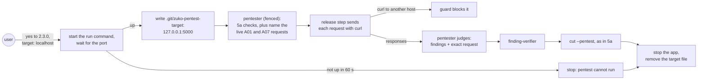
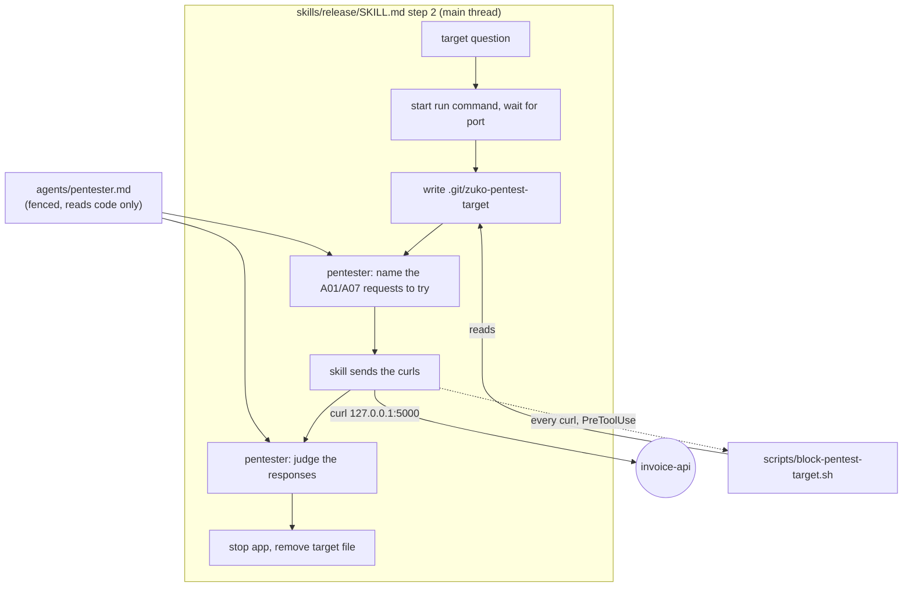
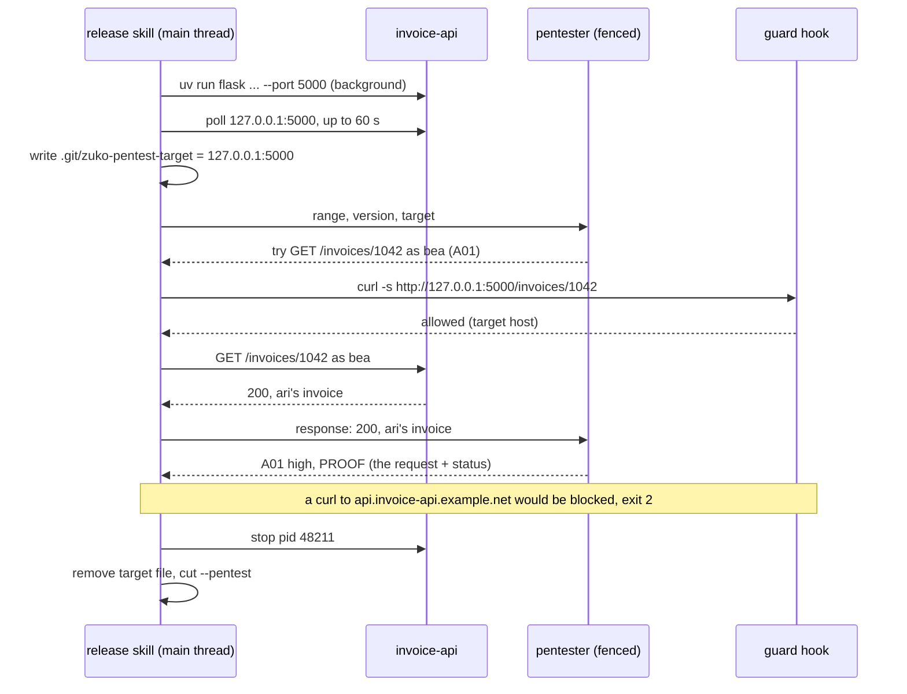

# Pentest live

**Version:** v1 · **Status:** Shipped · **Type:** Feature · **Project type:** CLI/Library

**Shape doc:** docs/specs/v3-release-and-hosts/shape.md — slice 5 (split: this is 5b)
**Depends on:** `pentest` — this adds a live mode to its step, agent and report
**Page:** https://claude.ai/artifact/9ncMJwsS8wJtRzdfWxrv4j

For a project with a server, the `/release` pentest also attacks the running app.
The target is localhost, started from the overview's run command, or a staging URL
the user names. Every proof is a real request, and a guard hook blocks any request
to another host. It comes now because code-level review (5a) cannot see access
control or sessions: A01 and A07 stay "not assessed" on every web release until
something sends real requests.

## Problem

5a's report for a web app lists A01 Broken Access Control and A07 Authentication
Failures as not assessed, because a missing ownership check or a session that
survives logout only shows up in a live request. Those are the two categories most
likely to be critical in a web app, and today no release checks them. Attacking a
live app also carries a risk 5a never had: a request to the wrong host is an attack
on someone else.

## Slice test

| Check                         | Result                                                                                                                                                              |
| ----------------------------- | ------------------------------------------------------------------------------------------------------------------------------------------------------------------- |
| Cuts every layer it needs     | yes — the target question and app start in `/release`, live checks in the pentester, and a target guard hook                                                        |
| One e2e test walks it         | yes — `test-e2e-pentest-live.sh` starts a fixture server, runs the guard against allowed and blocked hosts, and cuts a live report; one seeded run proves the agent |
| Worth shipping alone          | yes — web releases get A01 and A07 checked with real requests                                                                                                       |
| Fits (≤5 scenarios, ≤2 areas) | yes — 5 scenarios; two areas: the release stage (`skills/release`, `agents/pentester.md`) and the guard (`scripts/`, `hooks/`)                                      |

**Path:** full — a new hook, a new mode, and a safety boundary.

## User story

As someone releasing a web app with zuko, I want the release pentest to attack the
running app the way a user could, so a broken ownership check stops the release,
without ever touching a host I did not name.

## Flow



The user names the target with the version yes. zuko starts the app and writes the
target file the guard reads. The fenced pentester reads the code and names the
requests; the release step sends each one with curl to that host only, and the
pentester judges the responses. Findings go through the verifier and `cut` as in 5a.
The app is stopped and the target file removed on every path.

## Acceptance criteria

```gherkin
Scenario: a broken ownership check on localhost blocks the release
  Given invoice-api whose OVERVIEW.md "Run it" run row is
    "uv run flask --app invoice_api run --port 5000"
  And the user says yes to 2.3.0 with target localhost
  When the pentester logs in as bea@ledgerworks.test and requests
    GET http://127.0.0.1:5000/invoices/1042, an invoice owned by ari@ledgerworks.test
  And gets 200 with ari's invoice
  Then the finding is A01:2025 Broken Access Control, high, with that exact request
    and the response status as its proof
  And the release is blocked as in 5a, and the app is no longer running

Scenario: a named staging URL is the only remote target
  Given the user answers the target question with https://staging.invoice-api.example.net
  When the pentester runs
  Then every request goes to staging.invoice-api.example.net
  And a curl to https://api.invoice-api.example.net is blocked before it runs,
    naming the allowed host
  And no run command is started

Scenario: an app that will not start blocks the pentest
  Given the run command exits, or port 5000 does not answer within 60 seconds
  When the pentest step runs
  Then it stops with "Pentest cannot run: invoice-api did not answer on 127.0.0.1:5000
    in 60 s" and the last 20 lines of the app's output
  And the release goes to 5a's reason question; nothing is written without one

Scenario: live proofs never change data they do not own
  Given the pentester can create its own invoices as bea@ledgerworks.test
  When it tests for a missing ownership check on DELETE /invoices/<id>
  Then it deletes only an invoice it created, and proves the hole by reading ari's
    invoice, never by deleting it
  And a hole it could prove only by damaging data it does not own is reported
    at code level, with the reason "not proven live: would change another user's data"

Scenario: the live report and teardown
  Given a live run on localhost has finished, passed or blocked
  Then the report reads "**Mode:** live · http://127.0.0.1:5000" and lists A01
    and A07 under Assessed
  And the app process is stopped and .git/zuko-pentest-target is gone
  And a project whose overview has no run row is offered code-level only, as 5a
```

## Scope

**In:**

- The target question, asked with the version: localhost (from the overview's `run`
  row), a staging URL, or code-level. No run row → code-level, with nothing to ask.
- Start the app, wait for the port, capture its output, and stop it on every path.
- `.git/zuko-pentest-target` holds the one allowed host for the run. It lives in
  `.git/`, so the tree gate stays clean.
- `scripts/block-pentest-target.sh`: a PreToolUse Bash hook. While the target file
  exists, it blocks `curl`, `wget`, `http`/`https` (HTTPie), `nc` and Python or Node
  one-liners that open a URL to any host other than the allowed one. It passes when
  the file is absent.
- Live checks in `agents/pentester.md`: A01 (another user's objects, a
  role-restricted route as a plain user) and A07 (a session cookie that still works
  after logout, a password-reset token that works twice), plus 5a's code-level
  checks, which run before the target file is written.
- Report `**Mode:** live · <target>`. The `cut` contract is unchanged from 5a.

**Out:**

- Browser-driven attacks (DOM XSS, CSRF through a page) — no slice; curl-level only.
- Creating test accounts — the user's seed data or fixtures supply them. With none,
  A07 is "not assessed: no test account".
- Targets other than localhost and one named URL — never.
- Load and DoS testing — excluded by `owasp.md` (D5).

## Interface

The question, joining 5a's yes:

```
Release 2.3.0? Say yes, or give another version.
Pentest target: localhost (starts "uv run flask --app invoice_api run --port 5000"),
a staging URL, or code-level?
> yes, localhost
```

Progress and teardown:

```
Pentest    live · http://127.0.0.1:5000 · started in 3 s (pid 48211)
           A01 Broken Access Control   1 high
           A07 Authentication Failures 0
Pentest blocked v2.3.0: 1 high
  | P1 | high | A01:2025 Broken Access Control | GET /invoices/1042 | Open | /debug next |
Stopped invoice-api (pid 48211). Nothing written.
```

Guard block (stderr, exit 2):

```
Blocked: the pentest target is staging.invoice-api.example.net; this command reaches
api.invoice-api.example.net.

  curl -s https://api.invoice-api.example.net/health

Only the named target may be attacked. .git/zuko-pentest-target sets it; /release
removes it when the pentest ends.
```

Finding `PROOF` for a live finding:

```
PROOF: as bea@ledgerworks.test (session from POST /login), GET
  http://127.0.0.1:5000/invoices/1042 → 200, body holds "customer": "ari@ledgerworks.test".
```

## Technical plan

### Approach

The skill owns the app's lifecycle, the target file, and the live requests. The
pentester reads the code and names the A01 and A07 requests to try; the release
step sends them with curl from its own main-thread context and hands the responses
back for the pentester to judge. This keeps the pentester's fence
(`scope-pentester-bash.sh`, D14) exactly as shipped — it still blocks curl for the
pentester, and never has to make an exception (O7). The guard
(`block-pentest-target.sh`) is a separate hook that reads one file, so the safety
boundary holds even when a prompt drifts. It uses the same pattern as
`block-dangerous.sh`, registered on every Bash call in `hooks/hooks.json`. The
guard parses commands through `lib/git-command.py`'s tokeniser, which already
resolves quoting for `block-attribution.sh` (`scripts/block-attribution.sh:25`).
Report and `cut` are 5a's, unchanged, except the `**Mode:**` line.

Relies on: D5, D8, D9 (5a), D14 (the fence stays), D27, D28, D29 (drafted below)



The skill starts the app and writes the target file. The pentester, still fenced,
reads the code and names the requests. The skill sends each one, and every one of
its curls passes the guard, which allows only the host in the target file. The
pentester judges the responses the skill feeds back. The skill tears down on every
path.



### Changes

| File                                                                                        | What changes                                                                                                                                                                                                                                                                                                                                                                                                                                                                                                                                                                            | Why               |
| ------------------------------------------------------------------------------------------- | --------------------------------------------------------------------------------------------------------------------------------------------------------------------------------------------------------------------------------------------------------------------------------------------------------------------------------------------------------------------------------------------------------------------------------------------------------------------------------------------------------------------------------------------------------------------------------------- | ----------------- |
| `plugins/zuko/scripts/block-pentest-target.sh` (new)                                        | Reads the target file from `git rev-parse --git-dir` and exits 0 when it is absent. Otherwise it tokenises the command with `lib/git-command.py`, finds URL and host arguments to curl, wget, http, https and nc, and blocks any host other than the allowed one. It guards the release step's own curls in the main thread (the pentester is fenced separately by D14 and never curls). A command that will not parse is blocked while the file exists (the `gates-allow-the-pass-not-block-the-fail` lesson)                                                                          | scenario 2        |
| `plugins/zuko/hooks/hooks.json`                                                             | Registers the guard on `PreToolUse` Bash with no `if`, like `block-dangerous.sh`                                                                                                                                                                                                                                                                                                                                                                                                                                                                                                        | scenario 2        |
| `plugins/zuko/skills/release/SKILL.md` step 2                                               | The target question joins the step 1 ask. On localhost, it starts the `run` row in the background, polls the port every second for up to 60 s, writes the target file, then runs the live loop: dispatch the pentester to name the A01/A07 requests, send each with curl, feed the responses back for the pentester to judge, and stop the pid and remove the file on every path. On a staging URL, it skips the start and only writes the file. `allowed-tools` gains `Bash(curl *)` for the poll and the live requests, plus `Bash(kill *)` and `Bash(bash *)` for the start and stop | scenarios 1, 3, 5 |
| `plugins/zuko/agents/pentester.md`                                                          | A live section: read the code, name the A01 (another user's objects, a role-restricted route as a plain user) and A07 (a session that survives logout, a reset token reused) requests to try, and judge the responses the skill feeds back. The pentester never sends a request itself — the fence (D14) still blocks curl for it. The proof is the exact request and the response status; the rule is to read, and to change only objects the run created; plus code-level fallback wording                                                                                            | scenarios 1, 4    |
| `plugins/zuko/scripts/lib/release.py` `pentest_gate`                                        | Accepts `**Mode:** live · <target>` beside `code-level`                                                                                                                                                                                                                                                                                                                                                                                                                                                                                                                                 | scenario 5        |
| `plugins/zuko/scripts/tests/test-block-pentest-target.sh` (new)                             | Allow and block matrix                                                                                                                                                                                                                                                                                                                                                                                                                                                                                                                                                                  | scenario 2        |
| `plugins/zuko/scripts/tests/test-e2e-pentest-live.sh` (new), `fixtures/pentest-live/` (new) | A 20-line `python3 -m http.server`-style fixture app with one owner check missing, plus live reports                                                                                                                                                                                                                                                                                                                                                                                                                                                                                    | all               |

Reusing: `lib/git-command.py`'s tokeniser and invocation finder; 5a's step, report,
`cut` contract and verifier flow; `test-block-attribution.sh`'s hook-input
harness; the headless run proven by owasp-lens O7.

### Earn-it

| Added                      | Triggered by                                                                                                                                                                               |
| -------------------------- | ------------------------------------------------------------------------------------------------------------------------------------------------------------------------------------------ |
| `block-pentest-target.sh`  | scenario 2 and the shape's "never targets anything other than localhost or the named staging URL". A request to the wrong host attacks a third party, so the boundary needs a script (D28) |
| `.git/zuko-pentest-target` | the guard needs the allowed host without a config file, and `.git/` keeps the tree gate clean                                                                                              |
| `allowed-tools` additions  | scenario 1 (start, poll, stop)                                                                                                                                                             |

Cut: a network sandbox (macOS `sandbox-exec` is deprecated, and Docker is a
dependency most projects lack), and account seeding (out of scope).

### Non-functionals

|                      |                                                                                                                                                                                                                                                                                                                                      |
| -------------------- | ------------------------------------------------------------------------------------------------------------------------------------------------------------------------------------------------------------------------------------------------------------------------------------------------------------------------------------ |
| **Load**             | One live run per web release, with tens of requests against localhost or staging. The guard adds one Python tokenise per Bash call, about 30 ms (the same as `block-attribution.sh`), and only while the target file exists                                                                                                          |
| **Breaks first**     | An app slower than 60 s to boot. The message names the timeout; raising it is a one-line change when a real project needs it                                                                                                                                                                                                         |
| **Security surface** | The release step, in the main thread, sends attacks from this machine to the one host in the target file; the fenced pentester never sends a request. The guard trusts the file's content, which only the skill writes. A stale file left by a crash blocks every non-target request until removed; the block message names the file |
| **Proof it works**   | A web project's release report reads `**Mode:** live` with A01 and A07 under Assessed                                                                                                                                                                                                                                                |
| **Rollout**          | No flag; the default target stays code-level for any project without a run row. Rollback is `git revert`; with the hook gone, 5a's code-level mode still runs                                                                                                                                                                        |

### Test plan

| Scenario     | Test                                                                                                                                                                                                                                                                           | Command                                                       |
| ------------ | ------------------------------------------------------------------------------------------------------------------------------------------------------------------------------------------------------------------------------------------------------------------------------ | ------------------------------------------------------------- |
| 2            | `test-block-pentest-target.sh`: file absent passes everything. File `staging.invoice-api.example.net` allows curl to it, and blocks curl, `wget -qO-`, `http GET`, `nc`, `python3 -c "urllib..."` to other hosts, a `curl` inside `bash -c`, and a command that will not parse | `bash plugins/zuko/scripts/tests/run.sh block-pentest-target` |
| 1, 3, 5      | `test-e2e-pentest-live.sh`: the fixture app starts on a free port, the skill's start, poll and teardown shell snippet runs, the target file appears then goes, a blocked live report makes `cut` refuse, and a timeout message names the port                                  | `bash plugins/zuko/scripts/tests/run.sh e2e-pentest-live`     |
| 1, 4 (agent) | seeded run: `claude -p` dispatching `zuko:pentester` to name the A01/A07 requests against the fixture app (flags from owasp-lens O7), the skill sends them with curl, and the pentester judges the responses into findings                                                     | recorded in this spec                                         |

**E2E:** `test-e2e-pentest-live.sh`.

### Chunks

| Chunk | Scenarios  | Files owned                                                                                                                    |
| ----- | ---------- | ------------------------------------------------------------------------------------------------------------------------------ |
| A     | all        | `scripts/tests/test-block-pentest-target.sh`, `scripts/tests/test-e2e-pentest-live.sh`, `scripts/tests/fixtures/pentest-live/` |
| B     | 2          | `scripts/block-pentest-target.sh`, `hooks/hooks.json`                                                                          |
| C     | 1, 3, 4, 5 | `skills/release/SKILL.md`, `agents/pentester.md`, `scripts/lib/release.py`                                                     |

A first and red, then B and C in parallel.

### Risks

| Risk                                                                           | Mitigation                                                                                                                                                                                                                                                              |
| ------------------------------------------------------------------------------ | ----------------------------------------------------------------------------------------------------------------------------------------------------------------------------------------------------------------------------------------------------------------------- |
| The live requests run in the main thread, which has no fence of its own        | `block-pentest-target.sh` guards every main-thread curl to the one target host, so a request to the wrong host is blocked before it runs. The fence (D14) still blocks the pentester, which never curls. Both are in the test matrix                                    |
| The guard misses a way to reach the network (a spelling it does not recognise) | The guard allow-lists the one target host and blocks anything that will not parse while the file exists (`gates-allow-the-pass-not-block-the-fail`). The block matrix covers curl, `wget -qO-`, `http GET`, `nc`, a `curl` inside `bash -c`, and an unparseable command |
| A crash leaves the app running or the target file behind                       | Teardown runs on every path, and the next `/release` removes a target file older than the current session before asking. The stale-file block message names the file                                                                                                    |
| A live attack changes staging data                                             | Scenario 4's rule, and the user names staging only when that is acceptable (O2); D29 holds proofs to reads and to objects the run created                                                                                                                               |

### Decisions to record

Recorded as D27, D28, D29.

## Open items

| ID  | What                                                                                                                                                                                                                                                                                                                                                                                                                              | Type       | Raised at | Owner  | Status   | Answer                                                                                                                                                                                                                                                                                                                                                                                                                                                                                                                                                                                             |
| --- | --------------------------------------------------------------------------------------------------------------------------------------------------------------------------------------------------------------------------------------------------------------------------------------------------------------------------------------------------------------------------------------------------------------------------------- | ---------- | --------- | ------ | -------- | -------------------------------------------------------------------------------------------------------------------------------------------------------------------------------------------------------------------------------------------------------------------------------------------------------------------------------------------------------------------------------------------------------------------------------------------------------------------------------------------------------------------------------------------------------------------------------------------------- |
| O1  | Split from slice 5                                                                                                                                                                                                                                                                                                                                                                                                                | flag       | spec p1   | claude | Resolved | See `pentest.md` O1                                                                                                                                                                                                                                                                                                                                                                                                                                                                                                                                                                                |
| O2  | Assuming the target is asked with the version yes, as localhost, a staging URL, or code-level (default chosen autonomously; alternative: read the target from the overview)                                                                                                                                                                                                                                                       | assumption | spec p1   | user   | Resolved | Default accepted by the user, 2026-09-25                                                                                                                                                                                                                                                                                                                                                                                                                                                                                                                                                           |
| O3  | Plugin PreToolUse hooks fire on a subagent's Bash calls                                                                                                                                                                                                                                                                                                                                                                           | unproven   | spec p3   | poc    | Resolved | Yes, spiked 2026-09-25 with a throwaway plugin run headless (`claude -p`, `--plugin-dir`). Its PreToolUse Bash hook logged and blocked (exit 2) the subagent's `curl -s http://127.0.0.1:9/probe`. The subagent's tool result was "PreToolUse:Bash hook error: … BLOCKED-BY-SPIKE-HOOK", with no curl output, and its next call (`echo PROBE-RAN`) still ran. The main-thread control curl was blocked the same way. The hook input carries `agent_id` and `agent_type` (`spikeprobe:probe`) for subagent calls and neither for the main thread, so the guard can tell the pentester's calls apart |
| O4  | Assuming a 60-second start timeout (default chosen autonomously; alternative: a per-project value in the overview)                                                                                                                                                                                                                                                                                                                | assumption | spec p1   | user   | Resolved | Default accepted by the user, 2026-09-25                                                                                                                                                                                                                                                                                                                                                                                                                                                                                                                                                           |
| O5  | Assuming an app that will not start goes to 5a's reason question, not to a code-level-only fallback (default chosen autonomously; alternative: fall back to code-level and list A01 and A07 as not assessed)                                                                                                                                                                                                                      | assumption | spec p1   | user   | Resolved | Default accepted by the user, 2026-09-25                                                                                                                                                                                                                                                                                                                                                                                                                                                                                                                                                           |
| O6  | Assuming test accounts come from the project's own seed data; with none, A07 is not assessed (default chosen autonomously; alternative: the pentester registers accounts through the app)                                                                                                                                                                                                                                         | assumption | spec p1   | user   | Resolved | Default accepted by the user, 2026-09-25                                                                                                                                                                                                                                                                                                                                                                                                                                                                                                                                                           |
| O7  | The plan predates D13/D14 (2026-09-27): `scope-pentester-bash.sh` holds zuko:pentester to read-only git and its scratch copy, and blocks curl, wget, nc (`:221`) and inline `-c`/`-e` (`:231`). Every live proof in this plan is one of those, and the Changes table never names the fence. Decide how the fence and the target guard combine (e.g. the fence allows these only when the target file exists, for the target host) | flag       | build     | user   | Resolved | Option B (user, 2026-10-05): the fence stays exactly as D14 ships it, untouched. The pentester reads the code and names the A01/A07 requests to try; the release step (`skills/release` step 2) sends them with curl from its own context and hands the responses back for the pentester to judge. `block-pentest-target.sh` guards those skill-context curls to the one allowed host. Rejected: loosening the fence to let the pentester curl the target host (reopens a boundary reviewed twice). Recorded as D27. The Technical plan below is rewritten to match                                |

_Never delete this section or its rows. See references/ledger.md._

## Glossary

- **Staging** — a copy of the app deployed for testing, separate from production.
- **Target file** — `.git/zuko-pentest-target`: the one host the pentest may attack,
  written by `/release` and read by the guard hook.
- **Ownership check** — the server confirming the logged-in user owns the object
  they asked for; missing, one user reads another's data (A01).
- **e2e** — end-to-end: one test that walks the whole slice as a user would.
- **Pentest** — penetration test: attacking the app the way an outsider would, to
  prove which holes are real.
- **XSS** — cross-site scripting: input the app echoes back runs as script in
  another user's browser.
