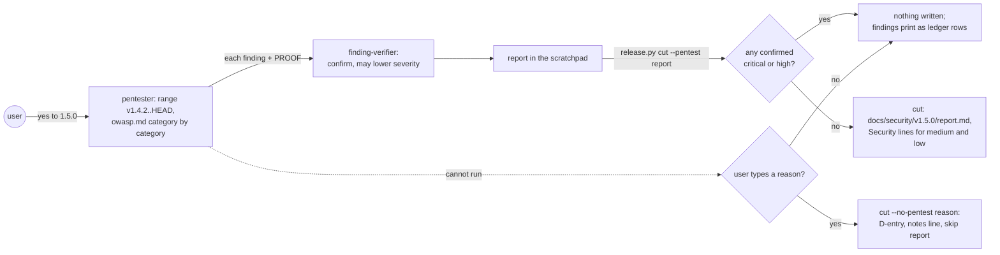
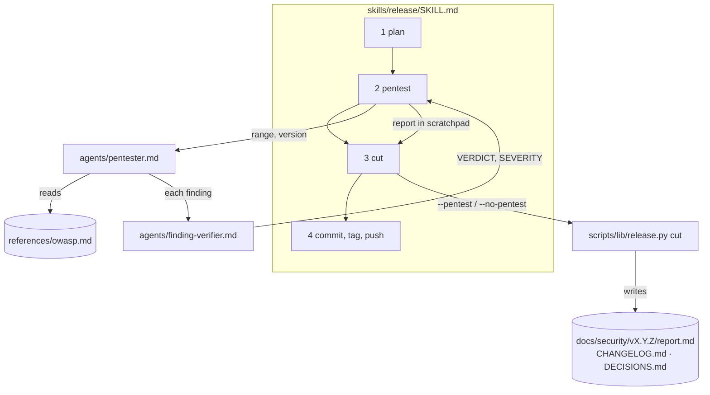
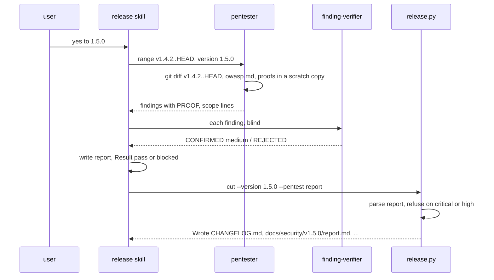

# Pentest

**Version:** v1 · **Status:** Refined · **Type:** Feature · **Project type:** CLI/Library

**Shape doc:** docs/specs/v3-release-and-hosts/shape.md — slice 5 (split: this is 5a)
**Depends on:** `owasp-lens` — the pentester reads `references/owasp.md` and its severity grid
**Page:** https://claude.ai/artifact/8ed6sqgcVTL6GzYmT3xkAS

`/release` runs a code-level pentest between the version and the cut. The pentester
proves each finding with an input it ran. Critical or high blocks the release,
medium and low go into the release notes, and the report lands in
`docs/security/vX.Y.Z/report.md`. It comes now because releases exist (slice 4) and
the OWASP reference will (slice 7a), but nothing attacks the code before users get
it.

## Problem

`/release` tags and publishes whatever passed CI (`plugins/zuko/skills/release/SKILL.md`
steps 1–4). `/review` looks at one branch diff at a time, and nobody ever looks at
the whole range going out, from the last tag to `HEAD`, as an attacker would. A
release can ship a command injection that two reviews each saw only half of. A
dependency added three branches ago is never looked at again. There is no record of
what was checked for a version, and no rule that stops a release on a proven hole.

## Slice test

| Check                         | Result                                                                                                                                          |
| ----------------------------- | ----------------------------------------------------------------------------------------------------------------------------------------------- |
| Cuts every layer it needs     | yes — a `pentester` agent, a new `/release` step, and `release.py cut` enforcing the verdict and writing the report, notes lines and skip entry |
| One e2e test walks it         | yes — `test-e2e-pentest.sh` walks plan → cut with a pass, a medium, a blocked and a skipped report; one seeded run proves the agent             |
| Worth shipping alone          | yes — every release of every zuko project gets a security pass and a record, even with no server to attack                                      |
| Fits (≤5 scenarios, ≤2 areas) | yes after the split — 5 scenarios; two areas: the release stage (`skills/release`, `scripts/lib/release.py`) and `agents/pentester.md`          |

The shape's slice 5 failed "fits". Code-level and live attacks together came to
about nine scenarios across three areas: the agent, the release stage, and a target
guard. It is split by variation:

- **5a · `pentest`** (this spec): code-level, for every project.
- **5b · `pentest-live`** (`docs/specs/pentest-live.md`): attacks a running server
  on localhost or a named staging URL. It depends on this spec.

**Path:** full — a new agent, a new release step, and a changed `cut` contract.

## User story

As someone releasing a zuko project, I want the code going out attacked before users
get it, so a proven hole stops the release and everything else is on the record.

## Flow



After the user says yes to a version, the pentester attacks the range and every
finding is re-judged blind. `cut` then refuses on a confirmed critical or high, and
otherwise writes the report and the notes lines. A pentest that cannot run blocks
the release unless the user types a reason, which gets recorded.

## States

```mermaid
stateDiagram-v2
    [*] --> Planned: yes to version
    Planned --> Tested: pentester report
    Planned --> Skipped: reason typed
    Tested --> Blocked: critical or high confirmed
    Tested --> Cut: none confirmed
    Skipped --> Cut: D-entry and notes line written
    Blocked --> [*]: nothing written; fix, then /release again
    Cut --> [*]: commit, tag, push, release as today
```



## Acceptance criteria

```gherkin
Scenario: a clean pentest goes into the release commit
  Given invoice-cli on main tagged v1.4.2, with 9 commits since, and the user says
    yes to 1.5.0
  When the pentester finds nothing the verifier confirms
  Then docs/security/v1.5.0/report.md reads "**Result:** pass", names the range
    "v1.4.2..a1b2c3d (9 commits)", and lists each category it assessed and each it
    did not, with a reason
  And the report never calls the code secure
  And the commit "chore(release): v1.5.0" carries the report
  And the release notes have no Security section

Scenario: medium and low findings ship, on the record
  Given the pentester proves order in exporters/ledger.py is injectable and the
    verifier confirms it at medium
  And uv.lock gained requests-toolbelt 0.10.1 in the range, confirmed at low
  When the release is cut
  Then [1.5.0] ends with a "### Security" section holding
    "- Known medium issue: A05:2025 Injection in exporters/ledger.py; see
    docs/security/v1.5.0/report.md." and a matching low line for uv.lock
  And the GitHub release notes carry the same lines, with no proving input in them
  And docs/security/v1.5.0/report.md describes both findings with no proving input;
    the proving input for each printed in the terminal only

Scenario: a proven critical or high blocks the release
  Given importers/bank.py runs subprocess.run("gpg --decrypt " + row["attachment"],
    shell=True) on rows from a bank CSV the user imports
  And the pentester runs it on a CSV row with attachment "x.gpg; touch pwned" and
    the file pwned appears
  When the verifier confirms it at high
  Then /release stops before the cut with "Pentest blocked v1.5.0: 1 high"
  And prints the finding as a ledger row: severity, category, importers/bank.py:22,
    and "/debug next"
  And CHANGELOG.md, the manifests and the repo are unchanged, and no tag exists

Scenario: a pentest that cannot run blocks, unless the user types a reason
  Given the pentester stops with no report, or a report cut cannot read
  When /release reaches the cut
  Then it stops and asks for a reason to release without a pentest
  And an empty answer, or "skip", stops it with nothing written
  And the reason "rounding hotfix for 3,000 invoices due 2026-10-02; pentester timed
    out twice" writes a D-entry "Release v1.5.1 ships without a pentest" to
    DECISIONS.md, the line "- Released without pentest: rounding hotfix for 3,000
    invoices due 2026-10-02; pentester timed out twice." under Security, and a
    report reading "**Result:** skipped"

Scenario: the range decides what is attacked
  Given commits since v1.4.2 add a CLI subcommand, a lockfile change and a skill
    that reads .github/pull_request_template.md
  When the pentester runs
  Then it checks command and shell injection, path traversal, unsafe file writes,
    secrets, the dependencies the range added (A03), and untrusted text that can
    make a skill run a tool (A05, per D6)
  And a dependency already in uv.lock at v1.4.2 is not reported
  And a repo with no tags yet is assessed as its whole tracked tree
  And the pentester makes no network request
```

## Scope

**In:**

- `agents/pentester.md`: code-level attack of the release range, category by
  category from `references/owasp.md`. Every finding carries a `PROOF`: the input,
  what was run, and the output observed. It runs proofs in a scratch copy, with no
  network. The report lists categories not assessed, and never says "secure".
- The committed report never carries a proving input. Unfixed medium and low
  findings get severity, category, file and a description; each `PROOF` prints in
  the terminal only (O4).
- Every finding goes through the blind `finding-verifier`, as in `/review` (7a).
  Severity comes from the grid in `owasp.md`; the verifier may lower it, never
  raise it.
- `/release` step 2 · Pentest, between Plan and Cut. The one yes still covers the
  release. A blocked or failed pentest ends it, and a skip asks for a reason.
- `release.py cut` requires exactly one of `--pentest <report>` or
  `--no-pentest <reason>`. It refuses a report with a confirmed critical or high,
  or one it cannot read, and writes nothing. It writes
  `docs/security/vX.Y.Z/report.md`, the Security lines, and, on a skip, the
  D-entry.
- A resumed release (tag at HEAD) skips the pentest: the report is already in the
  release commit.

**Out:**

- Live attacks on a running server or a staging URL, the target guard, and A01/A07
  checks that need a session — slice 5b, `pentest-live`.
- Fixing findings — `/debug`, then `/release` again.
- Re-running the pentest on a resume — not needed; the cut commit already holds its
  report.
- Deleted-guard history and silent-failure checks — slice 7b; the pentester picks
  them up through `owasp.md` when 7b lands.

## Interface

### The `/release` step

```
Release gates
  ...
Release 1.5.0? Say yes, or give another version.
> yes

Pentest    code-level · v1.4.2..a1b2c3d (9 commits) · 7 categories
           A05 Injection        1 medium
           A03 Supply Chain     1 low
           not assessed: A01, A07, A02 — no running server (slice 5b)
Pentest passed v1.5.0: 0 critical, 0 high, 1 medium, 1 low
```

Blocked:

```
Pentest blocked v1.5.0: 1 high
  | P1 | high | A05:2025 Injection | importers/bank.py:22 import_rows | Open | /debug next |
Nothing written. Fix it, then run /release again.
```

Cannot run:

```
Pentest did not finish: no report from the pentester.
Release without a pentest? Type the reason; it goes into DECISIONS.md and the
release notes. Anything else stops here.
```

### Pentester finding format

The 7a reviewer format plus `PROOF`, which the verifier sees. `PROOF` is observed
evidence, not reasoning (the `verifiers-cannot-run-code` lesson):

```
CLAIM: import_rows passes a CSV field to a shell.
CATEGORY: A05:2025 Injection
SEVERITY: high
FILE: importers/bank.py:22
SYMBOL: import_rows
SNIPPET: subprocess.run("gpg --decrypt " + row["attachment"], shell=True)
PROOF: ran import_rows on a CSV row with attachment "x.gpg; touch pwned" in a
  scratch copy; afterwards `ls pwned` printed "pwned".
```

### The report — `docs/security/v1.5.0/report.md`

```text
# Pentest v1.5.0

**Result:** pass
**Mode:** code-level
**Range:** v1.4.2..a1b2c3d (9 commits)
**Date:** 2026-10-02

## Findings

| ID | Severity | Category                              | Where                               | Description                                          |
| P1 | medium   | A05:2025 Injection                    | exporters/ledger.py:31 export_ledger | order reaches ORDER BY unchecked                     |
| P2 | low      | A03:2025 Software Supply Chain Failures | uv.lock                           | requests-toolbelt 0.10.1 added in the range          |

## Assessed

- A03:2025 Software Supply Chain Failures — uv.lock: 1 dependency added
- A05:2025 Injection — 4 subprocess calls, 2 SQL strings, 1 skill reading a PR template
- ...

## Not assessed

- A01:2025 Broken Access Control — needs a running server (slice 5b)
- ...
```

`**Result:**` is `pass`, `blocked` or `skipped`. A skipped report has
`**Reason:**` in place of the Findings and Assessed sections. The table's columns
and the `**Result:**` line are the contract `cut` reads. The table has no Proof
column: the skill prints each finding's `PROOF` to the terminal after the table
and never writes it to the report (O4).

### `release.py cut`

```
release.py cut <project-dir> --version X.Y.Z --date YYYY-MM-DD --pentest <report>
release.py cut <project-dir> --version X.Y.Z --date YYYY-MM-DD --no-pentest "<reason>"
```

| Case                                                           | Output                                                                                    | Exit |
| -------------------------------------------------------------- | ----------------------------------------------------------------------------------------- | ---- |
| neither flag, or both                                          | usage                                                                                     | 2    |
| report missing, or no `**Result:**` line, no Findings table, or a pass with no `**Range:**`, Assessed or Not assessed list | `Pentest report unreadable: <what>` · `Nothing written.`                                  | 1    |
| a Proof column in the Findings table | `Pentest report carries proving inputs — the report is public; print them instead (O4)` · `Nothing written.` | 1 |
| report version is not X.Y.Z                                    | `Pentest report is for v1.4.9, not v1.5.0` · `Nothing written.`                           | 1    |
| a critical or high row                                         | `Pentest blocked v1.5.0: 1 high`, then each row · `Nothing written.`                      | 1    |
| empty reason, or `skip`                                        | `A skip needs a reason` · `Nothing written.`                                              | 1    |
| no `DECISIONS.md`, on a skip                                   | `DECISIONS.md missing — /ship creates it` · `Nothing written.`                            | 1    |
| otherwise                                                      | today's `Wrote` list plus `docs/security/v1.5.0/report.md` and, on a skip, `DECISIONS.md` | 0    |

The notes line for a finding names its severity, category and file, never the
proof. `Wrote` lists every file, so the skill's commit step (`SKILL.md` step 3)
still commits exactly what cut changed.

## Technical plan

### Approach

The pentester is a new agent that reads `references/owasp.md` (7a) and attacks the
release range. The skill passes its report to `release.py cut`. That makes the
verdict something a script enforces: `cut` refuses without a report or a typed
reason, so no prompt can skip the pentest. `cut` already re-checks every gate and
writes nothing on failure (`release.py:798`), and the pentest rules join that
path. The report sits in the session scratchpad until `cut` copies it in. That
keeps the tree clean for `tree_gate` (`release.py:146`), which `cut` re-runs.

Relies on: D1 (release commits go to main, so the report rides the release commit),
D2, D5, D6 and D9 (from 7a), D10, D11, D12



The skill runs plan, then the pentester, whose findings the verifier re-judges.
The skill writes the confirmed report to the scratchpad and hands it to `cut`,
which decides and writes.



### Changes

| File                                                      | What changes                                                                                                                                                                                                                                                                                                                                                                                                                                                                                                                                                                                                                                                                                                                                           | Why               |
| --------------------------------------------------------- | ------------------------------------------------------------------------------------------------------------------------------------------------------------------------------------------------------------------------------------------------------------------------------------------------------------------------------------------------------------------------------------------------------------------------------------------------------------------------------------------------------------------------------------------------------------------------------------------------------------------------------------------------------------------------------------------------------------------------------------------------------ | ----------------- |
| `plugins/zuko/agents/pentester.md` (new)                  | Tools `Read, Grep, Glob, Bash`, model opus. Its input is the range and the version. It reads `${CLAUDE_PLUGIN_ROOT}/references/owasp.md` (substituted in agent content; owasp-lens O6) and runs the Context first step over the whole range. It walks each category the range can touch, and adds these code-level checks: shell and command injection, path traversal, unsafe file writes, secrets, dependencies added in the range, and untrusted text that can steer a tool call (D6). Proofs run in a copy under `mktemp -d`, with no network command at all. It returns the 7a `SCOPE` block and findings with `PROOF`. Rule: report only what a run proved; never write "secure"                                                                 | scenarios 1, 3, 5 |
| `plugins/zuko/skills/release/SKILL.md`                    | A new step 2 · Pentest, placed after the yes and before Cut, so the producer comes before the consumer (the `producer-steps-run-before-consumers` lesson). It dispatches the pentester, then one `finding-verifier` per finding (7a's input), and writes the report in the Interface format to the scratchpad. The report's Findings table takes a one-line Description per finding and never the `PROOF`, which the skill prints to the terminal instead (O4). A pentester that returns nothing, or fails, leads to the reason question. Steps 3–7 renumber. Step 3 passes `--pentest` or `--no-pentest`. "One yes covers steps 2 to 6" becomes "2 to 7". The resume rows skip step 2. `allowed-tools` gains the read-only git commands its subagents run under `-p` (O19), and a hook fences the pentester's Bash (O11, O15) | scenarios 1–4     |
| `plugins/zuko/scripts/lib/release.py:798` `cut`           | Takes the two new options. `pentest_gate(project, version, report, reason)` runs after the existing gates and before the `locked` check (`:809`). It parses `**Result:**`, `**Range:**`, the version heading and the Findings rows. It refuses on a critical or high row, a Proof column (O4), a malformed report, a wrong version, or an empty or `skip` reason. `rewritten` (`:702`) gains the report file and, on a skip, the D-entry                                                                                                                                                                                                                                                                                                                                    | scenarios 1–4     |
| `plugins/zuko/scripts/lib/release.py:661` `cut_changelog` | Takes the Security lines. They go at the end of the new version's section, under `### Security`, which is added last when it is missing (Keep a Changelog order, `references/changelog.md:37`)                                                                                                                                                                                                                                                                                                                                                                                                                                                                                                                                                         | scenario 2, 4     |
| `plugins/zuko/scripts/lib/release.py:849` `main`          | Parses `--pentest` or `--no-pentest` on `cut`, requiring exactly one                                                                                                                                                                                                                                                                                                                                                                                                                                                                                                                                                                                                                                                                                   | Interface         |
| `plugins/zuko/scripts/lib/release.py` (new `skip_entry`)  | `decisions.parse` (loaded with `load("decisions")`, `release.py:53`) gives the next number. The entry is `## D<n> · <date> · Release vX.Y.Z ships without a pentest`, with `Why: <reason>`, `Rejected: running the pentest before vX.Y.Z (<reason>)`, `Source: docs/security/vX.Y.Z/report.md`, and `Status: active`. It is appended, so `decisions.py check` stays green                                                                                                                                                                                                                                                                                                                                                                              | scenario 4        |
| `plugins/zuko/references/changelog.md:49`                 | Adds the Security line shapes for a known issue and for a skip                                                                                                                                                                                                                                                                                                                                                                                                                                                                                                                                                                                                                                                                                         | scenario 2, 4     |
| `plugins/zuko/scripts/tests/test-release.sh`              | Cut cases from the Interface table                                                                                                                                                                                                                                                                                                                                                                                                                                                                                                                                                                                                                                                                                                                     | scenarios 2–4     |
| `plugins/zuko/scripts/tests/test-e2e-release.sh`          | Its `cut` call passes the pass report, and it checks that the report is written (O9) | Interface |
| `plugins/zuko/scripts/tests/test-e2e-pentest.sh` (new)    | The e2e, below                                                                                                                                                                                                                                                                                                                                                                                                                                                                                                                                                                                                                                                                                                                                         | all               |
| `plugins/zuko/scripts/tests/fixtures/pentest/` (new)      | `pass.md`, `medium.md`, `blocked.md`, `malformed.md`, plus a seeded invoice-cli (`base/`, `range.patch`) for the agent run                                                                                                                                                                                                                                                                                                                                                                                                                                                                                                                                                                                                                             | all               |

Reusing: the `Gates` report and "Nothing written." refusal path (`release.py:86`,
`:798`); `cut_changelog`'s section handling (`release.py:641`); `decisions.parse`;
7a's finding format, verifier flow and severity grid; the fake `gh` and bare origin
from `test-e2e-release.sh`; the headless run proven by owasp-lens O7.

### Earn-it

| Added                                 | Triggered by                                                                                                             |
| ------------------------------------- | ------------------------------------------------------------------------------------------------------------------------ |
| `agents/pentester.md`                 | every scenario: the reviewer judges one branch diff and never runs a proof, and the shape asks for a separate agent (O2) |
| `--pentest` / `--no-pentest` on `cut` | scenarios 3 and 4: blocking and skipping have to hold even when a prompt drifts (D10)                                     |
| `skip_entry`                          | scenario 4: the shape's O5 requires a skip to go to DECISIONS.md                                                         |
| `docs/security/vX.Y.Z/`               | scenario 1: the record of what was checked for a version                                                                 |

Cut: a `release.py pentest` subcommand (the skill could skip a separate command;
`cut` cannot be skipped), a pentest config file, and a report schema file (the
Interface section is the contract, and the tests pin it).

### Non-functionals

|                      |                                                                                                                                                                                                                                                                                                                           |
| -------------------- | ------------------------------------------------------------------------------------------------------------------------------------------------------------------------------------------------------------------------------------------------------------------------------------------------------------------------- |
| **Load**             | One pentest per release; zuko projects release a few times a month. One agent run over the range, plus one verifier per finding                                                                                                                                                                                           |
| **Breaks first**     | A large range, such as a first release on a whole tree of thousands of files, exhausts the agent's turns. The context step narrows it to the touched categories, and a truncated run produces no report, which blocks (scenario 4) and never passes silently                                                              |
| **Security surface** | The pentester runs code from the repo under test with `Bash`: the same trust as running its test suite, which `plan` already does (`release.py:236`). It runs no network command (a prompt rule; the guard arrives with 5b). The report is committed but carries no proving input (O4); proofs print in the terminal only |
| **Proof it works**   | The next zuko release commit carries `docs/security/v3.1.0/report.md`, and `/release` prints `Pentest passed v3.1.0: …`                                                                                                                                                                                                   |
| **Rollout**          | No flag: zuko ships by version (as in every earlier slice). Rollback is `git revert` of the slice, then `/release` a patch; `cut` without the new flags then works as before                                                                                                                                              |

### Test plan

| Scenario        | Test                                                                                                                                                                                                                                            | Command                                              |
| --------------- | ----------------------------------------------------------------------------------------------------------------------------------------------------------------------------------------------------------------------------------------------- | ---------------------------------------------------- |
| 1               | `test-e2e-pentest.sh`: cut with `pass.md` writes `docs/security/v1.5.0/report.md` and adds no Security section                                                                                                                                  | `bash plugins/zuko/scripts/tests/run.sh e2e-pentest` |
| 2               | same: `medium.md` gives two Security lines in `[1.5.0]` and in `release.py notes`, with no proof text; the committed report has a Description column and no Proof column, and a report fixture carrying a Proof column is refused as unreadable | same                                                 |
| 3               | same: `blocked.md` exits 1, prints the row, and `git status --short` is empty                                                                                                                                                                   | same                                                 |
| 4               | `test-release.sh`: malformed report, wrong version, both flags, empty reason, `skip`, no DECISIONS.md; a valid skip appends D4 to a fixture holding D1–D3, and `decisions.py check` passes                                                      | `bash plugins/zuko/scripts/tests/run.sh release`     |
| 1, 3, 5 (agent) | the seeded run below                                                                                                                                                                                                                            | recorded in this spec                                |

**E2E:** `test-e2e-pentest.sh`. One scratch invoice-cli with a bare origin and the
fake `gh` from `test-e2e-release.sh` walks plan, then `cut --pentest medium.md`,
then commit, tag, push and `gh release create`. The notes file must hold the two
Security lines, and the release commit must carry the report. It then tries
`cut --pentest blocked.md` on a second version and expects nothing written.

**Seeded run:** in a scratch copy of `fixtures/pentest/base/` plus `range.patch`,
tagged v1.4.2:

```
claude -p "Dispatch the zuko:pentester agent on range v1.4.2..HEAD for version 1.5.0 and print its output verbatim" \
  --plugin-dir <repo>/plugins/zuko --add-dir <repo>/plugins/zuko --output-format stream-json --verbose
```

This machine also needs the `--settings` override that owasp-lens O7 found. The
run passes when the output has the bank-import A05 finding with a `PROOF` whose
output shows `pwned`, the A03 lockfile finding, no finding on the pre-range
dependency, and no network command. `/build` records the output here.

### Seeded run

Recorded by `/build` on 2026-09-27. Both runs used the command above, with
`--allowedTools Bash` (O11) and the settings override, on a scratch copy of
`fixtures/pentest/base/` tagged v1.4.2 plus `range.patch`.

| Check | Run 1 | Run 2 |
| --- | --- | --- |
| A05 bank import, `PROOF` shows `pwned` | pass: high, `invoice_cli/importers/bank.py:12` | pass: high, `pwned` created inside the scratch copy |
| A03 lockfile finding | pass: low, requests-toolbelt 0.10.1 | pass: low |
| No finding on python-dateutil, already there at v1.4.2 | pass | pass |
| No network command | pass: 0 of 6 Bash calls | pass: 0 of 6 Bash calls |
| Nothing written outside the scratch copy | **fail**: the product's own `gpg` created `~/.gnupg` | pass: proofs set `HOME` inside the copy, and the agent put a stub `gpg` first on `PATH` |
| Never calls the code secure | pass | pass |

Run 1's leak was fixed in `pentester.md` (commit 18d0bd6): every proof runs
with `HOME`, `XDG_CONFIG_HOME`, `XDG_CACHE_HOME` and `TMPDIR` inside the scratch
copy, and the contract test checks for it. Run 1 left an empty `~/.gnupg`
holding `common.conf` on the build machine; it was not removed.

### Chunks

| Chunk | Scenarios | Files owned                                                                                             |
| ----- | --------- | ------------------------------------------------------------------------------------------------------- |
| A     | all       | `scripts/tests/test-e2e-pentest.sh`, `scripts/tests/fixtures/pentest/`, `scripts/tests/test-release.sh` |
| B     | 1–4       | `scripts/lib/release.py`, `references/changelog.md`                                                     |
| C     | 1, 3, 5   | `agents/pentester.md`, `skills/release/SKILL.md`                                                        |

A lands first and red (the `harness-before-the-chunks-it-proves` lesson). B and C
run in parallel from A's commit; the contract between them is the Interface
section. The seeded run goes after all three merge, and after 7a is built:
`owasp.md` must exist.

### Risks

| Risk                                                                   | Mitigation                                                                                                                                                           |
| ---------------------------------------------------------------------- | -------------------------------------------------------------------------------------------------------------------------------------------------------------------- |
| 7a is not built, so `owasp.md` is missing                              | `/build` of this spec refuses to start before `owasp-lens` is Built. The seeded run cannot pass without it                                                           |
| The pentester runs a proof that damages the machine (an injected `rm`) | Proofs run in a `mktemp -d` copy, and the proving payload must be harmless and observable, such as `touch pwned`. That is a prompt rule, so the seeded run checks it |
| A report that looks clean because the agent ran out of turns           | No report, or no `**Result:**`, means unreadable, which blocks. A pass needs the Assessed and Not assessed lists                                                     |
| Unfixed medium and low proofs become public in the committed report | Resolved by O4: the report has no Proof column, `cut` refuses one that does, and proofs print in the terminal only |
| The pentester makes a network call despite the rule                    | Named in the seeded run's pass condition. 5b adds a guard hook                                                                                                       |

### Decisions to record

Recorded as D10, D11, D12, D13.

## Open items

| ID  | What                                                                                                                                                                                                                   | Type       | Raised at | Owner  | Status   | Answer                                                                                                                       |
| --- | ---------------------------------------------------------------------------------------------------------------------------------------------------------------------------------------------------------------------- | ---------- | --------- | ------ | -------- | ---------------------------------------------------------------------------------------------------------------------------- |
| O1  | Slice 5 over the size rule                                                                                                                                                                                             | flag       | spec p1   | claude | Resolved | Split by variation: 5a code-level (this spec), 5b `pentest-live`. Done autonomously 2026-09-25; the user can merge them back |
| O2  | Assuming the pentest runs after the version yes and before the cut, under the same one yes (default chosen autonomously; alternative: a second confirmation before the pentest)                                        | assumption | spec p1   | user   | Resolved | Default accepted by the user, 2026-09-25                                                                                     |
| O3  | Assuming a blocked pentest writes nothing to the repo, and its critical and high findings print as ledger rows for `/debug` (default chosen autonomously; alternative: commit the blocked report to `docs/security/`)  | assumption | spec p1   | user   | Resolved | Default accepted by the user, 2026-09-25                                                                                     |
| O4  | The committed report carries proving inputs for unfixed medium and low findings, which are public on a public repo (default chosen autonomously: keep them; alternative: redact the Proof column for unfixed findings) | flag       | spec p3   | user   | Resolved | Redact: the committed report shows severity, category, file and description for unfixed medium/low findings; the proving input prints in the terminal only (user, 2026-09-25) |
| O5  | Assuming a first release with no tags is pentested over the whole tracked tree (default chosen autonomously; alternative: ask for a base commit)                                                                       | assumption | spec p1   | user   | Resolved | Default accepted by the user, 2026-09-25                                                                                     |
| O6  | Assuming "no network" in code-level mode holds as a prompt rule until 5b's guard (default chosen autonomously; alternative: build the guard in this slice)                                                             | assumption | spec p3   | user   | Resolved | Default accepted by the user, 2026-09-25                                                                                     |
| O7  | Shape O4 (no server gives a code-level review with proving inputs, and critical or high blocks)                                                                                                                        | question   | shape     | user   | Resolved | Carried from the shape; this spec is that mode                                                                               |
| O8  | Shape O5 (a pentest that cannot run blocks; a skip needs a typed reason in decisions and notes)                                                                                                                        | question   | shape     | user   | Resolved | Carried from the shape; scenario 4 and D-entry format in Changes                                                             |
| O9 | Making `--pentest` or `--no-pentest` required breaks every existing `cut` call in `test-release.sh` and `test-e2e-release.sh`, and the plan did not name the second file | flag | /build | claude | Resolved | Every existing call passes a pass report for its version, landed with the harness before the gate (lesson `a-new-gate-check-breaks-every-fixture`). `test-e2e-release.sh` is added to Changes (2026-09-27) |
| O10 | A first release has no base tag, so the verifier's `git diff <BASE>...HEAD` has nothing to compare against | flag | /build | user | Accepted risk | The skill passes `BASE: none (first release: every tracked line is in the range)`, and the verifier's git calls on that fail; it still reads the code. First releases are rare and O5 already accepts whole-tree scope (2026-09-27) Accepted by the user, 2026-09-27. |
| O11 | The pentester runs the project's own code, so its Bash commands cannot be listed in the release skill's `allowed-tools` | flag | /build | user | Resolved | A hook, scripts/scope-pentester-bash.sh, fences the pentester's Bash (user, 2026-09-27). The leftover risk is code under test opening sockets or writing through pw_dir or /tmp once it runs; the user accepted it on 2026-09-27, and the release docs recommend Claude Code's sandbox for untrusted code |
| O12 | A1: the Findings parser stops at the first line not starting with `\|`, so a high after a blank line, an HTML comment or a second table, or a row with no leading pipe, is missed and cut passes | flag | /review | claude | Resolved | cut reads the whole `## Findings` section to the next `## ` heading. A line naming a severity that is not a table row, or a row without exactly 5 cells, is unreadable and blocks; tests cover a blank line, an HTML comment, a second table, a row with no leading pipe, a sixth cell and an escaped pipe (2026-09-27) |
| O13 | A2: a regular file at `docs/security` leaves CHANGELOG.md and OVERVIEW.md written, with a NotADirectoryError traceback | flag | /review | claude | Resolved | The check before any write treats a file where a folder should be as unwritable, so cut prints `Cannot write docs/security/v1.5.0/report.md.` and writes nothing; tested (2026-09-27) |
| O14 | A3: a bare `**Result:** pass` report with no Range and no Assessed or Not assessed list passes | flag | /review | claude | Resolved | A pass report needs a `**Range:**` line and at least one item under both `## Assessed` and `## Not assessed`; otherwise cut refuses it as unreadable and names what is missing; tested (2026-09-27) |
| O15 | P1: prompt rules alone let the pentester run `git push`, `git tag`, `curl` and writes outside its copy | flag | /review | claude | Open | — |
| O16 | P1a: a stray tag at HEAD makes plan resume, so a planted `git tag` skips the pentest and the cut | flag | /review | claude | Open | — |
| O17 | P2: `$work` does not persist between Bash calls, and cwd resets to the repo, so later proof steps run in the real repo | flag | /review | claude | Open | — |
| O18 | P3 and P4: an env prefix covers only the first pipeline stage, and nothing checks after a proof that the repo and home are unchanged | flag | /review | claude | Open | — |
| O19 | P5: the release skill's `allowed-tools` does not cover the read-only git commands its subagents run under `-p` | flag | /review | claude | Open | — |

_Never delete this section or its rows. See references/ledger.md._

## Glossary

- **Pentest** — penetration test: attacking your own code on purpose to find holes
  before someone else does.
- **Proving input** — the exact input that shows the hole is real, run and observed,
  not argued.
- **Release range** — the commits from the last tag to `HEAD`: everything the
  release ships that the last one did not.
- **Blind verifier** — a second agent that re-judges a finding without seeing why the
  first agent thought it was a bug.
