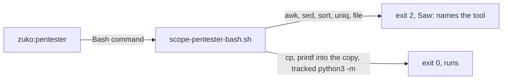
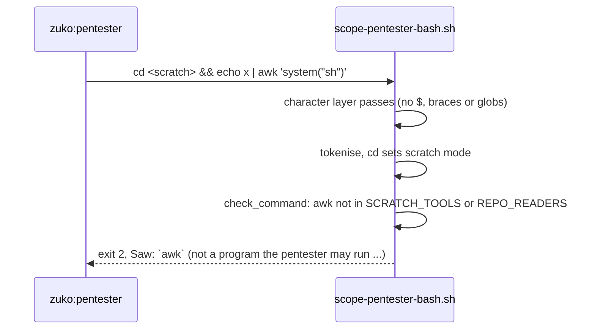

# Pentester fence awk

**Version:** v1 · **Status:** Shipped · **Type:** Bug · **Project type:** CLI/Library

**Depends on:** None

The pentester fence stops allowing five tools whose arguments can be a program
or an output file: `awk`, `sed`, `sort`, `uniq` and `file`. Found by the v2.2.0
pentest (P1, awk); the other four turned up while proving it.

## Problem

`scope-pentester-bash.sh` holds zuko's pentester to read-only git in the repo
and to commands inside its scratch copy (D14). It already blocks a shell and an
interpreter's inline-code flag such as `python3 -c`, because code given on the
command line runs things the fence never sees. Five allowed tools take code or
an output file as an argument, so they reopen that hole. Each row below was run
against the hook on 2026-10-06; the "writes" column was also run against the
real tool on this Mac.

| Command fed to the hook (as `zuko:pentester`)                     | Hook exit | What the tool does                           |
| ----------------------------------------------------------------- | --------- | -------------------------------------------- |
| `cd <scratch> && echo x \| awk 'system("sh")'`                    | 0         | runs a shell                                 |
| `cd <scratch> && echo x \| awk 'print > "/Users/dev/out.txt"'`    | 0         | writes outside the copy                      |
| `cd <scratch> && echo x \| awk 'print \| "cat"'`                  | 0         | runs a program                               |
| `cd <scratch> && echo x \| sed -n 'w /Users/dev/out.txt'`         | 0         | writes outside the copy                      |
| `sort -o README.md CHANGELOG.md` (in the real repo)               | 0         | overwrites a file in the real repo           |
| `sort --compress-program=sh -S 1 CHANGELOG.md` (in the real repo) | 0         | runs a program (`man sort`, 2.3-Apple)       |
| `uniq CHANGELOG.md README.md` (in the real repo)                  | 0         | overwrites `README.md` (proved on a copy)    |
| `file -C -m CHANGELOG.md` (in the real repo)                      | 0         | writes `CHANGELOG.md.mgc` (proved on a copy) |

`awk 'system("curl http://evil.example")'` is blocked today, but only by
accident: the hook reads `//evil.example")` as an absolute path. GNU `sed` also
has an `e` command that runs a shell command; macOS `sed` lacks it, Linux has it.

```
pentester ── Bash ──► scope-pentester-bash.sh ── awk in SCRATCH_TOOLS ──► exit 0
                                                                           │
                                       awk runs system("sh") ◄─────────────┘
```

## Slice test

| Check                         | Result                                                                              |
| ----------------------------- | ----------------------------------------------------------------------------------- |
| Cuts every layer it needs     | yes — the one hook script and its test                                              |
| One e2e test walks it         | yes — `test-scope-pentester-bash.sh` feeds each command to the real hook            |
| Worth shipping alone          | yes — the pentester can no longer run a shell or write the repo through these tools |
| Fits (≤5 scenarios, ≤2 areas) | yes — 4 scenarios, 1 area (hook and gate scripts)                                   |

**Path:** light — a bug fix in one script plus its test, with no new
interface, data or dependency. Pauses 1 and 3 merged, pause 2 skipped.

## Flow



A command naming one of the five tools blocks and says which tool; every proof
step the pentester used before still runs.

## Acceptance criteria

```gherkin
Scenario: awk runs nothing
  Given the pentester has cd'd into its scratch copy /tmp/tmp.Qm81Zx0aPl
  When it runs echo x | awk 'system("sh")'
  Or it runs awk -f prog.awk stmt.csv
  Then the hook exits 2 and the Saw: line names awk

Scenario: sed writes nothing
  Given the pentester is in /tmp/tmp.Qm81Zx0aPl
  When it runs sed -n 'w /Users/dev/out.txt' stmt.csv
  Then the hook exits 2 and the Saw: line names sed

Scenario: sort, uniq and file write nothing in the real repo
  Given the pentester is in the real repo /Users/dev/code/invoice-cli
  When it runs sort -o README.md CHANGELOG.md
  Or it runs uniq CHANGELOG.md README.md
  Or it runs file -C -m CHANGELOG.md
  Then the hook exits 2 and the Saw: line names the tool
  And the same three commands inside /tmp/tmp.Qm81Zx0aPl also exit 2

Scenario: a proof still runs
  Given the pentester's existing proof steps: git archive HEAD | tar -x -C <scratch>,
    printf ... > <scratch>/stmt.csv, cp, mkdir, and python3 -m invoice_cli.cli
  When each is fed to the hook
  Then each exits 0, as before
```

## Scope

**In:** removing `awk` and `sed` from `SCRATCH_TOOLS`, and `sort`, `uniq` and
`file` from `REPO_READERS` (which also removes them from the scratch copy); the
tests that prove it.

**Out:**

- Tracked code that opens a socket or writes outside the copy once it runs —
  accepted in D14 and pentest O11; the fence stops commands, not code.
- P3 and P4 (a payload the JSON parser rejected let the call through in `block-dangerous.sh` and
  `secret-scan.sh`) — already fixed by release-commit-guard (D31).
- The other read-only tools (`cat`, `grep`, `head`, `tail`, `diff`, `cmp`,
  `stat`, `date`, `cut`, `tr`, `wc` and the rest) — swept on 2026-10-06; none
  takes an output file or a program on macOS.

## Technical plan

### Approach

Take the five names out of the two allow-lists. The hook's existing catch-alls
then block them with a message naming the tool: `` `sort` in the repo ``
(`scope-pentester-bash.sh:348`) and `` `awk` (not a program the pentester may
run in the scratch copy) `` (`:377`). No new check, no option parsing.

Relies on: D14 (the fence stops commands, not code), and D32 drafted below.



### Changes

| File                                                      | What changes                                                                                                        | Why            |
| --------------------------------------------------------- | ------------------------------------------------------------------------------------------------------------------- | -------------- |
| `plugins/zuko/scripts/scope-pentester-bash.sh:216`        | drop `sort`, `uniq` and `file` from `REPO_READERS`; a comment says why they are absent                              | scenario 3     |
| `plugins/zuko/scripts/scope-pentester-bash.sh:232`        | drop `sed` and `awk` from `SCRATCH_TOOLS`; the comment no longer calls them read-only and says why they are absent  | scenarios 1, 2 |
| `plugins/zuko/scripts/tests/test-scope-pentester-bash.sh` | a `# --- P1: tools whose arguments are code or an output file ---` block with the `blocks` lines from scenarios 1–3 | scenarios 1–3  |

Reusing: the test file's `blocks` and `allows` helpers; the existing `allows`
lines already cover scenario 4.

### Non-functionals

|                      |                                                                                                       |
| -------------------- | ----------------------------------------------------------------------------------------------------- |
| **Load**             | unchanged; one set lookup per command                                                                 |
| **Breaks first**     | a pentest proof that used one of the five tools now blocks; the pentester's prompt names none of them |
| **Security surface** | closes pentest P1: the pentester can no longer run a shell or write the real repo through these tools |
| **Proof it works**   | `bash plugins/zuko/scripts/tests/run.sh scope-pentester-bash` passes, with the new blocks lines       |
| **Rollout**          | no flag: a hook script. Rollback is `git revert` of the fix commit                                    |

### Test plan

| Scenario               | Test                                                 | Command                                                       |
| ---------------------- | ---------------------------------------------------- | ------------------------------------------------------------- |
| 1–3, each tool blocks  | new `blocks` lines in `test-scope-pentester-bash.sh` | `bash plugins/zuko/scripts/tests/run.sh scope-pentester-bash` |
| 4, a proof still runs  | the existing `allows` lines in the same file         | same                                                          |
| nothing else regressed | the whole suite                                      | `bash plugins/zuko/scripts/tests/run.sh`                      |

**E2E:** `bash plugins/zuko/scripts/tests/run.sh scope-pentester-bash` — it
pipes each command as a real hook payload into the real script. The new
`blocks` lines are written first and must fail against today's hook (exit 0)
before the lists change.

### Chunks

Single chunk.

### Risks

| Risk                                                       | Mitigation                                                                                        |
| ---------------------------------------------------------- | ------------------------------------------------------------------------------------------------- |
| Another allowed tool takes code or an output file on Linux | the sweep covered macOS; GNU `tail`, `head`, `grep`, `diff` take no program or output file either |
| The pentester loses a step it relied on                    | `pentester.md` names none of the five; `cp`, `printf` into the copy and `python3 -m` remain       |

### Decisions to record

Recorded as D32.

## Open items

| ID  | What                                                                                  | Type     | Raised at | Owner | Status   | Answer                                                                                    |
| --- | ------------------------------------------------------------------------------------- | -------- | --------- | ----- | -------- | ----------------------------------------------------------------------------------------- |
| O1  | sed has the same hole as awk (`w` writes anywhere, GNU `e` runs a command): fix both? | question | spec p1   | user  | Resolved | Yes, awk and sed both leave the fence (2026-10-06)                                        |
| O2  | `sort -o` and `--compress-program` pass in the real repo: fold in, or its own slice?  | question | spec p1   | user  | Resolved | Fold in, drop sort (2026-10-06)                                                           |
| O3  | `uniq in out` and `file -C` also write, found by the sweep after O2                   | flag     | spec p1   | user  | Resolved | Dropped with sort, the same rule as O2's answer; named at the approval pause (2026-10-06) |

_Never delete this section or its rows. See references/ledger.md._

## Glossary

- **e2e** — end-to-end: one test that walks the whole slice as a user would
- **Pentest** — the security test `/release` runs on the code it ships; its
  findings are numbered P1, P2, …
