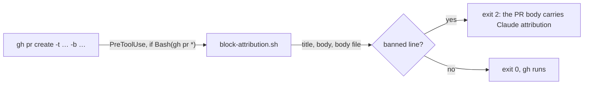
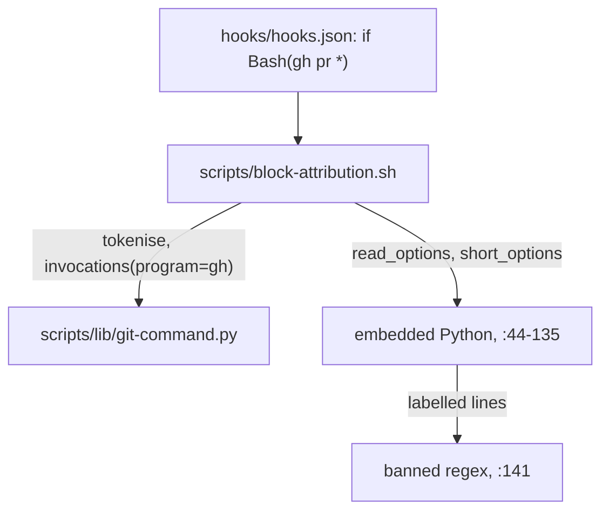
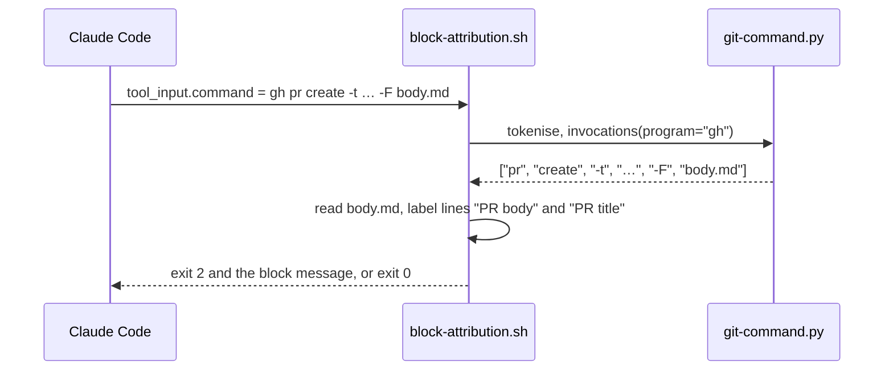

# PR attribution

**Version:** v1 · **Status:** Shipped · **Type:** Enhancement · **Project type:** CLI/Library

**Shape doc:** docs/specs/v3-release-and-hosts/shape.md — slice 8, part 3 of 9
**Depends on:** None
**Page:** https://claude.ai/artifact/5e7QMLTaHEKMdAijQ1W6JC

The attribution hook blocks a `gh pr create` whose body or title signs Claude's name,
as it already does for commits, tags and releases. Now, because the harness injects
a PR attribution line by default, and `/ship` opens every PR through `gh`.

## Problem

`references/git-naming.md:23` bans Claude attribution in "every commit message, PR
body, tag message and release notes". The hook enforces three of the four:
`hooks.json` routes only `git commit`, `git tag` and `gh release` to
`block-attribution.sh`, and the script reads only `commit`, `tag` and
`release create` (`block-attribution.sh:120`–`:135`). A PR body goes out unchecked.
Claude Code's harness adds a "Generated with Claude Code" line to PR bodies unless
`attribution.pr` is set to empty, so the gap is hit by default. `verify-ship-gates.sh`
checks the branch's commits, not the PR body, so nothing catches it before the PR
is public.

## Slice test

| Check                         | Result                                                                                                                  |
| ----------------------------- | ----------------------------------------------------------------------------------------------------------------------- |
| Cuts every layer it needs     | yes — the hook's parser, its message, the `hooks.json` route, and the ban text in `git-naming.md`                       |
| One e2e test walks it         | yes — `test-block-attribution.sh` feeds real hook payloads through the script, and its routing check reads `hooks.json` |
| Worth shipping alone          | yes — a signed PR is blocked before it is public                                                                        |
| Fits (≤5 scenarios, ≤2 areas) | yes — 4 scenarios; two areas: `scripts/` (hook, test) and `hooks/` + `references/`                                      |

**Path:** full — a new guarded command surface. Part 3 of slice 8's split; the full
split is in `mermaid-placeholder.md`.

## User story

As someone who ships with zuko, I want a PR that carries Claude attribution stopped
before it opens, so the rule in `git-naming.md` holds for PRs as it does for commits.

## Flow



`hooks.json` routes every `gh pr` call to the hook. The hook reads the title, the
body and any body file, and blocks the call when a banned line is in any of them.

## Acceptance criteria

```gherkin
Scenario: a signed PR body is blocked
  Given /ship runs gh pr create -t "feat(export): write ledger csv" -b "Adds the
    ledger exporter.

    Generated with [Claude Code](https://claude.com/claude-code)"
  When the hook sees the command
  Then it exits 2 with "Blocked: the PR body carries Claude attribution."
  And it quotes the offending line
  And it does not print the settings.json advice meant for commits

Scenario: every spelling gh accepts is read
  Given the same banned line
  When it arrives through --body "…", --body=…, -b"…", -F body.md, --body-file body.md,
    --body-file=body.md, -F=body.md, or through gh pr new, gh's alias for create
  Then each one is blocked
  And a title carrying "Co-Authored-By: Claude <noreply@anthropic.com>" through -t,
    --title or --title= is blocked as "the PR title"

Scenario: clean and unreadable PRs go through
  Given gh pr create -t "feat(export): write ledger csv" -b "Adds the ledger exporter."
  Then it exits 0 and prints nothing
  And gh pr create --fill, -F - (stdin), --web and --editor go through, since no
    body text is on the command line
  And gh pr view 41 --json body and gh pr list are never judged

Scenario: the route and the ban text agree
  Given hooks.json
  Then it routes Bash(git commit *), Bash(git tag *), Bash(gh release *) and
    Bash(gh pr *) to block-attribution.sh
  And git-naming.md names gh pr create among the commands the hook blocks
```

## Scope

**In:** `gh pr create` and `gh pr new`: `--title`/`-t`, `--body`/`-b`,
`--body-file`/`-F` in every spelling gh's parser accepts; the `hooks.json` route; the
block message; the sentence in `git-naming.md:31`.

**Out:**

- `gh pr edit --body` — `/ship` never edits a PR body; no slice.
- The GitHub MCP tool `mcp__github__create_pull_request` — O2; no slice.
- `--fill` text — it comes from commits, which the commit hook already checked.
- `-F -` (stdin), `--editor`, `--web` — no text on the command line to read.

## Interface

The hook's output on a block, next to the existing ones:

```text
Blocked: the PR body carries Claude attribution.

  Generated with [Claude Code](https://claude.com/claude-code)

references/git-naming.md bans model attribution in commit messages, PR bodies, tag
messages and release notes. Remove those lines and run it again.
```

A title hit reads `Blocked: the PR title carries Claude attribution.` The
`settings.json` advice stays for commits only, as today (`block-attribution.sh:155`).

## Technical plan

### Approach

A third invocation loop in the hook's embedded Python, beside the `gh release`
loop at `block-attribution.sh:130`, reads `gh pr create|new` with the same
`read_options` helper and `drop_equals=True`, so `-F=path` reads `path` as gh does.
`after_repo` first drops gh pr's own `-R`/`--repo` flag, which gh accepts before
the subcommand (`gh pr --help`; added by `/review`). One new `if` entry in `hooks.json` routes `Bash(gh pr *)` to the script. The label
switch at `:143` gains the two new labels.

Relies on: D20





### Changes

| File                                                   | What changes                                                                                                                                                                            | Why           |
| ------------------------------------------------------ | --------------------------------------------------------------------------------------------------------------------------------------------------------------------------------------- | ------------- |
| `plugins/zuko/scripts/block-attribution.sh:127`        | Labels `PR body` (text and file) and `PR title`; a loop over `gh` invocations whose args start `pr create` or `pr new`, reading `--body`, `--body-file`, `--title` and `-b`, `-F`, `-t` | scenarios 1–3 |
| `plugins/zuko/scripts/block-attribution.sh:143`        | The label switch and the footer name PR bodies and titles                                                                                                                               | scenario 1    |
| `plugins/zuko/hooks/hooks.json`                        | One entry: `"if": "Bash(gh pr *)"`, `statusMessage` "Checking the PR body for attribution..."                                                                                           | scenario 4    |
| `plugins/zuko/references/git-naming.md:31`             | "blocks the first three at `git commit`, `git tag`, `gh release create` and `gh pr create`"                                                                                             | scenario 4    |
| `plugins/zuko/scripts/tests/test-block-attribution.sh` | Scenarios 1–3 through `run_hook`; the routing check at `:273` expects the fourth route                                                                                                  | scenarios 1–4 |

Reusing: `read_options`, `short_options`, `long_option` and `emit`
(`block-attribution.sh:44`–`:113`), `git_command.invocations(program="gh")`, and the
`run_hook` helper.

### Earn-it

| Added                 | Triggered by                                                  |
| --------------------- | ------------------------------------------------------------- |
| `Bash(gh pr *)` route | scenario 4: the hook only sees what `hooks.json` routes to it |
| two labels            | scenario 1: the message names what carried the line           |

No new helper: the `gh release` loop's option reader already handles every spelling.

### Non-functionals

|                      |                                                                                                             |
| -------------------- | ----------------------------------------------------------------------------------------------------------- |
| **Load**             | One hook run per `gh pr` call, a few per `/ship`                                                            |
| **Breaks first**     | Nothing at 10×. A body file is capped at 1 MiB (`MAX_MESSAGE_BYTES`, `:34`)                                 |
| **Security surface** | Reads the command line and a body file the command names; a fifo or stdin is never read (`:40`). No secrets |
| **Proof it works**   | The next `/ship` prints "Checking the PR body for attribution..." as the hook's status line                 |
| **Rollout**          | No flag. Rollback is `git revert`; the route and the parser go together                                     |

### Test plan

| Scenario | Test                                                 | Command                                                    |
| -------- | ---------------------------------------------------- | ---------------------------------------------------------- |
| 1–3      | `test-block-attribution.sh`, new `gh pr` block       | `bash plugins/zuko/scripts/tests/run.sh block-attribution` |
| 4        | the routing check at `test-block-attribution.sh:265` | same                                                       |

**E2E:** `test-block-attribution.sh`: real hook payloads through the real script,
plus the `hooks.json` routing check. Write every spelling in scenario 2 from `gh pr
create --help` output pasted into the test, not from this prose (the
`match-the-artifact-not-its-description` and `guard-every-spelling-the-parser-accepts`
lessons).

### Chunks

Single chunk.

### Risks

| Risk                                                            | Mitigation                                                                                             |
| --------------------------------------------------------------- | ------------------------------------------------------------------------------------------------------ |
| gh's shorthand `-b` clashes with a bundled flag, e.g. `-db "…"` | `short_options` already reads the letters before the value-taking one as flags; one test uses `-db`    |
| The new route fires on `gh pr view` and `gh pr list`            | The loop only reads `create` and `new`; scenario 3 asserts both exit 0                                 |
| The MCP path stays unguarded                                    | O2. `/ship`'s own ban-list rule still covers it; the GitHub MCP is not connected on this machine today |

### Decisions to record

Recorded as D20.

## Open items

| ID  | What                                                                                                                                                                               | Type       | Raised at | Owner | Status | Answer |
| --- | ---------------------------------------------------------------------------------------------------------------------------------------------------------------------------------- | ---------- | --------- | ----- | ------ | ------ |
| O1  | Assuming `-F -`, `--editor` and `--web` go through unjudged (default chosen autonomously; alternative: block them, which stops `/ship` from ever using them)                       | assumption | spec p1   | user  | Resolved | Default accepted by the user, 2026-09-25 |
| O2  | Assuming the GitHub MCP `create_pull_request` tool stays unguarded in this slice (default chosen autonomously; alternative: add a matcher on that tool reading `title` and `body`) | assumption | spec p3   | user  | Resolved | Default accepted by the user, 2026-09-25 |

_Never delete this section or its rows. See references/ledger.md._

## Glossary

- **PreToolUse hook** — a script Claude Code runs before a tool call; exit 2 blocks
  the call and shows the script's stderr.
- **Attribution** — lines that sign a model's name onto work, such as
  `Co-Authored-By: Claude` or "Generated with Claude Code".
