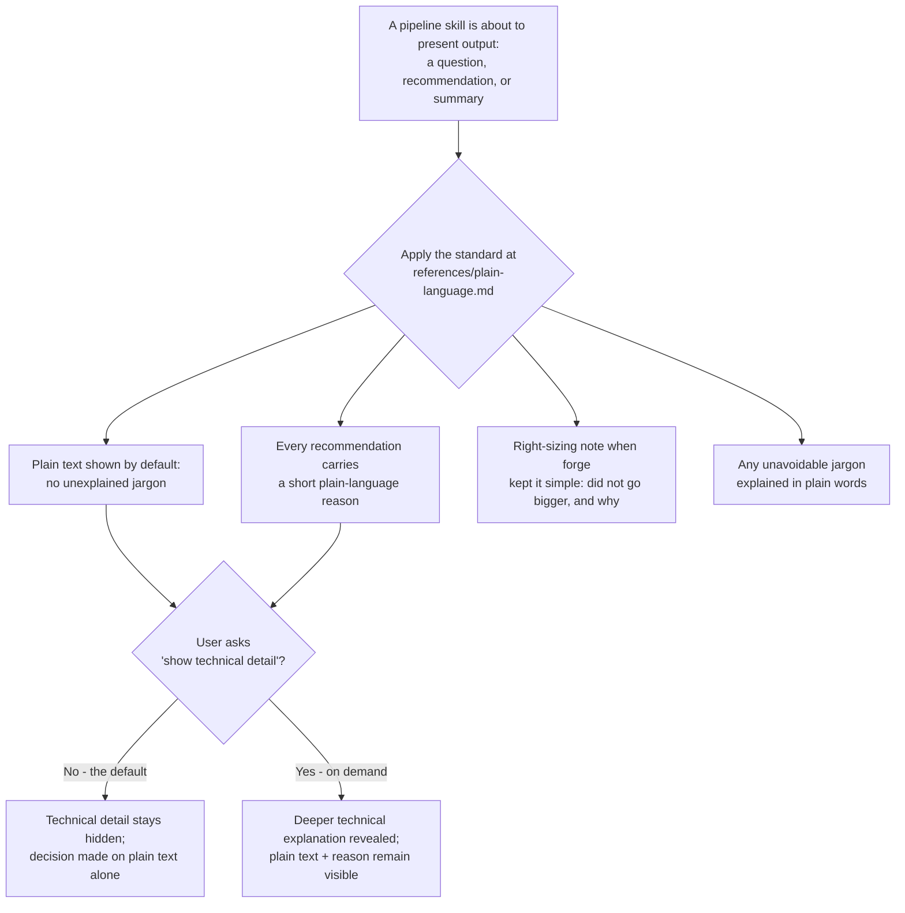

# Plain-language & trust layer

**Discovery Brief:** docs/discovery/quality-gated-pipeline/brief.md
**Epic:** [Quality-Gated Pipeline](spec.md)

**Ticket:** TBD

This feature makes everything forge says understandable and trustworthy from
start to finish. Across the whole pipeline — from the first discovery question
to the summary shown before work is saved — every question, answer, and
recommendation is written in plain language, states the reason behind it, and
offers a "show me the technical detail" option for anyone who wants to dig
deeper. It also makes right-sizing visible: when forge recommends the simpler
option, it says why it deliberately did not build something bigger. The
beneficiary is the non-technical maker — a product owner or founder — who needs
to judge forge's advice rather than accept it on faith.

## User Story

As a forge user who is not an engineer, I want every question, answer, and
recommendation in plain language with the reason behind it and the technical
detail available on demand, so that I can understand and judge what forge tells
me instead of trusting it blindly or getting something over-built.

## Background & Context

**Current state:**

- Forge runs through stages from discovery to ship. At each stage it asks
  questions and makes recommendations.
- Some of those questions, answers, and recommendations are written in technical
  terms a non-technical user cannot follow.
- Recommendations rarely show the reasoning behind them. The user sees the
  suggestion but not why forge chose it.

**Problem:**

- A non-technical user tends to accept a technical recommendation on faith,
  because there is no easy way to tell whether it is correct.
- Because the reason is hidden, the user cannot tell when forge has quietly
  over-engineered the solution — built a rocket when a bike was asked for.
- Unexplained, jargon-heavy output erodes trust. The user cannot confidently
  agree with, or push back on, what forge proposes.

## Target User & Persona

- **Who:** A forge user at the non-technical end of the range — a product owner
  or founder who is not an engineer and uses forge to take ideas from discovery
  through to shipped work.
- **Context:** They meet forge at every stage of the pipeline — answering its
  questions, weighing its recommendations, and approving work before it is
  saved. They need to understand what forge tells them in the moment, without
  pausing to look up technical terms.
- **Current workaround:** They accept technical recommendations on trust, or
  stop to ask a separate person to translate, which slows them down and leaves
  them unsure whether the advice was sound or over-built.

## Goals

- Make every question, answer, and recommendation across the whole pipeline
  readable by a non-technical user, with no unexplained jargon.
- Attach a plain-language reason to every recommendation so the user can judge
  it, agree with it, or push back.
- Offer a "show me the technical detail" option so depth is always one step away
  for the user who wants it.
- Make right-sizing visible: when forge keeps things simple or picks the smaller
  option, it states why it did not go bigger.
- Keep the experience consistent, so the same plain-language treatment applies
  whether the user is in discovery, defining requirements, or approving a build.

## Non-Goals

- This story does not change how the build stage builds, checks, or fixes its
  own work — that is the self-completing build loop story.
- This story does not change how the planning stages stress-test their own
  drafts or decide which decisions to surface — that is the self-grilling
  planning stages story.
- This story is about HOW things are presented and justified, not about the
  underlying behaviour of any stage. It standardizes the wording, the reasons,
  the on-demand detail, and the right-sizing note around whatever each stage
  already produces.

## User Workflow

1. **A question or recommendation appears** — The user reaches a point in the
   pipeline where forge asks something or proposes something. It is written in
   plain language, with no unexplained technical terms.
2. **The reason is right there** — Every recommendation comes with a short, plain
   reason for it, so the user can immediately see the basis for the suggestion.
3. **The user decides** — The user agrees, disagrees, or asks a follow-up,
   confident they understood what was proposed and why.
4. **Detail on demand (optional)** — If the user wants to go deeper, they ask to
   see the technical detail, and forge reveals the underlying explanation.
5. **Right-sizing is visible** — When forge recommends the simpler option, it
   tells the user it deliberately kept things small and why, so the user can see
   it is not over-building.
6. **Consistent to the finish** — The same treatment holds at every stage,
   through to the plain summary shown before any work is saved.

## Acceptance Criteria

### Scenario: A recommendation is shown in plain language with its reason

```gherkin
Given Maya, a non-technical product owner, is in a discovery session about a new
  customer sign-up flow
When forge recommends an approach for handling sign-ups
Then the recommendation is written in plain language with no unexplained
  technical terms
  And a short reason for the recommendation is shown alongside it
  And Maya can tell what is being proposed and why without asking for help
```

### Scenario: The user asks to see the technical detail on demand

```gherkin
Given Maya has been shown a plain-language recommendation with its reason
  And the technical detail is not shown by default
When Maya asks to see the technical detail behind the recommendation
Then forge reveals the deeper, technical explanation
  And the plain-language recommendation and its reason remain available
```

### Scenario: A jargon term is explained in plain terms the user can follow

```gherkin
Given Maya is told that her sign-up feature needs "rate limiting"
When forge presents the recommendation
Then "rate limiting" is explained in plain terms, such as "we cap how many
  sign-up attempts one person can make in a short window, so nobody can hammer
  the form thousands of times and slow it down for real customers"
  And Maya can follow the recommendation without already knowing the term
```

### Scenario: When two approaches are possible, the basis for the choice is explained

```gherkin
Given Reza, a founder who is not an engineer, is defining requirements for a
  feature that could store data in one of two ways
  And forge has weighed the two approaches below
    | Approach              | Plain trade-off                                          |
    | Keep it simple now    | Faster to build, easy to change later, fits today's size |
    | Build the bigger one  | Handles far more data, but more work and harder to change |
When forge presents its recommendation
Then forge states which approach it recommends in plain language
  And forge explains the basis for choosing it over the other approach
  And Reza can either agree with the basis or push back on it
```

### Scenario: Right-sizing — forge recommends the simpler option and says why it did not go bigger

```gherkin
Given Reza asks for a way to let his small team share weekly notes
  And a simpler option fully meets what Reza asked for
When forge makes its recommendation
Then forge recommends the simpler option
  And forge states that it deliberately did NOT build something bigger
  And forge gives the reason, such as "this matches what you asked for; a larger
  setup would add work and complexity you don't need yet — a bike, since a bike
  was what you asked for, not a rocket"
  And Reza can see that forge is not over-building
```

### Scenario: The user pushes back and forge responds in the same plain, reasoned way

```gherkin
Given forge has recommended the simpler option and explained why it did not go
  bigger
When Reza pushes back and says he expects the data to grow a lot next year
Then forge responds in plain language with the reason behind its updated view
  And if forge now recommends the larger option, it explains the basis for
  changing its mind
  And Reza can follow the updated recommendation without unexplained jargon
```

### Scenario Outline: The plain-language treatment is consistent across every stage

```gherkin
Given Maya reaches "<stage moment>" in the pipeline
When forge shows her a "<message type>"
Then the message is written in plain language with no unexplained jargon
  And every recommendation in it carries a plain-language reason
  And the option to see the technical detail is available on demand

Examples:
  | stage moment                         | message type                          |
  | a question during discovery          | a question with a recommended answer  |
  | defining requirements                | a recommendation between two options  |
  | adding technical depth to the plan   | a decision she must weigh in on       |
  | the summary shown before work saves  | a plain summary of what was built     |
```

### Scenario: A non-technical user completes a full run without hitting unexplained jargon

```gherkin
Given Maya runs a feature all the way from discovery through to the pre-save
  summary
  And Maya never asks to see the technical detail at any point
When Maya reads every question, answer, recommendation, and summary along the way
Then she understands each one without encountering an unexplained technical term
  And every recommendation she saw had a visible reason
  And she is able to explain, in her own words, why each recommendation was made
```

### Scenario: The pre-save summary reads plainly and surfaces judgment calls in plain language

```gherkin
Given the build stage has finished its work and stopped before saving
When forge shows Maya the summary of what it built
Then the summary is written in plain language with no unexplained jargon
  And any judgment calls forge made are described plainly, each with its reason
  And where forge kept something deliberately simple, it says so and why
  And Maya can decide whether to approve without needing anything translated
```

### Scenario: Technical detail is available but never forced on the user

```gherkin
Given Reza is reading a plain-language recommendation
  And he has not asked for the technical detail
When the recommendation is presented
Then the technical detail is not shown unless Reza asks for it
  And nothing Reza must read to make his decision is written in jargon
```

## Business Rules & Constraints

- Every question, answer, and recommendation across the whole pipeline
  (discovery, requirements, technical planning, build, and the pre-save summary)
  is written in plain language by default (Epic rule SR6).
- Every recommendation carries a plain-language reason, so the user can judge it
  rather than accept it on faith. A recommendation shown without a reason does
  not meet this rule.
- A "show me the technical detail" option is available on demand wherever forge
  makes a recommendation. Plain language is the default; the technical detail is
  never forced on the user before a decision (Epic rule SR6).
- When a technical term is unavoidable in a recommendation, it is explained in
  plain words the user can follow, with a concrete plain-language description
  (for example, "rate limiting" described as capping how many attempts one
  person can make in a short window).
- When more than one approach is possible, the recommendation states the basis
  for choosing one over the other in plain language, so the user can agree or
  push back.
- Right-sizing is explicit: when forge keeps something simple or recommends the
  smaller option, it states that it did not go bigger and why (Epic rule SR7) —
  "a bike when a bike was asked for, not a rocket."
- This layer changes presentation and justification only. It does not change how
  any stage builds, checks, fixes, or stress-tests its work.
- A change to how a stage presents its output takes effect the next time the
  user starts a session, not in the middle of the current one. The user should
  be told this so an in-progress session behaving the old way is not a surprise.

## Success Metrics

- A non-technical user can complete a full pipeline run, from discovery through
  the pre-save summary, without encountering a single unexplained technical
  term — measured by zero "I don't understand this" moments on a representative
  run where the user never asks for technical detail.
- Every recommendation shown to the user has a visible reason — measured by
  checking that no recommendation across the pipeline appears without a
  plain-language reason attached.
- The user can explain, in their own words, why each recommendation was made —
  because the reason is always shown, "I don't understand this" moments fall.
- Right-sizing is visible — where forge keeps something deliberately simple, it
  says so, so a reviewer can point to where the pipeline showed it was not
  over-building.
- The "show me the technical detail" option is reachable at every recommendation
  point in the pipeline — measured by confirming depth is one step away wherever
  a recommendation is made.

## Dependencies

- Applies on top of the existing pipeline stages (discovery, requirements,
  technical planning, build, ship) and the new self-completing build loop and
  self-grilling planning stages. It standardizes how their questions, answers,
  recommendations, and summaries are presented and justified; it does not change
  what those stages do.
- Soft dependency on the self-completing build loop and self-grilling planning
  stages stories: this layer reaches its fullest coverage once those stages
  exist, since it also standardizes the wording and reasons of the build loop's
  pre-save summary and the self-grills' surfaced decisions.

## Rollout Considerations

- Roll this out last in the epic so it also standardizes the output of the new
  build loop and the self-grills, giving the whole pipeline one consistent
  plain-language voice.
- Communicate the activation timing: changes to how a stage presents its output
  take effect the next time the user starts a session, so a session already in
  progress may still read the old way.

## Open Questions

- [x] ~~How wide should the plain-language and "why" treatment go?~~ —
  **Resolved:** The whole pipeline, from discovery through to the pre-save
  summary, applied consistently. (Epic decision)
- [x] ~~Should the technical detail be shown by default?~~ — **Resolved:** No.
  Plain language is the default and the technical detail is revealed only when
  the user asks for it. (Epic rule SR6)
- [x] ~~Does every recommendation need a reason?~~ — **Resolved:** Yes. Every
  recommendation carries a plain-language reason so the user can judge it rather
  than accept it on faith. (Epic rules SR6, SR7)
- [ ] Whether "show me the technical detail" is a one-time reveal per
  recommendation or a setting the user can switch on for the whole session —
  **Deferred (non-blocking):** either way satisfies the rule that plain language
  is the default and depth is one step away on demand; the exact form is a
  refinement detail.

---

> Added by `/prd-refine`. The business content above is unchanged. The sections
> below specify this story's technical slice, consistent with the canonical
> "Shared Architecture Notes (Technical)" in [spec.md](spec.md). "Implementation"
> here means editing markdown SKILL.md instruction files and markdown references
> — forge is a Claude Code plugin, so there is no application runtime, HTTP API,
> database, or UI in scope.

## Functional Requirements

The standard is defined once in a new shared reference,
`plugins/forge/references/plain-language.md`, and applied by every pipeline
skill that presents a question, recommendation, or summary. Stated as MUSTs:

- **Plain-language default.** Every question, answer, recommendation, and
  summary forge shows the user MUST be written in plain language with no
  unexplained jargon. Plain text is what the user reads to make a decision.
  (Epic rule SR6.)
- **Reason behind every recommendation.** Every recommendation MUST carry a
  short, plain-language reason — the basis for *this* recommendation. When the
  recommendation was chosen over an alternative, the reason MUST state why this
  one over the other. **A recommendation shown without a reason does NOT satisfy
  the standard** and is treated as a defect, not a style preference.
- **Show-technical-detail is default-off.** A "show me the technical detail"
  convention MUST be available wherever forge makes a recommendation, and the
  technical detail MUST NOT be shown unless the user asks for it. Depth is
  always one step away but is never forced on the user before a decision. When
  the user does ask, the deeper explanation is revealed **and the plain-language
  recommendation and its reason remain visible** — revealing detail never
  replaces the plain version. (Epic rule SR6.)
- **Unavoidable jargon is explained in plain words.** When a technical term is
  unavoidable in a recommendation, it MUST be explained in plain words with a
  concrete description the user can follow without already knowing the term
  (e.g. "rate limiting" → "we cap how many sign-up attempts one person can make
  in a short window, so nobody can hammer the form thousands of times and slow
  it down for real customers").
- **Explicit right-sizing note.** When forge keeps something deliberately simple
  or recommends the smaller of two options, it MUST state that it did *not* go
  bigger and why — "a bike when a bike was asked for, not a rocket." (Epic rule
  SR7.)
- **Cross-stage consistency.** The same standard MUST apply at every stage that
  faces the user — from the first discovery question, through requirements
  (`prd`) and technical planning (`prd-refine`), to the build loop's pre-save
  summary and the ship PR/summary. There is no stage where output is exempt.
- **One shared source, identical rendering (idempotency/consistency).** The
  standard MUST live in exactly one file
  (`plugins/forge/references/plain-language.md`). Every consumer points at that
  one file, so the same question presented twice, or by two different skills,
  renders the same way. Editing the standard once changes every consumer; no
  skill keeps its own divergent copy of the rules.

### Validation & Business Rules

- A recommendation that appears without a visible plain-language reason fails
  the standard — checked during dry-run verification by reading each presented
  recommendation.
- Anything the user must read to make a decision must be jargon-free; technical
  depth lives only behind the explicit "show technical detail" reveal.
- The standard governs **presentation and justification only**. It MUST NOT
  change what any stage builds, checks, fixes, or stress-tests — only how that
  stage's output is worded and justified.
- **Activation timing.** Because skills load at session start, an edit to a
  skill or the standard takes effect only in the user's **next** session, not
  mid-session. When relevant, the user should be told so an in-progress session
  behaving the old way is not a surprise.

## Permissions & Security

- **Scope:** Internal, developer-local only. This story edits markdown
  instruction files that ship with the forge plugin and are read by Claude Code
  at session start.
- **Authorization:** None. There is no runtime, no endpoint, no user account,
  and no privileged operation. The change is a documentation/wording standard.
- **Input validation:** N/A — no user input is parsed or stored. The only
  "input" is the user's free-text request to "show technical detail", which is
  handled conversationally by the skill, not by code.
- **New surface:** None. No new endpoint, route, deserializer, file upload, or
  network call is introduced.

## System Design

### Components

- **`plugins/forge/references/plain-language.md` (NEW — single source of
  truth).** A plugin-shared reference, loaded via
  `${CLAUDE_PLUGIN_ROOT}/references/plain-language.md`. It defines the five
  rules above: (1) plain-language default; (2) a stated reason behind every
  recommendation, including why-this-over-the-alternative when relevant; (3) the
  "show me the technical detail" convention, default-off; (4) how to explain an
  unavoidable jargon term in plain words with a concrete description; (5) the
  explicit right-sizing note. It is the only place the rules are written down.
- **`plugins/forge/references/multi-choice.md` (EXTENDED, not replaced).** The
  existing shared prompt format already requires "the recommended choice is
  always shown." This story extends it to also require the
  **reason-behind-the-recommendation** (the basis for the recommended option,
  and why over the alternatives) and to **mention the show-technical-detail
  hook** so multi-choice prompts and free-form recommendations follow one
  consistent trust standard. Its `Recommended: <#>` line gains a companion
  plain-language "why this one" reason; the format, the "max 4 + Other" rule,
  and every existing rule stay intact.
- **One-line pointers in the pipeline skills (EDITED).** Each pipeline skill
  that presents a question, recommendation, or summary gains a single
  lightweight line instructing it to apply the standard at
  `${CLAUDE_PLUGIN_ROOT}/references/plain-language.md` wherever it presents
  output. The skills' own prose is otherwise untouched — the standard, not the
  skill, is the single source of truth.

### Interfaces

- **How skills load the standard.** Skills reference it by the plugin-root path
  `${CLAUDE_PLUGIN_ROOT}/references/plain-language.md`, the same mechanism
  already used for `${CLAUDE_PLUGIN_ROOT}/references/multi-choice.md` (see
  `product-discovery/SKILL.md` line 27–29 and `grill-me/SKILL.md` line 12 for
  the existing pattern). No new loading machinery is added.
- **Relationship to `multi-choice.md`.** `multi-choice.md` governs the *shape*
  of an enumerable question (numbered options + a recommended pick).
  `plain-language.md` governs the *trust standard* that applies to all
  user-facing output — enumerable or free-form. The two are complementary:
  multi-choice points at plain-language for the reason-and-depth requirement, so
  a multi-choice prompt and a free-text recommendation read with the same voice.

### Data flow



### Tradeoffs considered

- **Shared reference + light pointers vs. rewriting each skill's wording.**
  *Chosen: shared reference + one-line pointers.* A single
  `plain-language.md` is the one source of truth; each consumer is a one-line
  pointer, so the standard can evolve in one place and every stage stays in
  sync. Rewriting the plain-language rules into every skill's prose was
  rejected: it scatters the standard across six-plus files, invites drift, and
  is exactly the over-building this story warns against. This is a routine
  single-responsibility call (one standard, one file), **not ADR-worthy** — no
  ADR is written for it.
- **"Show technical detail" as a per-message reveal vs. a session-wide mode.**
  *Left as a deferred open question.* Either form satisfies the standard (plain
  language is the default; depth is one step away on demand), so the choice is a
  refinement detail rather than a design fork. Tracked in Open Questions.

## Threat Model Checklist

- **Data classification:** N/A — presentation/wording change only; handles no
  PII, secrets, tokens, or user data. The standard is a markdown instruction
  file.
- **Attack surface:** N/A — no new endpoints, routes, deserializers, file
  uploads, redirects, or parsers. Nothing executes; the files are read by Claude
  Code as instructions.
- **Authn / authz changes:** N/A — developer tooling with no roles, middleware,
  sessions, or public routes.
- **Dependency additions:** N/A — no new packages, services, or external calls.
  The work adds one markdown file, extends one markdown file, and adds one-line
  pointers to existing markdown files.
- **Network / data egress:** N/A — no network activity introduced.

## Architecture Notes

- **New dependencies:** None. No packages, services, scripts, or external
  integrations. The deliverable is one new markdown reference plus edits to
  existing markdown.
- **Dependencies & integration:**
  - **Extends `multi-choice.md`.** The reason-behind-the-recommendation and the
    show-technical-detail hook are added to the existing shared prompt format,
    not bolted on separately — so prompts that already follow multi-choice
    inherit the trust standard.
  - **Consumed by the build loop and the self-grills (cross-story dependency).**
    Per the Shared Architecture Notes in [spec.md](spec.md), Story 1's
    self-completing build loop renders its **pre-save checkpoint summary**
    through this standard, and Story 2's self-grilling planning stages render
    their **surfaced decisions** through it. This story is independently
    valuable (it standardizes whatever stages exist today) but reaches full
    coverage once Stories 1 & 2 land — hence the recommended epic order
    **1 → 2 → 3** and the "soft" dependency recorded in the Story Index. This
    story changes no external contract: `ship`'s standalone behavior, the
    individual gate skills, and `grill-me` all keep their current contracts.
- **Exemplar files:**
  - `plugins/forge/references/multi-choice.md` — the format and house-style to
    match when writing `plain-language.md` (a short "Format" block, a "Rules"
    list, a "When NOT to use" caveat, and a concrete "Example").
  - `plugins/forge/skills/grill-me/SKILL.md` line 12 — the existing one-line
    "Prompt style" note that points at `multi-choice.md`; the new pointers
    follow this exact shape and length.
  - `plugins/forge/skills/product-discovery/SKILL.md` lines 27–29 — another
    existing one-line "Prompt style" pointer to copy the wording pattern from.

## Implementation Plan

### Sub-tasks

**Task 1: Write the new shared standard
`plugins/forge/references/plain-language.md`** — _small_ (<100 LOC)

- Files: `plugins/forge/references/plain-language.md` (create)
- Content: the five rules (plain-language default; reason behind every
  recommendation incl. why-over-alternative; show-technical-detail convention,
  default-off; explaining unavoidable jargon in plain words with a concrete
  description; explicit right-sizing note). Mirror the structure of
  `multi-choice.md` (Format / Rules / When NOT to use / Example). Include at
  least one concrete worked example of each of: a recommendation-with-reason, a
  jargon→plain translation (e.g. "rate limiting"), and a right-sizing note
  ("a bike, not a rocket").
- INDEPENDENT

**Task 2: Extend `plugins/forge/references/multi-choice.md`** — _small_
(<100 LOC)

- Files: `plugins/forge/references/multi-choice.md` (edit)
- Content: add a rule requiring the `Recommended: <#>` line to carry a
  plain-language reason (the basis for the recommended pick, and why over the
  alternatives when relevant), and a line mentioning the show-technical-detail
  hook. Add a cross-reference to `plain-language.md` for the full trust
  standard. Do NOT change the existing format block, the "max 4 + Other" rule,
  or any existing rule.
- INDEPENDENT

**Task 3: Add a one-line pointer to each pipeline skill** — _small_ (<100 LOC
total across files)

- Files (each gets one lightweight pointer line, in the "Prompt style"
  region near the top, modeled on `grill-me/SKILL.md` line 12):
  - `plugins/forge/skills/product-discovery/SKILL.md`
  - `plugins/forge/skills/prd/SKILL.md`
  - `plugins/forge/skills/prd-refine/SKILL.md`
  - `plugins/forge/skills/build/SKILL.md` (apply at the Phase 4/Phase 5 pre-save
    summary and any surfaced `BLOCKED.md` / judgment-call output)
  - `plugins/forge/skills/ship/SKILL.md` (apply at the Step 0/0.5 multi-choice
    gates, the Step 3a commit-plan prompt, and the Step 6 report/PR summary)
  - `plugins/forge/skills/fix/SKILL.md` (apply at the Step 1/2/3/6 multi-choice
    prompts and the root-cause hypothesis)
- The pointer text is one line: instruct the skill to apply the standard at
  `${CLAUDE_PLUGIN_ROOT}/references/plain-language.md` wherever it presents a
  question, recommendation, or summary. Do NOT rewrite the skill's prose.
- SEQUENTIAL — depends on Task 1 (the file the pointers reference must exist
  first). The six per-skill edits are mutually INDEPENDENT and may be made in
  parallel once Task 1 lands. `grill-me/SKILL.md` already points at
  `multi-choice.md`; no new pointer is required there because Task 2 routes
  multi-choice's reason/depth requirement through the standard — but verify it
  reads correctly during Task 4.

**Task 4: Dry-run verification in a fresh session** — _small_

- Files: none (verification only)
- Run the Test Scenarios below in a new session and run the `verifier` skill for
  markdown lint over the changed files.
- SEQUENTIAL — depends on Tasks 1–3.

### Negative Constraints

- Do NOT rewrite each skill's prose. Add light, one-line pointers only — the
  standard is the single source of truth and the skill edits stay minimal.
- Do NOT force the technical detail on the user before a decision. "Show
  technical detail" is default-off and revealed only on request.
- Do NOT replace `plugins/forge/references/multi-choice.md`. Extend it in place;
  keep its existing format and every existing rule intact.
- Do NOT change any stage's underlying behavior — what it builds, checks, fixes,
  or stress-tests. This story is presentation and justification only.
- Do NOT add a session-wide "always show detail" mode in this story; that form
  is a deferred open question.

## Test Scenarios

> Skills load at session start, and there is no unit-test harness or E2E
> framework in this repo, so every scenario below is a structured **manual
> dry-run run in a FRESH session** after the edits land. Each names the skill,
> the scratch input, and the expected observable behavior. Reuses the Maya
> (non-technical product owner) and Reza (non-technical founder) personas from
> the Acceptance Criteria.

**Test 1: Every recommendation in a stage shows a plain reason**

- Setup: Fresh session. Maya starts a `product-discovery` run for a customer
  sign-up flow.
- Action: Walk to any step where forge recommends an approach (e.g. Step 5,
  "Pick one to go after first").
- Expected: The recommendation is in plain language and is accompanied by a
  short plain-language reason for *this* pick. No recommendation appears without
  a visible reason.

**Test 2: Asking "show technical detail" reveals depth and the plain version
stays**

- Setup: Fresh session. Maya has been shown a plain-language recommendation with
  its reason; no technical detail is visible yet.
- Action: Maya says "show me the technical detail."
- Expected: forge reveals a deeper technical explanation, **and** the original
  plain-language recommendation and its reason remain visible. Before she asked,
  the technical detail was not shown.

**Test 3: A jargon term is explained in plain words**

- Setup: Fresh session. Reza is in `prd-refine` and the recommendation involves
  "rate limiting."
- Action: forge presents the recommendation.
- Expected: "rate limiting" is explained in plain words with a concrete
  description (e.g. "we cap how many sign-up attempts one person can make in a
  short window, so nobody can hammer the form thousands of times and slow it
  down for real customers"), and Reza can follow it without already knowing the
  term.

**Test 4: forge recommends the simpler option and states why it did not go
bigger**

- Setup: Fresh session. Reza asks for a way to let his small team share weekly
  notes, where a simpler option fully meets the ask.
- Action: forge makes its recommendation (e.g. in `prd` or `prd-refine`).
- Expected: forge recommends the simpler option, explicitly states it did NOT
  build something bigger, and gives the reason ("this matches what you asked
  for; a larger setup would add work and complexity you don't need yet — a bike,
  since a bike was what you asked for, not a rocket"). Reza can see forge is not
  over-building.

**Test 5: A full run never surfaces unexplained jargon when the user never asks
for detail**

- Setup: Fresh session. Maya runs a feature from `product-discovery` through
  `prd` and `prd-refine` to the point a summary is shown, and never once asks to
  see the technical detail.
- Action: Maya reads every question, answer, recommendation, and summary along
  the way.
- Expected: She encounters no unexplained technical term, every recommendation
  she saw had a visible reason, and she could explain in her own words why each
  recommendation was made.

## Verification

All verification is by manual dry-run in a **fresh session** — skills load at
session start, so the edits do not take effect until a new session starts. There
is no unit-test harness or E2E framework in this repo.

- Run **Test 1–5** above as structured dry-runs in a new session and confirm the
  expected observable behavior for each.
- Run the `verifier` skill for **markdown lint** over the changed files
  (`plugins/forge/references/plain-language.md`,
  `plugins/forge/references/multi-choice.md`, and each edited pipeline
  `SKILL.md`).
- Spot-check that every consumer skill points at the single
  `${CLAUDE_PLUGIN_ROOT}/references/plain-language.md` path (one source of
  truth, identical rendering everywhere).
