# Self-Completing Build Loop

**Discovery Brief:** docs/discovery/quality-gated-pipeline/brief.md

**Epic:** [Quality-Gated Pipeline](spec.md)

**Ticket:** TBD

This feature turns the build stage into a self-completing loop. When a forge
user asks forge to build an approved spec, the build stage builds the work, runs
every quality check, fixes whatever failed, and repeats until the work is
genuinely done — every check is green and the agreed requirements are met. It
then stops before saving anything, shows a plain-language summary of what it
built and any judgment calls it made, and waits for the user's approval. The
forge user no longer has to manually re-run review and fixes round after round.

## User Story

As a forge user, I want the build stage to keep building, checking, and fixing
its own work until it is genuinely done, so that I get finished, right-sized
work to approve instead of having to babysit round after round of review and
fixes myself.

## Background & Context

**Current state:**

- The forge user has an approved spec and asks forge to build it.
- Today the build stage makes a single, limited pass: it runs its quality checks
  once and attempts at most one fix per failing item, then moves on — whether or
  not everything actually passed.
- When work is left unfinished, the user manually re-runs review and fixes,
  round after round, until the work is genuinely done.

**Problem:**

- The user carries the finishing effort by hand on every single feature. This is
  the biggest repeated tax on the workflow.
- "It ran" does not mean "it's done." Without a self-completing loop and a clear
  finish line, the user can never be confident the work is actually complete and
  right-sized without checking it all by hand.
- A single fix attempt per item often is not enough, so the user is pulled back
  in even when the remaining work is small and mechanical.

## Target User & Persona

- **Who:** A forge user — a maker using the forge plugin to build software,
  ranging from a non-technical product owner to a solo developer.
- **Context:** They have an approved spec and ask forge to build it. They want
  finished work to review, not a half-finished pass they must shepherd.
- **Current workaround:** After the build runs once, they manually re-run the
  review and fix steps themselves, repeating until the work is genuinely done.

## Goals

- Make the build stage self-complete to a trustworthy finish line: every quality
  check is green **and** the agreed requirements are met.
- Remove the manual re-run-review-and-fix loop the user does today, replacing it
  with one pre-save approval.
- When the build cannot reach "done," always stop and show exactly what is
  blocking — never loop forever, never silently give up, and never save
  unapproved or unfinished work.
- Keep the work right-sized: build only what the requirements call for, and say
  so plainly whenever something is deliberately kept simple.

## Non-Goals

- Full hands-off autonomy. The build stage always stops before saving and asks
  the user to approve. It never saves or finalizes work on its own.
- Redefining what the individual quality checks evaluate. This feature reuses the
  existing checks (security, code quality, tests, end-to-end) as the quality bar;
  it does not change what any of them measures or invent new standards.
- Changing the planning stages (discovery, requirements, technical detail). Those
  stay human-led and are out of scope here.

## User Workflow

1. **Starting point** — The forge user has an approved spec and asks forge to
   build it. Their intent: get finished, right-sized work back to review.
2. **The loop runs on its own** — The build stage builds the work, runs every
   quality check, and fixes whatever failed. If anything is still not done, it
   builds and checks again. The user does not have to step in between rounds.
3. **It reaches the finish line, or it stops** — The loop continues until the
   work is genuinely done (every check green and every agreed requirement met),
   or until it hits its safe limit, or until a round resolves nothing new. It
   never keeps going forever.
4. **Pre-save checkpoint** — Before saving anything, the loop stops and shows the
   user a plain-language summary: what it built, which checks passed, and any
   judgment calls it made (warnings it couldn't fully resolve, or trade-offs it
   deliberately chose, including anything it kept deliberately simple). If it
   could not reach the finish line, it instead shows exactly what is blocking.
5. **Completion** — The user approves, and only then is the work saved. Or the
   user rejects or redirects, and nothing is saved. The user is always the one
   who decides whether the work is kept.

## Acceptance Criteria

### Scenario: The loop reaches the finish line and the user approves

```gherkin
Given Maya has an approved spec for a CSV export feature
  And she asks forge to build it
When the build stage builds the work, runs every quality check, and fixes what failed
  And it repeats until every quality check is green and every agreed requirement is met
Then it stops before saving anything
  And it shows Maya a plain-language summary of what it built and which checks passed
  And it does not save the work until Maya approves
When Maya approves the summary
Then the work is saved
  And forge continues from there
```

### Scenario: Early rounds fail but a later round reaches the finish line

```gherkin
Given Reza has an approved spec for a discount-code feature
  And he asks forge to build it
When the build stage builds the work and runs the quality checks
  And the first round leaves the tests failing
Then it fixes the failing tests and runs every quality check again
When a later round reaches every quality check green and every agreed requirement met
Then it stops before saving
  And it shows Reza a plain-language summary of what it built and which checks passed
  And it waits for Reza's approval before saving anything
```

### Scenario: The loop stops early because a round resolved nothing new

```gherkin
Given Priya has an approved spec for a bulk-invite feature
  And she asks forge to build it
When the build stage builds the work and runs the quality checks
  And a fix round resolves nothing new compared to the round before it
Then it stops trying instead of repeating the same fix again
  And it shows Priya exactly what is still blocking the work
  And it explains that it could not make further progress on its own
  And it saves nothing
  And it asks Priya how she wants to proceed
```

### Scenario: The loop reaches its round limit still failing

```gherkin
Given Maya has an approved spec for a CSV export feature
  And she asks forge to build it
When the build stage builds, checks, and fixes across its allowed fix rounds
  And the work is still not done after the last allowed round
Then it stops instead of continuing to loop
  And it shows Maya exactly which checks or requirements are still failing
  And it explains what it tried and what blocked it
  And it saves nothing
  And it asks Maya how she wants to proceed
```

### Scenario: All checks pass but a required behavior from the spec is missing

```gherkin
Given Reza's approved discount-code spec requires that expired codes are rejected
  And he asks forge to build it
When the build stage gets every quality check to green
  But the built work still accepts expired discount codes
Then the loop does not treat the work as done
  And it keeps working to satisfy the missing requirement, or surfaces the gap if it cannot
  And it never declares the work finished on green checks alone
```

### Scenario: An unresolved warning is surfaced as a judgment call at the checkpoint

```gherkin
Given Priya has an approved spec for a bulk-invite feature
  And the build stage reached every quality check green and every agreed requirement met
  But there is a warning it could not fully resolve on its own
When the loop stops at the pre-save checkpoint
Then it shows Priya a plain-language summary of what it built and which checks passed
  And it clearly flags the unresolved warning as a judgment call for Priya to decide on
  And it saves nothing until Priya decides
When Priya chooses to proceed despite the warning
Then the work is saved
When Priya chooses not to proceed
Then the work is not saved
  And Priya can redirect the build
```

### Scenario: A deliberate trade-off is surfaced as a judgment call at the checkpoint

```gherkin
Given Maya's approved CSV export spec did not ask for scheduled exports
  And the build stage deliberately kept the export simple and on-demand only
  And it reached every quality check green and every agreed requirement met
When the loop stops at the pre-save checkpoint
Then it shows Maya a plain-language summary of what it built and which checks passed
  And it notes that it deliberately kept the export simple and on-demand to match the requirements
  And it waits for Maya's approval before saving anything
```

### Scenario: The user rejects at the checkpoint

```gherkin
Given Reza's build reached the finish line and stopped at the pre-save checkpoint
  And it is showing him a plain-language summary of the discount-code work
When Reza rejects the summary instead of approving it
Then the work is not saved
  And Reza can redirect the build with new direction
  And nothing is saved until Reza approves a later summary
```

### Scenario: The build is kept right-sized to the requirements

```gherkin
Given Maya's approved CSV export spec asks only for a basic on-demand export
  And she asks forge to build it
When the build stage builds the work
Then it builds only what the requirements call for
  And it does not add extra capabilities beyond the requirements
  And at the checkpoint it notes anything it deliberately kept simple
  And the summary reflects a build sized to the task, not an over-built one
```

### Scenario Outline: The loop never saves without an explicit approval

```gherkin
Given a forge user's build for <feature> has stopped at the pre-save checkpoint
When the user responds with <response>
Then the work is <outcome>

Examples:
  | feature              | response                  | outcome     |
  | CSV export           | approves the summary      | saved       |
  | discount-code        | rejects the summary       | not saved   |
  | bulk-invite          | redirects with changes    | not saved   |
  | scheduled reminders  | walks away without replying | not saved |
```

### Scenario Outline: The loop always stops and surfaces blockers instead of looping forever

```gherkin
Given a forge user asks forge to build <feature>
When the loop hits <stopping condition>
Then it stops looping
  And it shows the user exactly what is blocking
  And it saves nothing

Examples:
  | feature             | stopping condition                          |
  | CSV export          | the work is still failing after the last allowed round |
  | discount-code       | a fix round resolves nothing new            |
  | bulk-invite         | a requirement cannot be satisfied on its own |
```

## Business Rules & Constraints

- **Finish line = checks green AND requirements met.** The loop only treats work
  as done when every quality check is green **and** every agreed acceptance
  criterion is satisfied. Green checks alone are never "done" if a required
  behavior is missing. (Epic rule SR3.)
- **Bounded effort, never silent failure.** The loop tries a small number of fix
  rounds (around three) and stops early if a round resolves nothing new. When it
  cannot reach the finish line, it stops and shows exactly what is blocking. It
  never loops forever and never quietly gives up. (Epic rule SR4.)
- **Always stops before saving.** Even when everything passes, the loop never
  saves or finalizes work without first showing the user a plain-language summary
  and getting their approval. (Epic rule SR2.)
- **The pre-save checkpoint shows three things:** a plain summary of what was
  built, which checks passed, and any judgment calls — warnings it could not fully
  resolve and trade-offs it deliberately made (including anything kept simple).
  Hard failures are already fixed by the time the user sees the checkpoint, so the
  checkpoint is about judgment calls, not unresolved breakage.
- **Reuse the existing quality bar.** The loop uses the checks forge already has
  (security, code quality, tests, end-to-end) as its quality bar. It does not
  invent new standards or change what any check evaluates. (Epic rule SR5.)
- **Right-sizing is explicit.** The loop builds only what the requirements call
  for — no gold-plating — and whenever it deliberately keeps something simple, it
  says so at the checkpoint, so the user can see it is not over-building.
  (Epic rule SR7.)
- **Nothing is saved without approval, in every outcome.** Whether the user
  rejects, redirects, or simply does not respond, the work is not saved. Saving
  happens only after an explicit approval.

## Success Metrics

- **Builds self-complete more often.** The share of builds that reach "every
  check green and every requirement met" without the user manually re-running
  review and fixes increases noticeably compared to today's single-pass behavior.
- **Manual finishing rounds drop to near zero.** On a typical feature, the user
  no longer manually re-runs review and fixes after a build; their only build-time
  touchpoint is the single pre-save approval.
- **No unapproved or unfinished saves.** Every saved build was explicitly approved
  at the pre-save checkpoint; zero builds are saved without approval, and zero
  unfinished builds are saved as if they were done.
- **No over-engineering flagged in review.** Builds are sized to the task;
  reviewers do not flag gold-plating, and the checkpoint surfaces where the loop
  deliberately kept things simple.

## Dependencies

- **An approved spec to build.** The loop runs against a spec the user has already
  approved, including its agreed acceptance criteria, which the loop treats as
  part of the finish line.
- **The existing quality checks.** The loop relies on forge's existing checks
  (security, code quality, tests, end-to-end) as its quality bar; it orchestrates
  them rather than redefining them.
- **Trustworthy finish line confirmed.** Before this loop is relied upon, the
  epic's hand-run validation confirms that "every check green" plus "requirements
  met" really equals "genuinely done and right-sized." If that does not hold, the
  agreed acceptance criteria must be an explicit part of the finish line — which
  this feature already requires.

## Rollout Considerations

- **Changes take effect on the next session.** A change to how the build stage
  behaves takes effect the next time the user starts a fresh session, not in the
  middle of an in-progress one. Communicate this so users are not surprised when a
  session already underway still behaves the old single-pass way.

## Open Questions

- [x] ~~What counts as "done" for the loop?~~ — **Resolved:** Every quality check
  green **and** every agreed acceptance criterion met. Green checks alone are not
  enough. (SR3.)
- [x] ~~How hard should the loop try before stopping for help?~~ — **Resolved:** A
  small number of fix rounds (around three), stopping early if a round resolves
  nothing new, then stopping and surfacing what is blocking. (SR4.)
- [x] ~~Does the build stage save work on its own?~~ — **Resolved:** No. It always
  stops before saving and gets the user's explicit approval first. (SR2.)
- [x] ~~What does the pre-save checkpoint show?~~ — **Resolved:** A plain-language
  summary of what was built and which checks passed, plus any judgment calls
  (unresolved warnings and deliberate trade-offs). Hard failures are already fixed
  by then.
- [ ] Exact round-count limit and effort budget for the loop — **Deferred
  (non-blocking):** "around three rounds, stop on no progress" is enough to build
  against; the precise number and any budget are a refinement detail.
- [ ] Precise categories of warning that the checkpoint surfaces versus
  auto-resolves — **Deferred (non-blocking):** the principle (surface judgment
  calls, auto-fix hard failures) is settled; the exact list is a refinement detail.

---

> The sections below are the **technical** elaboration added by `/prd-refine`.
> The business content above is unchanged. Everything here is consistent with the
> epic's [Shared Architecture Notes (Technical)](spec.md#shared-architecture-notes-technical)
> and with [ADR-002](../../adr/002-build-loop-gate-ownership.md): same five-gate
> set, same "done" condition, same build↔ship handoff. "Implementation" here means
> editing markdown `SKILL.md` instruction files and adding markdown references
> under `plugins/forge/skills/`, not application code — there is no HTTP API, DB,
> or UI in scope.

## Functional Requirements

- **The five-gate set (reused unchanged).** Each round of the loop runs all five
  gates and classifies each result as blocking or non-blocking, exactly per the
  Shared Architecture Notes table:

  | Gate              | Skill/agent                        | Blocking signal                  | Non-blocking signal                  |
  | ----------------- | ---------------------------------- | -------------------------------- | ------------------------------------ |
  | Build cleanliness | `verifier`                         | `FAIL`                           | —                                    |
  | Requirements met  | spec acceptance criteria           | any unmet acceptance criterion   | —                                    |
  | End-to-end        | `e2e`                              | `FAIL`; `ERROR` → **stop loop**  | `NO_E2E` → skip                      |
  | Security          | `security-review`                  | `FAIL`                           | `WARN` → surface at checkpoint       |
  | Code quality      | `code-reviewer` agent              | any `fail` finding               | `warn` / `manual` → surface at checkpoint |

- **The "Done" condition (exact).** The loop may declare the work done **only**
  when all of the following hold simultaneously: `verifier` returns `PASS` **and**
  every acceptance criterion in the spec is met **and** `e2e` returns `PASS` or
  `NO_E2E` **and** `security-review` returns `PASS` or `WARN` **and**
  `code-reviewer` returns no `fail` findings. Green checks alone are never "done"
  if any acceptance criterion is unmet (epic SR3).

- **Non-blocking signals never block "done".** A `security-review` `WARN`,
  `code-reviewer` `warn`/`manual` findings, and `e2e` `NO_E2E` do **not** prevent
  the loop from reaching "done". `WARN`-level security findings and
  `warn`/`manual` code-review findings are carried forward and surfaced at the
  Phase 4.5 checkpoint as judgment calls.

- **Bounded to ≤ 3 rounds.** The loop runs at most three fix rounds. Each round:
  (a) runs the five gates, (b) computes the set of blocking failures, (c) if the
  set is non-empty and the cap is not reached, spawns fix work scoped to those
  blocking failures and starts the next round. Round 1 is the initial gate run
  after Phase 3.5.

- **"No progress" stops early.** A round makes *no progress* when it does not
  **shrink** the set of blocking failures versus the previous round (same count
  and same identities, or a larger set). On a no-progress round the loop stops
  immediately rather than re-attempting the identical fix, surfaces the remaining
  blockers, and saves nothing. Shrinking the set — even by one blocker — counts as
  progress and the loop continues (subject to the round cap).

- **`e2e` ERROR stops the loop (infrastructure, never auto-fixed).** If `e2e`
  returns `ERROR` (missing dependency, port conflict, config error), the loop
  stops at once and surfaces it as an infrastructure blocker. The loop never
  spawns fix work against an `ERROR` — matching `e2e`'s own constraint that it
  does not install dependencies or start services.

- **The loop never saves without explicit approval.** Reaching "done" does not
  save anything. The loop always halts at the Phase 4.5 pre-commit checkpoint and
  only proceeds to `ship` (commit/push/PR) after the user explicitly approves
  (epic SR2). Reject, redirect, or no reply ⇒ nothing is saved.

- **Pre-commit checkpoint content.** When the loop reaches "done", the Phase 4.5
  checkpoint presents, in plain language: (1) a summary of what was built; (2)
  which of the five gates passed; and (3) the **judgment calls**, which are
  exactly — the `security-review` `WARN` findings, the `code-reviewer`
  `warn`/`manual` findings, and any deliberate simplifications the build made to
  keep the work right-sized (epic SR7). Hard failures are already fixed by this
  point, so the checkpoint is about judgment calls, not unresolved breakage. When
  the loop stops *without* reaching "done" (cap reached, no progress, or `e2e`
  ERROR), it instead surfaces exactly the remaining blockers and what it tried,
  and saves nothing.

- **Idempotency.** Re-running the loop on already-done work makes no changes:
  every gate passes on the first round, the blocking-failure set is empty, no fix
  work is spawned, and the loop proceeds straight to the Phase 4.5 checkpoint. No
  commit, branch, or file edit happens until approval — re-running is safe and
  side-effect-free up to that point.

## Permissions & Security

- **Scope:** Developer-local tooling. The loop runs inside the maker's own
  `/forge:build` session on their machine and operates only on the working tree
  and git branches that `build` already controls.
- **Authorization:** N/A — there is no service, API surface, or multi-tenant
  boundary. The human approval checkpoint (Phase 4.5) is the only authorization
  gate, and it gates *saving*, not access.
- **Credentials / network:** The loop introduces no network calls and no
  credentials of its own. It reuses the existing gate skills; any network or
  credential use (e.g. `npm audit`, `gh api`, `pip-audit` inside
  `security-review`; `gh` inside `ship`) is exactly what those skills already do
  today, unchanged.

## System Design

### Components

- **`build` Phase 4 — the bounded gate-loop (modified).** Today Phase 4 is a
  single limited pass: it runs `verifier`, checks acceptance criteria (1 retry
  each), and runs `e2e` (1 retry per failing test), then proceeds. It is rewritten
  into the bounded loop: each round runs **all five** gates (now including
  `security-review` and `code-reviewer`, pulled in from `ship`), collects the
  blocking-failure set, spawns fix work scoped to those blockers, and re-runs —
  capped at three rounds, stopping early on no progress or `e2e` ERROR. It defers
  the exact gate set, done-condition, and round/no-progress rules to the canonical
  `loop-contract.md` reference rather than restating them inline.

- **`build` Phase 4.5 — the pre-commit checkpoint (new).** A new phase inserted
  between verification and ship, **owned by the main `build` session** (not the
  worktree feature-builder workers, which cannot commit — repo learning
  `blocker-feature-builder-cannot-commit`). It renders the plain-language summary,
  the passed gates, and the judgment calls (security `WARN`, code-review
  `warn`/`manual`, deliberate simplifications), then waits for explicit approval.
  On approval it proceeds to Phase 5; on reject/redirect/no-reply it saves nothing
  and returns control to the user.

- **`ship` skip-gates mode (modified).** `ship` Steps 0 (security-review) and 0.5
  (code-reviewer) become **conditional**. When `ship` is invoked by `build` Phase 5
  with the skip-gates signal, it skips Steps 0/0.5 (the loop already ran and
  cleared them) and starts at Step 1 (state detection) → commit/push/PR. Run
  **standalone** (no signal), `ship` runs Steps 0/0.5 exactly as today — manual-ship
  safety is fully preserved (ADR-002, rejected Option D).

- **`plugins/forge/skills/build/references/loop-contract.md` — canonical contract
  (new).** A new skill-local reference, loaded by `build` Phase 4/4.5 via
  `${CLAUDE_SKILL_DIR}/references/loop-contract.md`. It is the single source of
  truth for: the five-gate set with each gate's blocking vs non-blocking signal;
  the exact "Done" condition; the ≤ 3 round cap; the "no progress = does not shrink
  the blocking-failure set" rule; the `e2e` ERROR stop rule; and the Phase 4.5
  checkpoint format (summary + passed gates + judgment calls). `build` references
  it so the rules live in one place and cannot drift between Phase 4 and Phase 4.5.

### Interfaces

- **The loop↔ship handoff signal.** `build` Phase 5 tells `ship` to skip its own
  gate steps by passing a token argument **`--gates-cleared`** to the `ship`
  skill, appended to the existing argument string (e.g.
  `ship PROJ-123 --gates-cleared`, or just `ship --gates-cleared` when no ticket).
  `ship` parses `$ARGUMENTS`: if the literal token `--gates-cleared` is present, it
  strips the token from the ticket/description parse and skips Steps 0 and 0.5,
  proceeding to Step 1. If the token is absent (the standalone path), Steps 0/0.5
  run as today. The token is the **only** new contract; no gate skill's interface
  changes.

### Data Flow

```mermaid
flowchart TD
    A[build Phases 0–3.5: load, decompose, execute, merge] --> B[Round starts]
    B --> C["Run 5 gates: verifier, acceptance criteria, e2e, security-review, code-reviewer"]
    C --> E{e2e ERROR?}
    E -- yes --> Z[STOP: infra blocker, save nothing]
    E -- no --> F{Blocking failures?}
    F -- "no (Done condition met)" --> G[Phase 4.5 checkpoint]
    F -- yes --> H{Round cap reached &#40;3&#41; OR no progress?}
    H -- yes --> Z2[STOP: surface blockers, save nothing]
    H -- "no &#40;set shrank, rounds left&#41;" --> I[Spawn fix work scoped to blockers]
    I --> B
    G --> J{User approves?}
    J -- "reject / redirect / no reply" --> K[Save nothing, return to user]
    J -- approve --> L["Phase 5: ship --gates-cleared (skip Steps 0/0.5)"]
    L --> M[commit → push → PR]
```



### Tradeoffs Considered

The build↔ship gate ownership is decided in
[ADR-002](../../adr/002-build-loop-gate-ownership.md). **Chosen — Option A:** the
build loop owns all five gates as its exit condition, and `ship` gains a
skip-gates mode for post-loop invocation. It reuses every existing gate skill
unchanged (right-sized, no new quality machinery), puts the loop and checkpoint in
one place, and preserves `ship`'s standalone safety. Rejected alternatives:
**Option B** (keep gates split, wrap build+ship in an outer loop) — re-running
`ship`'s gate steps entangles them with its commit/push/PR side effects, leaving a
half-run ship; **Option C** (a new standalone `/forge:loop` skill) — duplicates
`build`'s context-loading, decomposition, and worktree orchestration for no new
capability (the "rocket" the discovery brief warned against); **Option D** (move
`security-review` + `code-reviewer` permanently out of `ship` into `build`) —
breaks `ship`'s standalone manual-ship path, a security regression.

## Threat Model Checklist

- **Data classification.** Developer tooling. The loop itself handles **no PII and
  no secrets** — it orchestrates gate skills over the maker's own working tree on
  their own machine. `security-review` actively *flags* hardcoded secrets/PII in
  the diff; the loop merely consumes that verdict.
- **Attack surface / blast radius.** The material risk is autonomy: across up to
  three rounds the loop **autonomously modifies source code** (via spawned
  fix-work agents) and **runs project commands repeatedly** — `verifier`'s
  `verify.sh` (format/lint/type/tests), the `e2e` suite, `security-review`'s
  dependency scanners, and `code-reviewer`. The blast radius is the working tree
  and the build branch: bad or runaway fixes could churn many files and burn
  compute over repeated rounds. There is no production system, network service, or
  shared state in the blast radius — the base branch is frozen by `build`'s
  existing HARD RULE and is never touched.
- **Authn / authz.** N/A — no service boundary, no users, no roles. The Phase 4.5
  human approval is the sole control point and it gates *saving*, not access.
- **Dependency additions.** **None.** The loop reuses the five existing gates and
  introduces no new packages, services, or tools. The only new artifacts are
  markdown (`loop-contract.md` and edits to `build`/`ship` `SKILL.md`).

### Safety invariants that bound the risk

- **Bounded rounds** — at most three fix rounds, with early stop on no progress.
  No unbounded looping and therefore no unbounded resource use (compute, churn).
- **STOP-before-commit** — the loop always halts at the Phase 4.5 checkpoint and
  never commits, pushes, or opens a PR without explicit human approval. No
  autonomous push of bad code.
- **`security-review` FAIL ALWAYS blocks "done"** — a `FAIL`-severity security
  finding is a blocking failure, so the loop may **never** declare "done" with an
  unresolved security FAIL. If it cannot be fixed within the round budget, the
  loop stops and surfaces it rather than reaching the checkpoint.
- **`e2e` ERROR stops rather than fighting infra** — infrastructure errors halt
  the loop instead of triggering autonomous fix attempts against config/env the
  loop should not touch.
- **Main session owns the checkpoint** — only the main `build` session presents
  the checkpoint and commits; worktree feature-builder workers cannot commit
  (`blocker-feature-builder-cannot-commit`), so no worker can save autonomously.

## Architecture Notes

- **New dependencies:** none. No new packages, services, or external tools. The
  only new file is a markdown reference; the rest are edits to existing `SKILL.md`
  files.
- **Integration points:** `build` Phase 4 now additionally depends on the
  `security-review` skill and the `code-reviewer` agent (previously invoked only
  inside `ship`). Both already have an **"unavailable → log a one-line notice and
  continue"** fallback in `ship` Steps 0/0.5; the loop inherits that same
  fallback, so a forge-less or partial install degrades gracefully rather than
  hard-failing. `build` Phase 5 gains the `--gates-cleared` argument on its `ship`
  invocation. No external contract changes; the individual gate skills and
  `ship`'s standalone path keep their current contracts.
- **Exemplar files to match:**
  - `plugins/forge/skills/build/SKILL.md` — match the Phase 4 prose style
    (numbered, imperative steps; `verifier`/`e2e` result handling) when rewriting
    Phase 4 and writing Phase 4.5.
  - `plugins/forge/skills/ship/SKILL.md` Steps 0 and 0.5 — match their
    gate-handling prose (PASS/WARN/FAIL and `info`/`warn`/`fail` interpretation,
    the "walk through findings one at a time" pattern, the multi-choice prompts,
    and the "unavailable → log and continue" fallback) when making those steps
    conditional and when describing how the loop consumes the same gates.

## Implementation Plan

### Sub-tasks

**Task 1: Write the canonical loop contract** — _medium_

- Files: `plugins/forge/skills/build/references/loop-contract.md` (new)
- Content: the five-gate set with blocking/non-blocking signal per gate; the exact
  "Done" condition; the ≤ 3 round cap; the "no progress = round did not shrink the
  blocking-failure set" rule; the `e2e` ERROR stop rule; and the Phase 4.5
  checkpoint format (plain summary + passed gates + judgment calls =
  security `WARN` + code-review `warn`/`manual` + deliberate simplifications).
- INDEPENDENT

**Task 2: Rewrite `build` Phase 4 into the bounded gate-loop + add Phase 4.5
checkpoint** — _large_

- Files: `plugins/forge/skills/build/SKILL.md`
- Replace the single-pass Phase 4 with the bounded loop that runs all five gates
  per round (adding `security-review` and `code-reviewer` to the existing
  `verifier`/criteria/`e2e`), computes the blocking-failure set, spawns scoped fix
  work, and stops on done / cap / no progress / `e2e` ERROR. Reference
  `${CLAUDE_SKILL_DIR}/references/loop-contract.md` for the rules rather than
  restating them. Add a new Phase 4.5 owned by the main session that renders the
  checkpoint and waits for explicit approval; preserve the existing `BLOCKED.md`
  behavior for the stop paths.
- SEQUENTIAL (after Task 1 — references the contract file)

**Task 3: Add the skip-gates mode to `ship` and wire `build` Phase 5 to pass the
signal** — _medium_

- Files: `plugins/forge/skills/ship/SKILL.md`, `plugins/forge/skills/build/SKILL.md`
- In `ship`: make Steps 0 and 0.5 conditional on the `--gates-cleared` token in
  `$ARGUMENTS`; strip the token from the ticket/description parse; keep standalone
  behavior (token absent) unchanged. In `build` Phase 5: append `--gates-cleared`
  to the `ship` invocation so the post-loop ship skips Steps 0/0.5.
- SEQUENTIAL (after Task 2 — Phase 5 follows the new Phase 4.5)

**Task 4: Dry-run verification notes** — _small_

- Files: documentation note attached to this spec / the build skill's evals area
  (`plugins/forge/skills/build/evals/`); no production code.
- Write the fresh-session dry-run scripts from the Test Scenarios below as the
  verification procedure (scratch spec, deliberately-failing test, injected
  `security-review` FAIL, no-progress double round, `WARN` judgment-call,
  reject-at-checkpoint), plus the `verifier` markdown/format lint on the changed
  `SKILL.md`/reference files.
- SEQUENTIAL (after Task 3 — verifies the full wired behavior)

### Negative Constraints

- Do **NOT** change what any individual gate evaluates. `verifier`,
  `security-review`, `e2e`, and `code-reviewer` keep their exact current checks and
  return values; the loop only orchestrates them.
- Do **NOT** remove `ship`'s standalone Steps 0 and 0.5. Make them *conditional* on
  the `--gates-cleared` token only; the standalone manual-ship path must still run
  both gates (ADR-002, rejected Option D).
- Do **NOT** let worktree feature-builder workers own the checkpoint or commit. The
  main `build` session owns Phase 4.5 and the handoff to `ship`
  (`blocker-feature-builder-cannot-commit`).
- Do **NOT** auto-accept `code-reviewer` findings. Preserve the blocking,
  walked-individually behavior for `fail` findings — `fail` blocks "done" and is
  walked finding-by-finding; never bulk-accept (`win-code-reviewer-gate-before-commit`).
- Do **NOT** add infinite or unbounded looping. The cap is ≤ 3 rounds with an
  early stop on no progress and on `e2e` ERROR.

## Test Scenarios

> There is no unit-test harness and no E2E framework in this repo, and skills load
> at session start (`blocker-skills-load-at-session-start`). Each scenario is an
> implementation-level **dry-run** run in a **fresh session** against a scratch
> spec under `docs/specs/_scratch/`, observing the loop's behavior. Names reuse the
> Maya/Reza/Priya scenarios for continuity.

**Test 1: A deliberately-failing test is fixed within ≤ 3 rounds, reaches the
checkpoint, and does not commit until approved (Maya, CSV export)**

- Setup: scratch spec `docs/specs/_scratch/csv-export/spec.md` whose acceptance
  criteria include one test that the initial build leaves failing (so `verifier`
  returns `FAIL` in round 1).
- Action: run `/forge:build _scratch/csv-export` in a fresh session.
- Expected: round 1 reports the `verifier` FAIL as the only blocking failure;
  the loop spawns scoped fix work; a later round (≤ 3) shrinks the blocking set to
  empty and the five-gate "Done" condition is met; the loop **stops at the Phase
  4.5 checkpoint** showing the summary + passed gates; **no commit, branch push,
  or PR happens** until Maya types an approval.

**Test 2: An injected `security-review` FAIL never reaches "done" (Reza,
discount-code)**

- Setup: scratch spec `docs/specs/_scratch/discount-code/spec.md`; seed the diff
  with a `security-review` FAIL trigger (e.g. SQL string concatenation with
  request data, or a hardcoded token) that the round budget cannot resolve.
- Action: run `/forge:build _scratch/discount-code` in a fresh session.
- Expected: `security-review` FAIL is treated as a blocking failure every round;
  the loop **never declares "done"** and **never reaches the Phase 4.5
  checkpoint**; on cap/no-progress it stops, surfaces the security FAIL as the
  blocker, and **saves nothing**.

**Test 3: Two rounds that don't shrink the failing set stops with blockers and
saves nothing (Priya, bulk-invite)**

- Setup: scratch spec `docs/specs/_scratch/bulk-invite/spec.md` with a blocking
  failure the loop cannot fix (e.g. an acceptance criterion that needs a decision
  the loop can't make), so round N+1 leaves the **same** blocking-failure set as
  round N.
- Action: run `/forge:build _scratch/bulk-invite` in a fresh session.
- Expected: the loop detects the no-progress round (set did not shrink), **stops
  immediately** instead of re-attempting the identical fix, surfaces exactly what
  is still blocking, explains it could not make further progress, and **saves
  nothing** — does not reach the checkpoint.

**Test 4: A `security-review` WARN reaches "done" and is surfaced as a judgment
call at the checkpoint (Priya, bulk-invite)**

- Setup: scratch spec `docs/specs/_scratch/bulk-invite/spec.md` whose diff
  triggers a `security-review` **WARN** (e.g. a new route with no explicit role
  check) but no FAIL, with all other gates passing.
- Action: run `/forge:build _scratch/bulk-invite` in a fresh session.
- Expected: the `WARN` does **not** block "done"; the loop reaches the Phase 4.5
  checkpoint; the checkpoint **surfaces the WARN as a judgment call** (alongside
  any `code-reviewer` `warn`/`manual` findings and deliberate simplifications);
  **nothing is saved** until Priya decides.

**Test 5: Rejecting at the checkpoint saves nothing (Reza, discount-code)**

- Setup: continue Test 1's flow to a clean "Done" checkpoint (or use a clean
  scratch spec that reaches "Done" in round 1).
- Action: at the Phase 4.5 checkpoint, the user **rejects** the summary instead
  of approving.
- Expected: **no commit, no push, no PR** — `ship` is never invoked; the loop
  returns control so the user can redirect; **nothing is saved**.

**Test 6 (idempotency): Re-running already-done work makes no changes**

- Setup: a scratch spec whose work is already complete and all five gates pass.
- Action: run `/forge:build` on it in a fresh session.
- Expected: round 1's blocking-failure set is empty, no fix work is spawned, the
  loop goes straight to the Phase 4.5 checkpoint with no edits; if the user does
  not approve, no commit or file change occurs — re-running is side-effect-free up
  to approval.

## Verification

Verification is by the fresh-session dry-runs above, plus a markdown/format lint —
there is no unit-test harness and no E2E framework in this repo, and **skills load
at session start**, so every dry-run must run in a **new session** after the
`SKILL.md`/reference edits land.

- **Dry-run scenarios (primary).** Execute Test 1–Test 6 above, each in a fresh
  session against a scratch spec under `docs/specs/_scratch/`, and confirm the
  exact observable behavior listed for each (fix-within-≤3-rounds + stop at
  checkpoint; security FAIL never "done"; no-progress stop; WARN surfaced as
  judgment call; reject saves nothing; idempotent re-run).
- **Markdown/format lint.** Run the `verifier` skill on the changed files
  (`plugins/forge/skills/build/SKILL.md`,
  `plugins/forge/skills/build/references/loop-contract.md`,
  `plugins/forge/skills/ship/SKILL.md`) to confirm the markdown/format quality bar
  passes.
- **Note on activation.** None of these edits take effect mid-session — confirm
  each behavior only in a session started **after** the edits are saved.
