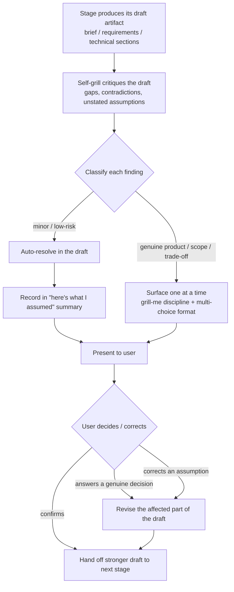

# Self-Grilling Planning Stages

**Ticket:** TBD

**Discovery Brief:** docs/discovery/quality-gated-pipeline/brief.md

**Epic:** [Quality-Gated Pipeline](spec.md)

Each of the three planning stages — the discovery stage (shaping an idea), the
requirements stage (turning it into requirements), and the technical-detail
stage (adding technical depth) — now stress-tests its own draft for gaps,
contradictions, and unstated assumptions, fixes what it safely can on its own,
and surfaces to the user only the few decisions that genuinely need a human, in
plain language. This removes the separate, manual stress-test the user runs
today and replaces an interrogation-style back-and-forth with a short, focused
set of real choices plus a clear summary of the assumptions that were made.

## User Story

As a forge user, I want each planning stage to stress-test its own draft and
ask me only the decisions that truly need me — instead of making me run a
separate grilling step and answer a long string of questions — so that I get a
higher-quality result with far less effort and without feeling interrogated.

## Background & Context

**Current state:**

- The pipeline shapes a feature in stages: first the discovery stage turns a
  fuzzy idea into a brief, then the requirements stage turns that into
  requirements, then the technical-detail stage adds technical depth.
- To raise quality, the user manually runs a separate "grilling" stress-test
  after a planning stage, then reads through it. That stress-test is a
  relentless, one-question-at-a-time interview.
- The interview asks the user about every open branch, even ones the stage
  could reasonably settle itself, which is extra effort and can feel like an
  interrogation — especially for a non-technical user.

**Problem:**

- The user carries the quality effort by hand at every planning stage. Running
  a separate stress-test after each stage is a tax paid on every feature.
- The interview surfaces too much. Many questions have an obvious answer the
  stage could resolve on its own, so the user spends time confirming things
  that did not need a human at all.
- When a question is surfaced without the reasoning behind it, a non-technical
  user tends to accept the suggestion on faith, with no easy way to tell
  whether it is right.

## Target User & Persona

- **Who:** A forge user — a maker shaping an idea into requirements, ranging
  from a non-technical product owner to a solo developer.
- **Context:** They are moving an idea through the three planning stages —
  discovery, requirements, and technical detail — and want a strong result
  without babysitting the process or being interrogated.
- **Current workaround:** After each planning stage they manually launch a
  separate stress-test and answer its questions one by one, then fold the
  outcome back into the draft by hand.

## Goals

- Embed the stress-test inside each of the three planning stages so the user
  never has to launch it separately.
- Point the stress-test at the stage's own draft — finding gaps,
  contradictions, and unstated assumptions — rather than interrogating the
  user.
- Resolve everything the stage can safely settle on its own, and surface only
  the few decisions that genuinely need a human.
- When the stage is confident, ask nothing and instead show a short,
  plain-language summary of the assumptions it made, which the user can confirm
  or correct.
- Keep the user firmly in control: the stage assists, but the user makes every
  genuine product or scope call at these three stages.

## Non-Goals

- The build stage's self-completing loop. That is a separate story; this story
  covers only the three planning stages.
- Making genuine product or scope decisions on the user's behalf at any
  planning stage. The stage may settle minor, low-risk gaps, but it never
  decides a real product or scope question for the user.
- Inventing a new questioning method. This story reuses the existing grilling
  discipline — good, specific questions asked one decision at a time, each with
  a recommended answer to react to — pointed at the draft.
- Redefining what makes a good brief, good requirements, or good technical
  detail. The stages still produce the same kinds of artifacts; only the
  stress-test is now built in and self-directed.

## User Workflow

1. **The user works through a planning stage** — They are shaping their idea in
   the discovery stage, the requirements stage, or the technical-detail stage,
   as they do today. They do not launch a separate stress-test.
2. **The stage drafts its output and stress-tests it** — Behind the scenes, the
   stage produces its draft (a brief, a set of requirements, or technical
   detail) and quietly stress-tests its own work for gaps, contradictions, and
   unstated assumptions.
3. **The stage resolves what it safely can** — Minor, low-risk gaps the stage
   can reasonably settle on its own are fixed without bothering the user, and
   noted so the user can see what was assumed.
4. **The stage surfaces only the genuine decisions** — For the few choices that
   truly need a human, the stage asks one decision at a time, in plain
   language, each with a recommended answer and the reason behind it, so the
   user has something concrete to react to.
5. **The user decides, or confirms the assumptions** — The user answers the
   genuine decisions. When there are none, the stage instead shows a short
   "here's what I assumed" summary the user can confirm or correct.
6. **The stage updates its output** — The user's answers and any corrections
   are folded back into the draft, and the stage hands off a stronger result to
   the next stage.

## Acceptance Criteria

### Scenario: Discovery stage surfaces a single genuine decision

```gherkin
Given Maya is shaping a referral-rewards idea in the discovery stage
  And the stage has drafted a brief from her idea
When the stage stress-tests its own draft
  And it finds a gap in who the reward is for
Then the stage surfaces exactly one plain-language decision about who qualifies for a reward
  And the decision includes a recommended answer and the reason behind it
  And no separate stress-test step is required of Maya
When Maya chooses that only existing customers who refer a new signup qualify
Then the draft brief is updated to reflect that choice
  And the stage continues without re-asking a question Maya has already settled
```

### Scenario: Requirements stage surfaces a contradiction between two requirements

```gherkin
Given Reza is shaping a notifications feature in the requirements stage
  And the stage has drafted requirements that include "users receive a notification for every comment"
  And the same draft includes "users in quiet hours receive no notifications"
When the stage stress-tests its own requirements
Then the stage detects the contradiction between the two requirements
  And it surfaces one plain-language decision asking which requirement wins during quiet hours
  And the decision includes a recommended answer and the reason behind it
When Reza decides that quiet hours suppress all notifications until morning
Then the draft requirements are updated so the two requirements no longer conflict
  And the resolved decision is reflected in the requirements
```

### Scenario: Technical-detail stage surfaces a genuine trade-off in plain language

```gherkin
Given Priya is adding technical depth to an export feature in the technical-detail stage
  And the stage has drafted technical detail for how a large export is delivered
When the stage stress-tests its own technical draft
  And it finds a genuine trade-off between delivering the export instantly and delivering it reliably for very large files
Then the stage surfaces one plain-language decision describing the trade-off without technical jargon
  And the decision includes a recommended answer and the reason behind it
When Priya chooses that very large exports are prepared in the background and the user is told when they are ready
Then the draft technical detail is updated to match her choice
  And the trade-off she accepted is recorded in plain language
```

### Scenario: Confident draft asks nothing and shows an assumptions summary

```gherkin
Given Maya is shaping a simple "add a profile photo" idea in the discovery stage
  And the stage has drafted a brief it is confident in
When the stage stress-tests its own draft
  And it finds no decision that genuinely needs a human
Then the stage asks Maya no questions
  And the stage shows a short plain-language summary titled "here's what I assumed"
  And the summary lists the assumptions the stage made, such as "the photo replaces any existing photo" and "the photo is visible only to the user's connections"
  And Maya can confirm or correct any assumption in the summary
```

### Scenario: User corrects an assumption and the output is revised

```gherkin
Given the discovery stage has shown Maya an assumptions summary for the profile-photo idea
  And one assumption reads "the photo is visible only to the user's connections"
When Maya corrects that assumption to "the photo is visible to everyone, like a public avatar"
Then the stage revises the draft brief to match the corrected assumption
  And the revised summary reflects Maya's correction
  And no unrelated assumptions are changed
```

### Scenario: Minor gap is resolved without asking and noted in the summary

```gherkin
Given Reza is shaping the notifications feature in the requirements stage
  And the stage has drafted requirements that do not say what happens when a notification cannot be delivered
  And this is a minor, low-risk gap the stage can reasonably settle on its own
When the stage stress-tests its own requirements
Then the stage resolves the gap on its own by assuming an undelivered notification is retried later that day
  And the stage does not ask Reza about it
  And the assumptions summary notes that it assumed undelivered notifications are retried later that day
  And Reza can correct that assumption if he disagrees
```

### Scenario: Many candidate questions are filtered down to the genuine decisions

```gherkin
Given Priya is shaping a multi-part billing feature in the requirements stage
  And the stage's stress-test produces a long list of candidate questions while critiquing its own draft
  And most candidates are minor points the stage can settle on its own
When the stage decides what to surface to Priya
Then the stage surfaces only the few decisions that genuinely need a human
  And Priya is never shown a long checklist of questions
  And the decisions are presented one at a time, each in plain language with a recommended answer and a reason
  And the minor points the stage settled itself appear in the assumptions summary rather than as questions
```

### Scenario: The same self-grilling behavior applies across all three stages

```gherkin
Given a forge user is working through a planning stage
When the stage produces its draft and stress-tests its own output
Then the stage resolves the minor gaps it can settle and surfaces only the genuine decisions

  Examples:
    | stage                  | draft produced       | genuine decision surfaced                          |
    | discovery stage        | a brief              | who qualifies for a referral reward                |
    | requirements stage     | a set of requirements| which requirement wins during quiet hours          |
    | technical-detail stage | technical detail     | instant delivery versus reliable large-file export |
```

### Scenario: The user, not the stage, makes every genuine call

```gherkin
Given the requirements stage has found a genuine product decision while stress-testing its own draft
  And the decision is which plan tiers can use the new export feature
When the stage surfaces the decision with a recommended answer
Then the stage does not choose on Reza's behalf
  And the draft is updated only after Reza picks an answer
  And if Reza disagrees with the recommended answer, the stage uses his choice instead
```

## Business Rules & Constraints

- **The stress-test is built into all three planning stages.** The discovery
  stage, the requirements stage, and the technical-detail stage each
  stress-test their own draft. The user never launches a separate stress-test
  step.
- **The stress-test targets the draft, not the user.** It critiques the stage's
  own output for gaps, contradictions, and unstated assumptions. It does not
  interrogate the user.
- **Settle the minor, surface the genuine.** The stage resolves minor, low-risk
  gaps on its own and surfaces only the decisions that genuinely need a human —
  real product, scope, or trade-off calls.
- **Genuine decisions are the user's to make.** At these three stages the stage
  assists but never decides a genuine product or scope question on the user's
  behalf. The draft is updated only after the user chooses, and if the user
  disagrees with the recommended answer, the user's choice wins.
- **Decisions are surfaced in the existing grilling style.** Each surfaced
  decision is presented one at a time, in plain language, with a recommended
  answer and the reason behind it — so the user has something concrete to react
  to. The user is never shown a long checklist.
- **A confident stage asks nothing and summarizes its assumptions.** When the
  stress-test finds no decision that genuinely needs a human, the stage asks no
  questions and instead shows a short "here's what I assumed" summary the user
  can confirm or correct.
- **Self-resolved gaps are disclosed.** Anything the stage settled on its own is
  recorded in the assumptions summary so the user can see what was assumed and
  correct it.
- **A correction revises the output.** When the user corrects an assumption, the
  stage revises that part of the draft to match and leaves unrelated parts
  unchanged.

## Success Metrics

- **The separate stress-test step disappears from the planning stages.** The
  user no longer launches a standalone grilling step after the discovery,
  requirements, or technical-detail stage; the stress-test happens inside each
  stage on every feature.
- **The number of questions surfaced per stage stays small.** Each stage
  surfaces only a handful of genuine decisions, not a long checklist, and many
  confident drafts surface none at all.
- **Confident drafts produce an assumptions summary instead of questions.** When
  a stage is confident, the user receives a short, plain-language summary they
  can confirm or correct rather than a string of questions.
- **The user can act on every surfaced decision without help.** Because each
  surfaced decision carries a recommended answer and a reason in plain language,
  the user can decide without separate explanation, and "I don't understand this
  question" moments fall.

## Dependencies

- **Reuses the existing grilling discipline.** This story points the existing
  stress-test method — good, specific questions asked one decision at a time,
  each with a recommended answer to react to — at the stage's own draft. It does
  not invent a new questioning method.
- **Builds on the three existing planning stages.** The discovery, requirements,
  and technical-detail stages already produce their respective drafts; this
  story embeds the self-directed stress-test into each of them.
- **Soft pairing with the plain-language and trust layer.** That separate story
  standardizes plain language and the stated reason behind every recommendation
  across the whole pipeline. This story already presents surfaced decisions in
  plain language with a reason; full, consistent coverage comes when both
  stories are in place.

## Rollout Considerations

- **Changes take effect in the next session.** A change to how a stage behaves
  takes effect the next time the user starts a session, not in the middle of an
  in-progress one. Communicate this so users are not surprised when a session
  already underway still behaves the old way.

## Open Questions

- [x] ~~Should the user still run a separate stress-test after each planning
  stage?~~ — **Resolved:** No. The stress-test is embedded in each of the three
  planning stages and runs on the stage's own draft automatically.
- [x] ~~Does the stress-test interrogate the user or critique the draft?~~ —
  **Resolved:** It critiques the stage's own draft, defaults to resolving what
  it safely can, and surfaces only genuine decisions.
- [x] ~~What happens when the stage is confident and has no genuine decision to
  surface?~~ — **Resolved:** It asks nothing and shows a short "here's what I
  assumed" summary the user can confirm or correct.
- [x] ~~Can the stage decide a genuine product or scope question on the user's
  behalf?~~ — **Resolved:** No. At these three stages the user makes every
  genuine call; the stage may settle only minor, low-risk gaps, and it discloses
  those in the assumptions summary.
- [ ] The exact line between a "minor gap the stage can settle" and a "genuine
  decision the user must make" — **Deferred (non-blocking):** the principle
  (settle minor and low-risk, surface genuine product/scope/trade-off calls) is
  settled and enough to build against; the precise threshold is a
  technical-refinement detail.

---

> Added by `/prd-refine`. The business content above is unchanged. These
> technical sections elaborate this story's slice of the epic and stay
> consistent with the canonical **[Shared Architecture Notes (Technical)](spec.md#shared-architecture-notes-technical)**.
>
> **What "implementation" means here:** forge is a Claude Code plugin. There is
> no application runtime, HTTP API, database, or UI in scope. Every sub-task is
> either a new markdown reference (`plugins/forge/references/self-grill.md`) or
> an edit to a skill instruction file (`plugins/forge/skills/<skill>/SKILL.md`).
> Accordingly, the **API Design**, **Data Model & Migrations**, and
> **UI/Frontend Requirements** sections are N/A and deleted.

## Functional Requirements

The self-grill procedure is defined **once** in the new shared reference
`plugins/forge/references/self-grill.md` and invoked, unchanged, by each of the
three planning skills at its existing interrogation step. The procedure runs in
this order: produce the draft artifact → critique the draft → classify each
finding → auto-resolve the minor ones and record them → surface only the genuine
decisions one at a time → fold the user's answers/corrections back into the
draft → hand off.

- **Producer-before-consumer ordering (load-bearing).** The self-grill MUST run
  on the **draft artifact** — after the stage has produced it but **before** the
  draft is presented, finalized, or handed to the next stage. This is the repo
  learning `blocker-skill-step-numbering-vs-data-deps`: the producer step (draft
  exists) must run before the consumer step (self-grill). Each edited skill step
  MUST make this explicit — name the artifact it grills and state that the draft
  must exist first. The self-grill MUST NOT run on a not-yet-drafted artifact
  (an empty or partial draft yields nothing meaningful to critique).
- **Classify-gap rule.** For every finding the critique produces, the procedure
  MUST classify it as exactly one of:
  - **Minor / low-risk gap** — an omission or ambiguity with an obvious,
    reasonable default that does not change product scope, a product decision,
    or a trade-off the user would care about. The stage MUST resolve it itself.
  - **Genuine decision** — a real product, scope, or trade-off call (who
    qualifies, which requirement wins, instant-vs-reliable delivery). The stage
    MUST surface it to the user and MUST NOT decide it on the user's behalf at
    these three stages.
- **Always disclose self-resolved gaps.** Every gap the stage resolves itself
  MUST appear in an "assumptions I made" summary (a "here's what I assumed"
  block), in plain language, regardless of how minor. Nothing is silently
  resolved without disclosure. The user MUST be able to correct any listed
  assumption.
- **Never decide a genuine product/scope question for the user.** At discovery,
  prd, and prd-refine, a genuine product/scope/trade-off decision is the user's
  to make. The draft is updated for that decision only after the user chooses;
  if the user disagrees with the recommended answer, the user's choice wins.
- **Reuse the existing questioning discipline — no new method.** Surfaced
  decisions MUST use the existing `grill-me` discipline (one decision at a time;
  the question, why it matters, a recommended answer with its reason) rendered
  through the existing `${CLAUDE_PLUGIN_ROOT}/references/multi-choice.md` format
  (numbered options, recommended choice, "Other" escape hatch). The procedure
  MUST NOT invent a new prompt format, a checklist dump, or any other questioning
  mechanism.
- **Confident draft surfaces nothing.** When the classify step yields zero
  genuine decisions, the stage MUST ask no questions and instead present only
  the assumptions summary (which may be empty or short), which the user can
  confirm or correct. A string of confirmation questions is forbidden.
- **A correction revises only the affected part.** When the user corrects an
  assumption, the stage MUST revise the part of the draft that depends on that
  assumption and leave unrelated parts unchanged, then reflect the correction in
  the summary.
- **Idempotency.** Re-running the self-grill on an unchanged, already-grilled
  draft MUST surface nothing new — no new questions and no new assumptions
  beyond those already recorded. The procedure is a function of the draft's
  content: same draft in, same classification out. (A draft revised by a
  correction is a *different* draft and may legitimately produce a different
  result.)

### Validation & Business Rules

- A finding classified as a genuine decision that is surfaced but **not yet
  answered** MUST NOT cause the draft to change for that decision; the stage
  blocks on the user.
- The assumptions summary MUST list **every** self-resolved gap, not a sample.
- The procedure MUST NOT escalate a minor gap into a question, nor demote a
  genuine product/scope/trade-off into a silent assumption.

## Permissions & Security

- **Scope:** Developer-local tooling. The self-grill runs inside an interactive
  Claude Code session on the developer's machine while shaping a spec. No new
  surface of any kind is introduced.
- **Authorization:** None. There is no service, endpoint, or privileged action.
  The only "actor" is the local user driving their own session.
- **Input validation:** The only inputs are the stage's own draft artifact
  (markdown the session already holds) and the user's free-text/multi-choice
  answers. No untrusted external input, no network call, no file outside the
  repo's `docs/` and `plugins/` trees is read or written.

## System Design

### Components

- **`plugins/forge/references/self-grill.md` (NEW — single source of truth).**
  A plugin-shared reference (loaded via `${CLAUDE_PLUGIN_ROOT}/references/`)
  that defines the self-grill procedure end to end: critique the supplied draft
  for gaps / contradictions / unstated assumptions; classify each finding
  (minor/low-risk auto-resolve vs. genuine product/scope/trade-off); resolve the
  minor ones and record them in the "here's what I assumed" summary; surface only
  the genuine decisions one at a time (reusing the `grill-me` discipline and the
  `multi-choice.md` format); when confident, surface zero questions and only the
  summary; accept a user correction to any assumption and revise the affected
  part of the draft. It is the only place the procedure is written.
- **`plugins/forge/skills/product-discovery/SKILL.md` — Step 4 "Quick
  pressure-test" (EDITED).** Today this step runs a light inline check on the
  problem list and explicitly does *not* invoke `grill-me`. It is rewritten to
  invoke the shared self-grill on the stage's **draft brief** — which means the
  brief must be drafted first. (Because discovery currently writes the brief at
  Step 8, the edit must ensure a draft brief exists before the self-grill runs;
  see the Implementation Plan.)
- **`plugins/forge/skills/prd/SKILL.md` — Step 4 "Product Interrogation Gate"
  (EDITED).** Today this step says to run the `grill-me` skill on the
  requirements. It is rewritten to invoke the shared self-grill on the stage's
  **draft requirements**, keeping the existing restriction that questions stay on
  product/business concerns (no architecture/API/DB) for the product-owner
  audience.
- **`plugins/forge/skills/prd-refine/SKILL.md` — Step 1.5 "Design Interrogation
  Gate" (EDITED).** Today this step says to run the `grill-me` skill on the
  feature. It is rewritten to invoke the shared self-grill on the stage's
  **draft technical sections**.

### Interfaces

There are no programmatic interfaces. The "interface" is a markdown
instruction contract: each edited skill step loads the shared reference and
states what draft it points the procedure at.

- **How a skill calls the procedure:** the edited step reads
  `${CLAUDE_PLUGIN_ROOT}/references/self-grill.md` and follows it, passing **its
  own draft artifact** as the thing to critique:

  | Skill (edited step)                     | Draft artifact passed to self-grill |
  | --------------------------------------- | ----------------------------------- |
  | `product-discovery` (Step 4)            | the draft **brief**                 |
  | `prd` (Step 4)                          | the draft **requirements**          |
  | `prd-refine` (Step 1.5)                 | the draft **technical sections**    |

- **What the procedure references in turn:** `self-grill.md` reuses the existing
  `grill-me` questioning discipline (from
  `plugins/forge/skills/grill-me/SKILL.md`) and the existing
  `${CLAUDE_PLUGIN_ROOT}/references/multi-choice.md` prompt format. It defines no
  new prompt mechanism.

### Data flow



### Tradeoffs considered

- **Shared reference vs. duplicating the procedure in each skill.** Chosen:
  **one shared reference** (`plugins/forge/references/self-grill.md`) that all
  three skills invoke. A single source of truth keeps the classify rule, the
  disclosure rule, and the questioning discipline identical across stages and
  avoids three copies drifting apart. This is a standard single-responsibility
  call (extract a reused procedure into a shared reference, exactly as
  `multi-choice.md` already does) — **not an ADR-worthy architectural tradeoff**,
  so no ADR is written.
- **Fully-silent-when-confident vs. always-confirm-assumptions.** Chosen:
  **confident → an assumptions summary the user can correct**, never a string of
  confirmation questions. The user always sees what was assumed (so a wrong
  auto-resolution is visible and correctable) without being interrogated when the
  draft needs no genuine decision. "Fully silent" would hide self-resolved gaps
  (failing the disclosure requirement); "always confirm every assumption as a
  question" would recreate the interrogation this story removes.

## Threat Model Checklist

- **Data classification — N/A.** No PII, secrets, or sensitive data. The
  procedure reads the developer's own draft spec markdown and their answers; it
  handles no user data.
- **Attack surface — N/A.** No new endpoints, deserializers, file uploads,
  redirects, or network calls. The change is markdown instructions interpreted
  inside a local Claude Code session.
- **Authn / authz changes — N/A.** No roles, middleware, or routes; no
  privileged action exists to gate.
- **Dependency additions — N/A.** No new packages or services. The procedure
  reuses the in-repo `grill-me` discipline and `multi-choice.md` format only.
- **One real (non-security) risk class — wrong auto-resolution.** The genuine
  risk here is correctness, not security: the stage could mis-classify a
  *genuine* product/scope decision as a *minor* gap and bake a bad assumption
  silently into the spec. **Mitigation:** the procedure ALWAYS discloses every
  self-resolved gap in the "here's what I assumed" summary, in plain language,
  and lets the user correct any of them — which revises the affected part of the
  draft. This is a correctness safeguard, not a security control, but it bounds
  the blast radius of a misclassification to "visible and correctable" rather
  than "silent."

## Architecture Notes

- **New dependencies:** none. No packages, services, or external tools. The only
  new artifact is one in-repo markdown reference.
- **Dependencies & integration:** the self-grill **reuses** the existing
  `grill-me` questioning discipline (one decision at a time; question + why +
  recommended answer with reason) and the existing
  `${CLAUDE_PLUGIN_ROOT}/references/multi-choice.md` prompt format. It changes no
  external contract: `grill-me` keeps its current behavior as a standalone skill;
  `multi-choice.md` is unchanged by this story. The three edited skill steps
  replace their current interrogation instruction with an invocation of the
  shared reference, pointed at their own draft.
- **Exemplar files:**
  - `plugins/forge/skills/grill-me/SKILL.md` — the standard for question quality
    (specific over vague, recommended answer + reason, one at a time) the
    surfaced decisions must meet.
  - `plugins/forge/skills/prd/SKILL.md` Step 4 prose — the model for how a
    planning step frames and restricts its interrogation gate; the rewrite should
    read like it.
  - `plugins/forge/references/multi-choice.md` — the existing shared-reference
    shape and prose style to mirror when authoring `self-grill.md`.

## Implementation Plan

### Sub-tasks

**Task 1: Write `plugins/forge/references/self-grill.md`** — _medium_

- Files: `plugins/forge/references/self-grill.md` (new)
- Authors the full procedure: critique the supplied draft → classify each
  finding (minor/low-risk vs. genuine product/scope/trade-off) → auto-resolve and
  record minors in the "here's what I assumed" summary → surface only genuine
  decisions one at a time via the `grill-me` discipline + `multi-choice.md`
  format → confident path surfaces zero questions, only the summary → accept a
  correction and revise the affected part of the draft. States the
  producer-before-consumer ordering requirement and the idempotency property as
  part of the contract.
- INDEPENDENT

**Task 2: Edit `product-discovery` Step 4 to invoke the self-grill on the draft
brief** — _small_

- Files: `plugins/forge/skills/product-discovery/SKILL.md`
- Replaces the current "Quick pressure-test" (which does a light inline check
  and explicitly avoids `grill-me`) with an invocation of
  `${CLAUDE_PLUGIN_ROOT}/references/self-grill.md` pointed at the draft brief.
  Makes the ordering explicit: a draft brief must exist before the self-grill
  runs (ensure a draft is produced ahead of this step, before the Step 8
  write/hand-off), and the self-grill runs before the brief is presented or
  handed to `/prd`.
- SEQUENTIAL (depends on Task 1 — the reference must exist to invoke).
  Parallelizable with Tasks 3 and 4.

**Task 3: Edit `prd` Step 4 to invoke the self-grill on the draft
requirements** — _small_

- Files: `plugins/forge/skills/prd/SKILL.md`
- Replaces "run the `grill-me` skill on these requirements" in the "Product
  Interrogation Gate" with an invocation of
  `${CLAUDE_PLUGIN_ROOT}/references/self-grill.md` pointed at the draft
  requirements. Preserves the existing product/business-only question restriction
  for the product-owner audience. Makes ordering explicit: the requirements draft
  must exist (Step 3 context loaded, draft formed) before the self-grill runs,
  and it runs before template fill / hand-off.
- SEQUENTIAL (depends on Task 1). Parallelizable with Tasks 2 and 4.

**Task 4: Edit `prd-refine` Step 1.5 to invoke the self-grill on the draft
technical sections** — _small_

- Files: `plugins/forge/skills/prd-refine/SKILL.md`
- Replaces "run the `grill-me` skill on the feature" in the "Design
  Interrogation Gate" with an invocation of
  `${CLAUDE_PLUGIN_ROOT}/references/self-grill.md` pointed at the draft technical
  sections. Makes ordering explicit: the technical-sections draft must be
  produced before the self-grill runs, and it runs before the spec is presented
  for approval.
- SEQUENTIAL (depends on Task 1). Parallelizable with Tasks 2 and 3.

**Task 5: Dry-run verification in a fresh session** — _small_

- Files: none (verification only; may produce throwaway scratch inputs under
  `docs/discovery/` or `docs/specs/` that are not committed)
- Runs the Test Scenarios below in a new session and runs the `verifier` skill
  for markdown lint on the changed files.
- SEQUENTIAL (depends on Tasks 2–4 being complete).

**Parallelism summary (honest):** Task 1 must land first because Tasks 2–4 all
invoke the file it creates. Once Task 1 exists, Tasks 2, 3, and 4 touch three
different files and can run in parallel. Task 5 runs last, after 2–4.

### Negative Constraints

- Do NOT make genuine product/scope/trade-off decisions for the user at the
  discovery, prd, or prd-refine stages — surface them; the user decides.
- Do NOT invent a new question format. Reuse the `grill-me` discipline and the
  existing `${CLAUDE_PLUGIN_ROOT}/references/multi-choice.md` format.
- Do NOT remove the user's ability to correct any assumption in the summary, and
  do NOT silently resolve a gap without listing it in the summary.
- Do NOT run the self-grill before the draft exists — the draft artifact is the
  required input (producer-before-consumer ordering).
- Do NOT modify `grill-me`'s standalone behavior or change `multi-choice.md` —
  this story only adds `self-grill.md` and rewrites three skill steps.
- Do NOT duplicate the self-grill procedure inside the three skills — they invoke
  the shared reference.

## Test Scenarios

> Skills load at session start (`blocker-skills-load-at-session-start`), so every
> scenario is a **manual dry-run in a FRESH session** after the edits land. There
> is no unit/E2E harness in this repo; observable behavior in the session is the
> assertion.

**Test 1: Discovery — scratch idea with a deliberate gap surfaces exactly one
decision**

- Setup: New session. Run `/product-discovery` on a scratch idea —
  "referral rewards for our app" — deliberately leaving *who qualifies for a
  reward* unstated (the Maya scenario).
- Action: Let discovery draft a brief and self-grill it.
- Expected: The stage surfaces **exactly one** plain-language decision — who
  qualifies for a reward — in `multi-choice` form with a recommended answer and
  its reason, one at a time. It also shows a "here's what I assumed" summary for
  any minor gaps it settled. No separate `grill-me` invocation is required, and
  no long checklist appears.

**Test 2: Discovery — confident simple draft surfaces zero questions, only the
assumptions summary**

- Setup: New session. Run `/product-discovery` on a simple, well-bounded idea —
  "add a profile photo" (the Maya confident-draft scenario).
- Action: Let discovery draft the brief and self-grill it.
- Expected: The stage asks **zero questions** and shows a short "here's what I
  assumed" summary listing its assumptions (e.g. "the photo replaces any existing
  photo", "the photo is visible only to the user's connections"), each
  correctable. No string of confirmation questions.

**Test 3: User corrects one assumption → only that part of the draft changes**

- Setup: Continue Test 2's session, with the assumptions summary on screen
  including "the photo is visible only to the user's connections".
- Action: Correct that one assumption to "the photo is visible to everyone, like
  a public avatar".
- Expected: The stage revises **only** the visibility-related part of the draft
  brief and the summary line; unrelated assumptions (e.g. "replaces any existing
  photo") are unchanged.

**Test 4: Requirements — many minor gaps, none surfaced as questions**

- Setup: New session. Run `/prd` on a multi-part billing feature (the Priya
  scenario) whose draft requirements have many small, low-risk omissions plus
  one genuine product decision (which plan tiers can use export).
- Action: Let prd draft the requirements and self-grill them.
- Expected: Only the **genuine** decision (plan tiers) is surfaced — one at a
  time, plain language, recommended answer + reason. The many minor gaps appear
  in the assumptions summary, **not** as questions. Priya is never shown a long
  checklist.

**Test 5: Requirements — contradiction is detected and surfaced (Reza)**

- Setup: New session. Run `/prd` on a notifications feature whose draft
  requirements contain a contradiction — "users receive a notification for every
  comment" vs. "users in quiet hours receive no notifications".
- Action: Let prd self-grill the draft requirements.
- Expected: The stage detects the contradiction and surfaces one plain-language
  decision — which requirement wins during quiet hours — with a recommended
  answer and reason. After Reza decides, the two requirements no longer conflict.

**Test 6: prd-refine — technical trade-off surfaced in plain language (Priya)**

- Setup: New session. Run `/prd-refine` on an export feature spec whose draft
  technical sections contain a genuine instant-vs-reliable-for-large-files
  trade-off.
- Action: Let prd-refine draft the technical sections and self-grill them.
- Expected: One plain-language decision describing the trade-off (no jargon), with
  a recommended answer and reason. After Priya chooses background preparation, the
  draft technical detail is updated and the accepted trade-off is recorded.

**Test 7: Idempotency — re-grilling an unchanged draft surfaces nothing new**

- Setup: After Test 2 (confident draft, already grilled, assumptions confirmed),
  re-trigger the self-grill on the unchanged brief in the same session.
- Expected: No new questions and no new assumptions beyond those already recorded
  — the procedure produces the same classification for the same draft.

## Verification

All verification is by manual dry-run in a **fresh session** (skills load at
session start; mid-session edits do not hot-reload). There is no unit or E2E
framework in this repo.

- Run **Test 1–Test 7** above in a new session and confirm each expected
  observable behavior.
- Run the **`verifier` skill** for markdown lint on the changed files:
  `plugins/forge/references/self-grill.md`,
  `plugins/forge/skills/product-discovery/SKILL.md`,
  `plugins/forge/skills/prd/SKILL.md`, and
  `plugins/forge/skills/prd-refine/SKILL.md`.
- Spot-check that each edited skill step names the draft artifact it grills and
  states the producer-before-consumer ordering (draft exists → self-grill →
  present/hand off).
