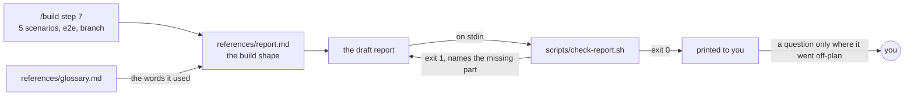
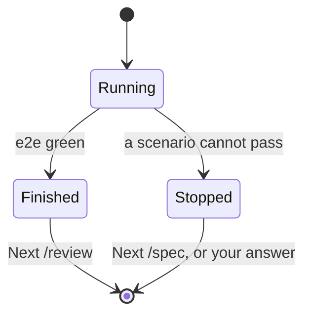
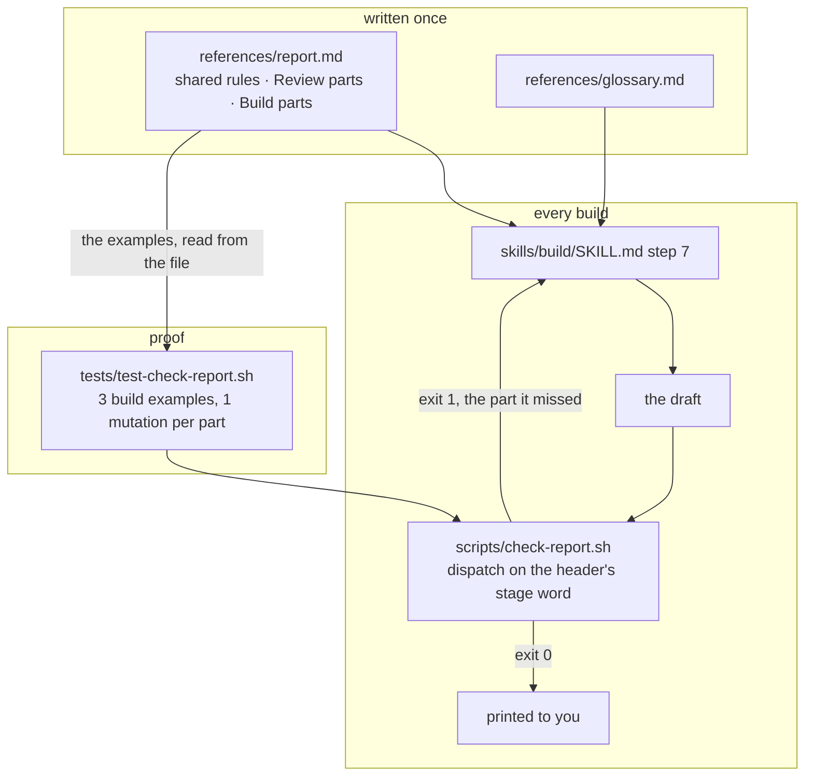
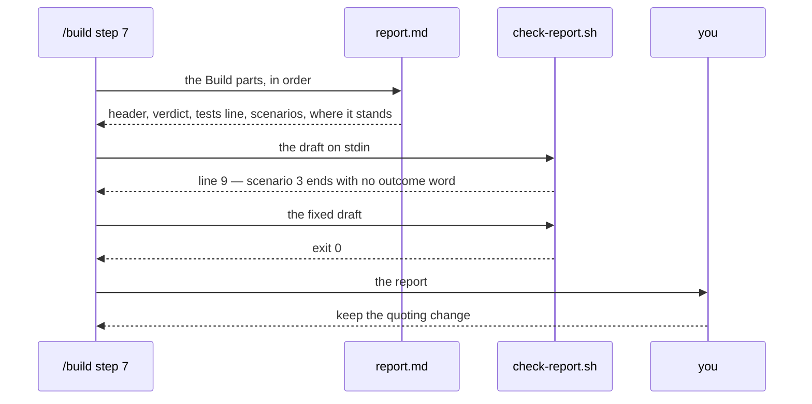

# Readable build reports

**Version:** v1 · **Status:** Refined · **Type:** Enhancement · **Project type:** CLI/Library

**Shape doc:** docs/specs/readable-replies/shape.md
**Depends on:** Readable review findings (docs/specs/readable-review-findings.md) — shipped
**Page:** none — your `CLAUDE.md` says you read the `.md` directly

`/build` prints its end-of-run report in the same fixed shape `/review` already uses:
good or bad news first, one plain line per acceptance scenario, where the branch stands,
and the one command to type next. A build that stops part-way gets the same shape with
the bad news at the top.

## Problem

`/build` runs for a long time and then prints whatever it feels like. The whole
definition of that report is two lines — `plugins/zuko/skills/build/SKILL.md:127-128`:
"chunks and their results, tests added and passing, the e2e result, the flag name, the
branch, and anything you did that the plan did not anticipate."

Six things in one sentence, in no stated order, with five words that mean nothing unless
you already know how zuko works: chunk, e2e, flag, branch, plan. So the longest-running
stage produces the report you are least able to read, at the moment you most need to know
what state the project is in.

Slice 1 fixed this for `/review` and left behind the machinery to fix it here: a written
contract at `plugins/zuko/references/report.md`, a word list at
`plugins/zuko/references/glossary.md`, and a script that reads a report and says whether
it conforms. None of it works on a build report today —
`plugins/zuko/scripts/check-report.sh:121` demands a count line saying how many findings
were raised and how many held up, which a build has none of. The checker would reject
every build report ever written.

## Slice test

| Check | Result |
| ----- | ------ |
| Cuts every layer it needs | yes — the contract gains the build shape, `/build` prints it, `check-report.sh` reads it, and a fixture test proves the checker |
| One e2e test walks it | yes — the build examples read out of `references/report.md` through `check-report.sh`: the conforming ones pass, then one mutation per required part fails and names that part |
| Worth shipping alone | yes — the next build you run, you can read without asking what any of it means |
| Fits (≤5 scenarios, ≤2 areas) | yes — 5 scenarios, two areas (`references/` + `skills/build/`, and `scripts/`) |

**Path:** full — it adds a second report shape and a second branch inside the checker, and
touches six files, so neither light-path trigger holds.

## User story

As the person who typed `/build` and walked away, I want the report at the end to tell me
in plain words whether it worked, what works now, and what to type next, so that I can
act on it without asking a follow-up question or approving something I did not read.

## Flow



The build composes its report against the contract, hands the draft to the checker before
you ever see it, and prints only what passed.

## States



Two end states, two verdicts, one shape. Which one you are reading is obvious from the
second line, not from counting how many things are red.

## Acceptance criteria

```gherkin
Scenario: The build finished and everything went to plan
  Given /build ran docs/specs/csv-export.md on branch feat/csv-export
  And all 4 acceptance scenarios pass, the end-to-end test is green,
    and 3 commits were made across 6 files
  When the report prints
  Then its first line is "Build: csv-export — 6 files, 3 commits"
  And the line under it says, in plain words, that it is built and runs end to end
  And one line follows per scenario, in the spec's order, each naming what now
    works and whether it is green
  And it says the branch is feat/csv-export and the flag csv_export is off
  And no line asks you to decide anything
  And the last line is "Next: /review"

Scenario: The build stopped part-way
  Given /build ran the same spec, and scenario 3 "a row with a comma in it"
    cannot pass because the spec says commas are escaped and the export library
    quotes the whole field instead
  When the report prints
  Then the line under the header says what stopped it, before anything green
  And scenarios 1 and 2 are listed green, scenario 3 red, with one plain
    sentence saying what it hit
  And it says the branch is feat/csv-export and that 2 commits are on it
  And it ends with one question: change the spec, or change the export?
  And the last line names /spec, not /review

Scenario: Something the plan did not anticipate
  Given the same finished build, except scenario 2 needed a change to
    lib/csv/quote.ts, a file the plan's Changes table never named
  When the report prints
  Then all 4 scenarios are listed green, as in the first scenario
  And one block names the off-plan change: what it is, why it was needed,
    and where it is as file:line
  And that block ends with its own question
  And the last line is still "Next: /review"

Scenario: Every word you might not know is defined
  Given a build report that uses the words "e2e", "worktree" and "feature flag"
  When it prints
  Then a Glossary at the bottom defines those three words, one plain line each
  And a report that uses no word from references/glossary.md prints no Glossary
  And a word the report needs that references/glossary.md does not have yet is
    written into that file in the same run

Scenario: A build report that breaks the contract is caught
  Given a build report with no scenario list, or a scenario line saying neither
    green nor red, or an off-plan block with no question, or a last line naming
    no next command
  When scripts/check-report.sh reads it
  Then it exits 1 and names the missing part and the line it expected it on
  And a report headed "Build:" is never asked for the review's count line
  And a header whose stage word is neither Build nor Review exits 1 and says so
  And a conforming build report exits 0 and says what it checked
```

## Scope

**In:**

- The report `/build` prints at step 7, in both end states: finished, and stopped
  part-way.
- `references/report.md`: the build shape's parts table and its worked examples, beside
  the review ones already there.
- `references/glossary.md`: the words a build report reaches for that the file lacks.
- `scripts/check-report.sh`: tells a build report from a review one by its header, and
  holds each to its own parts.
- `skills/build/SKILL.md:125-135`: step 7 rewritten to compose against the contract and
  check the draft before printing.

**Out:**

- Live lines while the build is still running — slice 3.
- Wiring `check-report.sh` into the Stop hook so a bad report fails the turn — slice 4.
- `/spec`, `/ship`, `/status`, `/debug` — slice 5.
- The `chunk-builder` agent's own output. It reports to `/build`, not to you; only the
  report composed from its results changes.
- The review report's shape. It shipped in slice 1 and does not move here.
- What the build actually does — which tests run, how chunks split, when it stops. Only
  the words at the end change.

## Interface

The report is the interface. Three shapes — finished, stopped, and finished with
something off-plan — plus the checker's new error lines. No design system and no
preview: `/build` prints to a terminal.

### The parts, in order

| Part | Rule | The checker holds you to |
| ---- | ---- | ------------------------ |
| Header | `Build: {what was looked at} — {size}`. The first line, always | all of it |
| Verdict | One or two sentences. Whether it is built, and if it stopped, what stopped it — before anything that went right | that there is one |
| Tests line | How many of the scenarios pass, and what happened to the e2e test. Words, not a ratio | that there is one, with a number and the word "scenario" |
| What works now | One numbered line per acceptance scenario, in the spec's order, each ending `green`, `red`, or `not started`. A red one carries one plain sentence under it saying what it hit | the heading, the numbering, and that every line ends in one of the three words |
| Where it stands | The branch and its commits, the feature flag and its state, the spec and its status | that it is there, and that a `Branch` line follows it |
| Not in the plan | Only when something happened the plan did not name. Numbered, three labels in this order: `What changed`, `Why`, `Where` with a `file:line`, at most two sentences each. Each block ends `→ Keep it, or back it out?` | the numbering, the labels, their order, the `file:line`, the question |
| Glossary | Every technical word the report used, one plain line each. No technical words, no Glossary section | that every word in `glossary.md` used in the report is defined |
| Next | The last line names the next command. `Next: /review` when it finished, `Next: /spec` when it stopped | that it is there, and that nothing follows the decisions except it and the Glossary |

### Rules

**Bad news goes above good news.** A build that stopped says so in the verdict,
before the list of what works. You should never have to count red lines to learn
that it failed.

**A red scenario owes you a question.** Any scenario listed `red` means the report
ends with one question of its own, on a line starting `→ ` and ending `?`. The
checker holds you to a question being there, not to which question it is.

**Every off-plan change is its own decision.** One block, one question, answered on
its own. Never one question covering several changes.

**A clean build asks nothing.** Everything green and nothing off-plan means no `→`
line anywhere. The next command is the whole of what you do next.

**The rest is the review contract.** Numbering, the two-sentence limit, no severity
words, no summary at the end, the `voice.md` ban list. Stated once, in the shared
part of `references/report.md`.

### The report when it finished

```
Build: csv-export — 6 files, 3 commits

It is built, and the whole thing runs end to end.
All 4 scenarios pass, and so does the e2e test that walks the slice from a click
to a downloaded file.

What works now
  1  You can export a table to CSV from the toolbar            green
  2  An empty table exports a file with just the headers       green
  3  A row with a comma in it survives the round trip          green
  4  A failed export says so instead of downloading nothing    green

Where it stands
  Branch        feat/csv-export, 3 commits, nothing uncommitted
  Feature flag  csv_export, off — turn it on to see any of this
  Spec          docs/specs/csv-export.md, now marked Built

Glossary
  e2e             one test that walks the whole feature the way a person would
  feature flag    a switch that turns new behaviour on or off without new code
  slice           one thin piece of a product, complete enough to ship on its own

Next: /review
```

### The report when it stopped

```
Build: csv-export — 5 files, 2 commits

It stopped. Scenario 3 cannot pass as the spec is written, so nothing was
committed for it.
2 of the 4 scenarios pass, and the e2e test has not run yet.

What works now
  1  You can export a table to CSV from the toolbar            green
  2  An empty table exports a file with just the headers       green
  3  A row with a comma in it survives the round trip          red
     The spec says a comma is escaped with a backslash. The library quotes the
     whole field instead, and changing that means writing our own writer.
  4  A failed export says so instead of downloading nothing    not started

Where it stands
  Branch        feat/csv-export, 2 commits, nothing uncommitted
  Feature flag  csv_export, off
  Spec          docs/specs/csv-export.md, still marked Refined

→ Change the spec to accept quoted fields, or write our own writer?

Glossary
  e2e             one test that walks the whole feature the way a person would
  feature flag    a switch that turns new behaviour on or off without new code

Next: /spec
```

### The report when something was not in the plan

```
Build: csv-export — 7 files, 4 commits

It is built and runs end to end. One change was not in the plan and needs your
call.
All 4 scenarios pass, and so does the e2e test.

What works now
  1  You can export a table to CSV from the toolbar            green
  2  An empty table exports a file with just the headers       green
  3  A row with a comma in it survives the round trip          green
  4  A failed export says so instead of downloading nothing    green

Where it stands
  Branch        feat/csv-export, 4 commits, nothing uncommitted
  Feature flag  csv_export, off
  Spec          docs/specs/csv-export.md, now marked Built

Not in the plan
  1. The quoting helper had to change
     What changed  quoteField now escapes a backslash before it escapes a comma,
                   which it did not do before.
     Why           Scenario 3 fails without it. A cell holding a backslash came
                   back with that backslash doubled.
     Where         lib/csv/quote.ts:31
     → Keep it, or back it out?

Glossary
  e2e             one test that walks the whole feature the way a person would
  feature flag    a switch that turns new behaviour on or off without new code

Next: /review
```

### The checker

The command surface does not move. `check-report.sh` reads the first word of the
header and applies that stage's parts.

```
Usage: check-report.sh [<file>]
       ... | check-report.sh        reads stdin when no file is given

Exit 0   the report conforms — prints what it checked
Exit 1   it does not — one line per problem, each with its line number
Exit 2   nothing to check — no file, an empty input, or a path that does not exist
```

Passing, for a build:

```
check-report.sh: 24 lines — header, verdict, tests line, 4 scenarios,
where it stands, glossary (3 words), next step.
```

Failing, one line per problem:

```
check-report.sh: line 1 — the header's stage is "Ship", which has no parts yet — Build or Review.
check-report.sh: line 6 — no "What works now" list — a build report lists its scenarios.
check-report.sh: line 9 — scenario 3 ends with neither green, red, nor not started.
check-report.sh: line 14 — a scenario is red and nothing asks you anything.
check-report.sh: line 22 — off-plan change 1 has no "Why" line.
```

An unknown stage word is exit 1, never a silent pass to the review rules. A checker
that quietly applies the wrong contract is the shape of this repo's own lesson,
`docs/learnings/gate-scanned-nothing-is-not-a-pass.md`.

**Preview:** none — the three reports above are the interface.

## Technical plan

### Approach

`check-report.sh` reads the first word of the header and applies that stage's parts.
The review rules become `review_parts()`, the build rules become `build_parts()`, and
everything both stages share — the glossary check, the severity ban, the next-step
rule, `plain()`, `sentences()`, the exit codes — stays where it is, in one copy. A
stage word the script does not know is exit 1, never a quiet fall-through to the
review rules.

The three build examples live in `references/report.md` behind `<!-- example: -->`
markers, and the test reads them out of that file. The contract and the check cannot
drift apart, because there is only one copy of the text.





### Changes

| File | What changes | Why |
| ---- | ------------ | --- |
| `plugins/zuko/references/report.md` | The shared rules move under a `Both stages` heading. A `Build` section gains the parts table and the four build-only rules from the Interface above, plus three marked examples: `build-finished`, `build-stopped`, `build-offplan` | The contract `/build` reads and the test extracts. Slices 3-5 read the same file |
| `plugins/zuko/scripts/check-report.sh:91` | The header pattern gains a capture group for the stage word. Unknown word → `fail(0, ...)` naming it, and neither branch runs | Scenario 5 |
| `plugins/zuko/scripts/check-report.sh:101-159` | Becomes `review_parts()`, unchanged inside. `LABEL_LINE`, `DECISION`, the count line, the finding blocks and the review closing-summary rule move in with it | No behaviour change; a review report checks exactly as it does today |
| `plugins/zuko/scripts/check-report.sh` | New `build_parts()`: the tests line, the `What works now` list, `Where it stands` with its `Branch` line, the optional `Not in the plan` blocks, the section order, and the two question rules — a red scenario owes one, a clean build has none | Scenarios 1, 2, 3, 5 |
| `plugins/zuko/scripts/check-report.sh:161-213` | Glossary coverage, the next-step rule and the summary line stay shared. The summary gains the build wording: `tests line, 4 scenarios, where it stands` | One copy of the parts both stages have |
| `plugins/zuko/scripts/tests/test-check-report.sh:30-40` | `mutate` takes an optional second argument, the source basename, defaulting to `findings.txt`. The thirteen existing calls are untouched | The build mutations need a different source; changing the signature outright would edit thirteen working call sites for nothing |
| `plugins/zuko/scripts/tests/test-check-report.sh` | Three new extractions and one mutation per build part, plus the unknown-stage case and a clean build carrying a stray question | Every scenario except the prompt half of 3 |
| `plugins/zuko/skills/build/SKILL.md:125-135` | Step 7 rewritten: read the contract, compose the Build parts in order, hand the draft to `check-report.sh` on stdin, fix what it names, then print. A clean build ends at `Next: /review` and asks nothing | Scenarios 1, 3 |
| `plugins/zuko/skills/build/SKILL.md:137-146` | `When the spec turns out wrong` points at the stopped shape instead of "report to the user with a proposal" | Scenario 2 |
| `plugins/zuko/skills/build/SKILL.md:13-15` | `references/report.md` and `references/glossary.md` join the existing read line | The same loading path the stage already uses for `voice.md` |
| `plugins/zuko/.claude-plugin/plugin.json:4`, `.claude-plugin/marketplace.json:13` | 2.3.0 to 2.4.0 | Both carry the version; slice 1 bumped both. 2.3.0 belongs to `feat/study-on-demand`, which is ahead of main and not merged yet — see O6 |
| `README.md:144-147` | The report paragraph names both stages, not just findings | The README says what the plugin does, and this changes it |

Reusing: `extract`, `mutate`, `run` and the `expect_exit` / `expect_match` helpers in
the test harness; `fail()`, `plain()`, `sentences()` and the vocabulary loader already
inside `check-report.sh`; the `<!-- example:name -->` marker convention in
`report.md`; and the `${CLAUDE_PLUGIN_ROOT}` read line `build/SKILL.md` already has.

`glossary.md` does not change. All three examples were run against the current word
list and every chased word they use — `e2e`, `feature flag`, `slice` — is already
defined, with nothing defined that they do not use. The rule that a missing word gets
written in during the run still stands; this slice just does not trip it.

### Earn-it

| Added | Triggered by |
| ----- | ------------ |
| A build branch inside `check-report.sh` rather than a second script | The glossary check, the severity ban, the next-step rule and the exit codes are identical for both stages. A second script is two copies of them and two places for them to drift |
| Three worked examples where review has two | Scenarios 1, 2 and 3 are three end states with three different endings, and the test uses the examples as its fixtures. One example proves one of them |
| `not started` as a third outcome word | Scenario 2. A stopped build has scenarios it never reached, and calling those red says something untrue |
| An optional second argument on `mutate` | The build mutations need a source other than `findings.txt`, and the alternative is editing thirteen call sites that work |

Not added: a config for which parts are required, a formatter that rewrites a bad
report, a registry of stages, or a separate build-report script. The checker reports;
the stage writes.

### Non-functionals

| | |
| --- | --- |
| **Load** | One report per build, under 40 lines. One pass over it, one read of `glossary.md` |
| **Breaks first** | A spec with more than about ten scenarios. `What works now` becomes the wall of text this slice exists to remove. The slice test caps a spec at five, so it only breaks if that cap is ignored |
| **Security surface** | The checker reads a text file and `references/glossary.md`. Report text is Claude's own output and can hold code, backticks and quotes, so it never reaches a shell — `python3` with the text in an environment variable, no `eval` over report content, no network, no secrets. `mutate` in the test file does `eval` a mutation expression, but that expression is written in the test file, never read from a report. `/build`'s `allowed-tools` stays `Bash(bash *)`: it runs the project's own test commands, so it cannot be narrowed the way `/review`'s was |
| **Proof it works** | The first real `/build` after the merge: its report passes `check-report.sh` with exit 0, and you read it through without asking what anything meant |
| **Rollout** | No runtime flag — a plugin is instructions. Rollback is reverting the merge. It takes effect only in a new session with the plugin reinstalled, per `docs/learnings/the-installed-plugin-is-not-the-merge.md` and `docs/learnings/skills-load-at-session-start.md` |

### Test plan

| Scenario | Test | Command |
| -------- | ---- | ------- |
| 1 · Finished, everything to plan | `tests/test-check-report.sh` — the `build-finished` example out of `references/report.md` passes; dropping the tests line, the `What works now` heading, a scenario's outcome word, or the `Branch` line each fails with its own line number; adding a `→` question to it fails as a clean build that asks something | `bash plugins/zuko/scripts/tests/run.sh check-report` |
| 2 · Stopped part-way | Same file — the `build-stopped` example passes; removing its `→` line fails with "a scenario is red and nothing asks you anything"; changing `not started` to nothing fails on the outcome word | `bash plugins/zuko/scripts/tests/run.sh check-report` |
| 3 · Something off-plan | Same file — the `build-offplan` example passes; removing its `Why` line, reordering `Why` and `Where`, stripping the `file:line`, or dropping `→ Keep it, or back it out?` each fails and names the block | `bash plugins/zuko/scripts/tests/run.sh check-report` |
| 4 · Every word defined | Same file — deleting the `e2e` line from a build example's Glossary fails and names `e2e`; the existing review cases already cover the path and `file:line` stripping | `bash plugins/zuko/scripts/tests/run.sh check-report` |
| 5 · A broken build report is caught | Same file — a header reading `Ship: x — 1 file` exits 1 and names the stage; a build report is never asked for the review's count line; the two review examples still pass unchanged | `bash plugins/zuko/scripts/tests/run.sh check-report` |

Every mutation goes through `mutate`, which asserts the replacement changed the text —
a mutation matching nothing would pass for the wrong reason
(`docs/learnings/a-mutation-that-matches-nothing-passes.md`).

**E2E:** the walk already in `tests/test-check-report.sh`, extended. The three build
examples are read out of the real `references/report.md`, each passes, then each is
mutated once per required build part and each mutation fails with the message naming
that part. One test, the real files, no copies.

The whole suite — `bash plugins/zuko/scripts/tests/run.sh` — must stay green, because
the review examples and all thirteen existing mutations run through the refactored
script unchanged. That is the regression test for the refactor.

### Chunks

`Single chunk`. Three files carry the whole slice and two of them are shared:
`report.md` holds the examples the test extracts, and `check-report.sh` holds both
branches. Splitting on story lines would put two chunks in the same two files, which
is the exact shape `docs/learnings/chunk-by-file-not-by-story.md` says to re-cut.

Order inside the chunk, which is not free:

1. `references/report.md` — the parts table and the three examples. The checker's
   patterns are written from this text verbatim, not from a description of it
   (`docs/learnings/match-the-artifact-not-its-description.md`).
2. `tests/test-check-report.sh` — the extractions and mutations, run red. The harness
   comes before the code it proves (`docs/learnings/harness-before-the-chunks-it-proves.md`).
3. `scripts/check-report.sh` — the dispatch and both branches, run green. Run the whole
   suite here, not just `check-report`, to catch the refactor breaking review.
4. `skills/build/SKILL.md` — step 7 and the spec-turns-out-wrong section.
5. The version bump and the README line.

### Risks

| Risk | Mitigation |
| ---- | ---------- |
| The build report is composed at the end of the longest session zuko runs, where a prompt rule is most likely to have drifted out of attention (O1) | The stage runs the checker on its own draft before printing, so a drifted report is caught by the build, not by you. Slice 4 makes that a Stop hook instead of an instruction |
| Refactoring the review rules into a function breaks a review report that passes today | The thirteen existing mutations and both review examples run unchanged through the new script. If any of them moves, the refactor is wrong |
| `Where it stands` as a heading and `Where` as a label in one report | Build labels are matched indented, `^\s+`; headings sit at column 0. The review branch's `^\s*` is left exactly as it is — tightening it would turn reports that pass today into failures, for no scenario in this slice |
| Two branches in one script grow into a framework | Two named functions and a dispatch on one word. Slice 5 adds four more stages; that is when to look at this again, not now |
| A build that is killed or interrupted never reaches step 7, so no report is composed (O2) | Out of reach of a report contract. Slice 3's live lines are the nearest fix, because they print while the run is happening |

## Open items

| ID | What | Type | Raised at | Owner | Status | Answer |
| -- | ---- | ---- | --------- | ----- | ------ | ------ |
| O1 | The build report is composed at the end of a long run, not from a cold read. Slice 1's spike only proved the contract is followable cold — drift over a long session is still untested, and a build session is the longest one zuko has | flag | shape | user | Accepted risk | 2026-09-16. The stage checks its own draft with `check-report.sh` before printing, so the structure is held whatever the session did to attention. The plain words are not checkable and stay a prompt rule until slice 4's gate |
| O2 | A build that dies or is interrupted never reaches step 7, so no report is composed at all and the contract never applies. The worst case for readability is the one case outside its reach | flag | spec p1 | user | Accepted risk | 2026-09-16. Genuinely out of a report contract's reach — there is no report to shape. Slice 3's live lines are the nearest fix, because they print while the run is still going |
| O3 | "Off-plan" is not something a script can detect. The checker can see that a question is present; it cannot see that one was owed and left out | assumption | spec p1 | user | Accepted risk | 2026-09-16. The checker holds the shape of an off-plan block when one is written, and holds a clean build to asking nothing. Whether something was left out is yours to judge, the same bargain slice 1 struck in its O5 |
| O4 | The Claude Code output style in use ("learning") injects its own explanation format, including insight blocks, around whatever a stage prints | question | shape | user | Resolved | Same answer as slice 1: the contract governs the report block only. What the output style wraps around it belongs to `docs/specs/learning-mode/`, whose slice 2 switches it off |
| O5 | The checker picks its rules from the header's first word, so a stage writing a header it does not know could silently be held to the review contract | flag | spec p3 | user | Resolved | Fail loudly. An unknown stage word is exit 1 naming the word, never a fall-through — `docs/learnings/gate-scanned-nothing-is-not-a-pass.md`, a check applying the wrong rules is the same failure as one that scanned nothing |
| O6 | This slice was planned while `feat/study-on-demand` sat 4 commits ahead of main, unmerged, holding the 2.3.0 bump and a README edit in the same two files this slice touches | flag | spec p3 | user | Accepted risk | 2026-09-16. None of the five files this slice changes is touched by that branch, checked file by file. Only the version bump and one README line number depend on it: build after it merges and 2.3.0 to 2.4.0 is right, build before and the bump is 2.2.0 to 2.3.0 — read the version row before writing it |

_Never delete this section or its rows. See references/ledger.md._
