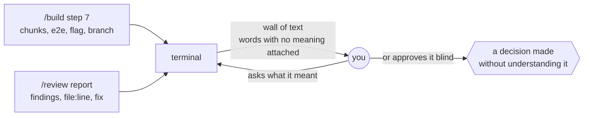
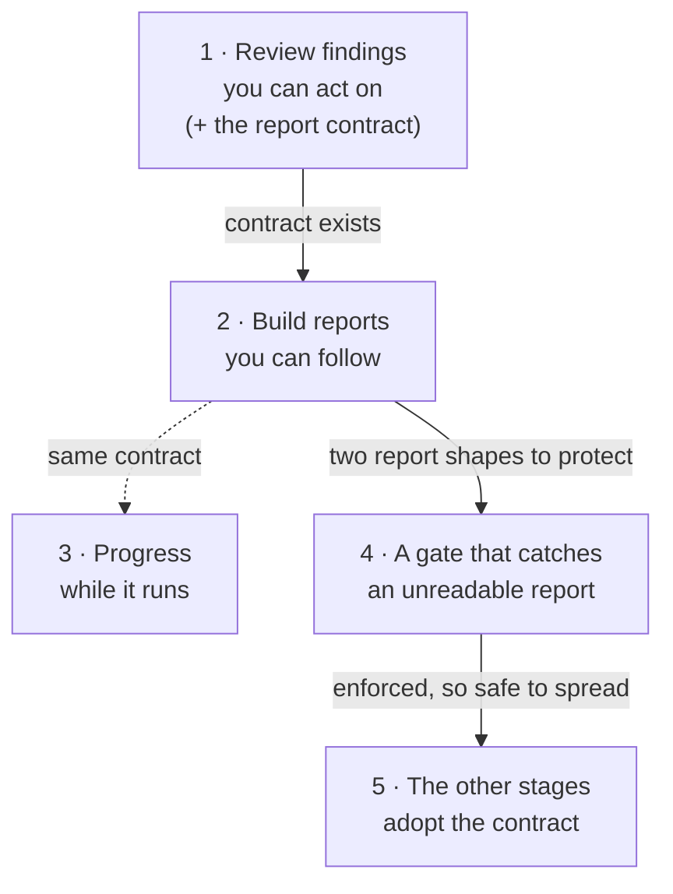

# Readable replies

**Project type:** CLI/Library · **Status:** Shaped

## Problem

During `/build` and `/review`, what zuko prints back is written for someone who
already knows how zuko works. You either ask for the same thing again, accept it
without understanding it, or lose track of what state the project is in.

## Today

The rule to explain jargon already exists — `references/voice.md` rule 10, and
your own `CLAUDE.md` asks for a glossary — and it still does not happen, so the
fix is a stated report shape, not another sentence asking for plainness.

## Slices

| # | Slice | What ships | Why this order |
|---|-------|-----------|----------------|
| 1 | Review findings you can act on | `/review`'s report in a fixed shape: verdict first in plain words, each finding as what breaks, what it costs you, what you would do; every zuko term defined where it is used; one decision at the end. Carries the shared report contract and the seed glossary that later slices reuse. | The riskiest place you accept things blind — you approve code changes from it. Smallest surface too: one shape per finding, so the contract gets proven cheaply. |
| 2 | Build reports you can follow | `/build`'s end-of-run report in the same shape: good or bad news first, what exists now that did not before, tests in plain words, where the slice stands, the one next command. | Bigger report, more moving parts. Worth doing second, on a contract that has already survived a real review. |
| 3 | Progress while it runs | Short live lines during a long build and a fan-out review — which scenario, green or red, what is happening now — instead of raw agent noise. | Only worth it once the end-of-run reports are right. Fixes losing the thread mid-run, not the report itself. |
| 4 | A gate that catches an unreadable report | A Stop-hook check that fails the turn when a `/build` or `/review` report skips a required part — no verdict line, an undefined term, no next step. | Needs two real report shapes to protect. This repo's own lesson: prompt rules drift, checks do not. |
| 5 | The other stages adopt the contract | `/spec`, `/ship`, `/status`, `/debug` print to the same contract. | Last, because by then the shape is proven and the gate already exists to hold it. |

## Not doing

- **Simplifying the code itself.** That was the first reading of "code-simplifier",
  and it is a different problem. `/review`'s quality lens already flags unjustified
  complexity. What you named is the words, not the code.
- **Rewriting specs and docs.** You said specs read fine. Only terminal replies and
  review findings are in scope.
- **A `/explain` command that re-explains the last reply.** It treats the symptom.
  If a reply needs a second reply, the first one failed.
- **Just making replies shorter.** Cutting facts makes losing the thread worse. The
  contract sets a shape, not a word count.

## Open items

| ID | What | Type | Raised at | Owner | Status | Answer |
| -- | ---- | ---- | --------- | ----- | ------ | ------ |
| O1 | A written contract alone may not change what gets printed — `voice.md` rule 10 already says define jargon, and it does not happen | assumption | shape | user | Open | — |
| O2 | The Claude Code output style in use ("learning") injects its own explanation format, including insight blocks. Unknown whether it fights the contract or carries it | question | shape | user | Open | — |
| O3 | Terms defined once per session cannot be tracked across subagents, so every report may have to repeat its glossary | flag | shape | user | Open | — |
| O4 | Which words actually lose you — the seed glossary needs your list, not a guess (worktree, e2e, flag, chunk, ledger, verifier, drift…) | question | shape | user | Open | — |
