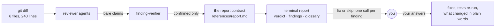
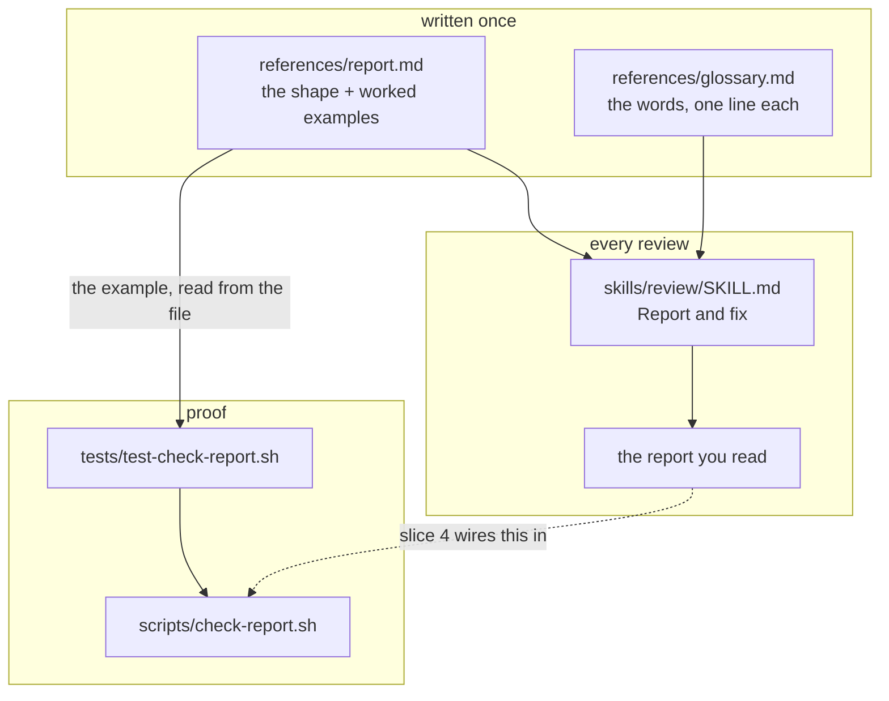
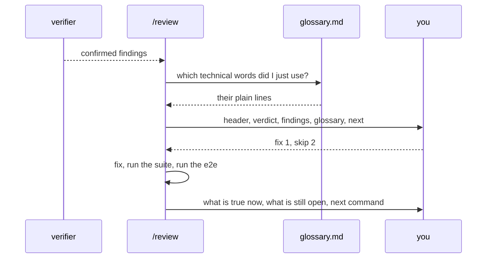

# Readable review findings

**Version:** v1 · **Status:** Built · **Type:** Enhancement · **Project type:** CLI/Library

**Shape doc:** docs/specs/readable-replies/shape.md
**Depends on:** None
**Page:** none — your `CLAUDE.md` says you read the `.md` directly

`/review` prints its findings in a fixed shape you can act on without asking what any
of it means: what breaks, what it costs you, the fix, and your own fix-or-skip call on
each one. It carries the report contract and glossary that the later slices reuse.

## Problem

You approve code changes from a review report you cannot fully read. Today the report
is defined in eight lines of `skills/review/SKILL.md` — "what is wrong, in one sentence,
the concrete failing case, `file:line`, the fix, ordered by severity, plus how many raw
findings there were and how many survived" — and every word of that assumes you already
know what a raw finding is, what survived means, and what severity is being measured.

Three things happen instead of understanding: you ask for the reply again, you accept it
without understanding, or you lose track of what state the slice is in.

The rule to explain jargon is already written twice and still does not happen —
`references/voice.md` rule 10 ("use the real term, then define it in one clause or in a
note at the bottom") and your own `CLAUDE.md` glossary rule. Another sentence asking for
plainness is not the fix. A stated report shape, and a check that reads it, is.

## Slice test

| Check | Result |
| ----- | ------ |
| Cuts every layer it needs | yes — the written contract, the stage that applies it, the check that reads a report, the fixture test that proves the check |
| One e2e test walks it | yes — one report text through the checker: a conforming one passes, one missing the verdict, the glossary, or the decision fails and says which |
| Worth shipping alone | yes — the next review you read, you can act on without a follow-up question |
| Fits (≤5 scenarios, ≤2 areas) | yes — 5 scenarios, two areas (`references/` + `skills/review/`, and `scripts/`) |

**Path:** full — it adds a new output contract and a new script, and touches more than
three files, so neither light-path trigger holds.

## Flow



Nothing about which findings survive changes — only the words they arrive in, and the
fact that each one now ends with a question you can answer.

## Acceptance criteria

```gherkin
Scenario: Two findings survive, and you can act on both
  Given a review of branch feat/share-links, 6 files and 240 lines
  And two findings survived verification:
    a share token compared with === in api/shares.ts:88,
    and a swallowed error in ui/ShareModal.tsx:41 that makes a failed copy look like it worked
  When the report prints
  Then its first line says what the review found in plain words,
    with no term that is not in the glossary at the bottom
  And each finding gives, in this order: what breaks, what it costs you,
    where it is as file:line, and the fix in one sentence
  And the worse one comes first, labelled by what it costs
    ("anyone can guess a share link"), never by a severity word
  And each finding ends with its own question: fix it, or skip it

Scenario: Nothing survives
  Given a review of the same branch where no finding survived verification
  When the report prints
  Then it says nothing was found, what was checked (6 files, 240 lines,
    for bugs, security holes, and needless complexity), and that /ship is next
  And it says how many raw findings were thrown out, in one plain line
  And it does not apologise for finding nothing

Scenario: Every word you might not know is defined
  Given a report that uses the words "diff", "e2e", and "verifier"
  When it prints
  Then a Glossary at the bottom defines those three words, one plain line each
  And a report that uses none of the glossary words prints no Glossary section

Scenario: You answer each finding
  Given the two-finding report above
  When you answer "fix the token one, skip the other"
  Then the token comparison is fixed, the swallowed error is left alone
  And the test suite and the e2e test are re-run
  And the reply says in plain words what is now true and what is still open,
    and what the next command is

Scenario: A report that breaks the contract is caught
  Given a report text with no first-line verdict, or a glossary word left undefined,
    or a finding with no fix-or-skip question
  When scripts/check-report.sh reads it
  Then it exits 1 and names the missing part and the line it expected it on
  And a conforming report exits 0 and says what it checked
```

## Scope

**In:**

- The report `/review` prints at the end of a run — the only surface this slice changes.
- `references/report.md`: the contract both this slice and the later ones read.
- The seed glossary: the zuko and engineering words that may appear in a review report,
  one plain line each.
- `scripts/check-report.sh`: reads a report text and says whether it conforms. Test-only
  in this slice.

**Out:**

- `/build`'s end-of-run report — slice 2.
- Progress lines while a run is happening — slice 3.
- Wiring `check-report.sh` into the Stop hook so a bad report fails the turn — slice 4.
- `/spec`, `/ship`, `/status`, `/debug` — slice 5.
- The `reviewer` and `finding-verifier` agents' own output formats. They stay as they
  are; only the report composed from their results changes.
- Which findings survive. The verification bar does not move in this slice.

## Interface

The report is the interface. Two shapes — one with findings, one with none — plus the
checker's command surface.

### A report with findings

```
Review: feat/share-links — 6 files, 240 lines

Two real problems. One lets a stranger read a shared report; the other hides a
failure from the person who caused it.
The reviewers raised 9 possible problems and 7 did not hold up on a second look.

1. Anyone can guess a share link, given enough tries
   What breaks  The share token is compared with ===, which stops at the first
                wrong character. How long the check takes tells an attacker how
                much of the token they already have, so they can find the rest
                one character at a time.
   Costs you    Any shared report can be read by someone it was never sent to.
   Where        api/shares.ts:88
   Fix          Compare with crypto.timingSafeEqual — it takes the same time
                whatever the input.
   → Fix it, or skip it?

2. A failed copy looks like it worked
   What breaks  The catch block in the copy handler returns without telling
                anyone, so the "Copied" message shows even when nothing reached
                the clipboard.
   Costs you    Someone pastes an empty link into an email and finds out when
                the recipient says it does not work.
   Where        ui/ShareModal.tsx:41
   Fix          Show the error state the design system already has.
   → Fix it, or skip it?

Glossary
  token           the secret string in a share link that proves you may read the report
  timing attack   guessing a secret by measuring how long a wrong guess takes to fail
  catch block     the part of the code that runs when something fails
  clipboard       where Copy puts something so you can paste it

Next: answer each finding above, then /ship.
```

### A report with nothing in it

```
Review: feat/share-links — 6 files, 240 lines

Nothing to fix. I looked for bugs, security holes, and code more complicated than
it needs to be.
The reviewers raised 4 possible problems and none held up on a second look.

Next: /ship
```

### The contract — `references/report.md`

| Part | Rule | Script checks it |
| ---- | ---- | ---------------- |
| Header | `{Stage}: {what was looked at} — {size}`, first line | yes |
| Verdict | one or two sentences, the consequence to you first | present, and sentence count |
| Count line | how many were raised, how many held up, in words | present whenever findings exist |
| Finding | four labels, in this order: `What breaks`, `Costs you`, `Where`, `Fix`. Two sentences each at most. Worst first | yes |
| Decision | every finding ends with `→ Fix it, or skip it?` | yes |
| Glossary | every technical word the report used, one plain line each. No technical words used → no Glossary section | yes, against `references/glossary.md` |
| Next | last line names the next command, or the question you answer | yes |

Never in a report: a severity label (critical, high, medium, low — say the consequence
instead), anything on the `voice.md` ban list, a summary of the report at the end of the
report, or a finding with no decision question.

### The glossary — `references/glossary.md`

One rule: **any technical word gets one plain line.** The file ships with the words a
review report actually reaches for — process (diff, branch, e2e, test suite, feature
flag, worktree, chunk, ledger, slice), review (finding, raw finding, held up, thrown out,
verifier, reviewer, linter, static analysis, vacuous test), security (injection,
authorization, authentication, timing attack, token, secret, PII, CVE), and bug shapes
(race condition, off-by-one, boundary, null, empty, swallowed error, catch block, silent
failure).

A report that needs a word the file does not have gets the line written into the file in
the same run. The list grows; a report with an undefined technical word does not ship.

### The checker — `scripts/check-report.sh`

```
Usage: check-report.sh [<file>]
       ... | check-report.sh        reads stdin when no file is given

Exit 0   the report conforms — prints what it checked
Exit 1   it does not — one line per problem, each with its line number
Exit 2   nothing to check — no file, an empty input, or a path that does not exist
```

Passing: `check-report.sh: 34 lines — header, verdict, 2 findings, 2 decisions, glossary (4 words), next step.`

Failing: `check-report.sh: line 19 — finding 2 has no "Fix" line.`

Exit 2 is not exit 0. A checker handed nothing must say so, or a broken wiring reads as a
clean pass.

**Preview:** none — the two reports above are the interface.

## Technical plan

### Approach

Two reference files hold the shape, `skills/review/SKILL.md` applies it, and one script
reads a report and says whether it conforms. The script is written from the worked
example in `references/report.md`, read out of that file at test time — the artifact and
the check cannot drift apart, because there is only one copy of the text.





### Changes

| File | What changes | Why |
| ---- | ------------ | --- |
| `plugins/zuko/references/report.md` | New. The parts table from the Interface section above, plus both worked examples verbatim | The contract slices 2-5 read. One copy of the text, so the checker cannot drift from it |
| `plugins/zuko/references/glossary.md` | New. The word list, one plain line each, and the rule that it grows when a report needs a word it lacks | Scenario 3 |
| `plugins/zuko/skills/review/SKILL.md:104-125` | The `## Report and fix` section is rewritten: load `report.md` and `glossary.md`, print to the contract, one fix-or-skip question per finding, then fix what was picked, re-run the suite and the e2e, and say what is true now | Scenarios 1, 2, 4 |
| `plugins/zuko/skills/review/SKILL.md:17` | Add the two references to the existing `Read ${CLAUDE_PLUGIN_ROOT}/references/voice.md` line | Same loading path as voice.md, which the stage already reads |
| `plugins/zuko/scripts/verify-ship-gates.sh` | The placeholder rule's exclusion list gains `{what was looked at}` and `{size}` | The report header's own format reads as an unfilled blank otherwise — O6 |
| `plugins/zuko/scripts/check-report.sh` | New. Reads a report, checks the structural parts, exits 0/1/2. Glossary matching skips the header line and any token holding `/`, `.` or `:`, so a branch name like `feat/csv-export` and a `file:line` reference are not read as undefined words — the spike's grader failed exactly this way | Scenario 5 |
| `plugins/zuko/scripts/tests/test-check-report.sh` | New. Unit cases plus the whole-slice walk: the real example out of `report.md` passes, then one mutation per required part fails with its own message | Every scenario except 4 |
| `plugins/zuko/.claude-plugin/plugin.json`, `.claude-plugin/marketplace.json` | 2.1.0 to 2.2.0 | Both carry the version; `ab2403a` bumped both for the last feature |
| `README.md` | One line in the Voice section: reports follow one contract, and a script reads them | The README states what the plugin does, and this changes it |

Reusing: `scripts/tests/run.sh` and its `expect_exit` / `expect_match` helpers, the
`${CLAUDE_PLUGIN_ROOT}` loading path `review/SKILL.md` already uses for `voice.md`, and
the `$here`-relative script layout from `block-attribution.sh`.

### Earn-it

| Added | Triggered by |
| ----- | ------------ |
| `references/report.md` as its own file, not a section of `voice.md` | Slices 2-5 all read it, and `voice.md` is about words, not the shape of a report |
| `references/glossary.md` as a second file | Scenario 3 needs a list the checker can read; a prose paragraph inside `report.md` is not a list a script can hold you to |
| `check-report.sh` | Scenario 5, and O5 - without it the only proof is you reading a report and saying it feels clearer |

Not added: a hook wiring (slice 4), a config option for which parts are required, a
formatter that rewrites a bad report. The checker reports; the stage writes.

### Non-functionals

| | |
| --- | --- |
| **Load** | One report per review, tens of lines. The checker makes a single pass and reads one glossary file |
| **Breaks first** | A review with more than about eight surviving findings. The report becomes the wall of text this slice exists to remove - the shape holds, the length does not. That is a risk below, not a feature here |
| **Security surface** | The checker reads a text file and `references/glossary.md`. Report text is Claude's own output and can contain code, backticks and quotes, so it is never passed to a shell - `grep -F` and `python3` only, no `eval`, no network, no secrets |
| **Proof it works** | The first real `/review` after the merge: its report passes `check-report.sh` with exit 0, and you answer every finding without asking what anything meant |
| **Rollout** | No runtime flag - a plugin is instructions. Rollback is reverting the merge commit. The change only takes effect in a new session, because skills load at session start (`docs/learnings/skills-load-at-session-start.md`) |

### Test plan

| Scenario | Test | Command |
| -------- | ---- | ------- |
| 1 · Two findings survive | `tests/test-check-report.sh` — the findings example, read out of `references/report.md`, passes; removing the verdict, a label, the order, or a decision question each fails with its own line number | `bash plugins/zuko/scripts/tests/run.sh check-report` |
| 2 · Nothing survives | Same file — the clean example passes; the same text without its `Next:` line fails | `bash plugins/zuko/scripts/tests/run.sh check-report` |
| 3 · Every word defined | Same file — a report using `token` with no Glossary line fails and names the word; a report using no technical word and no Glossary section passes | `bash plugins/zuko/scripts/tests/run.sh check-report` |
| 4 · You answer each finding | Manual. No script can prove a prompt rule held. The first real review after the merge is the proof, which is what O1 says | — |
| 5 · A broken report is caught | Same file — empty stdin and a missing path both exit 2; a broken report exits 1 with one line per problem; a good one exits 0 and prints what it checked | `bash plugins/zuko/scripts/tests/run.sh check-report` |

**E2E:** `tests/test-check-report.sh`'s walk — the example text is read from the real
`references/report.md`, passed, then mutated once per required part, each mutation
failing with the message that names that part. One test, the real files, no copies.

### Chunks

`Single chunk`. The checker's patterns come from the contract's text verbatim
(`docs/learnings/match-the-artifact-not-its-description.md`), so the contract has to
exist before the checker, and both have to exist before the skill is rewritten to obey
them. Splitting that across worktrees buys nothing and invites drift.

Order inside the chunk: `report.md` and `glossary.md` first, then the test file (red),
then `check-report.sh` (green), then `review/SKILL.md`, then the version bump and the
README line.

### Risks

| Risk | Mitigation |
| ---- | ---------- |
| The contract is a prompt rule and may not survive a busy session (O1) | The spike proved it is followable cold, 3 of 3, so the text is not the risk — drift over a long session is. Slice 4 makes the checker a Stop hook. Until then it is a script you or Claude can run on any report that reads badly |
| A severity-word ban that greps for `critical` and `high` blocks honest prose about a critical path | The rule is two literal patterns — a `Severity:` line, and a finding title starting with `Critical:`, `High:`, `Medium:` or `Low:` — not the words themselves (`docs/learnings/tightening-a-matcher-trades-blocks-for-allows.md`) |
| The glossary repeats the same four words in every report and starts to grate (O3) | Only words the report actually used are printed. If it still grates, slice 4 adds a define-once-per-session rule |
| A review with 15 findings is unreadable whatever shape it has | The report says so and offers them in batches. Not built here — if it happens twice, it earns a slice |
| `learning-output-style` wraps the report in its own insight blocks (O2) | Out of this contract's scope. `docs/specs/learning-mode/shape.md` owns that, and its slice 2 is what switches the Anthropic plugin off |

## Open items

| ID | What | Type | Raised at | Owner | Status | Answer |
| -- | ---- | ---- | --------- | ----- | ------ | ------ |
| O1 | A written contract alone may not change what gets printed — `voice.md` rule 10 already says define jargon, and it does not happen | unproven | shape | poc | Resolved | Spike, 2026-09-15: three agents given only the contract and two findings each wrote a conforming report, 3 of 3, structure identical and no severity labels. The text is followable from a cold read. Whether it survives a long session is still untested — that is what slice 4's gate is for |
| O2 | The Claude Code output style in use ("learning") injects its own explanation format, including insight blocks. Unknown whether it fights the contract or carries it | question | shape | user | Resolved | The contract governs the report block only. `learning-output-style@claude-plugins-official` is on in this repo's `.claude/settings.json`; what it wraps around the report belongs to `docs/specs/learning-mode/`, whose slice 2 switches it off |
| O3 | Terms defined once per session cannot be tracked across subagents, so every report may have to repeat its glossary | flag | shape | user | Resolved | Repeat it in every report. Only the words that report used are printed, so it stays short — a repeated line costs one line, a missing one costs a question |
| O4 | Which words actually lose you — the seed glossary needs your list, not a guess | question | shape | user | Resolved | Any technical word, not a fixed list. `references/glossary.md` ships the words a review reaches for and grows when a report needs one it lacks |
| O5 | A checker can only prove structure — the verdict line is present, every glossary word is defined, each finding has its question. It cannot prove the words are understandable. Only you can | assumption | spec p1 | user | Accepted risk | The user is the judge, 2026-09-15. The spec's Proof it works line is exactly this: the first real review after the merge, answered without a follow-up question |
| O6 | The report contract's header format (`{what was looked at}`, `{size}`) reads as an unfilled placeholder to `verify-ship-gates.sh`, which blocked the ship gate | flag | ship | user | Resolved | Added to the exclusion list, 2026-09-15. The list is the mechanism for exactly this — a documented format and an unfilled blank are the same text, and only a list can tell them apart |
