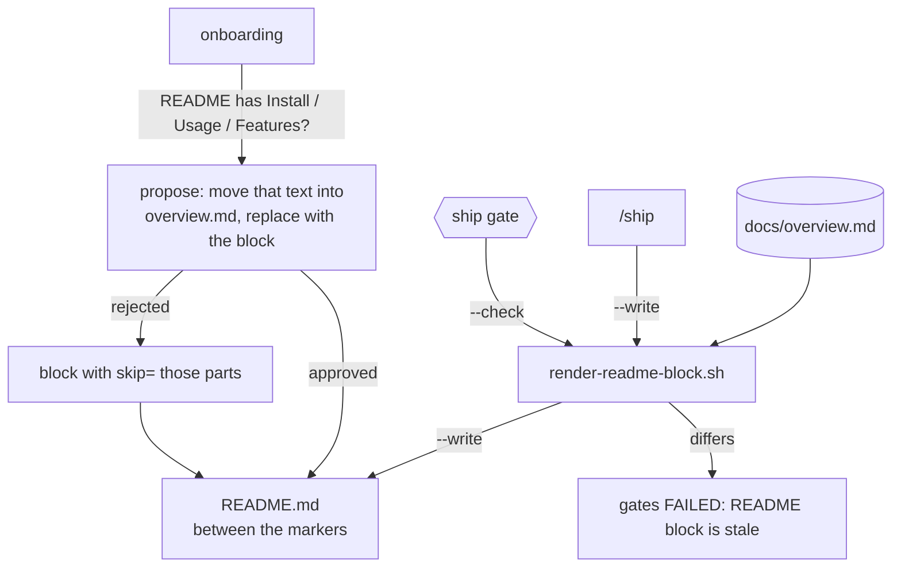
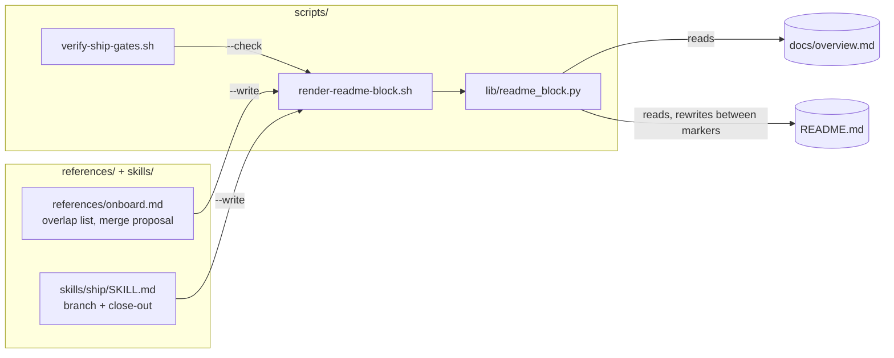
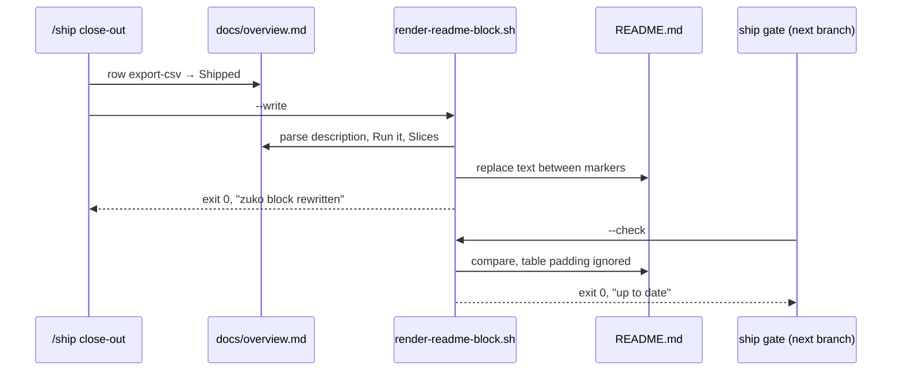

# README block

**Version:** v1 · **Status:** Refined · **Type:** Feature · **Project type:** CLI/Library

**Shape doc:** docs/specs/v3-project-memory/shape.md — slice 1b
**Depends on:** `auto-onboard` — the overview this block is rendered from
**Page:** https://claude.ai/artifact/UjgNXmdzaq2Uaq1VkAMmmg

The README's what-it-does, install-and-run, features and docs sections become one block
that a script renders from `docs/overview.md`. `/ship` re-renders it and the ship gate
refuses a stale one, so the repo's public front page never drifts from the overview.

## Problem

README is the repo's documentation for everyone who lands on it, and it goes stale
the fastest: a command changes, a feature ships, and nobody edits the README. After
`auto-onboard` the same facts also live in `docs/overview.md`, so without this slice
there would be two copies drifting apart. This repo shows it: `README.md` lists ten
commands and its install steps by hand, and nothing checks them against the code.

## Slice test

| Check                         | Result                                                                                                                                                                          |
| ----------------------------- | ------------------------------------------------------------------------------------------------------------------------------------------------------------------------------- |
| Cuts every layer it needs     | yes — the renderer script, onboarding's merge proposal, `/ship`'s re-render, the ship-gate check                                                                                |
| One e2e test walks it         | yes — one scratch repo: README with an Install section → merge applied → overview changes → gate fails stale → re-render → gate passes, text outside the markers byte-identical |
| Worth shipping alone          | yes — the README of every onboarded repo stays current without anyone editing it                                                                                                |
| Fits (≤5 scenarios, ≤2 areas) | yes — 5 scenarios; two areas: `scripts/` (renderer and gate), and `references/` + `skills/ship`                                                                                 |

**Path:** full — a new script with its own output contract, and a new gate check.

## Flow



The overview is the only source; the block is always rendered, never written by hand.

## Acceptance criteria

```gherkin
Scenario: onboarding merges an overlapping README section into the overview
  Given "invoice-cli" whose README.md has "## Install" holding "pip install -e ."
    and a "## License" section, and no zuko markers
  When onboarding runs and the user approves the proposed README diff
  Then the "## Install" section is gone and the zuko block stands in its place
  And overview.md's "Run it" table holds "pip install -e ." as the install command
  And the "## License" section and every line outside the markers are unchanged

Scenario: a rejected merge leaves the user's sections and skips those parts
  Given the same README and the user rejects the proposed diff
  When onboarding inserts the block
  Then "## Install" stays exactly as it was
  And the start marker records skip=install
  And the rendered block has no "Install and run" section

Scenario: a greenfield repo gets a README made of a title and the block
  Given "habit-tracker" with no README.md
  When onboarding runs
  Then README.md holds "# habit-tracker" followed by the zuko block
  And the block's "Features" section says "Nothing shipped yet"

Scenario: /ship re-renders the block when the overview changes
  Given "invoice-cli" whose overview row "export-csv" moves from Built to Shipped
    with "What it does" set to "Export the ledger as one CSV"
  When the close-out commit re-renders the README block
  Then the block's "Features" list contains "- Export the ledger as one CSV"
  And every byte of README.md outside the markers is unchanged

Scenario: the ship gate refuses a stale or missing block
  Given "invoice-cli" whose README block was hand-edited to say "pip install invoice"
  When verify-ship-gates.sh runs
  Then it exits 1 with "README.md  zuko block is stale — run render-readme-block.sh --write"
  And when README.md has no zuko markers at all, it exits 1 with
    "README.md  no zuko block — onboarding adds it"
```

## Scope

**In:**

- `scripts/render-readme-block.sh`: renders the block from `docs/overview.md`;
  `--write` replaces what sits between the markers, `--check` exits 1 when it differs.
- The block's four sections: what it does, install and run, features (Shipped rows
  only, from the "What it does" column), docs (links to files in the repo only).
- `references/onboard.md`: the overlap check and the merge proposal; the skip list on
  rejection; creating README.md when there is none.
- `skills/ship/SKILL.md`: re-render on the branch and in the close-out commit.
- `scripts/verify-ship-gates.sh`: the stale and missing checks.
- Tests for every script path, plus the e2e walk.

**Out:**

- The hub page link — artifacts are private by default, and a public README would link
  to a page most readers cannot open.
- Links to `docs/decisions.md` and `CHANGELOG.md` — added by slices 2 and 3 when those
  files exist.
- Badges, screenshots, licence — the user's, outside the markers.
- Rewriting README prose outside the markers, ever.

## Interface

### The block

Rendered for "invoice-cli" with one shipped slice:

```markdown
<!-- zuko:start — generated from docs/overview.md; edit that file, not this block -->

## What it does

Turns a folder of supplier invoices into one ledger CSV. Used by the finance team
at month end; about 400 invoices a run.

## Install and run

| Task    | Command                     |
| ------- | --------------------------- |
| install | `pip install -e .`          |
| run     | `invoice-cli build ./inbox` |
| test    | `pytest`                    |

## Features

- Export the ledger as one CSV

## Docs

- [Overview](docs/overview.md)
- [Architecture](docs/architecture.md)

<!-- zuko:end -->
```

| Section         | Source in `docs/overview.md`                                    | Rule                                                                                      |
| --------------- | --------------------------------------------------------------- | ----------------------------------------------------------------------------------------- |
| What it does    | the paragraph between the `**Status:**` line and the first `##` | copied as is                                                                              |
| Install and run | the `## Run it` table                                           | rows whose command is `not set up yet` are dropped; no rows left → section dropped        |
| Features        | `## Slices` rows with Status `Shipped`                          | one bullet per row, the "What it does" cell, in table order; none → `Nothing shipped yet` |
| Docs            | fixed list of repo files that exist                             | `docs/overview.md`, `docs/architecture.md`; slices 2 and 3 add theirs                     |

Headings are always `##`. The block never contains a URL outside the repo.

### Skipping parts

A rejected merge records what to leave out, in the start marker:

```markdown
<!-- zuko:start skip=install,features — generated from docs/overview.md; edit that file, not this block -->
```

Keys: `what`, `install`, `features`, `docs`. The skip list is the user's decision and
survives every re-render; only a hand edit of the marker changes it.

### `render-readme-block.sh`

```
render-readme-block.sh            print the block to stdout
render-readme-block.sh --write    replace the text between the markers in README.md
render-readme-block.sh --check    compare; exit 1 if README.md's block differs
```

Reads `docs/overview.md` and `README.md` under `$CLAUDE_PROJECT_DIR` (else `$PWD`).

| Exit | Meaning                         | Message (stderr)                                                                                                                                                                           |
| ---- | ------------------------------- | ------------------------------------------------------------------------------------------------------------------------------------------------------------------------------------------ |
| 0    | printed, written, or up to date | `README.md  zuko block up to date` (`--check`) · `README.md  zuko block rewritten` (`--write`)                                                                                             |
| 1    | stale (`--check` only)          | `README.md  zuko block is stale — run render-readme-block.sh --write` then a unified diff, capped at 40 lines                                                                              |
| 1    | no markers                      | `README.md  no zuko block — onboarding adds it`                                                                                                                                            |
| 2    | cannot render                   | `docs/overview.md  missing` · `docs/overview.md  no "## Run it" table` · `README.md  zuko:start without zuko:end` · `README.md  two zuko blocks` · `README.md  unknown skip key "licence"` |

`--write` touches nothing outside the markers and nothing at all when it would exit 2.
Exit 2 is never a pass, for `--check` either.

### Ship gate

`verify-ship-gates.sh` runs `render-readme-block.sh --check` and adds its message to the
problems list on any non-zero exit; on 0 it prints the scope line
`README: zuko block matches docs/overview.md`.

### Onboarding merge proposal (terminal)

```
README.md overlaps the zuko block:
  ## Install (lines 41-52)  →  moves into overview.md "Run it": install "pip install -e ."
Proposed README.md change:
  - lines 41-52 (## Install)
  + zuko block at line 41
Everything else in README.md is unchanged. Approve, or reject to keep ## Install and
skip "install" in the block.
```

A section counts as overlapping when its heading is one of: Install, Installation,
Getting started, Usage, Running, Features, Documentation, Docs (case-insensitive,
any `#` level). The list is closed and lives in `references/onboard.md`.

## Technical plan

### Approach

Rendering is a pure function from `docs/overview.md` to text, written in Python because
it parses Markdown tables and must rewrite a file byte-exactly outside the markers —
both fragile in bash. It sits in `scripts/lib/` beside `git-command.py` and is called
through a thin bash entry point, the same pattern as `block-dangerous.sh:14`. The gate
and `/ship` only ever call the entry point. Onboarding's merge proposal is Claude's
work (reading prose sections), so it lives in `references/onboard.md`; once approved,
it writes the overview first and then calls `--write`, so the block is always rendered,
never typed.





**Comparison rule.** `--check` compares after normalising both sides: trailing spaces
stripped, runs of spaces inside `|` table rows collapsed, table separator rows reduced
to their dashes-and-colons shape. A formatter that re-aligns tables — one did so to
every Markdown file written while this spec was drafted — must not make the block look
stale. Words, commands, order, and headings are compared exactly.

### Changes

| File                                                                                                | What changes                                                                                                                                                                                                               | Why                                               |
| --------------------------------------------------------------------------------------------------- | -------------------------------------------------------------------------------------------------------------------------------------------------------------------------------------------------------------------------- | ------------------------------------------------- |
| `plugins/zuko/scripts/lib/readme_block.py` (new)                                                    | Parse the overview's description, `## Run it` and `## Slices` (columns found by header name); render the block; find markers and skip list; `--write` / `--check` / print; exit codes and messages per the Interface table | scenarios 2–5                                     |
| `plugins/zuko/scripts/render-readme-block.sh` (new)                                                 | Entry point: resolves the project dir and calls the Python module; nothing else                                                                                                                                            | one command for the gate, `/ship`, and onboarding |
| `plugins/zuko/scripts/verify-ship-gates.sh`                                                         | After the overview check that `auto-onboard` adds: run `--check`, add non-zero output to `problems`, print the scope line on 0                                                                                             | scenario 5                                        |
| `plugins/zuko/references/onboard.md`                                                                | Overlap heading list; the merge proposal message; writing moved text into the overview before `--write`; skip keys on rejection; creating README.md as a `#` title from the repo name plus the block                                           | scenarios 1–3                                     |
| `plugins/zuko/skills/ship/SKILL.md`                                                                 | Run `--write` after updating the slices row on the branch, and again in the close-out commit                                                                                                                               | scenario 4                                        |
| `plugins/zuko/scripts/tests/test-render-readme-block.sh` (new)                                      | Render cases, skip keys, every exit-2 input, byte-identical outside markers, formatter-padded tables still "up to date"                                                                                                    | scenarios 2–5                                     |
| `plugins/zuko/scripts/tests/test-verify-ship-gates.sh`, `test-e2e-naming.sh`, `test-e2e-onboard.sh` | Fixtures gain a README with a current block                                                                                                                                                                                | old tests keep testing what they test             |
| `plugins/zuko/scripts/tests/test-e2e-readme.sh` (new)                                               | The e2e walk below                                                                                                                                                                                                         | slice proof                                       |

Reusing: the `scripts/lib/` + bash entry pattern; `verify-ship-gates.sh`'s `problems`
accumulator; `run.sh`'s `expect_exit` / `expect_match` / `expect_no_match`.

### Earn-it

| Added                    | Triggered by                                                                     |
| ------------------------ | -------------------------------------------------------------------------------- |
| `lib/readme_block.py`    | scenarios 4, 5 — table parsing and byte-exact rewriting                          |
| `render-readme-block.sh` | three callers need one command; matches the existing lib pattern                 |
| Normalised comparison    | a formatter already re-aligns tables here; exact comparison would fail every run |
| Skip keys in the marker  | scenario 2 — the rejection must survive re-renders without a config file         |

No new dependency: Python 3 standard library only, already required by
`block-dangerous.sh`.

### Non-functionals

|                      |                                                                                                                                                                                        |
| -------------------- | -------------------------------------------------------------------------------------------------------------------------------------------------------------------------------------- |
| **Load**             | Two small files read per call; runs in well under a second                                                                                                                             |
| **Breaks first**     | A hand-edited overview table the parser cannot read — exits 2 naming the file and table, never renders a partial block                                                                 |
| **Security surface** | Writes only README.md, only between the markers; no network; no shell-out from the renderer. Rendered text comes from the repo's own overview, and the block never adds an outside URL |
| **Proof it works**   | `verify-ship-gates.sh` prints `README: zuko block matches docs/overview.md` on the PR branch                                                                                           |
| **Rollout**          | No flag. Rollback: revert the merge commit; the block stays in READMEs as plain text and stops being checked                                                                           |

### Test plan

| Scenario               | Test                                                                                                         | Command                                                      |
| ---------------------- | ------------------------------------------------------------------------------------------------------------ | ------------------------------------------------------------ |
| 1 merge on approval    | real onboarding run on this repo during `/build` — its README has an Install section; diff shown to the user | run a writing stage from the repo                            |
| 2 skip on rejection    | `test-render-readme-block.sh` (skip keys) plus the same real run, rejected once on a scratch copy            | `bash plugins/zuko/scripts/tests/run.sh render-readme-block` |
| 3 greenfield README    | `test-render-readme-block.sh` (no README → create)                                                           | same                                                         |
| 4 re-render on ship    | `test-render-readme-block.sh` (Shipped row appears, outside bytes identical)                                 | same                                                         |
| 5 gate stale / missing | `test-verify-ship-gates.sh`                                                                                  | `bash plugins/zuko/scripts/tests/run.sh verify-ship-gates`   |
| all                    | the whole suite                                                                                              | `bash plugins/zuko/scripts/tests/run.sh`                     |

**E2E:** `scripts/tests/test-e2e-readme.sh` — one scratch repo: README with `## Install`
and `## License`, an Active overview → `--write` with the block replacing Install →
License byte-identical → flip a row to Shipped → gate fails stale → `--write` → gate
passes → pad the block's table like a formatter → gate still passes.

### Chunks

Harness first: each chunk writes its failing tests before its code.

| Chunk | Scenarios | Files owned                                                                                                                                  |
| ----- | --------- | -------------------------------------------------------------------------------------------------------------------------------------------- |
| A     | 2–4       | `scripts/lib/readme_block.py`, `scripts/render-readme-block.sh`, `scripts/tests/test-render-readme-block.sh`                                 |
| B     | 5, e2e    | `scripts/verify-ship-gates.sh`, `scripts/tests/test-verify-ship-gates.sh`, `test-e2e-naming.sh`, `test-e2e-onboard.sh`, `test-e2e-readme.sh` |
| C     | 1         | `references/onboard.md`, `skills/ship/SKILL.md`                                                                                              |

B merges after A. This slice builds after `auto-onboard` is merged — both edit
`verify-ship-gates.sh` and `onboard.md`.

### Risks

| Risk                                                                   | Mitigation                                                                                                                                                   |
| ---------------------------------------------------------------------- | ------------------------------------------------------------------------------------------------------------------------------------------------------------ |
| A formatter re-aligns the block's tables and the gate calls it stale   | Normalised comparison, with a test that pads the table like a formatter                                                                                      |
| `--write` corrupts text outside the markers                            | It writes by replacing the exact byte range between the markers; a test asserts every outside byte is identical, and nothing is written when it would exit 2 |
| The merge proposal moves text that was not really install instructions | The heading list is closed; the user sees the diff and the moved text before anything changes                                                                |
| A README already contains a `zuko:start` comment for another reason    | Treated as a block; two start markers exit 2 naming both lines rather than guessing                                                                          |

## Open items

| ID  | What                                                            | Type     | Raised at | Owner  | Status   | Answer                                                                                                                                |
| --- | --------------------------------------------------------------- | -------- | --------- | ------ | -------- | ------------------------------------------------------------------------------------------------------------------------------------- |
| O1  | What happens when the README already covers the block's ground? | question | spec p1   | user   | Resolved | Propose moving it into the overview and replacing it with the block; user approves the diff; on rejection the block skips those parts |
| O2  | Where does each feature's one-line description come from?       | question | spec p1   | user   | Resolved | A "What it does" column in the overview's slices table (amends `auto-onboard`, O8 there)                                              |
| O3  | Link the hub page from the README?                              | flag     | spec p1   | claude | Resolved | No — artifacts are private by default; README links repo files only                                                                   |

## Glossary

- **Markers** — the two HTML comments (`<!-- zuko:start … -->`, `<!-- zuko:end -->`)
  that fence the generated block; GitHub and GitLab do not display them.
- **Render** — produce the block's text from the overview by a fixed rule, so the same
  overview always gives the same block.
- **Stale** — the block in README no longer matches what the overview renders to.
