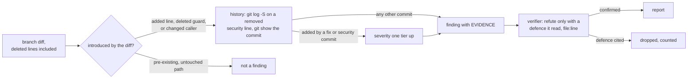
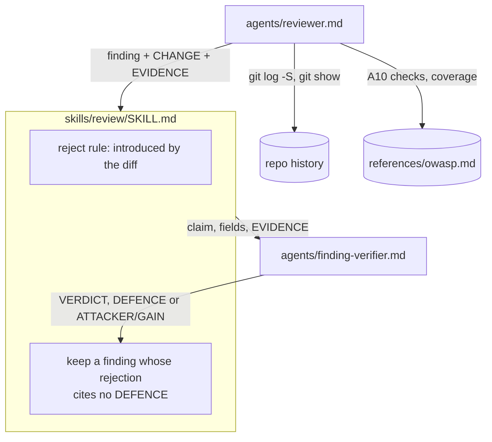
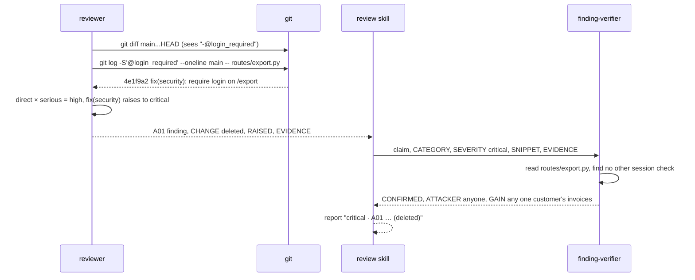

# Regression-aware review

**Version:** v1 · **Status:** Built · **Type:** Enhancement · **Project type:** CLI/Library

**Shape doc:** docs/specs/v3-release-and-hosts/shape.md — slice 7b
**Depends on:** `owasp-lens` — this plan edits the files as 7a leaves them: its finding format (`CATEGORY`, `SEVERITY`, `SNIPPET`, `SYMBOL`), its `references/owasp.md` with an A10 section, and the verifier's `SEVERITY` output
**Page:** https://claude.ai/artifact/2TQDxfubLjL9nQftBH3uDQ

`/review` judges what a diff introduces, not only the lines it touches. A deleted
guard or a changed caller becomes a finding, silent failures become A10 checks, and
auth or validation changed without a test change becomes a coverage finding. Now,
because 7a gives the review a standard, and the most damaging regressions (a removed
check) are exactly the ones today's rules throw away.

## Problem

Today a finding must sit "on a line the diff touched". The rule appears three times:
`skills/review/SKILL.md:115-117`, `agents/reviewer.md:56-58`, and
`agents/finding-verifier.md:22`. A deleted line is not a line that is left to point
at, so a branch that removes `@login_required` from `/export` has no line to report
on. A caller change that sends untrusted input into an untouched function is
rejected because the function's lines did not change. The verifier can reject a real
finding by saying "probably validated upstream" without naming where. And the silent
failure checks are one bullet under correctness (`SKILL.md:42`), with no severity
and no list of the shapes they take.

## Slice test

| Check                         | Result                                                                                                                                                           |
| ----------------------------- | ---------------------------------------------------------------------------------------------------------------------------------------------------------------- |
| Cuts every layer it needs     | yes — the reject rule in the skill and both agents, the history step, the verifier's defence rule, the A10 checks in `owasp.md`, the coverage lens               |
| One e2e test walks it         | yes — one headless `/review` on a seeded branch whose history has a `fix(security)` commit walks all five scenarios; a contract test in `run.sh` guards the text |
| Worth shipping alone          | yes — a branch that deletes a security check gets caught, which today it cannot                                                                                  |
| Fits (≤5 scenarios, ≤2 areas) | yes — 5 scenarios; two areas: the review stage (`skills/review`, `agents/reviewer.md`, `agents/finding-verifier.md`) and `references/owasp.md`                   |

**Path:** full — changes the reject rule every finding goes through, and adds fields
to both agent formats.

## User story

As someone who runs `/review` before shipping, I want a branch that removes or
weakens a check to be reported, so the review catches the regressions that do the
most damage.

## Flow



The reviewer asks whether the diff introduced the problem, including by deleting a
line or changing a caller. For removed security code it runs the history, and a guard
first added by a fix or security commit raises the severity one tier. The verifier
may drop a finding only by citing the defence it read.

## Acceptance criteria

```gherkin
Scenario: a deleted guard is reported, and its history raises the severity
  Given invoice-api on main, where commit 4e1f9a2 "fix(security): require login on /export"
    added @login_required above export_ledger in routes/export.py
  And branch feat/public-export deletes that decorator line and changes nothing else
  When the user runs /review
  Then the report has an A01:2025 Broken Access Control finding at routes/export.py
    in export_ledger, SNIPPET "@login_required", with EVIDENCE naming 4e1f9a2 and its subject
  And its severity is critical: direct × serious gives high, and removing a line a
    fix(security) commit added raises it one tier
  And the report line says "raised: removes a guard added by 4e1f9a2"

Scenario: a changed caller counts, an untouched pre-existing path does not
  Given invoice_api/db.py has raw(sql), which main only ever calls with constant strings
  And the branch changes reports.py:40 to call db.raw("SELECT * FROM reports WHERE id = " + report_id)
    with report_id from GET /reports
  When the user runs /review
  Then it reports an A05:2025 Injection finding at reports.py:40, though db.py is untouched
  And a string-built query already in legacy/import.py on main, which the branch does
    not touch or newly call, is not reported

Scenario: the verifier refutes only with a defence it read
  Given the reviewer's A05 finding at reports.py:40
  When the verifier rejects it because report_id is checked at routes/reports.py:12
    against ^[0-9]{1,9}$
  Then its output carries "DEFENCE: routes/reports.py:12" and the finding is dropped
  And a rejection whose only reason is the comment "# input is sanitised upstream"
    or "probably validated", with no file:line, is not accepted, and the finding stays
  And a confirmation of a security finding names who controls the input and what they
    gain: "ATTACKER: any logged-in user · GAIN: every report's rows"

Scenario: silent failures are A10 findings
  Given the branch adds, in invoice_api/payments.py:
    a try/except around charge() whose except block only calls log.info and continues,
    fetch_rate() returning 1.0 when the currency API raises,
    and a retry loop that gives up after 3 attempts and returns None without logging
  When the user runs /review
  Then each is an A10:2025 Mishandling of Exceptional Conditions finding with a severity
    from the grid
  And an except block that logs and re-raises is not a finding

Scenario: auth or validation changed with no test change is a coverage finding
  Given the branch changes is_admin() in invoice_api/auth.py and changes no file under tests/
  And adds a new route handler refund_invoice with no test that calls it
  When the user runs /review
  Then the report has two findings with CATEGORY coverage, one per case, no severity
  And a new private helper _format_cents called only from a tested function is not reported
  And every confirmed finding is fixed as today; a coverage fix is a test
```

## Scope

**In:**

- The reject rule changes from "a line the diff touched" to "**introduced by** the
  diff". That means added lines, deleted lines, and a changed caller that sends new
  input into an untouched function. It changes in all three places:
  `SKILL.md:115-117`, `reviewer.md:56-58`, `finding-verifier.md:22` and `:30`.
- History for removed security code: `git log -S` on the removed line, and `git show
--no-patch` on the commit that added it. If that commit's type is `fix`, or its
  subject names security, auth, a CVE or a vulnerability, severity rises one tier,
  capped at critical. The reviewer pastes the command output as `EVIDENCE`.
- `/review`'s `allowed-tools` keeps `Bash(git log *)` and `Bash(git show *)`, both
  already granted by 7a (`SKILL.md:9`); `Bash(git blame *)` is left out (O4).
- The verifier refutes a finding by citing a defence only if it read that defence,
  at a `file:line`. A comment that claims safety is not a defence. A confirmed
  security finding names `ATTACKER` and `GAIN`.
- Silent failures become A10 checks in `owasp.md`. The six shapes: an empty catch;
  catch, log and continue; a default returned on error; optional chaining that skips
  a failed call; retries exhausted silently; auth or validation failing open. The
  correctness bullet at `SKILL.md:42` and `reviewer.md:23` points there.
- Coverage findings: auth or validation code changed with no test file changed, and a
  new function reachable from an entry point with no test that calls it.

**Out:**

- The pentest — slice 5.
- Rewriting history or reading old PR comments — shape's Not doing list.
- Coverage percentages or a coverage tool — rejected (D18).
- Findings on pre-existing code the diff does not touch or newly reach — still
  rejected, as today.

## Interface

Everything is text: new fields in the two agent formats, one new category, and two
new report lines.

### Reviewer finding, new fields

```
CLAIM: The diff removes @login_required from export_ledger, so /export serves invoices without a session.
CATEGORY: A01:2025 Broken Access Control
SEVERITY: critical
RAISED: removes a guard added by 4e1f9a2
FILE: routes/export.py:14
SYMBOL: export_ledger
SNIPPET: @login_required
CHANGE: deleted
EVIDENCE: $ git log -S'@login_required' --oneline main -- routes/export.py
          4e1f9a2 fix(security): require login on /export
FAILING CASE: GET /export?customer=ACME-01 with no cookie returns ACME-01's invoices.
```

| Field      | When                                                                                        |
| ---------- | ------------------------------------------------------------------------------------------- |
| `CHANGE`   | always: `added`, `deleted`, or `caller` (a changed call into an untouched function)         |
| `EVIDENCE` | whenever the claim rests on command output (history, a grep); the output is pasted verbatim |
| `RAISED`   | only when history raised the severity; names the commit                                     |
| `SNIPPET`  | on a deleted line, the line as it was on the base branch                                    |

The verifier sees `EVIDENCE` as data. It still never sees `FAILING CASE`.

### Verifier output, new fields

```
VERDICT: REJECTED
DEFENCE: routes/reports.py:12
PATH: report_id is matched against ^[0-9]{1,9}$ before db.raw runs; no quote reaches the query.
```

```
VERDICT: CONFIRMED
SEVERITY: high
ATTACKER: any logged-in user
GAIN: every report's rows
PATH: report_id from GET /reports reaches db.raw at reports.py:40 unchecked.
```

A `REJECTED` whose reason is a defence without `DEFENCE: file:line` counts as not
refuted. The skill keeps the finding and notes "verifier cited no defence".

### Report, new lines

```
critical · A01:2025 Broken Access Control · routes/export.py:14 in export_ledger (deleted)
  The diff removes @login_required from export_ledger.
  raised: removes a guard added by 4e1f9a2 fix(security): require login on /export
  Failing case: GET /export?customer=ACME-01 with no cookie returns ACME-01's invoices.
  Fix: restore @login_required.

coverage · invoice_api/auth.py:22 in is_admin
  is_admin() changed and no test changed.
  Fix: a test for the new roles-lookup-fails path.
```

Order: security by tier, then correctness, coverage, decisions, quality.

**Preview:** this section. There is no UI to render.

## Technical plan

### Approach

These are prompt-text edits to the three review files 7a leaves behind, plus a new
A10 block in `owasp.md`. The reviewer already has `Bash` (`agents/reviewer.md:6`), so
it runs the history commands itself. The verifier has hook-scoped read-only git
(D9), so it reads the pasted `EVIDENCE` as data and may re-run the same command to
check it, never recalling git behaviour from memory (the `verifiers-cannot-run-code`
lesson; O7). A contract test and
one seeded headless run prove it, as in 7a.

Relies on: D4, D7, D9, D15, D16, D17, D18



The reviewer reads history and `owasp.md`, then hands findings with evidence to the
skill. The skill passes them to the verifier. A rejection without a cited defence
does not drop the finding.



### Changes

| File                                                                   | What changes                                                                                                                                                                                                                          | Why            |
| ---------------------------------------------------------------------- | ------------------------------------------------------------------------------------------------------------------------------------------------------------------------------------------------------------------------------------- | -------------- |
| `plugins/zuko/skills/review/SKILL.md:9`                                | none: `Bash(git show *)` and `Bash(git log *)` are already granted by 7a; `git blame` is cut (O4)                                                                                                                                                                            | scenario 1     |
| `plugins/zuko/skills/review/SKILL.md:42`                               | Silent-failure bullet points to `owasp.md` A10                                                                                                                                                                                        | scenario 4     |
| `plugins/zuko/skills/review/SKILL.md:115`                              | Rejected-by-default list: "lines the diff did not touch" becomes "problems the diff did not introduce: not added, not deleted, not newly reached by a changed caller"                                                                 | scenario 2     |
| `plugins/zuko/skills/review/SKILL.md` Verification                     | A `REJECTED` that relies on a defence without `DEFENCE: file:line` keeps the finding, noted "verifier cited no defence". On a large diff, such a vote counts as not-rejected                                                          | scenario 3     |
| `plugins/zuko/skills/review/SKILL.md` Report                           | `(deleted)` and `(caller)` after the symbol; the `raised:` line; the `coverage` category between correctness and decisions                                                                                                            | scenarios 1, 5 |
| `plugins/zuko/agents/reviewer.md:23`                                   | Silent-failure bullet points to A10                                                                                                                                                                                                   | scenario 4     |
| `plugins/zuko/agents/reviewer.md:56`                                   | Out-of-scope rule rewritten to "introduced by"; a History step: for a deleted line in an auth, validation, escaping or logging path, run `git log -S` on it against the base, and `git show --no-patch` on the commit; the raise rule | scenarios 1, 2 |
| `plugins/zuko/agents/reviewer.md` Coverage                             | A fifth lens, **Coverage**: changed auth or validation with no test file changed; a new function reachable from a route, command or public export with no test that calls it                                                          | scenario 5     |
| `plugins/zuko/agents/reviewer.md` Report format                        | `CHANGE`, `EVIDENCE`, `RAISED` fields; the `coverage` category                                                                                                                                                                        | scenarios 1–5  |
| `plugins/zuko/agents/finding-verifier.md:22`, `:30`                    | "a line this diff actually changed" becomes "a problem this diff introduced"; a deleted line and a changed caller qualify                                                                                                             | scenarios 1, 2 |
| `plugins/zuko/agents/finding-verifier.md` Confirm/Reject               | Refute on a defence only with `DEFENCE: file:line` you read; a comment is not a defence. A confirmed security finding names `ATTACKER` and `GAIN`. Read `EVIDENCE` as observed output; to doubt it, re-run the command with your read-only git, never judge it from memory             | scenario 3     |
| `plugins/zuko/references/owasp.md` A10                                 | **Check** gains the six silent-failure shapes, each with one example. **Not a finding** gains: log and re-raise; a default returned from a function documented to return it; a retry that logs its final failure                      | scenario 4     |
| `plugins/zuko/scripts/tests/test-regression-review.sh` (new)           | The contract test, below                                                                                                                                                                                                              | all            |
| `plugins/zuko/scripts/tests/fixtures/regression-review/build.sh` (new) | Builds the seeded repo with real history: base, the `fix(security)` commit, then the branch                                                                                                                                           | the seeded run |

Reusing: 7a's `run.sh` contract-test pattern and `$work` temp dir; 7a's E2E command
(proven by 7a's O7); the existing `git log` permission at `SKILL.md:9`.

### Earn-it

| Added                                 | Triggered by                                                                                                               |
| ------------------------------------- | -------------------------------------------------------------------------------------------------------------------------- |
| `CHANGE` field                        | scenarios 1, 2: the verifier needs to know a deleted line or a caller is in scope                                          |
| `EVIDENCE` field                      | scenario 1 plus the `verifiers-cannot-run-code` lesson: the verifier starts from observed output, not memory, and saves the turns of re-deriving it (O7)                                  |
| `RAISED` field                        | scenario 1: the report says why the tier is above the grid's                                                               |
| `DEFENCE`, `ATTACKER`, `GAIN`         | scenario 3                                                                                                                 |
| Coverage lens                         | scenario 5                                                                                                                 |
| `fixtures/regression-review/build.sh` | scenario 1 needs real commits; a patch cannot carry history                                                                |
| `Bash(git blame *)`                   | none of the scenarios needs it; `git log -S` finds the adding commit. **Cut** — kept out, against the shape's wording (O4) |

### Non-functionals

|                      |                                                                                                                                                                                                                                    |
| -------------------- | ---------------------------------------------------------------------------------------------------------------------------------------------------------------------------------------------------------------------------------- |
| **Load**             | One `git log -S` per deleted security line; a typical branch has zero to three. Each runs in under a second on a repo this size                                                                                                    |
| **Breaks first**     | `git log -S` on a 100k-commit repo can take tens of seconds per line. Scoping it to the file (`-- routes/export.py`) keeps it to that file's history                                                                               |
| **Security surface** | New: the reviewer runs `git log`, `git show` with arguments built from diff text. Both are read-only; the snippet goes in single quotes, and a snippet containing a single quote is searched on its longest quote-free run instead |
| **Proof it works**   | The next real `/review` whose diff deletes a line prints `(deleted)` on a finding, or reports zero findings with deleted lines in scope                                                                                            |
| **Rollout**          | No flag, as in 7a: prompt changes ship by version. Rollback is `git revert` of the slice, then `/release` a patch                                                                                                                  |

### Test plan

| Scenario        | Test                                                                                                                                                                                                                                                                                                                                                                                                                                                                                                                            | Command                                                       |
| --------------- | ------------------------------------------------------------------------------------------------------------------------------------------------------------------------------------------------------------------------------------------------------------------------------------------------------------------------------------------------------------------------------------------------------------------------------------------------------------------------------------------------------------------------------- | ------------------------------------------------------------- |
| all (text)      | `test-regression-review.sh`: `SKILL.md` allowed-tools has `Bash(git show *)`; the phrase "a line the diff touched" / "Lines the diff did not touch" / "a line this diff actually changed" is gone from all three files; `reviewer.md` carries `CHANGE:`, `EVIDENCE:`, `RAISED:` and a Coverage lens; `finding-verifier.md` carries `DEFENCE:`, `ATTACKER:`, `GAIN:`; `owasp.md`'s A10 section names all six shapes; `build.sh` makes a repo under `$work` whose `git log -S'@login_required'` prints the `fix(security)` commit | `bash plugins/zuko/scripts/tests/run.sh regression-review`    |
| 1–5 (behaviour) | The seeded run                                                                                                                                                                                                                                                                                                                                                                                                                                                                                                                  | `bash plugins/zuko/scripts/tests/run.sh`, then the seeded run |

**E2E:** the seeded run. `/build` runs `fixtures/regression-review/build.sh
<scratch>` to create invoice-api with history, then runs 7a's command in it
unchanged. No `--allowedTools` is needed: the O6 spike showed the reviewer
subagent runs `git log -S` and `git show` headless without it. The fixture must
carry an `OVERVIEW.md`, or `/review` goes into onboarding first. It passes when:

- the deleted `@login_required` is reported critical, with `RAISED` naming 4e1f9a2 (scenario 1);
- the `reports.py:40` caller is reported and `legacy/import.py` is not (scenario 2);
- the seeded `# input is sanitised upstream` comment does not get the A05 finding dropped, and the regex-guarded twin reached through `routes/reports.py` is dropped with its defence named, by the reviewer or by a verifier's `DEFENCE` (scenario 3; O8);
- the three `payments.py` shapes are A10 findings and the log-and-re-raise is not (scenario 4);
- `is_admin` and `refund_invoice` are coverage findings and `_format_cents` is not (scenario 5).

The output goes into this spec under `### Seeded run`.

### Seeded run

Run 2026-09-27 at `2e357d0`, in a scratch repo from `fixtures/regression-review/build.sh`
(the `fix(security)` commit came out as `c2503b5`), with 7a's E2E command. Exit 0,
$1.91. The diff has 5 files, so the skill took the small-diff path: one reviewer,
one verifier per finding. Writes and `uv run pytest` are denied in `-p`, so no fix
was applied. `Findings   10 raw, 10 survived`.

| Scenario | Result | Evidence |
| -------- | ------ | -------- |
| 1 | pass | `critical · A01:2025 Broken Access Control · routes/export.py:14 in export_ledger (deleted)`, `raised: removes a guard added by c2503b5 fix(security): require login on /export`. Reviewer: `CHANGE: deleted`, `EVIDENCE: $ git log -S'@login_required' --oneline c2503b5 -- routes/export.py`. It also ran history on the deleted `load_report`, `load_rows` and `is_admin` lines, found a `feat:` commit, and raised none |
| 2 | pass | `high · A05:2025 Injection · reports.py:40 in load_report`; nothing on `legacy/import.py`. A `CHANGE: caller` finding also appeared (`routes/payments.py:21 in refund_invoice (caller)`) |
| 3 | pass (O8) | The `# input is sanitised upstream` comment did not drop the A05 finding; its verifier confirmed with `ATTACKER: any logged-in user · GAIN: read all reports via SQL injection`. Every confirmed security verdict carried `ATTACKER` and `GAIN`. The regex-guarded twin (`load_rows`) never reached a verifier: the reviewer named `checked_id` itself and left it out. A separate headless probe sent that claim to one `zuko:finding-verifier`; it read `routes/reports.py:29` and `:11-14` and returned `VERDICT: REJECTED`, `DEFENCE: routes/reports.py:12` (O8) |
| 4 | pass | Three `low · A10:2025` findings: `payments.py:16 in fetch_rate` (1.0 on error), `:30 in refund` (fee logged at info, carries on), `:39 in refund` (None after 3 retries, no log). The `void` log-and-re-raise was not reported |
| 5 | pass | `coverage · routes/payments.py:18 in refund_invoice` and `coverage · invoice_api/auth.py:22 in is_admin`, no tier. `_format_cents` named by the reviewer as not a finding |

Also seen: two real findings outside the scenarios (a refund retried without an
idempotency key, and `rows[0]` on an unknown invoice giving a 500), both confirmed
as correctness. Three verifiers put a `SEVERITY` on a correctness or coverage
finding, against their instructions; the skill left it out of the report.

### Chunks

| Chunk | Scenarios  | Files owned                                                                            |
| ----- | ---------- | -------------------------------------------------------------------------------------- |
| A     | all        | `scripts/tests/test-regression-review.sh`, `scripts/tests/fixtures/regression-review/` |
| B     | 4          | `references/owasp.md`                                                                  |
| C     | 1, 2, 3, 5 | `agents/reviewer.md`, `agents/finding-verifier.md`, `skills/review/SKILL.md`           |

A goes first and lands red. B and C run in parallel from A's commit, both from 7a's
merged state; `/build` of 7a must be merged first. The seeded run goes last.

### Risks

| Risk                                                                                      | Mitigation                                                                                                                                        |
| ----------------------------------------------------------------------------------------- | ------------------------------------------------------------------------------------------------------------------------------------------------- |
| "Introduced by" widens what the reviewer reports, and noise returns                       | The blind verifier still defaults to reject, and a pre-existing untouched path stays rejected (scenario 2's second half)                          |
| The verifier stops rejecting because it cannot cite a defence, so false positives survive | Only defence-based rejections need a citation. "Unreachable", "pre-existing" and "could not find the code" still reject without one               |
| The raise rule over-rates a cosmetic removal from a fix commit                            | It applies only to deleted lines in auth, validation, escaping or logging paths, and the report shows the `raised:` reason so the user can see it |
| Headless subagent Bash is blocked, so the history step cannot run in the seeded run       | Settled by O6: read-only `git log` and `git show` run in the reviewer subagent headless with no extra flag                                        |
| 7a's plan changes during its build, so line refs here drift                               | Changes reference sections as well as lines; `/build` re-reads the merged files first                                                             |

### Decisions to record

Recorded as D15, D16, D17, D18.

## Open items

| ID  | What                                                                                                                                                                                                                                                                                                                                                                                                                                                                                                                                                | Type       | Raised at | Owner | Status   | Answer                                                                                                                                                                                                                                                                                                                                                                                                                                                                                                                             |
| --- | --------------------------------------------------------------------------------------------------------------------------------------------------------------------------------------------------------------------------------------------------------------------------------------------------------------------------------------------------------------------------------------------------------------------------------------------------------------------------------------------------------------------------------------------------- | ---------- | --------- | ----- | -------- | ---------------------------------------------------------------------------------------------------------------------------------------------------------------------------------------------------------------------------------------------------------------------------------------------------------------------------------------------------------------------------------------------------------------------------------------------------------------------------------------------------------------------------------- |
| O1  | Assuming a security commit is one with type `fix`, or a subject naming security, auth, a CVE or a vulnerability (default chosen autonomously; alternative: only commits with a `security` scope)                                                                                                                                                                                                                                                                                                                                                    | assumption | spec p1   | user  | Resolved | Default accepted by the user, 2026-09-25                                                                                                                                                                                                                                                                                                                                                                                                                                                                                           |
| O2  | Assuming the raise is one tier, capped at critical, and only for deleted lines in auth, validation, escaping or logging paths (default chosen autonomously; alternative: any deleted line added by a fix commit)                                                                                                                                                                                                                                                                                                                                    | assumption | spec p1   | user  | Resolved | Default accepted by the user, 2026-09-25                                                                                                                                                                                                                                                                                                                                                                                                                                                                                           |
| O3  | Assuming a coverage finding carries no severity and is fixed like any other, with a test (default chosen autonomously; alternative: report-only, not auto-fixed)                                                                                                                                                                                                                                                                                                                                                                                    | assumption | spec p1   | user  | Resolved | Default accepted by the user, 2026-09-25                                                                                                                                                                                                                                                                                                                                                                                                                                                                                           |
| O4  | Assuming `Bash(git blame *)` is left out, since `git log -S` finds the adding commit (default chosen autonomously; alternative: add it as the shape says)                                                                                                                                                                                                                                                                                                                                                                                           | assumption | spec p3   | user  | Resolved | Default accepted by the user, 2026-09-25                                                                                                                                                                                                                                                                                                                                                                                                                                                                                           |
| O5  | Assuming a defence-based rejection without `DEFENCE: file:line` keeps the finding, while "unreachable" or "pre-existing" rejections need no citation (default chosen autonomously; alternative: every rejection needs a file:line)                                                                                                                                                                                                                                                                                                                  | assumption | spec p3   | user  | Resolved | Default accepted by the user, 2026-09-25                                                                                                                                                                                                                                                                                                                                                                                                                                                                                           |
| O6  | `--allowedTools "Bash(git log *)" "Bash(git show *)"` on `claude -p` lets the reviewer subagent run them headless (7a's O7 spike saw a subagent's `python3` blocked pending approval)                                                                                                                                                                                                                                                                                                                                                               | unproven   | spec p3   | poc   | Resolved | Yes, and the flag isn't needed. Spiked 2026-09-25 on a marked zuko copy with 7a's headless command. The `zuko:reviewer` subagent ran `git log -S subprocess --oneline` and `git show --stat HEAD` itself, and both returned real output (`02d11e4 fix(security): pass archive args as a list`), with and without `--allowedTools`. Read-only git needs no approval, unlike 7a's `python3`. The E2E command now drops the flag. Found on the way: a fixture without `OVERVIEW.md` sends `/review` into onboarding before any review |
| O7  | The plan says the verifier has no Bash (Approach, drafted D14 "the verifier stays without Bash"). 7a's build later gave it hook-scoped read-only git (D9, `DECISIONS.md:89`), and `scope-verifier-bash.sh` allows `git log -S'…' -- file` and `git show --no-patch <sha>` (exit 0, 2026-09-27). Recording D14 as drafted contradicts D9. Options: keep `EVIDENCE`, and rewrite D14 so the verifier may re-run the pasted command with its read-only git, never judge it from memory; or drop `EVIDENCE` and let the verifier run the history itself | question   | build     | user  | Resolved     | Keep `EVIDENCE`; the verifier reads it as data and may re-run the command with its read-only git (D9), never judges it from memory. D14 rewritten to match (user, 2026-09-27) |
| O8  | Seeded run, scenario 3: the regex-guarded twin (`load_rows`) never reached a verifier, because the reviewer named `checked_id` and left it out itself, so the E2E bullet "dropped with a `DEFENCE`" was not exercised through `/review`. A headless probe of one verifier on that claim returned `REJECTED`, `DEFENCE: routes/reports.py:12` | flag       | build     | user  | Resolved | Accept on the run plus the probe: the reviewer dropping a defended path is the right outcome, and the probe proves the verifier's rule on the same claim. The E2E bullet now allows either to drop it (user, 2026-09-27) |

_Never delete this section or its rows. See references/ledger.md._

## Glossary

- **Changed caller** — a diff line that calls an untouched function in a new way, so
  input reaches it that did not before.
- **`git log -S`** — git's "pickaxe": lists the commits that added or removed a given
  string.
- **Silent failure** — an error the code swallows, so nobody learns it happened.
- **Blind verifier** — a second agent that re-judges a finding without seeing why the
  first agent thought it was a bug.
