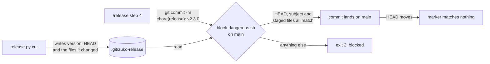
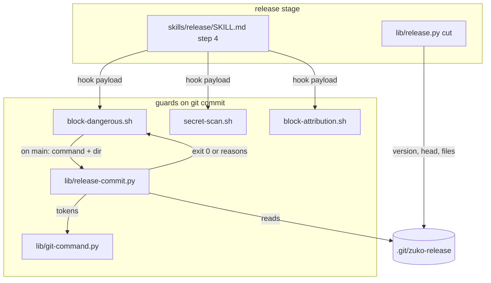
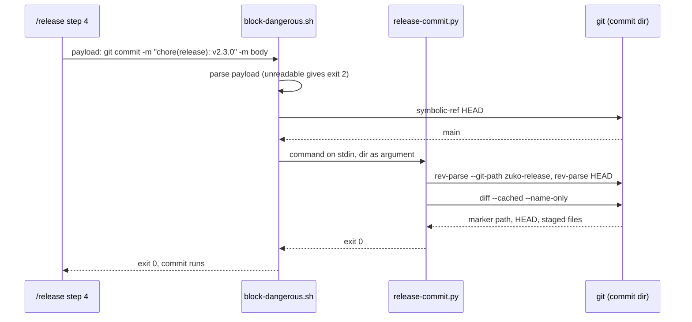

# Release commit guard

**Version:** v1 · **Status:** Shipped · **Type:** Bug · **Project type:** CLI/Library

**Depends on:** `release` — the commit this slice lets through is its step 4
**Page:** https://claude.ai/artifact/R9mozzVbH3JQ65xTvLJU3w

`/release` cannot make its own commit. D1 sends the release commit straight to
`main`, and `block-dangerous.sh` blocks every commit on `main`. This slice lets
exactly the commit `cut` prepared through, and makes the three guards bound to
`git commit` fail closed when they cannot read the hook payload.

## Problem

The first real release, v2.2.0 on 2026-10-05, stopped at step 4 with
"Blocked: committing directly on main". The user had to run the commit and tag
by hand with `!`, then hand back for the push. Every `/release` will stop the
same way until the guard changes.

The block dates from the zuko 2.0.0 rebuild (`40558c2`). The release slice
decided on a direct commit (D1; `release.md` ledger rows O4 and O12) and never
touched the guard. Its e2e commits with plain `git -C … commit --no-verify`
(`test-e2e-release.sh:153`), which no hook sees, so the suite stayed green.

```
/release step 4  ── git commit -m "chore(release): v2.2.0" ──►  hooks.json:53
                                                                    │
                                     block-dangerous.sh:42  HEAD = main ──► exit 2
```

The same v2.2.0 pentest confirmed two low findings in the commit guards.
`block-dangerous.sh:6` (P3) and `secret-scan.sh:6` (P4) end their payload
parse with `|| exit 0`. A payload Python cannot decode, such as one holding a
lone surrogate (`\ud800`), therefore skips every check: a force push or a
staged secret goes through.

## Slice test

| Check                         | Result                                                                                        |
| ----------------------------- | --------------------------------------------------------------------------------------------- |
| Cuts every layer it needs     | yes — `cut` writes what the guard reads, the guard reads it, the skill makes the commit       |
| One e2e test walks it         | yes — the release e2e feeds its step-4 commit to the hooks `hooks.json` binds to `git commit` |
| Worth shipping alone          | yes — `/release` runs start to finish again, and three guards stop failing open                |
| Fits (≤5 scenarios, ≤2 areas) | yes — 5 scenarios, 2 areas (the commit guards, the release stage)                             |

**Path:** full — a bug, but it touches more than three files and adds a
contract between `cut` and the guard.

## Flow



`cut` leaves a marker naming the version, the commit it cut on, and the files
it wrote. On `main`, the guard lets a commit through only when `HEAD` is still
that commit, the subject names that version, and the staged files are exactly
that list. Once the release commit lands, `HEAD` has moved and the marker
matches nothing.

## Acceptance criteria

```gherkin
Scenario: the release commit cut prepared lands on main
  Given zuko on main with plugin.json at 2.2.0
  And release.py cut has written CHANGELOG.md, both manifests, OVERVIEW.md
    and docs/security/v2.3.0/report.md for v2.3.0
  When /release step 4 stages those five files and runs
    git commit -m "chore(release): v2.3.0"
  Then block-dangerous.sh, secret-scan.sh and block-attribution.sh all exit 0
  And the commit lands on main
  And a second git commit -m "chore(release): v2.3.0" right after it is blocked,
    because HEAD is no longer the commit cut ran on

Scenario: an ordinary commit on main is still blocked
  Given zuko on main with no release marker
  When the session runs git commit -m "chore(release): v2.3.0"
  Then block-dangerous.sh exits 2 with "Blocked: committing directly on main"

Scenario: the marker covers only what cut wrote
  Given the marker for v2.3.0 listing the five files cut wrote
  When the commit also stages src/app.py
    or its subject is "chore(release): v2.4.0"
    or it runs as git commit -a -m "chore(release): v2.3.0"
    or the same call also runs git add src/app.py before the commit
  Then block-dangerous.sh exits 2 and names what did not match
  And a commit with the subject "fix: tidy changelog" gets the unchanged
    "Create a branch first" block
  But a reworded CHANGELOG.md line, with the same five files staged, passes

Scenario: an unreadable payload blocks instead of passing
  Given a hook payload Python cannot decode, holding a lone surrogate \ud800
  When it reaches block-dangerous.sh with "git push --force origin feature-x"
    or secret-scan.sh with "git commit -m x" and a staged AKIA… key
    or block-attribution.sh with "git commit -m x"
  Then each guard exits 2 and says it could not read the payload

Scenario: an abandoned release leaves nothing that widens the guard
  Given cut ran for v2.3.0 and the user stopped before step 4
  When the session later runs git commit -m "docs: fix a typo" on main
  Then block-dangerous.sh exits 2
  And the next release.py cut overwrites the old marker with its own
```

## Scope

**In:** the release marker `cut` writes; `block-dangerous.sh` allowing the
exact release commit on `main` or `master`; `block-dangerous.sh`, `secret-scan.sh` and `block-attribution.sh` failing
closed on an unreadable payload; the release e2e making its commit through the hooks.

**Out:**

- A protected `main` that rejects direct pushes — D1 and `release.md` O12 keep
  it out of scope; a release branch plus PR would be its own slice.
- P1 (awk's `system()` passing the pentester fence) and P2 (`sed` injection
  in `check-design-drift.sh`) — separate bug slices; neither touches a commit
  guard.
- Checking file content against what `cut` wrote — the user chose to allow
  edits to the same files between `cut` and the commit.

## Interface

### The release marker

`release.py cut` writes it last, after every other file, at the path
`git rev-parse --git-path zuko-release` gives (`.git/zuko-release` in a plain
checkout). Plain text, one field per line, then one changed path per line,
relative to the repo root:

```text
version 2.3.0
head 76a397d1c0f4e2b8a9d3c5e7f1a2b4c6d8e0f2a4
CHANGELOG.md
.claude-plugin/marketplace.json
plugins/zuko/.claude-plugin/plugin.json
OVERVIEW.md
docs/security/v2.3.0/report.md
```

A skipped pentest adds `DECISIONS.md` to the list. The list is exactly the set
`cut` prints under `Wrote`. Every `cut` overwrites the file. Nothing deletes
it: once `HEAD` moves, it matches nothing.

`cut`'s output gains one line under `Wrote`:

```
  .git/zuko-release                         marks the v2.3.0 commit for the main-branch guard
```

### What the guard lets through on `main`

All of these, or it blocks:

| Check                | Passes when                                                                                                        |
| -------------------- | ------------------------------------------------------------------------------------------------------------------ |
| Marker               | the commit's repo has a readable `zuko-release` marker                                                             |
| HEAD                 | `git rev-parse HEAD` equals the marker's `head`                                                                    |
| Subject              | the first `-m` is exactly `chore(release): v<version>`                                                             |
| Staged files         | `git diff --cached --name-only` equals the marker's list, as a set                                                 |
| Commit form          | one plain `git commit -m … [-m …]`: no `-a`/`--all`, `--amend`, pathspec, `-F`/`--file`, `-C`/`-c`, or `--no-verify` |
| Whole call           | the Bash call is that commit and nothing else: one line, first token `git`, then `commit`; no env prefix, git option, `$`, backtick, comment or operator |

The commit-form row closes the ways a commit could take more than the staged
set, or a message the guard did not read. The whole-call row exists because
the guard reads `HEAD` and the index before the call runs: a `git add` before
the commit, `GIT_INDEX_FILE=`, `git -c core.hooksPath=…`, or a `$(…)` the
shell splits into `--all` would each change the commit after the check passed
(found in /review, 2026-10-06). So `/release` step 4 stages in one Bash call
and commits alone in the next; the skill says so.

### Messages

No marker, or a commit that does not try to be a release — unchanged:

```
Blocked: committing directly on main. Create a branch first.
```

A commit whose subject starts `chore(release):`, with no marker or a marker
whose `head` is not `HEAD`:

```
Blocked: committing directly on main. A release commit needs the marker
release.py cut writes; run /release.
```

A `chore(release):` commit whose marker is current but does not match, naming
every check that failed:

```
Blocked: committing directly on main. This is not the commit release.py cut
prepared for v2.3.0:
  - staged src/app.py, which cut did not write
  - subject is "chore(release): v2.4.0", not "chore(release): v2.3.0"
  - HEAD is 9f2e1aa, not 76a397d where cut ran
```

An unreadable payload, in `block-dangerous.sh`, `secret-scan.sh` and
`block-attribution.sh`:

```
Blocked: could not read the hook payload, so this command was not checked.
Run it again without unusual characters.
```

## Technical plan

### Approach

`cut` writes the marker as its last write. `block-dangerous.sh` keeps its
branch check. When a commit whose directory is known lands on `main` or
`master`, it asks a new `lib/release-commit.py` whether this is the commit the
marker describes, before it denies. The checker reuses `lib/git-command.py`'s
tokens, because the parser's printed output joins arguments with spaces and
loses where `chore(release): v2.3.0` begins and ends. The three guards bound to
`git commit` change one line each: a payload Python cannot read ends in a
block, not `exit 0`.

Relies on: D1 (release commits go straight to `main`), D28 (a hook reads one
file the skill's step writes), D30 and D31 (drafted below).



`cut` leaves the marker. Step 4's commit reaches all three guards.
`block-dangerous.sh` sends a commit on `main` to `release-commit.py`, which
tokenises it with `git-command.py`, compares it with the marker, and answers
with exit 0 or the list of what failed.



The commit's own directory comes from `git-command.py --dir`, as
guard-worktree-dir built it. A commit whose directory the parser cannot know
gets no exception: it is checked against the cwd and the project dir and
blocked on `main`, as today.

### Changes

| File                                                               | What changes                                                                                                                                                                                                                                                                | Why                                    |
| ------------------------------------------------------------------ | --------------------------------------------------------------------------------------------------------------------------------------------------------------------------------------------------------------------------------------------------------------------------- | -------------------------------------- |
| `plugins/zuko/scripts/lib/release.py:1036` `cut`                   | after the file writes, write the marker: `version`, `head` from `git rev-parse HEAD`, then each path from `writes()`. The path comes from `git rev-parse --git-path zuko-release`, joined to the project when relative                                                      | scenarios 1, 5                         |
| `plugins/zuko/scripts/lib/release.py:1070`                         | one more `Wrote` line, `.git/zuko-release`, printed after `writes()`                                                                                                                                                                                                        | the user sees every file `cut` touched |
| `plugins/zuko/scripts/lib/release-commit.py` (new)                 | `release-commit.py <dir>`, command on stdin. Exit 0: it is the marker's commit. Exit 1, one reason per line: the subject starts `chore(release):` and a check fails. Exit 4: the subject does not start `chore(release):`. Exit 3: the command will not parse               | scenarios 1 to 3                       |
| `plugins/zuko/scripts/block-dangerous.sh:6`                        | the parse failure blocks with the unreadable-payload message instead of `exit 0`                                                                                                                                                                                            | scenario 4 (P3)                        |
| `plugins/zuko/scripts/block-dangerous.sh:42` `deny_commit_on_main` | takes a second argument, `release-ok`, passed only from the known-dir branch at `:62`. On `main` with it, runs `release-commit.py`: exit 0 returns, exit 1 denies with its reasons, exit 4 keeps today's message, any other exit denies with the "needs the marker" message | scenarios 1 to 3, 5                    |
| `plugins/zuko/scripts/secret-scan.sh:6`                            | the same one-line fail-closed change                                                                                                                                                                                                                                        | scenario 4 (P4)                        |
| `plugins/zuko/scripts/block-attribution.sh:8`                      | the same one-line fail-closed change                                                                                                                                                                                                                                        | scenario 4 (O6)                        |
| `plugins/zuko/scripts/tests/test-block-dangerous.sh`               | the release cases in the scratch repo on `main` with a marker, scenarios 1, 2, 3 and 5, each through `run_hook`; the surrogate payload                                                                                                                                      | scenarios 1 to 5                       |
| `plugins/zuko/scripts/tests/test-secret-scan.sh`                   | the surrogate commit with a staged `AKIA…` key                                                                                                                                                                                                                              | scenario 4                             |
| `plugins/zuko/scripts/tests/test-block-attribution.sh`             | the surrogate commit                                                                                                                                                                                                                                                        | scenario 4                             |
| `plugins/zuko/scripts/tests/test-release.sh:733`                   | `cut` writes the marker, `head` equal to `HEAD`, the file list equal to the `Wrote` paths; a second `cut` overwrites it                                                                                                                                                     | scenarios 1, 5                         |
| `plugins/zuko/scripts/tests/test-e2e-release.sh:152`               | step 3 feeds its commit, as the skill writes it, to the three hooks `hooks.json` binds to `git commit`, with `cwd` and `CLAUDE_PROJECT_DIR` set to the scratch repo; each must exit 0 before the commit runs. The same commit fed again after it must exit 2                | scenario 1, the e2e                    |
| `plugins/zuko/skills/release/SKILL.md` step 4 | one paragraph: each line is its own Bash call, and the commit is the whole call | the guard reads the index before the call; found in /review |

Reusing: `git-command.py`'s `tokenise`, `strip_heredocs` and
`invocations_with_dirs`, loaded with `importlib` the way
`block-attribution.sh:22` loads them. `changelog.git` for the two `rev-parse`
calls in `cut`. `run.sh`'s `expect_exit` and `expect_match`, and `run_hook` in
`test-block-dangerous.sh`. Step 4's text gains one paragraph: each line is its
own Bash call, so the commit is the whole call (found in /review).

### Earn-it

| Added                      | Triggered by                                                                                                                                       |
| -------------------------- | -------------------------------------------------------------------------------------------------------------------------------------------------- |
| `.git/zuko-release` marker | scenarios 1 and 3: the guard has to know which files and which version `cut` prepared, and nothing in the commit says so                           |
| `head` field in the marker | scenarios 1 and 5: without it, a cleanup step has to delete the marker on every path out of `/release`, a failed push included (O4)                |
| `lib/release-commit.py`    | scenario 3 compares a subject that holds a space; `git-command.py`'s printed output loses token boundaries, and the bash guard cannot rebuild them |

### Non-functionals

|                      |                                                                                                                                                                                                                                                    |
| -------------------- | -------------------------------------------------------------------------------------------------------------------------------------------------------------------------------------------------------------------------------------------------- |
| **Load**             | one more `python3` run per Bash call that commits on `main`; none elsewhere. The fail-closed change adds no work                                                                                                                                   |
| **Breaks first**     | `block-dangerous.sh` runs on every Bash call. A broken `python3` used to switch it off silently; now every Bash call blocks with the unreadable-payload message until `python3` is fixed                                                           |
| **Security surface** | the guard trusts `.git/zuko-release`: anything that can write inside `.git` can mark a commit for `main` (O5). The marker lets through only the exact staged set, version and `HEAD` it names. The fail-closed change removes the P3 and P4 bypass |
| **Proof it works**   | `bash plugins/zuko/scripts/tests/run.sh` passes in full, and `test-e2e-release.sh` prints `e2e: the release commit passes block-dangerous.sh, secret-scan.sh and block-attribution.sh`. In use: the next `/release` makes its commit with no `!`   |
| **Rollout**          | no flag: hook scripts and one `cut` write. Rollback is `git revert` of the slice's commits; a marker left in `.git` is then ignored                                                                                                                |

### Test plan

| Scenario                                | Test                                                                          | Command                                                                                |
| --------------------------------------- | ----------------------------------------------------------------------------- | -------------------------------------------------------------------------------------- |
| 1 the release commit lands              | `test-block-dangerous.sh`, `test-release.sh`, `test-e2e-release.sh`           | `bash plugins/zuko/scripts/tests/run.sh block-dangerous`, `… release`, `… e2e-release`           |
| 2 an ordinary commit stays blocked      | `test-block-dangerous.sh`                                                     | `bash plugins/zuko/scripts/tests/run.sh block-dangerous`                               |
| 3 the marker covers only what cut wrote | `test-block-dangerous.sh`                                                     | `bash plugins/zuko/scripts/tests/run.sh block-dangerous`                               |
| 4 an unreadable payload blocks          | `test-block-dangerous.sh`, `test-secret-scan.sh`, `test-block-attribution.sh` | `bash plugins/zuko/scripts/tests/run.sh block-dangerous`, `… secret-scan`, `… block-attribution` |
| 5 an abandoned release widens nothing   | `test-block-dangerous.sh`, `test-release.sh`                                  | `bash plugins/zuko/scripts/tests/run.sh block-dangerous`, `… release`                       |

**E2E:** `test-e2e-release.sh`. It runs `plan` and `cut`, feeds the step-4
commit to all three hooks before making it, then commits, tags, pushes and
releases. Before the fix, its new hook check fails with exit 2 from
`block-dangerous.sh`. Each surrogate case is written first and fails with exit
0 before the fix.

### Chunks

Single chunk. The e2e needs `cut`'s marker and the guard's check together, so
it cannot be built in parallel (lesson: an e2e spanning two chunks builds
serially). Order: tests first, then `release.py`, `release-commit.py`, then the
three guards.

### Risks

| Risk                                                                                            | Mitigation                                                                                                                                                                                                                                            |
| ----------------------------------------------------------------------------------------------- | ----------------------------------------------------------------------------------------------------------------------------------------------------------------------------------------------------------------------------------------------------- |
| Any process that writes `.git/zuko-release` can mark a commit for `main`, the model included    | The guard catches accidents, not an adversary: a session that wants a commit on `main` can already ask the user to run it with `!`. The marker binds the exact `HEAD`, version and staged files, so a forged one has to name them all. Accepted as O5 |
| Fail-closed `block-dangerous.sh` blocks every Bash call when `python3` is broken                | The message says the payload could not be read, and every zuko hook already needs `python3`. A block with a reason beats a guard that is silently off                                                                                                 |
| The checker reads a different commit than git runs, such as a second `-m` taken for the subject | Only the first `-m` is the subject, as git builds it. `-F`, `-C`, `-c`, `-a`, `--amend`, a pathspec, `--no-verify`, and a second `git commit` in the call all block (Interface). A test covers each                                                   |
| A stale marker from an abandoned release                                                        | It needs `HEAD` unchanged, a `chore(release):` subject and the exact staged set. Any other commit gets the ordinary block (scenario 5)                                                                                                                |

### Decisions to record

Recorded as D30, D31.

## Open items

| ID  | What                                                                | Type     | Raised at | Owner | Status   | Answer                                                                                    |
| --- | ------------------------------------------------------------------- | -------- | --------- | ----- | -------- | ----------------------------------------------------------------------------------------- |
| O1  | What may land on `main` through the guard?                          | question | spec p1   | user  | Resolved | Only the commit `cut` prepared: marker present, subject names its version, same file list |
| O2  | Does an edit to a cut file between `cut` and the commit still pass? | question | spec p1   | user  | Resolved | Yes: the guard compares the staged file list, not the content                             |
| O3  | Fold the P3 and P4 fail-open fixes into this slice?                 | question | spec p1   | user  | Resolved | Yes, both: an unreadable payload blocks in `block-dangerous.sh` and `secret-scan.sh`      |
| O4  | Who removes the marker after the release commit?                                | question | spec p2   | claude| Resolved | Nobody: the marker records `HEAD`, so it stops matching once the commit lands; the next `cut` overwrites it |
| O5  | Anything that can write `.git/zuko-release` can mark a commit for `main` | flag | spec p3 | user | Accepted risk | The guard catches accidents, not an adversary; the marker must name the exact HEAD, version and staged files. Agreed with pause 3, 2026-10-06 |
| O6  | Fail `block-attribution.sh` closed too? It has the same `exit 0` on a parse failure as P3 and P4 | question | spec p3 | user | Resolved | Yes: all three guards bound to `git commit` fail closed |
| O7  | The guard checks before the call runs, so anything else in the call can change the commit, and step 4 run as `git add && git commit` is blocked | flag | /review | user | Resolved | The release commit must be the whole Bash call; step 4 stages in its own call. Approved 2026-10-06 |

_Never delete this section or its rows. See references/ledger.md._

## Glossary

- **e2e** — end-to-end: one test that walks the whole slice as a user would
- **Fail-open** — a guard that cannot decide lets the command run; failing
  closed blocks it instead
- **Hook payload** — the JSON Claude Code sends a hook on stdin, holding the
  tool name and the command about to run
- **Pentest** — the security test `/release` runs on the code it ships; its
  findings are numbered P1, P2, …
- **Lone surrogate** — half of a UTF-16 character pair on its own, such as
  `\ud800`; valid in JSON text, but Python cannot print it as UTF-8
- **Release marker** — the file `cut` writes at `.git/zuko-release`, naming the
  version and the files it changed, for the guard to read
