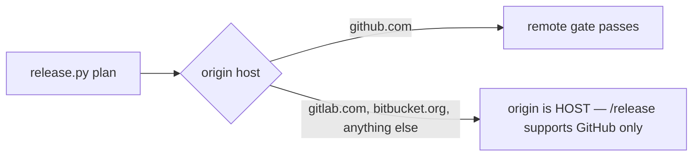
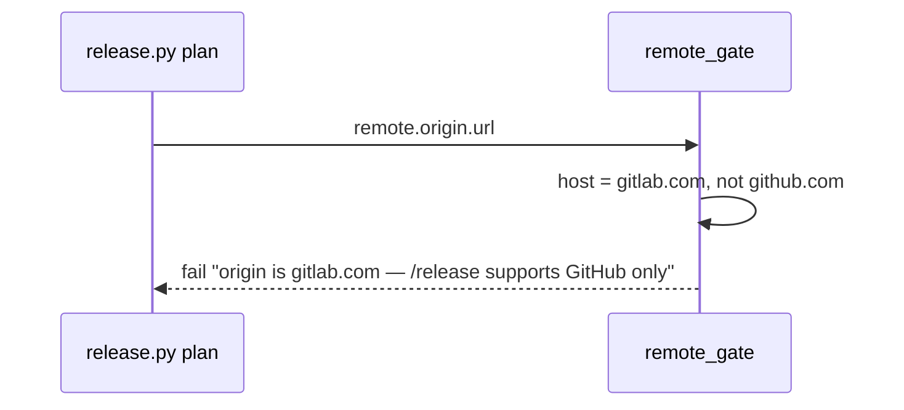

# Release host message

**Version:** v1 · **Status:** Built · **Type:** Bug · **Project type:** CLI/Library

**Shape doc:** docs/specs/v3-release-and-hosts/shape.md — slice 8, part 2 of 9
**Depends on:** None
**Page:** https://claude.ai/artifact/MvZ3Vm4192KiSyEyU5o4Hh

`/release` on a GitLab origin says "/release supports GitHub only" instead of
promising "GitLab releases come in slice 6". Slice 6 was dropped on 2026-09-25
(shape O13), so the current message promises a slice that will never ship.

## Problem

`release.py:165` has a branch for `gitlab.com` that fails the remote gate with
"origin is gitlab.com — GitLab releases come in slice 6". Every other host gets
"origin is HOST — /release supports GitHub only" at `release.py:168`. Slice 6 is in
the shape's Not doing list, so a GitLab user is told to wait for something that is
not coming.

## Slice test

| Check                         | Result                                                                  |
| ----------------------------- | ----------------------------------------------------------------------- |
| Cuts every layer it needs     | yes — the gate message and its test                                     |
| One e2e test walks it         | yes — `test-release.sh` section 8 runs `release.py plan` on each remote |
| Worth shipping alone          | yes — a GitLab user gets a true answer                                  |
| Fits (≤5 scenarios, ≤2 areas) | yes — 1 scenario, one area (`scripts/`)                                 |

**Path:** light — a copy change in 2 files. Pauses 1 and 3 are merged; pause 2 is
skipped. Part 2 of slice 8's split; the full split is in `mermaid-placeholder.md`.

## Flow



Every host other than `github.com` now gets the same line.

## Acceptance criteria

```gherkin
Scenario: a GitLab origin is told the truth
  Given invoice-cli with origin https://gitlab.com/acme/invoice-cli.git
  When the user runs /release
  Then plan exits 1 with "  remote     origin is gitlab.com — /release supports GitHub only"
  And the output never mentions slice 6
  And bitbucket.org and github.com.example.org still get the same line as today
```

## Scope

**In:** delete the `gitlab.com` branch at `release.py:165`–`:166`; update the
GitLab expectation in `test-release.sh:294`.

**Out:** the old text in `docs/specs/release.md:142` and `:274` — that spec is
Shipped, and its text records what was true then; GitLab support — dropped (shape
O13).

## Technical plan

### Approach

Remove the two-line `if host == "gitlab.com"` branch in `remote_gate`, so
`gitlab.com` falls through to the generic line that already exists for every other
host.

Relies on: none



### Changes

| File                                             | What changes                                            | Why        |
| ------------------------------------------------ | ------------------------------------------------------- | ---------- |
| `plugins/zuko/scripts/lib/release.py:165`        | Delete the `gitlab.com` branch and its message          | scenario 1 |
| `plugins/zuko/scripts/tests/test-release.sh:294` | The GitLab pair expects "/release supports GitHub only" | scenario 1 |

Reusing: the generic message at `release.py:168` and the section 8 loop.

### Non-functionals

|                      |                                                   |
| -------------------- | ------------------------------------------------- |
| **Load**             | One call per `/release`                           |
| **Breaks first**     | Nothing                                           |
| **Security surface** | None; the remote URL is read, never followed      |
| **Proof it works**   | `/release` on any GitLab repo prints the new line |
| **Rollout**          | No flag. Rollback is `git revert`                 |

### Test plan

| Scenario | Test                        | Command                                          |
| -------- | --------------------------- | ------------------------------------------------ |
| 1        | `test-release.sh` section 8 | `bash plugins/zuko/scripts/tests/run.sh release` |

**E2E:** section 8, which runs the real `release.py plan` against a scratch repo per
remote.

### Chunks

Single chunk.

### Risks

None beyond a stale message elsewhere; `grep -rn "slice 6" plugins/` before shipping
finds any.

### Decisions to record

None — no choice here rejected an option.

## Open items

| ID  | What                                           | Type | Raised at | Owner  | Status   | Answer                                                            |
| --- | ---------------------------------------------- | ---- | --------- | ------ | -------- | ----------------------------------------------------------------- |
| O1  | Leave the old message in Shipped `release.md`? | flag | spec p1   | claude | Resolved | Yes: a Shipped spec records what was true; only live code changes |

_Never delete this section or its rows. See references/ledger.md._

## Glossary

- **Remote gate** — the first `/release` check, which reads `origin` and stops on
  any host but GitHub.
