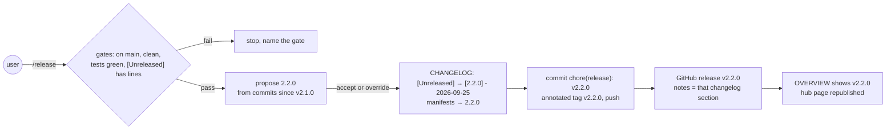
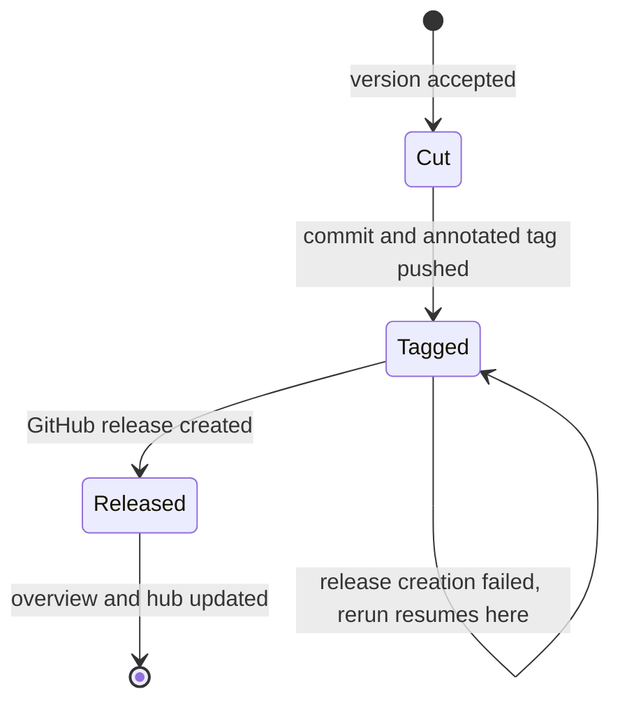
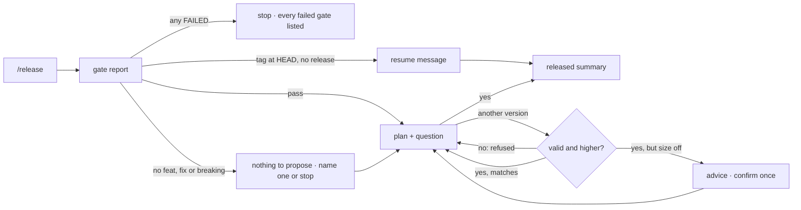
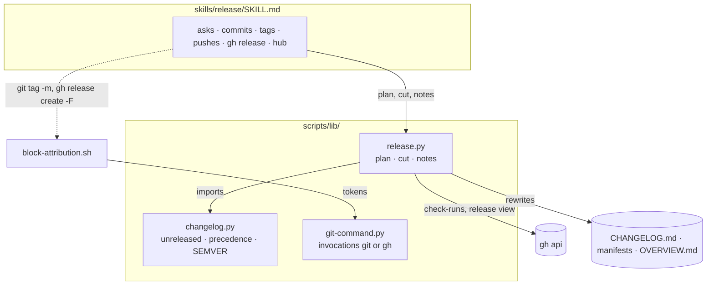
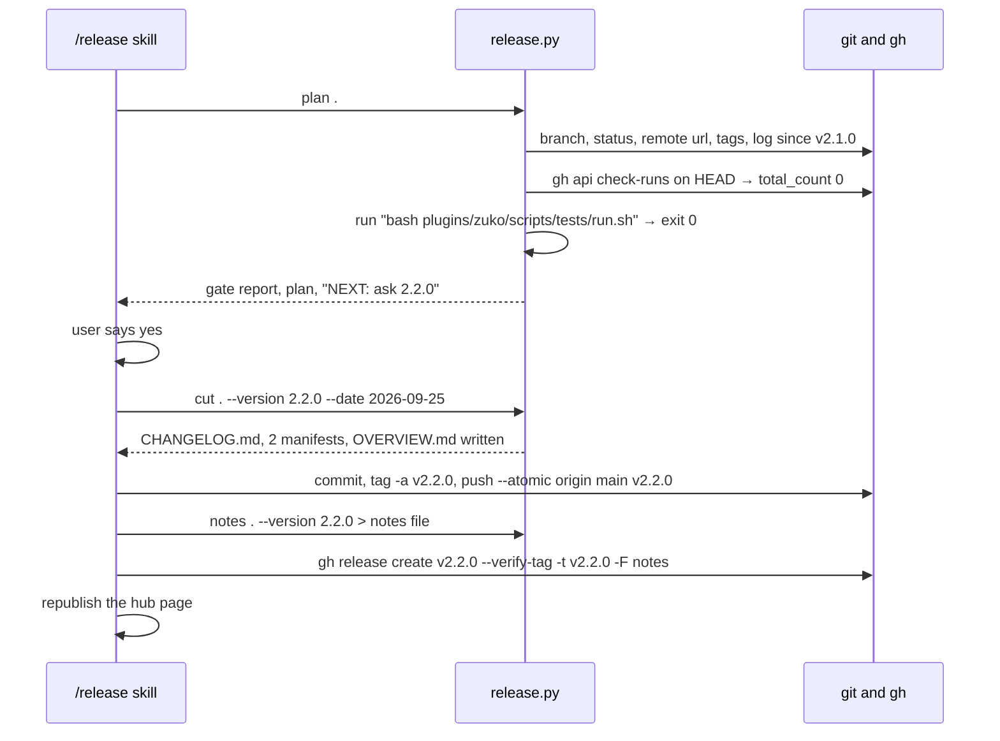

# Release

**Version:** v1 · **Status:** Refined · **Type:** Feature · **Project type:** CLI/Library

**Shape doc:** docs/specs/v3-release-and-hosts/shape.md — slice 4
**Depends on:** `changelog` — `/release` cuts versions from its `[Unreleased]` section
**Page:** https://claude.ai/artifact/GWzbvfunoJvLFAsWrBkimp

`/release` turns everything shipped since the last release into a version: it works
out the number from the commits, moves `[Unreleased]` under it, bumps the manifest
versions, then commits, tags, pushes and creates the GitHub release. Now, because
`changelog` fills `[Unreleased]` on every ship, and nothing ever empties it.

## Problem

zuko ships slices to `main` but never releases them. There is no tag and no GitHub
release, and the version in `plugin.json` and `marketplace.json` (2.1.0 today) is
bumped by hand when someone remembers. Someone who installed zuko cannot tell which
version they have, or what changed since. Since `changelog` shipped, every slice adds
lines under `[Unreleased]` and nothing ever turns them into a version.

## Slice test

| Check                         | Result                                                                                                                            |
| ----------------------------- | --------------------------------------------------------------------------------------------------------------------------------- |
| Cuts every layer it needs     | yes — a new `/release` stage, a script for the version maths and the changelog cut, and the attribution hook for tags             |
| One e2e test walks it         | yes — one scratch repo with a bare remote: gates, version, cut, bump, commit, tag, push, release notes; then a rerun that resumes |
| Worth shipping alone          | yes — zuko itself gets its first tagged release with notes, and any repo using zuko can release                                   |
| Fits (≤5 scenarios, ≤2 areas) | yes — 5 scenarios; two areas: `scripts/` (version and cut, hook) and `skills/release` + `references/`                             |

**Path:** full — a new stage with a new command surface and a new script.

## User story

As someone who ships with zuko, I want one command that turns what I've shipped into
a numbered release, so users can see what version they have and what changed since
the last one.

## Flow



The user runs `/release`; after the gates pass, zuko proposes a version, the user
accepts or overrides it, and zuko cuts the changelog, bumps the manifests, commits,
tags, pushes, creates the release, and updates the overview and hub.

## States



A release that stops after the tag is pushed is resumed, never redone: a rerun finds
the tag on `HEAD` and goes straight to creating the GitHub release.

## Acceptance criteria

```gherkin
Scenario: a feature release from main
  Given zuko on main, clean, with no tags, plugin.json and marketplace.json at 2.1.0,
    and [Unreleased] holding three lines under "### Added" from feat commits
  And the overview's test command "bash plugins/zuko/scripts/tests/run.sh" passes
  When the user runs /release and accepts the proposed version 2.2.0
  Then CHANGELOG.md has an empty "## [Unreleased]" above "## [2.2.0] - 2026-09-25"
    holding those three lines, and compare links for both at the bottom
  And plugin.json and marketplace.json say 2.2.0
  And main has the commit "chore(release): v2.2.0" with an annotated tag v2.2.0,
    both pushed to origin
  And GitHub release v2.2.0 exists, its notes exactly the lines under [2.2.0]
  And OVERVIEW.md shows "Release: v2.2.0" and the hub page is republished

Scenario: the version follows the commits since the last tag
  Given invoice-cli tagged v1.4.2, with commits since then
    "fix(parsers): keep leading zeros" and "feat(exporters): write ledger csv"
  When /release proposes a version
  Then it proposes 1.5.0
  And with a commit "feat(config)!: read settings from invoice.toml" added it proposes 2.0.0
  And for a repo tagged v0.3.1 with that same breaking commit it proposes 0.4.0
  And when the user overrides with "1.4.2" or "banana" it refuses, naming the rule:
    a valid version above 1.4.2
  And when the user overrides with "1.4.3" it pushes back — a feat since 1.4.2 calls
    for a minor — and releases 1.4.3 only after the user confirms

Scenario: gates refuse a release that isn't ready
  Given invoice-cli tagged v1.4.2
  When /release runs on branch feat/export-csv, or with an uncommitted change,
    or with the test command failing, or with [Unreleased] holding no lines
  Then it stops before proposing a version, naming the gate that failed
  And nothing is written, committed or tagged

Scenario: a first release with no tags and no manifest version
  Given ledger-tools with no tags, no manifest file, and [Unreleased] holding lines
  When the user runs /release
  Then it asks for the first version, 0.1.0 or 1.0.0, and proposes nothing itself
  And a repo whose package.json says 1.2.0 and pyproject.toml says 1.3.0 stops,
    naming both files and both versions

Scenario: a release that stopped after the tag is resumed
  Given v2.2.0 is tagged at HEAD and pushed, and no GitHub release v2.2.0 exists
  When the user runs /release again
  Then it creates GitHub release v2.2.0 from the [2.2.0] section, without a new
    commit or tag
  And a tag message or release notes containing "Generated with Claude Code" is
    blocked before it is created
```

## Scope

**In:**

- A `/release` stage: gates, proposed version with override, changelog cut with
  compare links, manifest bump, release commit, annotated tag, push, GitHub release,
  the overview's release line and the hub page.
- Version maths from Conventional Commits since the last tag: `feat` → minor, `fix` →
  patch, `!` or a `BREAKING CHANGE:` footer → major, and on `0.x` a breaking change
  bumps minor (semver §4). No tag → the manifest's version is the last one.
- Manifest versions, a closed list: `package.json`, `pyproject.toml`, `Cargo.toml`,
  `.claude-plugin/plugin.json`, `.claude-plugin/marketplace.json` (the plugin entry
  whose `source` is this repo's plugin), each only when it exists.
- The tests gate: CI checks on `HEAD` when there are any; no checks → the overview's
  "Run it" test command, run locally, must exit 0; neither → stop.
- The attribution ban from `references/git-naming.md` extends to tag messages and
  release notes; the hook blocks them.

**Out:**

- The pentest step — slice 5 plugs into `/release` between the version and the cut.
- GitLab releases and `glab` — slice 6. A GitLab remote stops `/release` with "GitLab
  releases come in slice 6".
- Pre-release versions (`2.2.0-rc.1`) — not needed yet; the override refuses them.
- Release branches and PR-based releases — rejected at pause 1 (O12): the commit goes
  straight to `main`.
- Publishing to a registry (npm, PyPI, crates.io) — out of zuko's scope; the repo's
  own pipeline does that from the tag.

## Interface

### Command

| Form               | Does                                                                     |
| ------------------ | ------------------------------------------------------------------------ |
| `/release`         | gates, then proposes a version and asks                                  |
| `/release 3.0.0`   | gates, then proposes 3.0.0 instead of the computed one, and still asks   |

One `yes` covers everything after it: write, commit, tag, push, GitHub release. The
plan printed before the question lists each of those, so the yes is informed.

### Interface map



Every run prints the gate report first; it then either stops, resumes, or shows the
plan and waits for a yes.

### Gates, passing

```
Release gates
  branch     main
  tree       clean
  remote     github.com/dzaffren/claude-plugin
  tests      no CI checks on 6e37aaf — ran "bash plugins/zuko/scripts/tests/run.sh": exit 0
  changelog  3 lines under [Unreleased]
```

With CI checks on `HEAD`, the tests line reads `tests      4 CI checks on 6e37aaf, all passing`.

### The plan and the question

```
Last version  2.1.0  from plugin.json and marketplace.json (no tags yet)
Since then    21 commits: 8 feat · 3 fix · 0 breaking
Proposed      2.2.0  — a feat since 2.1.0 bumps minor

Will write
  CHANGELOG.md                              [Unreleased] → [2.2.0] - 2026-09-25, links
  .claude-plugin/marketplace.json           2.1.0 → 2.2.0
  plugins/zuko/.claude-plugin/plugin.json   2.1.0 → 2.2.0
Then
  commit "chore(release): v2.2.0" on main · annotated tag v2.2.0
  push main and v2.2.0 to origin · GitHub release v2.2.0

Release 2.2.0? Say yes, or give another version.
```

The reason line names the rule that won: `a breaking change since 1.4.2 bumps major`,
`a breaking change on 0.x bumps minor (semver §4)`, `a fix since 1.4.2 bumps patch`.

### Nothing calls for a release

No `feat`, `fix` or breaking commit since the last version: zuko proposes nothing,
the way semantic-release and commitizen do by default. The user can still name one.

```
Nothing since 2.1.0 calls for a release: 4 commits, none feat, fix or breaking.
[Unreleased] has 2 lines. Give a version to release anyway, or stop here.
```

### Asking for a first version

```
No tags and no manifest version to start from.
First version: 0.1.0 (still changing) or 1.0.0 (stable)?
```

### Overrides: refused, or pushed back

An override that is not a valid version above the last one is refused — there is no
release it could mean:

```
"1.4.2" is not above 1.4.2. Give a plain X.Y.Z above 1.4.2, or yes for 1.5.0.
"banana" is not a version. Give a plain X.Y.Z above 1.4.2, or yes for 1.5.0.
"1.5.0-rc.1" is a pre-release; those are not supported yet. Give a plain X.Y.Z above 1.4.2, or yes for 1.5.0.
```

A valid override whose size does not match the commits is advice, never a block. zuko
says what the commits call for and what users will read into the number, then asks
once more:

```
1.4.3 is a patch, but a feat since 1.4.2 calls for a minor (1.5.0). Users read a
patch as fixes only. Release 1.4.3 anyway? yes, or give another version.

1.5.0 is a minor, but "feat(config)!: read settings from invoice.toml" is breaking,
which calls for 2.0.0. Users pinned to ^1 get it without warning. Release 1.5.0
anyway? yes, or give another version.

3.0.0 is a major, but nothing since 2.1.0 is marked breaking. Fine for a milestone;
users may look for something they must change. Release 3.0.0? yes, or give another
version.
```

### Gates, failing

Every failing gate is listed, then the run stops. Nothing is written.

```
Release gates FAILED
  branch     on feat/export-csv — release from main
  tree       2 uncommitted files — commit or stash them first
  tests      "pytest" exited 1
  tests      no CI checks on 4f2a9c1 and no test command in OVERVIEW.md "Run it"
  tests      2 of 4 CI checks on 4f2a9c1 failing: lint, e2e
  changelog  [Unreleased] has no lines — nothing to release
  changelog  CHANGELOG.md missing — /ship creates it
  commits    no commits since v1.4.2
  remote     origin is gitlab.com — GitLab releases come in slice 6
  remote     origin is bitbucket.org — /release supports GitHub only
  manifests  versions disagree: package.json 1.2.0 · pyproject.toml 1.3.0
  tag        v1.5.0 exists at 9c01d2e, not HEAD — check it by hand; zuko never moves a tag
```

### Resuming

```
v2.2.0 is tagged at HEAD (a1b2c3d) and on origin, but GitHub has no release v2.2.0.
Resuming: creating the release from the [2.2.0] section. No new commit or tag.
```

### Released

```
Released v2.2.0
  commit    a1b2c3d chore(release): v2.2.0
  tag       v2.2.0, annotated, pushed
  release   https://github.com/dzaffren/claude-plugin/releases/tag/v2.2.0
  overview  Release: v2.2.0 · hub page republished
```

### What it writes

`CHANGELOG.md` — `[Unreleased]` stays, empty, and its lines move under the new heading.
Links go at the bottom: a compare link when the last version has a tag, the release
page when it does not.

```markdown
## [Unreleased]

## [2.2.0] - 2026-09-25

### Added

- /ship writes plain-language lines to CHANGELOG.md for every feature or fix, and ...

[unreleased]: https://github.com/dzaffren/claude-plugin/compare/v2.2.0...HEAD
[2.2.0]: https://github.com/dzaffren/claude-plugin/releases/tag/v2.2.0
```

The next release after it links `[2.3.0]: .../compare/v2.2.0...v2.3.0`.

| Artifact            | Content                                                                                       |
| ------------------- | --------------------------------------------------------------------------------------------- |
| Release commit      | subject `chore(release): v2.2.0`; body names the files it changed                              |
| Tag                 | annotated `v2.2.0`, message `v2.2.0`                                                           |
| GitHub release      | title `v2.2.0`; notes are the lines under `## [2.2.0]`, exactly, without the heading            |
| `OVERVIEW.md`       | status line gains the release: `**Status:** Active · **Release:** v2.2.0 · **Updated:** …`      |
| Hub page            | the Releases cell reads `v2.2.0 · 2026-09-25`, linked to the release page                      |

The attribution ban covers the commit, the tag message and the release notes.

## Technical plan

### Approach

Code owns every mechanical step. A new `scripts/lib/release.py` runs the gates, works
out the version and checks an override, cuts the changelog, bumps the manifests and
the overview's release line, and prints the release notes. It reuses `changelog.py`'s
parsing, so there is still one reading of `CHANGELOG.md`. It never commits, tags or
pushes: the new `skills/release/SKILL.md` does those, asks the question, and
republishes the hub. `plan` ends every run with one `NEXT:` line saying what the
skill does next, so the skill branches on a line the tests pin, not on prose. The
attribution hook learns `git tag` and `gh release create`.

Relies on: D1, D2, D3 (drafted below)



The skill calls `release.py` for every decision and writes only through git and gh;
the hook reads those git and gh commands before they run.



`plan` decides, `cut` writes, the skill does the outward steps; a rerun's `plan`
sees the tag and says `NEXT: resume v2.2.0` instead.

**The `NEXT:` line.** The last line `plan` prints, one of:

| Line                         | Skill does                                                        |
| ---------------------------- | ----------------------------------------------------------------- |
| `NEXT: stop`                 | a gate failed; report and end                                     |
| `NEXT: ask 2.2.0`            | ask "Release 2.2.0?"                                              |
| `NEXT: confirm 1.4.3`        | an override whose size is off; the advice is above it; ask once   |
| `NEXT: ask-first`            | no tag, no manifest version; ask 0.1.0 or 1.0.0                   |
| `NEXT: ask-version`          | nothing calls for a release; ask for a version or stop            |
| `NEXT: resume v2.2.0 push`   | tag at HEAD, not on origin; push it, then create the release      |
| `NEXT: resume v2.2.0 release`| tag at HEAD and on origin, no GitHub release; create it           |

`plan --version X.Y.Z` checks an override and answers `ask`, `confirm` or `stop`.
`cut` re-checks everything `plan` did and refuses on any failure, so a skill that
skipped `plan` still cannot write a bad release.

**Version rule.** Commits `last..HEAD`, reusing `changelog.py`'s `NEEDS_LINE` and
`BREAKING`: any breaking → major, or minor below 1.0.0; else any `feat` → minor; else
any `fix` → patch; else nothing. The last version is the newest semver tag; no tag →
the manifests' shared version; none → `ask-first`.

**Tests gate.** `gh api repos/{owner}/{repo}/commits/{sha}/check-runs` plus
`/status`. Both `total_count` 0 → no CI, so run the `test` cell of the overview's
"Run it" table with `bash -c` in the repo, and require exit 0. Any check failing →
fail naming them; a gh error → fail with its message, never "no CI".

### Changes

| File                                                        | What changes                                                                                                                                                                                                                                             | Why                  |
| ----------------------------------------------------------- | -------------------------------------------------------------------------------------------------------------------------------------------------------------------------------------------------------------------------------------------------------- | -------------------- |
| `plugins/zuko/scripts/lib/release.py` (new)                 | `plan [--version]`, `cut --version --date`, `notes --version`, per the Interface and the `NEXT:` table. Manifest versions are edited by replacing the one version line in place, so every other byte stays; `cut` adds the overview's `**Release:**` field | scenarios 1–5        |
| `plugins/zuko/scripts/tests/test-release.sh` (new)          | version rule table (feat, fix, `!`, footer, 0.x, nothing); overrides refused and pushed back; each gate; manifests found, bumped, disagreeing; cut byte-exact; links first and later; notes; resume states with a fake `gh` on PATH                 | scenarios 1–5        |
| `plugins/zuko/scripts/tests/test-e2e-release.sh` (new)      | the walk under Test plan                                                                                                                                                                                                                                 | slice proof          |
| `plugins/zuko/scripts/lib/git-command.py:136`               | `invocations(tokens, program="git")`: the bare-token rule applies to `gh` too                                                                                                                                                                            | scenario 5           |
| `plugins/zuko/scripts/block-attribution.sh:65-81`           | also read `git tag` messages (`-m`, `-F`, `--message`, `--file`) and `gh release create` notes and title (`-n`, `--notes`, `-F`, `--notes-file`, `-t`, `--title`); block text names which command                                                        | scenario 5           |
| `plugins/zuko/hooks/hooks.json:13-18`                       | the attribution hook also fires on `Bash(git tag *)` and `Bash(gh release *)`                                                                                                                                                                            | scenario 5           |
| `plugins/zuko/scripts/tests/test-block-attribution.sh`      | tag and release commands blocked with attribution, clean ones pass, a quoted "git tag" in prose passes                                                                                                                                                   | scenario 5           |
| `plugins/zuko/skills/release/SKILL.md` (new)                | the stage: run `plan`, branch on `NEXT:`, ask, `cut`, commit, `git tag -a`, `git push --atomic origin main vX`, `notes` to a temp file, `gh release create --verify-tag`, republish the hub                                                               | scenarios 1, 4, 5    |
| `plugins/zuko/references/git-naming.md`                     | the ban list covers tag messages and release notes                                                                                                                                                                                                       | scenario 5           |
| `plugins/zuko/references/visual-page.md:66-80`              | the hub's status strip shows the latest release from the overview's `**Release:**` field                                                                                                                                                                 | scenario 1           |
| `plugins/zuko/scripts/route-to-zuko.sh`                     | routing line: "release it", "cut a version" → `zuko:release`                                                                                                                                                                                             | reachability         |

Reusing: `changelog.py`'s `unfenced`, `unreleased`, `precedence`, `SEMVER`,
`NEEDS_LINE`, `BREAKING`, `git`; `git-command.py`'s `tokenise` and `strip_heredocs`;
the test harness `run.sh`. The overview's `**Status:**` readers take only the first
word (`load-overview.sh:22`, `verify-ship-gates.sh:45`, `check-open-items.sh:16`,
`readme_block.py:133`), so the new `**Release:**` field on that line breaks none of
them.

### Earn-it

| Added                             | Triggered by                                                                                      |
| --------------------------------- | ------------------------------------------------------------------------------------------------- |
| `lib/release.py`                  | scenarios 1–5 — version rule, gates, changelog cut and manifest edits need tests, not prose        |
| the `NEXT:` line                  | scenarios 2, 4, 5 — seven outcomes the skill must tell apart; a pinned line beats parsing prose    |
| `invocations(program=...)`        | scenario 5 — `gh release create` needs the same quoting-aware parser, not a second one             |
| two `if` entries in `hooks.json`  | scenario 5 — today the hook fires only on `git commit`                                             |

No new dependency. `gh` is already required by `/ship`.

### Non-functionals

|                      |                                                                                                                                                                                            |
| -------------------- | ------------------------------------------------------------------------------------------------------------------------------------------------------------------------------------------ |
| **Load**             | One release every few weeks. Cost is the test suite: zuko's takes about 2 minutes                                                                                                          |
| **Breaks first**     | A suite longer than the 10-minute Bash cap — `plan` would time out (O17)                                                                                                                   |
| **Security surface** | Runs the overview's `test` command — a file the user approved at onboarding. Pushes to `origin main` and creates a release with the user's `gh` login, after one explicit yes. Stores nothing |
| **Proof it works**   | The skill prints `Released v2.2.0` with the release URL; `gh release view v2.2.0` shows the notes                                                                                           |
| **Rollout**          | No flag: nothing runs until the user types `/release`. Rollback: revert the merge commit. A release already made stays; zuko never deletes a tag                                           |

### Test plan

| Scenario                | Test                                                                         | Command                                                    |
| ----------------------- | ---------------------------------------------------------------------------- | ---------------------------------------------------------- |
| 1 feature release       | `test-release.sh` (cut, notes) plus the e2e                                  | `bash plugins/zuko/scripts/tests/run.sh release`           |
| 2 version rule          | `test-release.sh` (rule table, overrides)                                    | same                                                       |
| 3 gates                 | `test-release.sh` (each gate, nothing written)                               | same                                                       |
| 4 first release         | `test-release.sh` (ask-first, disagreeing manifests)                         | same                                                       |
| 5 resume, attribution   | `test-release.sh` (resume states) plus `test-block-attribution.sh`           | `bash plugins/zuko/scripts/tests/run.sh block-attribution` |
| all                     | the whole suite                                                              | `bash plugins/zuko/scripts/tests/run.sh`                   |

**E2E:** `scripts/tests/test-e2e-release.sh`. A scratch repo whose `origin` reads
`https://github.com/acme/invoice-cli.git` and pushes to a local bare repo through
`url.<bare>.insteadOf`, and a fake `gh` first on PATH that answers `check-runs` with
0, `release view` with "release not found", and records `release create`. The walk:
tag v1.4.2 and commit a feat and a fix, then:

1. `plan` gives `NEXT: ask 1.5.0`.
2. `cut` writes the changelog and manifests byte-exact.
3. Commit, tag and push as the skill does; the bare repo holds the commit and the
   annotated tag.
4. `notes` equals the `[1.5.0]` section, and the fake `gh` received it.
5. The fake `gh` is set to still report no release; the rerun `plan` gives
   `NEXT: resume v1.5.0 release`.
6. A branch checkout gives `NEXT: stop`.

The first real run is releasing zuko itself after this slice merges.

### Chunks

| Chunk | Scenarios     | Files owned                                                                                                               |
| ----- | ------------- | ------------------------------------------------------------------------------------------------------------------------- |
| A     | 1–5, e2e      | `scripts/lib/release.py`, `scripts/tests/test-release.sh`, `scripts/tests/test-e2e-release.sh`                            |
| B     | 5             | `scripts/lib/git-command.py`, `scripts/block-attribution.sh`, `hooks/hooks.json`, `scripts/tests/test-block-attribution.sh` |
| C     | 1, 4, 5       | `skills/release/SKILL.md`, `references/git-naming.md`, `references/visual-page.md`, `scripts/route-to-zuko.sh`            |

All three run in parallel; no file is shared. C quotes A's `NEXT:` table from this spec.

### Risks

| Risk                                                                             | Mitigation                                                                                                                             |
| -------------------------------------------------------------------------------- | -------------------------------------------------------------------------------------------------------------------------------------- |
| Pushing to `main` directly, so a bad release commit lands with no review         | The commit only moves changelog lines and version fields, and `cut` writes nothing `plan` did not show; the user's one yes follows the full plan |
| `git push` sends `main` but not the tag, or the reverse                           | `git push --atomic origin main vX.Y.Z`: both or neither                                                                                |
| The release is created for a tag that never reached GitHub                        | `gh release create --verify-tag` aborts when the tag is not on the remote                                                              |
| Combined status reads `pending` on a commit with no CI at all                     | Decide on `total_count`, never on `state` (probed on this repo: `pending 0`)                                                           |
| A manifest rewritten through a JSON or TOML dump reorders keys and reflows it     | Replace the one version line in place; tests compare every other byte                                                                  |

### Decisions to record

## D1 · 2026-09-25 · Release commits go straight to main

Why: one command runs start to finish; a PR would stop `/release` halfway, waiting
for a merge, with the version already chosen.
Rejected: release branch plus PR (pauses mid-release; only needed for a protected
main, which zuko's repos do not have today).
Source: specs/release.md
Status: active

## D2 · 2026-09-25 · zuko computes the release version itself

Why: the rule is four lines — breaking gives major (minor below 1.0.0), feat gives
minor, fix gives patch — and zuko already parses the commit types for the changelog
gate.
Rejected: git-cliff (a dependency for four lines), semantic-release (a Node
dependency that releases without a human yes), commitizen (a Python dependency whose
changelog lines are commit subjects, already rejected by the changelog slice).
Source: specs/release.md
Status: active

## D3 · 2026-09-25 · No feat, fix or breaking commit means no proposed release

Why: a version number promises a change; with none since the last release there is
nothing to promise. semantic-release and commitizen both default to no release here.
Rejected: proposing a patch anyway (a patch promises a fix nobody made).
Source: specs/release.md
Status: active

## Open items

| ID  | What                                                 | Type       | Raised at | Owner  | Status   | Answer                                                                                                                                    |
| --- | ---------------------------------------------------- | ---------- | --------- | ------ | -------- | ----------------------------------------------------------------------------------------------------------------------------------------- |
| O1  | Is there a release step, or is every ship a release? | question   | shape     | user   | Resolved | `/release` stage; ships fill `[Unreleased]` (shape O1)                                                                                    |
| O2  | Attribution on new surfaces                          | question   | shape     | user   | Resolved | The ban and the hook extend to tag messages and release notes (shape O9)                                                                  |
| O3  | Version tool                                         | question   | shape     | user   | Resolved | zuko's own script; no `git-cliff` (shape, Not doing)                                                                                      |
| O4  | Where the release commit lands                       | question   | spec p1   | user   | Resolved | Straight to `main`: commit, annotated tag, push. No release branch                                                                        |
| O5  | Do manifest versions move with the release?          | question   | spec p1   | user   | Resolved | Yes, a closed list: package.json, pyproject.toml, Cargo.toml, .claude-plugin/plugin.json and marketplace.json, each when present          |
| O6  | Last version when there are no tags                  | question   | spec p1   | user   | Resolved | The manifest's version (zuko: 2.1.0); no manifest version → ask 0.1.0 or 1.0.0                                                            |
| O7  | Tests gate when HEAD has no CI checks                | question   | spec p1   | user   | Resolved | Run the overview's "Run it" test command locally, require exit 0; no command either → stop                                                |
| O8  | Which overrides are allowed                          | assumption | spec p1   | claude | Resolved | Yes, with pushback (spec p2): a malformed, equal, lower or pre-release version is refused; a valid version whose size does not match the commits gets advice and one confirmation, never a block |
| O9  | Manifests that disagree with each other              | assumption | spec p1   | claude | Resolved | Yes: stop, naming every file and its version; the user fixes them by hand first |
| O10 | A release that stops halfway                         | assumption | spec p1   | claude | Resolved | Resume: tag at HEAD and no GitHub release → create only the release; tag exists but not at HEAD → stop and name it; never re-tag or force-push |
| O11 | A non-GitHub remote                                  | assumption | spec p1   | claude | Resolved | Keep the stop: this repo is on GitHub, but other repos may not be. GitLab → "GitLab releases come in slice 6"; other hosts → stop and name it |
| O12 | Release branch + PR instead of committing to main    | question   | spec p1   | user   | Resolved | Rejected: `/release` would pause mid-way waiting for a merge. Protected-`main` repos are out of scope for now                             |
| O13 | Lines under [Unreleased] but no feat, fix or breaking commit since the last version | assumption | spec p2 | claude | Resolved | Propose nothing and say why; release only if the user names a version. Matches semantic-release (no release without feat, fix or breaking) and commitizen (NoneIncrementExit unless --allow-no-commit), checked 2026-09-25 |
| O14 | GitHub's answer for a commit with no CI                                  | unproven   | spec p3   | claude | Resolved | Probed on this repo 2026-09-25: check-runs `total_count` 0, combined status `pending` with `total_count` 0. Decide on the counts          |
| O15 | `gh release view` when the release does not exist                       | unproven   | spec p3   | claude | Resolved | Exit 1, "release not found" (gh 2.92.0, probed 2026-09-25)                                                                                |
| O16 | An e2e remote that reads github.com but pushes locally                  | unproven   | spec p3   | claude | Resolved | `url.<bare>.insteadOf`: `git config --get remote.origin.url` keeps the github.com URL, pushes land in the bare repo (probed 2026-09-25) |
| O17 | A test suite longer than the 10-minute Bash cap                          | flag       | spec p3   | user   | Accepted risk | zuko's suite takes about 2 minutes; a repo whose suite runs past 10 minutes gets a timeout, not a false pass. Revisit when one does. Accepted 2026-09-25 |
| O18 | A marketplace with more than one plugin                                 | assumption | spec p3   | claude | Resolved | No special case: /release releases the repo it runs in, whatever it is. Every manifest found in the closed list is bumped when they agree; when they disagree it stops (O9). User clarified 2026-09-25 |
| O19 | `pyproject.toml` with `dynamic = ["version"]`                            | assumption | spec p3   | claude | Resolved | Yes: not a version source; the plan prints "pyproject.toml: version comes from the tag, not touched" |

## Glossary

- **Annotated tag** — a git tag that carries its own message, author and date; used to
  mark a release, unlike a lightweight tag, which is only a name.
- **Compare link** — a link at the bottom of the changelog to the diff between two
  tags on GitHub, e.g. `.../compare/v2.1.0...v2.2.0`.
- **Conventional Commits** — the `type(scope): subject` commit format zuko already
  enforces; `feat`, `fix` and `!` decide the next version.
- **Manifest** — the file that declares a project's name and version to its package
  tool: `package.json`, `pyproject.toml`, `Cargo.toml`, or a Claude plugin's
  `plugin.json`.
- **Semver** — `MAJOR.MINOR.PATCH`; MAJOR changes break existing users. Below 1.0.0,
  semver §4 says anything may change, so zuko bumps MINOR for a breaking change.
