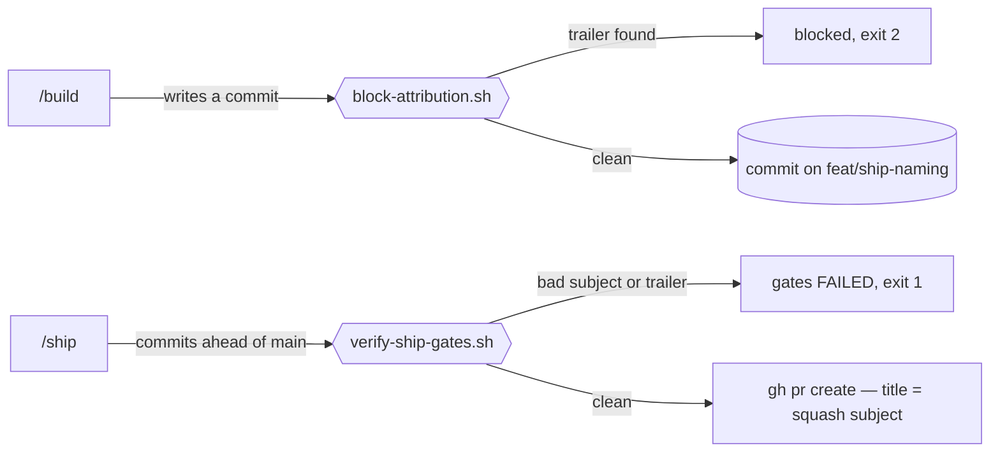
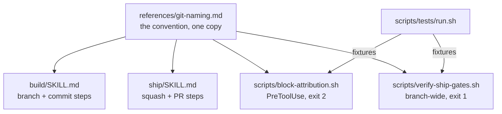
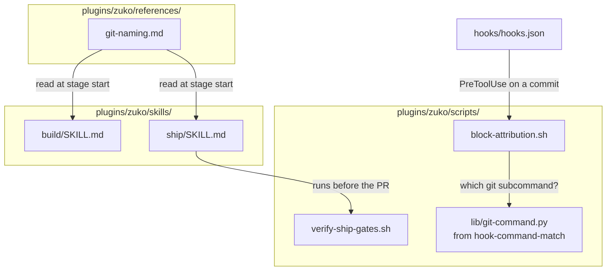
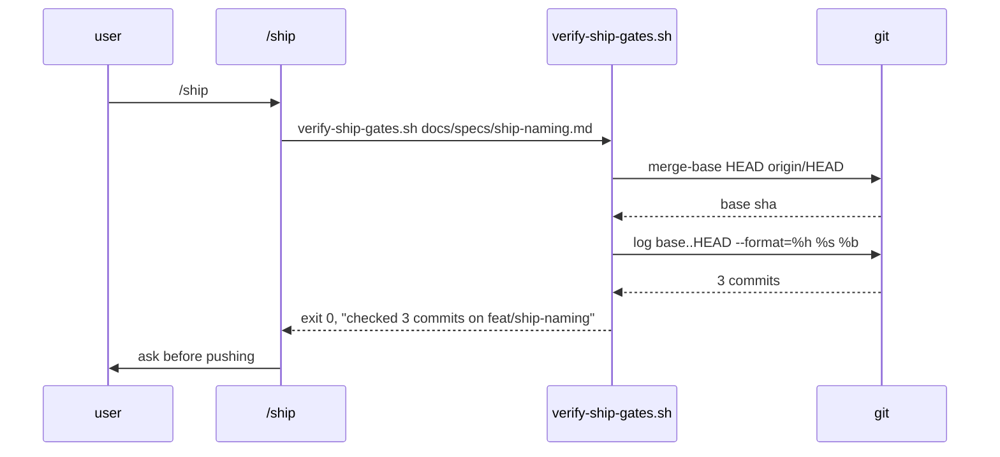

# Ship naming

**Version:** v1 · **Status:** Built · **Type:** Technical · **Project type:** CLI/Library

**Depends on:** `hook-command-match` — the same command matcher, fixed there first
**Page:** _(added at the end of pause 3)_

Everything zuko writes into git — branch name, commit subject, PR title — follows one
stated format, and nothing it writes names a model. Today the format lives in nobody's
head and the last four commits on `main` carry `Co-Authored-By: Claude` trailers the
user does not want.

## Problem

Two separate leaks, same surface.

**Naming drifts.** `build/SKILL.md:50` says branch `feat/{slice}`, and that is the only
naming rule written down anywhere. `ship/SKILL.md:48` says commit messages should carry
"what changed and why, no model identifiers, no emojis" — a description, not a format.
PR titles have no rule at all. The 21 commits in history show the result: one `chore:`
prefix, twenty sentence-case subjects, several starting with a slash command name.

**Claude signs the commits.** Four commits on `main` carry
`Co-Authored-By: Claude Opus 5 <noreply@anthropic.com>`, three carry `Claude-Session:`
URLs. The user's global `CLAUDE.md` says no `Co-Authored-By` trailers in commits or PR
descriptions, and it keeps happening anyway, because the Claude Code harness injects an
attribution instruction into every session that says the opposite. A prompt rule in a
skill file argues with that injection once per session and sometimes loses.

## Slice test

| Check | Result |
| ----- | ------ |
| Cuts every layer it needs | yes — the written convention, the stage that applies it, the hook that blocks a bad write, the gate that catches one before the PR |
| One e2e test walks it | yes — one fixture repo: hook rejects a trailered commit, accepts a clean one, gate passes, gate fails on a reintroduced trailer |
| Worth shipping alone | yes — the next PR out of this repo is named consistently and unsigned |
| Fits (≤5 scenarios, ≤2 areas) | yes — 5 scenarios, two areas (`skills/`, `scripts/` + `hooks.json`) |

**Path:** full — it adds a new script with its own output contract and touches five
files, so neither light-path trigger holds.

## Flow



A commit is checked twice: once as it is written, by a PreToolUse hook, and once for the
whole branch at ship time, by the existing gate script.

## The convention

This is the artefact the slice ships. Every rule below is enforced by scenario 2 or 4.

| Thing | Format | Example |
| ----- | ------ | ------- |
| Branch | `{type}/{slice}` | `feat/ship-naming` |
| Commit subject | `{type}({scope}): {subject}` | `feat(ship): standardise git naming` |
| Commit body | what changed and why, wrapped at 72 | — |
| PR title | the squash commit subject, unchanged | `feat(ship): standardise git naming` |

**Types:** `feat` `fix` `chore` `docs` `refactor` `test`. Nothing else.

**Scope:** the zuko stage or top-level area — `ship`, `build`, `spec`, `hooks`,
`scripts`, `docs`. Optional; `feat: …` is valid.

**Subject:** imperative, no trailing period, whole line ≤72 characters.

**Banned in every commit message and PR body:**

- `Co-Authored-By:` naming Claude or `noreply@anthropic.com`
- `Claude-Session:` and any `https://claude.ai/code/session_…` link
- `Generated with Claude Code`
- emojis, per `references/voice.md`

## Acceptance criteria

```gherkin
Scenario: /build names the branch and the commit
  Given an approved spec at docs/specs/ship-naming.md
  When /build starts work on it
  Then the branch is "feat/ship-naming"
  And the first commit subject matches "{type}({scope}): {subject}"
  And the commit message contains no Co-Authored-By, Claude-Session, or claude.ai link

Scenario: the hook blocks a commit that signs Claude's name
  Given a staged change on branch "feat/ship-naming"
  When a commit is attempted whose message ends with
    "Co-Authored-By: Claude Opus 5 <noreply@anthropic.com>"
  Then block-attribution.sh exits 2
  And stderr names the offending line and says to remove it
  And no commit is created

Scenario: /ship squashes and titles the PR
  Given branch "feat/ship-naming" with 3 commits ahead of main
  When /ship tidies the branch
  Then the squash subject is "feat(ship): standardise git naming"
  And the PR title is that same subject
  And the PR body carries no "Generated with Claude Code" line and no session URL

Scenario: the ship gate rejects a branch that broke the format
  Given branch "feat/ship-naming" whose second commit subject is
    "Standardise git naming" and whose third carries a Claude-Session trailer
  When verify-ship-gates.sh runs
  Then it exits 1
  And it prints both commits by short SHA, each with which rule it broke

Scenario: the ship gate refuses to pass on an empty scope
  Given branch "feat/ship-naming" with 0 commits ahead of its merge-base with main
  When verify-ship-gates.sh runs
  Then it exits 1 saying it found no commits to check
  And it never reports a pass on a scope it did not scan
```

## Scope

**In:**

- The convention table above, written into a reference file both stages read.
- `build/SKILL.md` — branch step and commit step carry the format.
- `ship/SKILL.md` — tidy-branch, PR title, and PR body carry the format and the ban.
- A new `scripts/block-attribution.sh`, wired as a PreToolUse hook on a commit command.
- `scripts/verify-ship-gates.sh` — a branch-wide check of every commit ahead of the
  merge-base, for both subject format and banned trailers.
- A test harness for the scripts, because none exists (see O4).

**Out:**

- `poc/SKILL.md`'s `spike/{question}` branch — spike branches are deleted, never merged,
  so nothing they are named reaches history. Picked up only if spikes ever get pushed.
- Rewriting the four existing `main` commits that carry trailers — history rewrite on a
  pushed branch, and the gate only ever looks at commits ahead of the merge-base.
- Setting `attribution` in `~/.claude/settings.json` — that is the user's own settings
  file, outside this repo. The spec records the setting to use (O1); the user applies it.
- Changelog generation from the conventional types. A later slice if it is ever wanted.

## Interface

Project type is CLI/Library, so the interface is the command surface, the exit
codes, and the exact text each script prints. No design system, no preview.



One reference file is read by two skills and enforced by two scripts, which one
test runner covers.

### `block-attribution.sh`

| | |
| --- | --- |
| **Invoked as** | PreToolUse hook on a commit command. No arguments. |
| **Reads** | The hook JSON payload on stdin. |
| **Checks** | The message text only — `-m`/`--message` values and any `-F` file. No message given means the editor path; it passes. |
| **Never checks** | Subject format. That is the ship gate's job, so this hook stays safe in repos that do not use Conventional Commits (O2). |
| **Exit 0** | Silent. A passing hook prints nothing, matching `block-dangerous.sh`. |
| **Exit 2** | Blocked, reason on stderr. |

On a block:

```
Blocked: the commit message carries Claude attribution.

  Co-Authored-By: Claude Opus 5 <noreply@anthropic.com>
  Claude-Session: https://claude.ai/code/session_01SXGpxYGgMK3E6G6kCNgi83

references/git-naming.md bans model attribution in commit messages. Remove
those lines and commit again.

The harness re-injects the attribution instruction every session, so this will
recur. To stop it at the source, set `attribution` in ~/.claude/settings.json.
```

The last paragraph is the point of the hook: it says why the rule keeps being
broken, so the fix goes to the cause rather than to the symptom each time.

### `verify-ship-gates.sh`

Unchanged command surface — `verify-ship-gates.sh [<spec.md>]`. Two things are
added: a naming section in `problems`, and a scope line printed on **every**
outcome, per the `gate-scanned-nothing-is-not-a-pass` lesson.

Clean branch:

```
Spec: docs/specs/ship-naming.md
Naming: checked 3 commits on feat/ship-naming ahead of main.
Mechanical ship gates passed.
```

Branch that broke the convention:

```
Spec: docs/specs/ship-naming.md
Naming: checked 3 commits on feat/ship-naming ahead of main.
Ship gates FAILED:
- Branch 'ship-naming' is not {type}/{slice}. Types: feat fix chore docs refactor test.
- 2 of 3 commits break the naming convention:
    a1b2c3d  subject is not {type}({scope}): {subject}
             "Standardise git naming"
    d4e5f6a  carries a Claude-Session trailer
```

Nothing to check:

```
Spec: docs/specs/ship-naming.md
Ship gates FAILED:
- No commits on 'feat/ship-naming' ahead of main. A gate that scanned nothing is not a pass.
```

The base is found from `git symbolic-ref refs/remotes/origin/HEAD`, falling back
to `main` then `master`. No base resolvable is the same failure as no commits.

### `scripts/tests/run.sh`

The harness O4 puts in scope. Each test builds a throwaway repo under `mktemp -d`
and runs the real script, not a copy.

| | |
| --- | --- |
| **Invoked as** | `bash plugins/zuko/scripts/tests/run.sh [<name>]` |
| **No argument** | Runs every `tests/test-*.sh`. |
| **With a name** | Runs `tests/test-<name>.sh` only. An unknown name is an error, never an empty pass. |
| **Exit 0** | All passed. |
| **Exit 1** | Any test failed, or zero tests ran. |

```
block-attribution   12 passed
verify-ship-gates    9 passed
                    21 passed, 0 failed
```

```
block-attribution
  FAIL  blocks a lowercase co-authored-by key
        expected exit 2, got 0
                    20 passed, 1 failed
```

### The skills

`build/SKILL.md` and `ship/SKILL.md` each gain one line pointing at
`references/git-naming.md`, next to the existing `voice.md` line. The convention
itself is never restated in a skill — one copy, or it drifts.

## Technical plan

### Approach

One reference file holds the convention. Two skills read it, two scripts enforce
it, one runner tests them. Nothing in the plugin restates the rules — a second
copy is how the rules diverge.

The enforcement is deliberately asymmetric, per O2. The hook bans only the
attribution trailers, because it fires in every repo zuko is enabled in and the
user's global `CLAUDE.md` already forbids those everywhere. The subject-format
check lives only in `verify-ship-gates.sh`, which runs inside a zuko `/ship`
against a zuko spec, so it never imposes Conventional Commits on a repo that has
not opted in.





### Changes

| File | What changes | Why |
| ---- | ------------ | --- |
| `plugins/zuko/references/git-naming.md` | New. The convention table, the type list, the scope list, and the ban list. Nothing else. | The single source both skills read |
| `plugins/zuko/skills/build/SKILL.md:17` | Add `git-naming.md` to the existing "Read …voice.md and …slicing.md" line | Scenario 1 |
| `plugins/zuko/skills/build/SKILL.md:50` | Branch step: `feat/{slice}` becomes `{type}/{slice}` with the type list | Scenario 1 |
| `plugins/zuko/skills/build/SKILL.md:81` | Step 3's list gains a fifth item: commit the scenario, with the subject format. Today `build/SKILL.md` never tells the stage to commit at all — the rule has no existing home to edit. | Scenario 1 |
| `plugins/zuko/skills/ship/SKILL.md:16` | Add `git-naming.md` to the existing `voice.md` read line | Scenarios 3 |
| `plugins/zuko/skills/ship/SKILL.md:48` | "no model identifiers" becomes the format plus the explicit ban list | Scenario 3 |
| `plugins/zuko/skills/ship/SKILL.md:58` | PR body section: title format, and no `Generated with Claude Code` or session URL | Scenario 3 |
| `plugins/zuko/scripts/block-attribution.sh` | New. Extracts the message from `-m`/`--message`/`-F`, matches the three banned trailer forms, exits 2 with the offending lines and the settings fix. | Scenario 2 |
| `plugins/zuko/hooks/hooks.json:11` | Second `if: "Bash(git commit *)"` entry alongside the existing `secret-scan.sh` one | Scenario 2 |
| `plugins/zuko/scripts/verify-ship-gates.sh:51` | Branch-state block extended: branch must match `{type}/{slice}` | Scenario 4 |
| `plugins/zuko/scripts/verify-ship-gates.sh:64` | New naming block inserted before the spike-branch block: resolve the base, list commits ahead, check each subject and trailers, print the scope line on every outcome, fail on an empty range | Scenarios 4, 5 |
| `plugins/zuko/scripts/tests/run.sh` | New. The harness O4 put in scope. | All |
| `plugins/zuko/scripts/tests/test-block-attribution.sh` | New fixtures | Scenario 2 |
| `plugins/zuko/scripts/tests/test-verify-ship-gates.sh` | New fixtures | Scenarios 4, 5 |
| `plugins/zuko/scripts/tests/test-block-dangerous.sh` | New fixtures, back-filling the four scenarios `hook-command-match` could only run by hand | `hook-command-match` O2 |
| `plugins/zuko/.claude-plugin/plugin.json:4` | `2.0.0` → `2.1.0` | New behaviour, not a fix |
| `.claude-plugin/marketplace.json` | Same bump, both places it appears | Must match `plugin.json` |

**Reusing:**

- `lib/git-command.py` from the `hook-command-match` slice, for deciding whether
  the command is actually a commit. Without it this hook inherits the same
  false-positive bug — that is why it is a dependency, not a sibling.
- The `deny()` idiom at `block-dangerous.sh:8` and the `python3 -c 'import
  json,sys; …'` stdin parse at `block-dangerous.sh:5`.
- `verify-ship-gates.sh`'s existing `problems` accumulator and its
  `Ship gates FAILED:` / exit 1 contract. No new output shape.
- `check-design-drift.sh:52-60`'s pattern for reporting scope and failing on an
  empty one.

### Settings — the part zuko cannot do

`attribution` lives in the user's own `~/.claude/settings.json`, outside this
repo, so the slice records it rather than writing it. O1 read this off the
settings schema in build 2.1.269:

```json
{
  "attribution": {
    "commit": "",
    "pr": "",
    "sessionUrl": false
  }
}
```

`commit` and `pr` are strings that *replace* the attribution text — the schema's
own words are "Empty string hides attribution", and for `commit`, "including any
trailers". There is no boolean co-author key; `includeCoAuthoredBy` is the
deprecated predecessor of the whole block.

The hook prints this block in its block message, so the fix is always one
copy-paste away from the failure.

Not traced: how `attribution.commit: ""` and a still-present
`includeCoAuthoredBy: true` resolve against each other. Setting the `attribution`
block and leaving `includeCoAuthoredBy` unset avoids the question.

### Earn-it

| Added | Triggered by |
| ----- | ------------ |
| `references/git-naming.md` as its own file rather than text inside `ship/SKILL.md` | Two skills and two scripts need the same list. The plugin's existing pattern for this is `voice.md`, read by every stage. |
| `scripts/block-attribution.sh` as a new script rather than a branch inside `block-dangerous.sh` | Different verdict on a different input. `block-dangerous.sh` judges the command; this judges the message. Merging them would mean one script with two unrelated reasons to fail. |
| `scripts/tests/` and a runner | O4. Two shell guards with five scenarios between them, in a repo whose own recorded lesson is about a gate that passed on nothing. |

Not added: no config file for the type list (it is six words in a reference
file), no per-repo opt-in mechanism (the asymmetric split in *Approach* removes
the need), no abstraction over the two scripts.

### Non-functionals

| | |
| --- | --- |
| **Load** | The hook runs once per commit command — one `python3` start on a path that already starts one. The gate runs once per `/ship`, over the commits ahead of the merge-base, typically under ten. |
| **Breaks first** | Message extraction, not volume. A commit message passed some way the extractor does not read — an unusual heredoc, `-F -` on stdin — is a miss, not a crash. At 10× commits the gate is still one `git log`. |
| **Security surface** | This is a guard, so the risk is it failing open. It reads only the command string and the message text; no network, no secrets, writes nothing, and it never sees the diff. Anyone who can run a commit can also edit `hooks.json` to remove it — it stops mistakes, not an adversary. |
| **Proof it works** | On the next PR from this repo: `git log origin/main..HEAD --format=%b \| grep -ci 'co-authored-by\|claude-session'` returns `0`, and the PR title matches `^(feat\|fix\|chore\|docs\|refactor\|test)(\(.+\))?: `. |
| **Rollout** | No flag — see O5. A PreToolUse hook is registered in `hooks.json` or it is not, and a guard defaulting to off guards nothing. Rollback is `git revert` of the merge commit, which removes the `hooks.json` entry and both scripts together. Version bumps to 2.1.0 so an installed copy can be pinned back to 2.0.0. |

### Test plan

| Scenario | Test | Command |
| -------- | ---- | ------- |
| 1 build names branch and commit | none — skill text, proven by scenario 4 catching a breach | — |
| 2 hook blocks a trailered message | `tests/test-block-attribution.sh` | `bash plugins/zuko/scripts/tests/run.sh block-attribution` |
| 3 ship titles the PR | none — skill text, proven by the Proof-it-works check on the real PR | — |
| 4 gate rejects a bad branch | `tests/test-verify-ship-gates.sh` | `bash plugins/zuko/scripts/tests/run.sh verify-ship-gates` |
| 5 gate fails on an empty range | `tests/test-verify-ship-gates.sh` | same |

Scenarios 1 and 3 are instructions to a model, not code, so no unit test can
prove them. They are proven the only way skill text can be: the gate in scenario
4 fails the branch if the model ignored them.

**E2E:** `tests/test-e2e-naming.sh`. One throwaway repo under `mktemp -d`: init,
commit a clean conventional commit through the hook (expect 0), attempt one
carrying `Co-Authored-By: Claude` (expect 2), run the gate on the branch (expect
0 with a scope line), append a commit with a bad subject, re-run the gate (expect
1 naming that commit's short SHA). One script, one walk, all five scenarios.

The harness is new, so it gets the treatment the `gate-scanned-nothing-is-not-a-pass`
lesson demands: `run.sh` exits 1 when zero tests ran, and the first fixture in
`test-block-attribution.sh` asserts exactly that by asking the runner for a name
that does not exist.

### Chunks

Files are disjoint. A, B and C run in parallel; D is serial because it tests what
B and C build.

| Chunk | Scenarios | Files owned |
| ----- | --------- | ----------- |
| A | 1, 3 | `references/git-naming.md`, `skills/build/SKILL.md`, `skills/ship/SKILL.md`, `plugins/zuko/.claude-plugin/plugin.json`, `.claude-plugin/marketplace.json` |
| B | 2 | `scripts/block-attribution.sh`, `hooks/hooks.json` |
| C | 4, 5 | `scripts/verify-ship-gates.sh` |
| D (serial, after B and C) | all | `scripts/tests/run.sh`, `scripts/tests/test-*.sh` |

Both version files are owned by chunk A only — they are the shared files that
would otherwise collide.

### Risks

| Risk | Mitigation |
| ---- | ---------- |
| The hook cannot reliably pull the message out of an arbitrary commit command, so a trailered commit slips through | It is the second line of defence, not the first. `verify-ship-gates.sh` reads the real commit objects with `git log`, where there is no parsing to get wrong, and nothing reaches a PR without passing it. |
| A new harness that itself reports a false pass — the exact failure in `docs/learnings/gate-scanned-nothing-is-not-a-pass.md` | `run.sh` exits 1 on zero tests ran, and a fixture asserts that behaviour rather than trusting it. |
| Conventional Commits turns out to be the wrong call after fifty commits | The type list is six words in one reference file and one regex in one script. Changing it is a two-line diff, not a migration. |
| The hook annoys the user in unrelated repos | It only ever blocks the three attribution forms, which the user's global `CLAUDE.md` already forbids everywhere. Subject format is never enforced outside a zuko `/ship`. |

## Open items

| ID | What | Type | Raised at | Owner | Status | Answer |
| -- | ---- | ---- | --------- | ----- | ------ | ------ |
| O1 | The exact `attribution` settings key that removes the co-author line. | unproven | spec p1 | poc | Resolved | There is no boolean key. `attribution.commit` and `attribution.pr` are **strings** that replace the attribution text, and an empty string hides it; `attribution.sessionUrl` is a boolean. Read from the settings schema in build 2.1.269, 2026-09-12. See the Settings block in the technical plan. |
| O5 | The slice ships with no feature flag. | flag | spec p3 | user | Accepted risk | A PreToolUse hook is registered in `hooks.json` or it is not; a guard defaulting to off guards nothing. Rollback is `git revert` of the merge commit, which removes the entry and both scripts together, and 2.1.0 can be pinned back to 2.0.0. Accepted on the model's recommendation, 2026-09-12. |
| O2 | `block-attribution.sh` is a plugin hook, so it fires on every commit in **every** repo where zuko is enabled, not only zuko-workflow repos. | flag | spec p1 | user | Resolved | Split it: the hook bans the attribution trailers everywhere, the conventional-subject check lives only in `verify-ship-gates.sh`. Approved at pause 1, 2026-09-12 |
| O3 | Do the 21 non-conforming commits already on `main` have to be fixed? | question | spec p1 | user | Resolved | No. The gate reads only commits ahead of the merge-base, so history is never touched. Approved at pause 1, 2026-09-12 |
| O4 | This repo has never had a test harness — no `tests/`, no runner, no fixtures, in any commit. | flag | spec p1 | user | Resolved | Building one is in scope for this slice, not a later one. Approved at pause 1, 2026-09-12 |
| O6 | The plan runs chunks A, B and C in parallel and the test harness (D) last, which makes test-first impossible — B and C would be written before anything could run them. | flag | build | model | Resolved | Built serially instead: `tests/run.sh` first, then test-then-code per scenario, then chunk A's text, then the e2e. Same files, same owners, no scope change. Parallel worktree agents were also dropped — six small files, and `docs/learnings/worktree-agents-cannot-commit.md` says they often lose the chunk. 2026-09-12 |
| O7 | The convention bans emojis, and the spec claims every rule in it is enforced by scenario 2 or 4. Neither script checks for one. | flag | build | user | Accepted risk | The Changes table asks the gate for subject format and trailers only, so an emoji check would be unplanned behaviour. The ban still holds through `voice.md` and both skills reading `git-naming.md`; it is enforced by the model and by review, not mechanically. Picked up as its own change if an emoji ever reaches a commit. 2026-09-12 |
| O8 | `verify-ship-gates.sh`'s placeholder check fails this very spec — `{type}`, `{scope}`, `{subject}` and `{slice}` are the convention, not unfilled blanks. The plan did not anticipate it. | flag | build | model | Resolved | Added the four to the existing exclusion list at `verify-ship-gates.sh:46`, the same idiom already used for `{token}` and `{N}`. Same file chunk C owns, no new file. 2026-09-12 |

_Never delete this section or its rows. See references/ledger.md._
