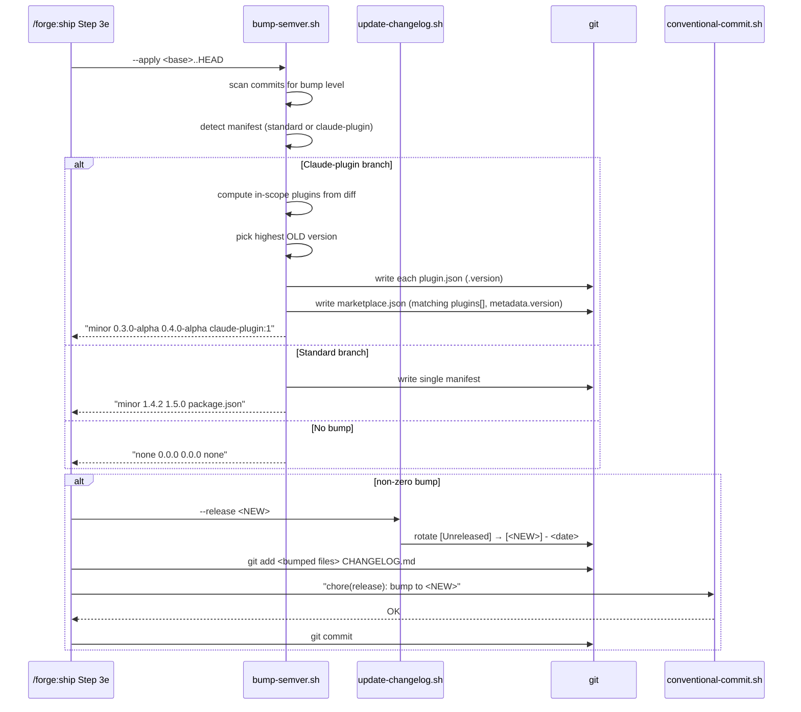

# Ship release automation

**Ticket:** TBD
**Type:** Technical — Tech Debt

Close two release-plumbing gaps in `/forge:ship` so that any ship producing a non-zero semver bump automatically updates plugin manifests, rotates `CHANGELOG.md`, and commits both changes atomically as a single `chore(release): bump to <new>` commit. Removes the need for a manual release follow-up PR.

## Motivation

`/forge:ship` promises "atomic-commit, semver-aware" shipping. In this repo that promise is undelivered because two Step 3e assumptions do not match reality:

1. The `bump-semver.sh` helper only recognizes mainstream manifest shapes (`package.json`, `pyproject.toml`, `Cargo.toml`, etc). Claude-plugin manifests (`plugins/*/.claude-plugin/plugin.json` and the marketplace-level `.claude-plugin/marketplace.json`) are invisible to it, so Step 3e silently skips with `manifest: none` every time.
2. The `/forge:ship` flow has no step that rotates `[Unreleased]` in `CHANGELOG.md` into a dated version heading, even though `update-changelog.sh --release` supports exactly that rotation. The changelog accumulates under `[Unreleased]` forever until a human notices.

**Current state:**

- Feature ships merge to `main` with stale versions in `plugins/forge/.claude-plugin/plugin.json` and `.claude-plugin/marketplace.json`.
- Every release requires a manual follow-up PR editing version fields, invoking `update-changelog.sh --release` by hand, and refreshing the README.
- The most recent release (v0.3.0-alpha, PR #4) was cut manually this way — the feature PR (#3) landed with the versions still at `0.2.0-alpha`.

**Desired state:**

- When `/forge:ship` runs Step 3e and the computed bump is non-zero, the script bumps every Claude-plugin manifest in the repo touched by the current diff, rotates `[Unreleased]` in `CHANGELOG.md` into `[<new-version>] - <date>`, and folds all of these changes into a single `chore(release): bump to <new>` commit.
- Feature ships land on `main` with a correct, tagged-ready release commit at the tip. No separate release PR required.
- The unchanged detection logic for standard manifests (`package.json` etc.) continues to work for other repos that install the plugin.

**Trigger:** Cutting the v0.3.0-alpha release manually after PR #3 revealed both gaps. Each captured as a skill-quality learning during that release cycle.

**Discovery briefs / learnings:**

- `docs/learnings/skill-ship-bump-semver-misses-plugin-manifests.md`
- `docs/learnings/skill-ship-no-changelog-release-rotation.md`

## Scope

**In scope:**

- Extend `plugins/forge/skills/ship/scripts/bump-semver.sh` to detect and bump:
  - `plugins/*/.claude-plugin/plugin.json` — single `version` field (per plugin)
  - `.claude-plugin/marketplace.json` — both `metadata.version` and `plugins[].version` entries
- Only bump the plugin manifest(s) whose files changed in the ship's diff. If `plugins/forge/` was untouched, do not bump `plugins/forge/.claude-plugin/plugin.json`.
- Update `bump-semver.sh` output format to describe multi-file bumps honestly (e.g. a compact token that signals more than one file was written).
- Wire `update-changelog.sh --release <new>` into `/forge:ship` Step 3e so that a non-zero bump rotates `[Unreleased]` in the same run.
- Stage the bumped manifests **and** the rotated `CHANGELOG.md` together. Produce exactly one `chore(release): bump to <new>` commit.
- Preserve the existing behavior for repos with standard manifests (`package.json` etc.) — those paths are not touched.
- Update `/forge:ship` Step 3e prose in `SKILL.md` to describe the new behavior.

**Out of scope:**

- Automatic git tag creation on release commits — tracked separately as a possible later addition.
- README version-line refresh on release commits — the README does not carry a machine-readable version line today; leave README freshness as a manual cadence decision.
- Extending detection to non-Claude-plugin JSON shapes (e.g. generic "find `version` anywhere"). Stay conservative to the two known Claude-plugin shapes plus the existing mainstream list.
- Pre-release version semantics (e.g. `0.3.0-alpha` → `0.3.0-beta` → `0.3.0`). The current numeric bump logic is preserved; if a manifest is at `0.3.0-alpha`, a `feat` commit bumps it to `0.4.0-alpha` via the existing patch-stripping rule. No new pre-release orchestration.
- Multi-package monorepos outside the Claude-plugin shape.

## Goals

- Eliminate the manual release follow-up PR: a single `/forge:ship` run that includes a `feat` commit produces a correctly-versioned, changelog-rotated release commit.
- Keep `bump-semver.sh`'s single-shot, side-effect-honest contract: the script prints `<level> <old> <new> <manifest-summary>` and exits; the caller decides what to do.
- Stay backwards-compatible — installing the plugin in a Node/Python/Rust/etc. repo should continue to work exactly as before.

## Non-Goals

- No change to the bump-level derivation logic (commit-message scanning for `BREAKING CHANGE` / `feat` / `fix` / etc.). Those rules stay identical.
- No change to `update-changelog.sh`'s append-to-Unreleased mode — only the release-mode wiring into `/forge:ship` is new.
- No rollback / undo orchestration beyond what Git already provides.
- No support for a "dry run" flag beyond the existing "omit `--apply`" behavior.

## Success Criteria

- A feature ship in this repo that includes at least one `feat` commit produces a final `chore(release): bump to <new>` commit on the feature branch that contains three kinds of changes in one commit: `plugins/forge/.claude-plugin/plugin.json`, `.claude-plugin/marketplace.json`, and `CHANGELOG.md` (with `[Unreleased]` rotated).
- After the feature branch merges to `main`, no further release PR is needed: the manifests and CHANGELOG are already correct.
- A ship that produces no `feat` / `fix` / `refactor` / `perf` commits (e.g. docs-only or test-only) produces no release commit — Step 3e still no-ops.
- `bash bump-semver.sh <range>` (without `--apply`) in this repo reports a non-`none` manifest summary and the new version, without modifying any file.
- Installing the plugin in a separate repo with a `package.json` continues to bump `package.json` as before, and does not look for Claude-plugin manifests (they won't exist).

## Acceptance Criteria

### Scenario: Feature ship bumps Claude-plugin manifests and rotates CHANGELOG

```gherkin
Given the working tree contains uncommitted changes under plugins/forge/
  And CHANGELOG.md has an [Unreleased] section with at least one entry
  And plugins/forge/.claude-plugin/plugin.json has version "0.3.0-alpha"
  And .claude-plugin/marketplace.json has metadata.version "0.3.0-alpha" and plugins[0].version "0.3.0-alpha"
When /forge:ship runs to completion with at least one feat commit in the range
Then the feature branch ends with a chore(release) commit
  And plugins/forge/.claude-plugin/plugin.json has version "0.4.0-alpha" in that commit
  And .claude-plugin/marketplace.json has metadata.version "0.4.0-alpha" and plugins[0].version "0.4.0-alpha"
  And CHANGELOG.md's [Unreleased] heading has been renamed to [0.4.0-alpha] - <today>
  And a fresh empty [Unreleased] heading sits above [0.4.0-alpha]
  And all three file changes are in the same commit
```

### Scenario: Docs-only ship does not produce a release commit

```gherkin
Given the working tree contains only documentation changes
  And no commit in the ship range uses the conventional types feat, fix, refactor, or perf
When /forge:ship runs to completion
Then no chore(release) commit is produced
  And plugin.json, marketplace.json, and CHANGELOG.md remain unchanged by Step 3e
  And [Unreleased] is not rotated
```

### Scenario: Only one plugin changed in a multi-plugin repo

```gherkin
Given a repo has two plugins: plugins/forge/ and plugins/alpha/
  And the ship diff only touches files under plugins/forge/
  And plugins/forge/.claude-plugin/plugin.json is at "1.0.0"
  And plugins/alpha/.claude-plugin/plugin.json is at "2.5.0"
When /forge:ship runs to completion with at least one feat commit
Then plugins/forge/.claude-plugin/plugin.json is bumped to "1.1.0"
  And plugins/alpha/.claude-plugin/plugin.json remains at "2.5.0"
  And .claude-plugin/marketplace.json updates only the forge plugin's entry
  And .claude-plugin/marketplace.json's metadata.version is bumped to "1.1.0" to reflect the released plugin
  And the release commit contains only the changed files
```

> Note on `metadata.version`: when a single plugin's bump also bumps `metadata.version`, the latter tracks the highest-numbered plugin released in that commit. This keeps marketplace-level consumers on a single moving version while not overstating work on untouched plugins.

### Scenario: Repo with a package.json continues to work as before

```gherkin
Given the repo at cwd has a package.json with version "1.4.2"
  And no Claude-plugin manifests are present
When bump-semver.sh <range> --apply runs on a range containing a feat commit
Then package.json's version is updated to "1.5.0"
  And no Claude-plugin manifest code paths are exercised
  And the script prints "minor 1.4.2 1.5.0 package.json"
```

### Scenario: CHANGELOG.md missing during release rotation

```gherkin
Given the repo has Claude-plugin manifests but no CHANGELOG.md
When /forge:ship runs Step 3e with a non-zero bump
Then manifest bumps are applied
  And update-changelog.sh --release logs a one-line "no CHANGELOG.md in cwd; skipping" notice and exits 0
  And the chore(release) commit still lands with the bumped manifests
  And the overall ship does not fail
```

### Scenario: CHANGELOG.md has no [Unreleased] section

```gherkin
Given CHANGELOG.md exists but has no ## [Unreleased] heading
When /forge:ship runs Step 3e with a non-zero bump
Then manifest bumps are applied
  And update-changelog.sh --release logs "no [Unreleased] section found; nothing to release" to stderr and exits 0
  And the chore(release) commit lands with only the bumped manifests
  And the overall ship does not fail
```

### Scenario: Release commit message matches conventional-commit rules

```gherkin
Given a non-zero bump is applied, raising version from "0.3.0-alpha" to "0.4.0-alpha"
When /forge:ship creates the release commit
Then the commit subject is exactly "chore(release): bump to 0.4.0-alpha"
  And the subject passes conventional-commit.sh validation
  And no Co-Authored-By trailer is present
```

## Constraints

- **Backwards compatibility:** Must maintain. Existing consumers relying on `bump-semver.sh` returning a single manifest path (e.g. `package.json`, `Cargo.toml`) must continue to work. The new multi-file output token is only emitted when the Claude-plugin detection branch runs.
- **Downtime:** N/A (developer-tooling change).
- **Compliance:** N/A.
- **Rollback:** Reverting the `chore(release)` commit must return manifests and CHANGELOG to their prior state. No irreversible operations.

## Dependencies

- **None.** This change is self-contained within `/forge:ship` and its helper scripts. No external services, no other teams, no concurrent refactors.

## Open Questions

- [x] ~~Should the release commit include both manifest bumps and CHANGELOG rotation?~~ — **Resolved:** Yes, one atomic `chore(release)` commit. Confirmed with user before PRD.
- [x] ~~In a multi-plugin repo, should all plugins bump together or only the changed plugin?~~ — **Resolved:** Only the plugin(s) whose files are in the diff. Marketplace `metadata.version` tracks the highest-numbered plugin released in that commit.
- [x] ~~Should this change add automatic git tags?~~ — **Resolved:** Out of scope — tracked separately.
- [ ] Should the `--apply` flag continue to be required for side effects, or should release mode always apply? — **Deferred (non-blocking):** Default `--apply` semantics stay unchanged. Step 3e already passes `--apply` today. No user-visible behavior change either way.

---

## Functional Requirements

- **Manifest detection priority** — standard manifests (`package.json`, `pyproject.toml`, `Cargo.toml`, `*.csproj`, `*.gemspec`) continue to take precedence when present. Claude-plugin manifest detection is an **additive branch** that runs only when no standard manifest is found AND at least one Claude-plugin manifest exists. This preserves backwards compatibility (Success Criterion 5).
- **Plugin scoping via diff** — when the Claude-plugin branch runs, the set of plugins to bump is computed from the ship's commit range (not the working tree). Source: `git diff --name-only <base>..HEAD`. A plugin is "in scope" if ≥1 changed file path starts with `plugins/<plugin-name>/`. The marketplace file itself changing does NOT pull a plugin into scope — only source-file changes do.
- **Atomicity** — the release commit is produced by Step 3e as a single `git commit`. The script must either bump all detected files or none (no partial success). On failure mid-write (e.g. malformed marketplace.json), the script prints an error on stderr, exits non-zero, and writes nothing to disk. Step 3e treats non-zero exit as fatal for that run.
- **Idempotency** — running `bump-semver.sh <range> --apply` a second time on the same committed range is a no-op: the commit range now includes the `chore(release)` commit which doesn't match any bump rule, so the computed level becomes `none`. Confirmed by the existing scanner behavior.
- **Concurrency** — `/forge:ship` is a developer-local tool; no concurrent invocations are assumed. No file locking added.

## Permissions & Security

- **Scope** — all changes are local filesystem operations inside the user's repo. No network calls, no credentials, no external state.
- **Input source** — `bump-semver.sh` reads git commit messages (already trusted input for the wider skill), JSON manifest contents (parsed via `jq`), and file paths derived from `git diff --name-only`.
- **Injection risk** — shell arguments (new version, plugin slug) flow into `jq --arg` (safe; `jq` treats values as data) and into the `chore(release)` commit subject (validated by `conventional-commit.sh` before commit — Acceptance Criteria scenario 6).
- **Secrets** — N/A. No secret material touched.
- **Threat model checklist** — see dedicated section below.

---

## System Design

Three components share the work; one existing component (`conventional-commit.sh`) validates the final output.

### Components

**`bump-semver.sh` — extended (existing file, modified)**

Today: detects one manifest, computes bump, optionally writes it.

After: adds a Claude-plugin detection branch that runs last (after standard manifests are checked and not found). When triggered:

1. Compute the set of plugin slugs in scope from the commit range.
2. For each in-scope plugin, read version from `plugins/<slug>/.claude-plugin/plugin.json` via `jq`.
3. Pick the **highest current version** among them as the `OLD` for bump arithmetic. This handles the rare case where in-scope plugins are at different versions; the new marketplace `metadata.version` needs a single number.
4. Compute `NEW` with the existing `compute_new()` helper.
5. If `--apply`, write `NEW` into:
   - Each in-scope plugin's `plugin.json` — `.version` field.
   - The marketplace file's matching `plugins[].version` entries for in-scope plugins only.
   - The marketplace file's top-level `metadata.version` field (single update).
6. Emit the stdout contract (see Interface below).

**`update-changelog.sh` — unchanged**

The release-mode code already does exactly what we need. The only change is _who_ invokes it: Step 3e starts calling it on non-zero bump. No code changes to this script.

**`/forge:ship` Step 3e prose — modified (SKILL.md)**

Current prose describes a single manifest file flow. New prose:

1. Invoke `bump-semver.sh --apply` (unchanged).
2. If `<level>` is `none` or `<manifest>` is `none`, skip (unchanged — covers docs-only ships, per Acceptance Criteria scenario 2).
3. Parse the manifest summary token. If it's the Claude-plugin multi-file token (`claude-plugin:N`), the script has already written every plugin manifest plus the marketplace file. Move on. Otherwise it's a single file (`package.json`, `Cargo.toml`, etc.) — same as today.
4. Invoke `update-changelog.sh --release <NEW>`. Tolerate non-fatal notices on stderr (missing CHANGELOG, missing `[Unreleased]`) — per Acceptance Criteria scenarios 4 and 5, these do not fail the ship.
5. `git add` the specific files the script(s) wrote. Do NOT `git add -A`.
6. `git commit -m "chore(release): bump to <NEW>"`, validated through `conventional-commit.sh`.

### Interfaces

**`bump-semver.sh` stdout contract (extended)**

Today:

```
<level> <old-version> <new-version> <manifest-path|none>
# e.g. "minor 1.4.2 1.5.0 package.json"
# or   "none 0.0.0 0.0.0 none"
```

After (new fourth-field token for Claude-plugin branch):

```
# Standard manifest — unchanged
minor 1.4.2 1.5.0 package.json

# Claude-plugin branch, single plugin in scope
minor 0.3.0-alpha 0.4.0-alpha claude-plugin:1

# Claude-plugin branch, two plugins in scope (hypothetical)
minor 2.5.0 2.6.0 claude-plugin:2

# No bump / no manifest
none 0.0.0 0.0.0 none
```

Callers that parse the current field (like Step 3e today) need a small update: recognize the `claude-plugin:` prefix and treat it as "already written, proceed" rather than `git add <path>` on a single file. The prefix convention keeps the old single-file case untouched.

**`update-changelog.sh --release` contract — unchanged**

```
update-changelog.sh --release <version> [--date YYYY-MM-DD]
# exits 0, writes CHANGELOG.md
# non-fatal notices on stderr for missing file or missing [Unreleased]
```

### Data flow



### Tradeoffs considered

**Decision: one atomic release commit vs. two commits (bump first, then rotate changelog).**

- **One commit** (chosen): cleanest history, revertable as a single unit, matches user intent confirmed before PRD ("Yes, one commit").
- **Two commits** (rejected): "each independently revertable" is marginal value since releases are cheap to re-cut. Two commits adds a second `chore` that muddies `git log` for solo-maintained projects.

Not ADR-worthy — this is a workflow preference with no architectural impact.

**Decision: `bump-semver.sh` handles changelog rotation directly, vs. Step 3e orchestrates the two scripts.**

- **Step 3e orchestrates** (chosen): keeps each script single-purpose. `bump-semver.sh` stays about version arithmetic; `update-changelog.sh` stays about CHANGELOG mutation. Composition lives in the skill prose where it's most visible.
- **bump-semver.sh does both** (rejected): couples two unrelated concerns. If someone later uses `bump-semver.sh` outside `/forge:ship`, they don't get surprise CHANGELOG edits.

Not ADR-worthy — a standard single-responsibility judgment.

**Decision: manifest summary uses a `claude-plugin:N` token vs. listing every file path.**

- **Token** (chosen): keeps the output contract compact (single space-separated field), preserves the "one field describes the manifest" shape for readers. `N` gives enough information to distinguish single vs. multi-file for callers that care.
- **Colon-separated file list** (rejected): breaks the "one token per field" shape of the existing output, makes parsing harder for the skill prose.

Not ADR-worthy.

## Threat Model Checklist

- **Data classification** — N/A. No PII, no secrets, no public data. Only version strings, manifest JSON, and local file paths.
- **Attack surface** — no new endpoints, deserializers, or network I/O. All operations are local file reads/writes and git invocations. The one potential concern: JSON parse via `jq` on `plugin.json` / `marketplace.json`. These are trusted repo files (written by the maintainer, not external input). No mitigation needed beyond `jq`'s normal parse safety.
- **Authn / authz changes** — N/A. Developer-local tooling.
- **Dependency additions** — none. `jq` is already a required dependency for the existing `package.json` branch of the same script.

## API Design

Not applicable — no HTTP API. Script interfaces documented under System Design → Interfaces above.

## Data Model & Migrations

Not applicable — no database.

## Architecture Notes

- **No new dependencies.** `jq` is already used; `python3` is already used by `update-changelog.sh`.
- **No new integration points.** All changes live inside `plugins/forge/skills/ship/`.
- **Exemplar files to match:**
  - `plugins/forge/skills/ship/scripts/update-changelog.sh` — for shell style (`set -eu`), Python heredoc use, stderr conventions, exit code discipline.
  - `plugins/forge/skills/ship/scripts/bump-semver.sh` — the file being modified; keep its existing style (`case` statements for dispatch, inline detection branches guarded by `if [ "$MANIFEST" = "none" ]`).

## Implementation Plan

Four sub-tasks. Order matters for most of them; only sub-task 4 (skill prose) is independent of the others. Total estimated effort: ~4–6 hours.

| #   | Sub-task                                                                                                             | Label                     | Size | Files                                                                                                                     |
| --- | -------------------------------------------------------------------------------------------------------------------- | ------------------------- | ---- | ------------------------------------------------------------------------------------------------------------------------- |
| 1   | Extend `bump-semver.sh` detection branch for Claude-plugin manifests                                                 | **SEQUENTIAL**            | M    | `plugins/forge/skills/ship/scripts/bump-semver.sh`                                                                        |
| 2   | Extend `bump-semver.sh` `--apply` to write plugin.json + marketplace.json                                            | **SEQUENTIAL** (after #1) | M    | `plugins/forge/skills/ship/scripts/bump-semver.sh`                                                                        |
| 3   | Add hand-rolled scenario scripts that verify all 6 Acceptance Criteria against a scratch repo                        | **SEQUENTIAL** (after #2) | M    | `plugins/forge/skills/ship/scripts/bump-semver.sh` (unchanged), `plugins/forge/skills/ship/scripts/__verify__/` (new dir) |
| 4   | Update `/forge:ship` Step 3e prose in `SKILL.md` to consume the new token and invoke `update-changelog.sh --release` | **INDEPENDENT**           | S    | `plugins/forge/skills/ship/SKILL.md`                                                                                      |

### Sub-task 1 — Claude-plugin detection branch (SEQUENTIAL, M)

**File:** `plugins/forge/skills/ship/scripts/bump-semver.sh`

**What:** Append a new detection branch after the existing `*.gemspec` block (lines 115–124). Branch runs only if `MANIFEST=none` so far AND `.claude-plugin/marketplace.json` exists at cwd.

**Implementation sketch:**

1. Build `CHANGED_FILES` via `git diff --name-only <range> 2>/dev/null` (the `<range>` is already in `$RANGE` — earlier in the script).
2. Extract plugin slugs from paths matching `^plugins/([^/]+)/`. Unique-ify.
3. For each slug, verify `plugins/<slug>/.claude-plugin/plugin.json` exists and is readable. Skip slugs without a manifest (edge case: a plugin with source but no manifest).
4. If ≥1 valid slug:
   - Read `.version` from each plugin.json via `jq -r '.version // empty'`.
   - Pick `MAX_OLD` = the highest of those versions via `sort -V | tail -n1` (shell-portable version sort).
   - Set `OLD="$MAX_OLD"`, `MANIFEST="claude-plugin:<N>"` (where `N` is the count of in-scope slugs).
   - Stash the slug list in a shell array `IN_SCOPE_PLUGINS` for sub-task 2 to consume in the same script run.
5. If 0 valid slugs, leave `MANIFEST=none` and exit normally (no bump).

**Do NOT:** change any of the existing manifest detection blocks above. They keep running first and win if they find a match.

**Acceptance:** scenarios 3 and 4 (`bump-semver.sh` invocation, standard-repo behavior unchanged).

### Sub-task 2 — `--apply` for plugin.json + marketplace.json (SEQUENTIAL after #1, M)

**File:** `plugins/forge/skills/ship/scripts/bump-semver.sh`

**What:** Extend the `if [ "$APPLY" -eq 1 ] ...` block (lines 150–174) with a new case arm matching `claude-plugin:*`.

**Implementation sketch:**

```bash
case "$MANIFEST" in
  # ... existing cases ...
  claude-plugin:*)
    # Write each in-scope plugin.json
    for slug in "${IN_SCOPE_PLUGINS[@]}"; do
      tmp=$(mktemp)
      jq --arg v "$NEW" '.version = $v' \
        "plugins/$slug/.claude-plugin/plugin.json" > "$tmp" \
        && mv "$tmp" "plugins/$slug/.claude-plugin/plugin.json"
    done
    # Write marketplace.json: metadata.version + each in-scope plugins[].version
    tmp=$(mktemp)
    jq --arg v "$NEW" --argjson slugs "$(printf '%s\n' "${IN_SCOPE_PLUGINS[@]}" | jq -R . | jq -s .)" '
      .metadata.version = $v
      | .plugins |= map(if .name as $n | $slugs | index($n) then .version = $v else . end)
    ' .claude-plugin/marketplace.json > "$tmp" \
      && mv "$tmp" .claude-plugin/marketplace.json
    ;;
esac
```

**Edge cases to handle explicitly:**

- If `.claude-plugin/marketplace.json` is missing at apply time (it existed at detect time but got deleted mid-run — practically impossible), error on stderr and exit non-zero.
- If the `.plugins` array in marketplace.json is missing or malformed, error on stderr and exit non-zero. Do NOT silently repair.
- `mktemp` + `mv` is the atomic write pattern — matches `package.json` branch.

**Acceptance:** scenarios 1 and 3 (end-to-end bump behavior including multi-plugin case).

### Sub-task 3 — Scenario verification scripts (SEQUENTIAL after #2, M)

**Files:**

- `plugins/forge/skills/ship/scripts/__verify__/bump-semver-scenarios.sh` (new)
- `plugins/forge/skills/ship/scripts/__verify__/README.md` (new — how to run)

**What:** A single shell script that sets up 5 scratch scenarios (one per Acceptance Criteria other than scenario 6, which is covered by conventional-commit.sh validation at commit time) in `/tmp/forge-bump-test-<pid>/`, runs `bump-semver.sh` against each, and asserts the output.

**Scenarios to encode:**

1. Single plugin + marketplace at `0.3.0-alpha` + feat commit → outputs `minor 0.3.0-alpha 0.4.0-alpha claude-plugin:1`, and after `--apply` all three JSON files contain `0.4.0-alpha` (plugin.json .version, marketplace metadata.version, marketplace plugins[0].version).
2. Docs-only range → outputs `none 0.0.0 0.0.0 none`.
3. Multi-plugin repo, only one plugin changed → the unchanged plugin.json is byte-identical before and after.
4. Repo with `package.json` at cwd (no Claude-plugin manifests) → output `minor 1.4.2 1.5.0 package.json`. Claude-plugin branch never fires.
5. Claude-plugin repo but no `CHANGELOG.md` → `bump-semver.sh` still succeeds; `update-changelog.sh --release` prints the "no CHANGELOG.md" notice and exits 0. (This one verifies the chain together.)

**Execution:** runs under `bash set -eu`. Every scenario writes its input, invokes the script, runs assertions via `diff` or `jq -e`, and prints `PASS: <scenario>` or `FAIL: <scenario>: <reason>`. Exit code is 0 iff all pass.

**Why not bats/shunit2:** no existing test harness in this repo; adding one for 5 scenarios is overhead. Hand-rolled keeps dependencies flat and lets the script serve as both test and executable documentation.

**Acceptance:** all 6 Acceptance Criteria scenarios exercised end-to-end (scenario 6 is a commit-time concern, not a bump-script concern, so it's verified via `conventional-commit.sh` inside Step 3e at real ship time).

### Sub-task 4 — Update Step 3e prose in SKILL.md (INDEPENDENT, S)

**File:** `plugins/forge/skills/ship/SKILL.md`

**What:** Replace the existing Step 3e block (lines 197–218) with the expanded flow described in System Design → Components.

**Key changes to the prose:**

- Explain the three possible manifest-summary shapes and how to interpret each.
- On `claude-plugin:N`, state "the script has already written every plugin manifest plus the marketplace file; do not `git add <manifest>` on a single file — `git add` every path the script wrote."
- Add the `update-changelog.sh --release <NEW>` invocation between the bump and the commit.
- Add the staging/commit language for the combined file set.
- Call out the two non-fatal stderr notices from `update-changelog.sh --release` (missing CHANGELOG, missing `[Unreleased]`) and instruct Claude to continue through them, matching Acceptance Criteria scenarios 4 and 5.

**Why INDEPENDENT:** the prose change stands alone. Even if sub-tasks 1–3 weren't merged, the prose update would just narrate behavior that hasn't shipped yet — harmless, and safe to review in parallel.

## Negative Constraints

- Do NOT modify `update-changelog.sh` — its contract is already correct.
- Do NOT modify any existing case arm in `bump-semver.sh`'s detection block (the `package.json`, `pyproject.toml`, `Cargo.toml`, `*.csproj`, `*.gemspec` blocks). Add a new arm only.
- Do NOT modify the `compute_new()` function — version arithmetic stays identical.
- Do NOT add a `--dry-run` flag, a `--no-changelog` flag, or any other new CLI surface area. Omitting `--apply` remains the sole dry-run mechanism.
- Do NOT write a git tag in this scope — tracked separately.
- Do NOT touch `plugins/forge/.claude-plugin/plugin.json` or `.claude-plugin/marketplace.json` as part of implementing this feature (except when the release-cut mechanism actually runs during the feature's own ship).

## Test Scenarios

Implementation-level test expectations. These complement the Acceptance Criteria (behavior-level Gherkin) above.

### Sub-task 1 — detection branch

- **T1.1** — Fresh repo with only `plugins/forge/.claude-plugin/plugin.json` (no standard manifests): `bump-semver.sh HEAD~1..HEAD` (where HEAD~1 is a `feat` commit) prints `minor <old> <new> claude-plugin:1`.
- **T1.2** — Repo with both `package.json` and `plugins/forge/.claude-plugin/plugin.json`: standard-manifest branch wins; output is `minor <old> <new> package.json`. Claude-plugin branch does not run.
- **T1.3** — Repo with Claude-plugin manifests but commit range is docs-only: output is `none 0.0.0 0.0.0 none`. Detection branch short-circuits since `LEVEL=none`.
- **T1.4** — Claude-plugin repo where the diff does not touch any `plugins/*/` file (e.g. only `.claude-plugin/marketplace.json` was edited — edge case): `IN_SCOPE_PLUGINS` is empty, so `MANIFEST=none`, output `none 0.0.0 0.0.0 none`.

### Sub-task 2 — `--apply` branch

- **T2.1** — After `--apply`, `jq -r '.version' plugins/forge/.claude-plugin/plugin.json` returns the new version.
- **T2.2** — After `--apply`, `jq -r '.metadata.version' .claude-plugin/marketplace.json` returns the new version.
- **T2.3** — After `--apply`, `jq -r '.plugins[] | select(.name == "forge") | .version' .claude-plugin/marketplace.json` returns the new version.
- **T2.4** — In a two-plugin repo where only `forge` is in scope, `jq -r '.plugins[] | select(.name == "alpha") | .version' .claude-plugin/marketplace.json` returns the **unchanged** version.
- **T2.5** — Running `--apply` when the script has already been applied (commit range now includes the `chore(release)` commit): level computes to `none`, no writes happen, output is `none <current> <current> none`.

### Sub-task 3 — verification harness

- **T3.1** — `bash scripts/__verify__/bump-semver-scenarios.sh` exits 0 after all 5 scenarios `PASS:`.
- **T3.2** — The harness cleans up its scratch `/tmp/forge-bump-test-<pid>/` directory on exit (trap EXIT).
- **T3.3** — The harness does not leave any side effects in the live repo working tree.

### Sub-task 4 — Step 3e prose

- **T4.1** — Manual end-to-end: create a throw-away feat commit on a throw-away branch in this repo (do **not** push), run `/forge:ship`. Confirm:
  - `plugin.json` bumped from `0.3.0-alpha` to `0.4.0-alpha`.
  - `marketplace.json` both fields bumped.
  - `CHANGELOG.md` `[Unreleased]` rotated into `[0.4.0-alpha] - <today>`, fresh empty `[Unreleased]` above.
  - One `chore(release): bump to 0.4.0-alpha` commit at tip of branch.
- **T4.2** — Abort the throw-away branch (`git reset --hard origin/main && git branch -D <branch>`) — leaves main untouched.

## Verification

### Backend / script tests

Run the sub-task 3 harness against a scratch repo:

```bash
bash plugins/forge/skills/ship/scripts/__verify__/bump-semver-scenarios.sh
# expect: PASS: <5 scenarios>, exit 0
```

Covers T1.1–T1.4, T2.1–T2.5, T3.1–T3.3.

### Integration / live-repo test

T4.1 manually against this repo on a throw-away branch. Not automated — it requires mutating the live repo state and is the definitive end-to-end check.

### E2E Tests

Not applicable — this is a developer-tooling change with no browser or user-facing flow. No E2E framework exists in this repo anyway.

### Verifier

Run the forge `verifier` skill on the changed files at the end of sub-tasks 1, 2, and 4. Since those are markdown + bash, the verifier will apply bash linting (`shellcheck`) if configured and markdown formatting.
