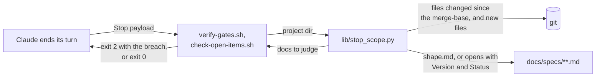
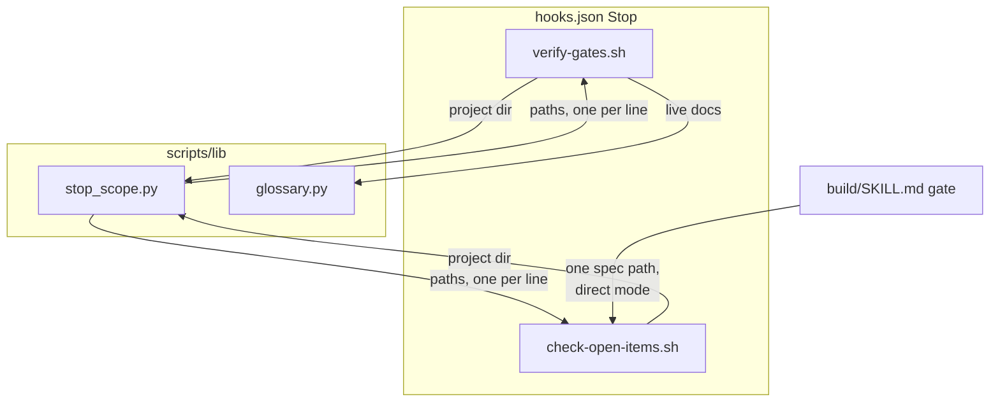
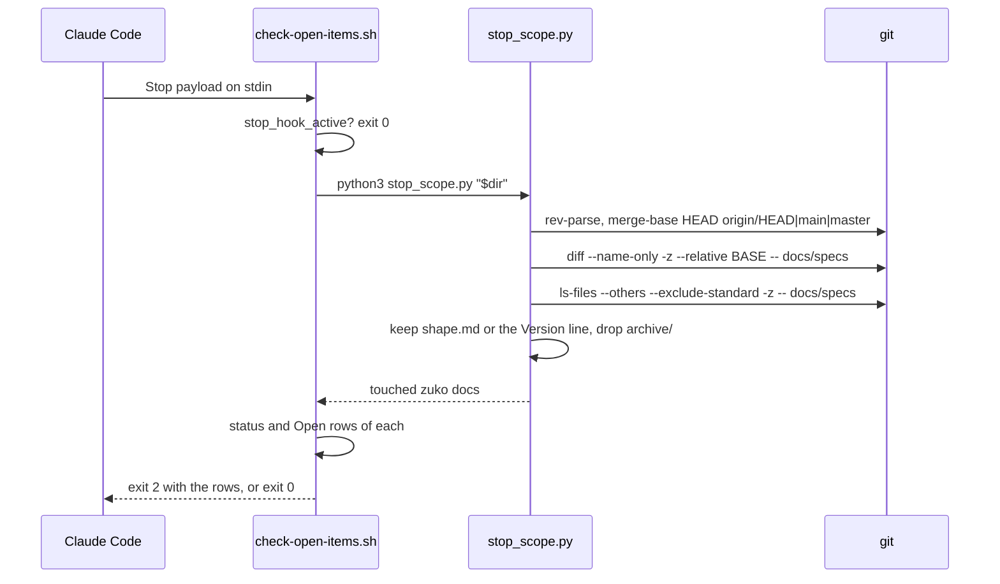

# Stop hook scope

**Version:** v1 · **Status:** Refined · **Type:** Bug · **Project type:** CLI/Library

**Shape doc:** docs/specs/ask-up-front/shape.md
**Depends on:** None

The two Stop hooks judge only the zuko docs that this branch or the working
tree changed. Runbooks, other tools' specs and old breaches stop pulling Claude
off its task, and a doc that the current work changed is still judged.

## Problem

The Stop hooks `verify-gates.sh` and `check-open-items.sh` read every `.md`
file in `docs/specs/` to depth 2, at the end of every turn. They failed a turn
in 18 past sessions across 7 projects. Most of those files were not zuko docs.
Examples are `raslaw-rebuild/5b-cutover-runbook.md`, 26 specs from another tool
in `TBD-security-audit-v1-2-0/`, and experiment notes. One was an old `Built`
spec in Raslaw with an Open row, which failed every turn until someone fixed
it. Each failure sends Claude back to edit a file that the task did not need.

## Slice test

| Check | Result |
| --- | --- |
| Cuts every layer it needs | yes. The hook scripts and the one helper they share. |
| One e2e test walks it | yes. A scratch git repo runs both hooks through the five scenarios. |
| Worth shipping alone | yes. Turns stop failing in the 7 projects as soon as it ships. |
| Fits (≤5 scenarios, ≤2 areas) | yes. 5 scenarios, one area: the Stop hooks. |

**Path:** light. This is a bug fix to two hook scripts plus a helper they
share, with no new interface, data or dependency. Pauses 1 and 3 are merged,
and pause 2 is skipped.

## Flow



When a turn ends, each hook asks `stop_scope.py` which docs to judge. The
helper keeps a doc only if it is a zuko doc that git says this work changed.

## Acceptance criteria

```gherkin
Scenario: a runbook under docs/specs is never judged
  Given branch fix/contact-form changed docs/specs/raslaw-rebuild/5b-cutover-runbook.md
  And that file opens with "**Status:** Shipped · **For:** slice 5b" and has no Open items section
  When Claude ends its turn
  Then verify-gates.sh and check-open-items.sh both exit 0

Scenario: another tool's spec is never judged
  Given a new, uncommitted file docs/specs/TBD-security-audit-v1-2-0/spec-rate-limiting-and-input-bounds.md
  And it opens with "**Ticket:** TBD · **Type:** Feature · **Version:** v1 · **Status:** Built"
  When Claude ends its turn
  Then both hooks exit 0

Scenario: an old breach that this work did not touch is ignored
  Given main holds docs/specs/raslaw-rebuild/1-reach-the-firm.md at Built, with row O19 Open
  And branch fix/contact-form changes only src/pages/contact.astro
  When Claude ends its turn
  Then both hooks exit 0

Scenario: a zuko spec that this branch committed is still judged, nested or not
  Given branch fix/contact-form committed docs/specs/raslaw-rebuild/8-the-site-follows-the-bars-publicity-rules.md
  And that spec is Refined, with row O3 Open
  And main still holds 1-reach-the-firm.md at Built, with O19 Open
  When Claude ends its turn
  Then check-open-items.sh exits 2 and names 8-the-site-follows-the-bars-publicity-rules.md and O3
  And its message does not name 1-reach-the-firm.md

Scenario: an uncommitted change on main is judged
  Given the checkout is on main with no branch commits
  And an uncommitted edit sets docs/specs/billing/shape.md to Shaped, with row O2 Open
  When Claude ends its turn
  Then check-open-items.sh exits 2 and names billing/shape.md and O2
```

## Scope

**In:**

- A zuko doc is `shape.md` anywhere in `docs/specs/` to depth 2, or a file
  that has a line starting `**Version:** v{N} · **Status:**`. That line is the
  spec template's first line.
- A doc is touched when it differs from the merge-base with the base branch
  (committed on the branch, staged, or unstaged), or is new and untracked.
- The base branch is `origin/HEAD`, then `main`, then `master`, in the same
  order as `verify-ship-gates.sh`.
- Not a git repo, or no base branch found: every zuko doc is judged, as today.
- `/build`'s direct call, `check-open-items.sh docs/specs/{slice}.md`, does not
  change. It always judges the file it is given.

**Out:**

- A non-blocking ledger status for rows that `/build` raises. This goes to
  unattended-build.
- A session working in a git worktree. The hooks read `CLAUDE_PROJECT_DIR`,
  not the worktree. This gap exists today and does not change.
- A warning for untouched breaches. `/status` already shows each spec's open
  rows (O3).

## Technical plan

### Approach

One new helper, `scripts/lib/stop_scope.py`, prints the docs that a Stop hook
judges. Both hooks replace their `find` loop with its output, so they cannot
drift apart. The helper asks git first, and reads only the touched files for
the marker line.

Relies on: D35, D36 (drafted below)



Both Stop hooks get their list from `stop_scope.py`. `/build` still calls
`check-open-items.sh` with one path, which skips the helper.



### Changes

| File | What changes | Why |
| --- | --- | --- |
| `plugins/zuko/scripts/lib/stop_scope.py` (new) | Prints the zuko docs to judge, one absolute path per line. It reads git output with `-z` and passes names as arguments, never through a shell. It exits 1 with a reason if git fails. | Scenarios 1 to 5 |
| `plugins/zuko/scripts/verify-gates.sh:37` | The loop reads the helper's list instead of `find`. If the helper fails, that is a problem line, the same as the glossary check's failure at `verify-gates.sh:46`. | Scenarios 1, 2, 4 |
| `plugins/zuko/scripts/check-open-items.sh:63` | The loop reads the helper's list instead of `find`. If the helper fails, the gate fails with the helper's reason. Direct mode, lines 22 to 37, does not change. | Scenarios 3, 4, 5 |
| `plugins/zuko/skills/build/SKILL.md:33` | "checks the whole repo" changes to "checks only the zuko docs that this branch or the working tree changed". | Keeps the gate's description true |
| `plugins/zuko/references/ledger.md:75` | Rule 7 says that the Stop hook judges only the docs that the work touched. | Keeps the rule true |
| `plugins/zuko/scripts/tests/test-stop-scope.sh` (new) | Scenarios 1 to 5 and the e2e block, in scratch git repos under `run.sh`'s `$work`. | Test plan |

Reusing: the base-branch order from `verify-ship-gates.sh:154`, the "could not
run" problem line from `verify-gates.sh:46`, the `stop_hook_active` guard in
both hooks, and `run.sh`'s `expect_*` helpers.

The existing `test-check-open-items.sh` and `test-glossary.sh` build their
repos with `mktemp -d` and no `git init`. They pass unchanged, and they prove
the "not a git repo, judge every zuko doc" fallback.

### Earn-it

| Added | Triggered by |
| --- | --- |
| `scripts/lib/stop_scope.py` | Both hooks must judge the same docs (scenarios 1 to 4). Two copies of the git and marker logic would drift, and the drift would bring the bug back in one hook. |

### Non-functionals

|  |  |
| --- | --- |
| **Load** | Every Stop runs both hooks. Each hook makes three git calls, which take 16 ms on this repo. Only the touched files are read. |
| **Breaks first** | A branch that touches hundreds of specs. Each touched file is read in full, which is still milliseconds. |
| **Security surface** | Called only by Claude Code's Stop event. Trusts git's file names, read with `-z` and never put through a shell. Touches no secrets. Writes nothing. |
| **Proof it works** | After the release and a plugin update, a turn in Raslaw or AuditBot ends without "Spec gate check failed" over `5b-cutover-runbook.md` or `TBD-security-audit-v1-2-0/`. The session logs show no new failure for those files. |
| **Rollout** | No flag. This is a light-path fix to two hook scripts. Rollback: `git revert` the fix commit. |

### Test plan

| Scenario | Test | Command |
| --- | --- | --- |
| 1. A runbook is never judged | `tests/test-stop-scope.sh` | `bash plugins/zuko/scripts/tests/run.sh stop-scope` |
| 2. Another tool's spec is never judged | `tests/test-stop-scope.sh` | same |
| 3. An old breach is ignored | `tests/test-stop-scope.sh` | same |
| 4. A committed zuko spec is judged, nested or not | `tests/test-stop-scope.sh` | same |
| 5. An uncommitted change on main is judged | `tests/test-stop-scope.sh` | same |
| No git: every zuko doc is judged | `tests/test-check-open-items.sh`, `tests/test-glossary.sh` | `bash plugins/zuko/scripts/tests/run.sh` |

**E2E:** the last block of `test-stop-scope.sh`. One scratch git repo has
`main` and the branch `fix/contact-form`, with the runbook, the other tool's
spec, and an old `Built` spec with an Open row on main. Both hooks run with
the Stop payload that Claude Code sends, and both pass. Then the branch
commits a nested zuko spec at `Refined` with an Open row. `check-open-items.sh`
fails and names only that spec.

**Verdict diff, before ship.** Run the old and the new hooks in hook mode over
each local repo that has `docs/specs/`. List every repo whose verdict changes.
Each change must be a doc from O4's list or an untouched breach. This check
uses real repos, so it runs from the scratchpad and is not committed.

The full suite must stay green: `bash plugins/zuko/scripts/tests/run.sh`.

### Chunks

Single chunk. The test file is written first.

### Risks

| Risk | Mitigation |
| --- | --- |
| A zuko spec with a broken Version line is no longer judged by the Stop hooks. | `/build` and `/ship` still read the spec by its path. Accepted in O4. |
| A narrower matcher turns false blocks into false allows. | The verdict diff over the real repos, before ship. |
| A repo with no `origin/HEAD`, `main` or `master` judges every zuko doc, so it still gets old breaches. | Fail toward the gate. A missed check costs more than a false block. |
| macOS runs the hooks with bash 3.2. | The shell change only swaps the input of an existing loop. The logic lives in Python. |

### Decisions to record

Recorded as D35, D36.

## Open items

| ID | What | Type | Raised at | Owner | Status | Answer |
| --- | --- | --- | --- | --- | --- | --- |
| O1 | Assuming "the Stop hooks must not block required work" means: they judge files that are not zuko docs, and zuko docs that the task did not touch (from shape O7) | assumption | shape | user | Resolved | Both. Confirmed 2026-10-09 |
| O2 | What counts as a doc that the current work touched? | question | spec p1 | user | Resolved | Changed on the branch since the merge-base, staged, unstaged, or new. 2026-10-09 |
| O3 | A zuko spec that nobody touched still has a breach. Ignore it, or warn without blocking? | question | spec p1 | user | Resolved | Ignore. `/status` shows the open rows. 2026-10-09 |
| O4 | 118 docs in 8 local repos stop being judged, because none has the Version line. None follows the current template, and each fails today's gate. A zuko spec whose Version line gets broken is also no longer judged. | flag | spec p3 | user | Accepted risk | Every one fails today's gate on every turn, and `/build` and `/ship` still read a spec by its path. 2026-10-09 |

_Never delete this section or its rows. See references/ledger.md._

## Glossary

- **e2e** — end-to-end: one test that walks the whole slice as a user would.
- **Stop hook** — a script that Claude Code runs when Claude tries to end its
  turn. An exit code of 2 sends Claude back to work with the script's message.
- **Merge-base** — the commit where this branch split from the base branch.
- **Untracked** — a new file that git has not been told to track yet.
- **Marker line** — the spec template's first line, `**Version:** v1 ·
  **Status:** …`, which tells a zuko spec apart from other Markdown.
