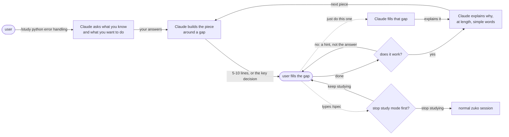
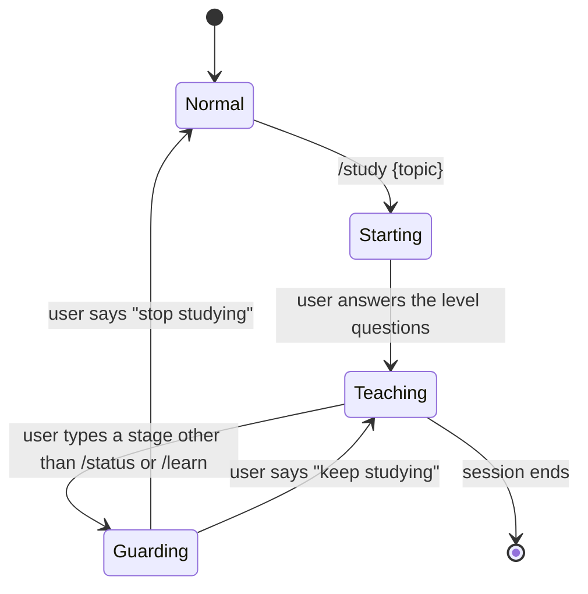
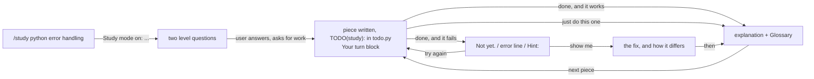
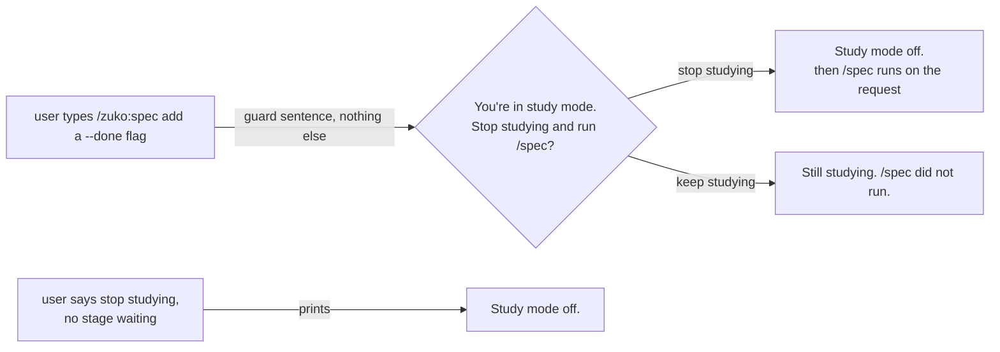
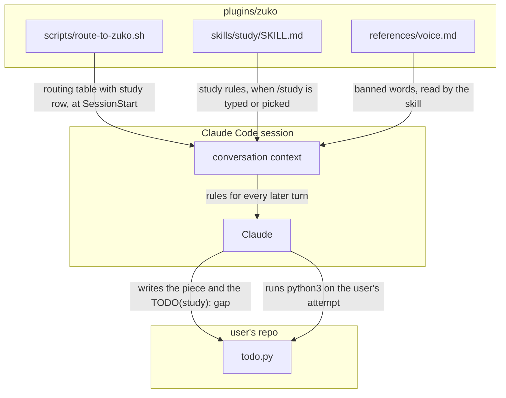
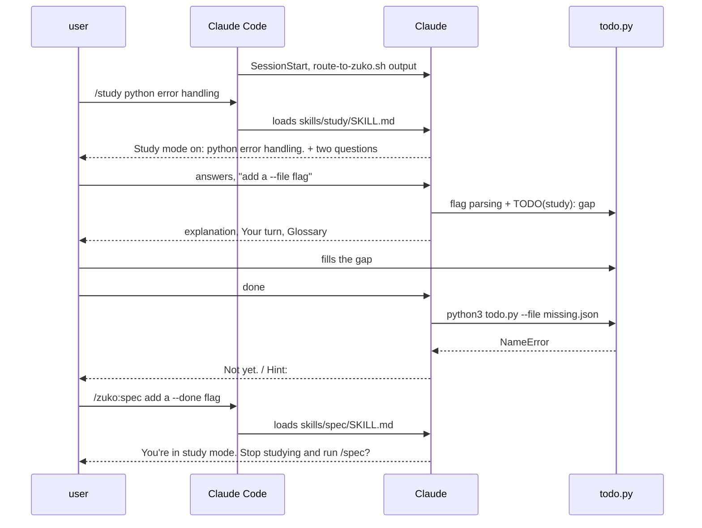

# Study on demand

**Version:** v1 · **Status:** Refined · **Type:** Feature · **Project type:** CLI/Library

**Shape doc:** docs/specs/learning-mode/shape.md
**Depends on:** None

`/study` puts the current session into learning mode for any topic: Claude asks where
the user is starting from, leaves the key part of each piece for them to do by hand,
and explains at length in simple words. It comes first because every later learning
slice is a behaviour of this mode.

## Problem

When the user wants to learn while they work, the only teaching mode they have is
Anthropic's `learning-output-style` plugin. It is switched on per repo in
`.claude/settings.json`, sits outside zuko, and loads into the same session as zuko's
`route-to-zuko.sh` ("route to a stage first") and the global `CLAUDE.md` ("explain
less"), so three instruction sets pull in different directions. The user wants learning
in two cases: when they decide to learn something, and in a repo made only for learning.
This slice covers the first.

## Slice test

| Check | Result |
| ----- | ------ |
| Cuts every layer it needs | yes — the `study` skill carries the teaching rules, and `route-to-zuko.sh` sends study requests to it instead of the lesson store |
| One e2e test walks it | yes — one scripted headless session in a scratch Python repo runs the five scenarios in order (O5 spike: 5 of 5 steady) |
| Worth shipping alone | yes — the user can type `/study` in any session and learn on the task in front of them, with no Anthropic plugin involved |
| Fits (≤5 scenarios, ≤2 areas) | yes — 5 scenarios, two areas (`skills/`, `scripts/route-to-zuko.sh`), after emulators and notebooks moved to slice 2 |

**Path:** full — it adds a new command, so the light path does not apply.

## User story

As the user, learning a topic while I work, I want to switch a session into learning
mode with one command, so that I do the key parts myself and understand why they work,
instead of reading code or designs Claude made for me.

## Flow



The user starts learning mode, answers two level questions, and then loops: Claude
builds around a gap, the user fills it, a wrong attempt gets a hint, a working one gets
an explanation. At any gap they can hand that one piece back. Typing a stage asks them
to leave the mode first.

## States



## Acceptance criteria

```gherkin
Scenario: Study a code task
  Given a Python repo "todo-cli" with zuko loaded and learning mode off
  When the user runs "/study python error handling"
  And asks for a "--file" flag that loads todos from "todos.json"
  Then Claude first asks what they already know about Python error handling
    and what they want to be able to do, and writes no code yet
  And once they answer, Claude writes the flag parsing in "todo.py"
    and leaves a marked gap of 5 to 10 lines where a missing or broken
    "todos.json" is caught and turned into a clear error message
  And explains in simple words what the gap has to do and why it was left for them
  And does not start /shape, /spec, or /build

Scenario: Study a topic with no code to write
  Given the user ran "/study system design" in an empty folder
  And said they have never designed a URL shortener
  When they ask "how would a URL shortener handle 10,000 new links a day"
  Then Claude lays out the parts and stops at the key decision,
    how the short codes get generated, without picking one
  And asks the user to choose an approach and say why
  And after they answer, explains in simple words what their choice does well
    and what it costs

Scenario: A wrong attempt gets a hint, not the answer
  Given learning mode is on in "todo-cli"
  And the user filled the gap with "except FileNotFound:"
  When they say "done"
  Then Claude runs "python3 todo.py --file missing.json"
    and sees it fail with "NameError: name 'FileNotFound' is not defined"
  And gives a hint about the exact name Python uses for a missing file,
    without writing the fix
  And shows the fix only after the user asks for the answer

Scenario: Hand one piece back
  Given learning mode is on in "todo-cli" and the gap in "todo.py" is still empty
  When the user says "just do this one for me"
  Then Claude fills that gap itself and explains it in simple words
  And the next piece, listing unfinished todos before finished ones,
    is left as a gap for the user again

Scenario: A stage typed while studying
  Given learning mode is on in "todo-cli"
  When the user types "/spec add a --done flag that marks a todo complete"
  Then Claude does not start /spec, and asks whether to stop study mode first
  And when the user says "stop studying", Claude says learning mode is off
    and runs /spec on the "--done" request, with no gap left for the user
```

## Scope

**In:**
- `/study {topic}`, for any topic: code, cloud, system design, and so on
- two level questions when the mode starts: what the user knows, what they want to do
- learning on the real task in front of the user; no separate practice files
- a gap in every piece: 5-10 lines of code, or the key decision when there is no code
- a wrong or failing attempt gets a hint; the answer only when the user asks for it
- "just do this one" hands a single piece back to Claude
- "stop studying" ends the mode; otherwise it lasts until the session ends
- long explanations in simple words, in this mode only
- routing: study requests reach `/study`, not the `/learn` lesson store; while studying,
  plain requests are handled as study pieces, not routed into a stage
- the guard: typing any zuko stage except `/status` or `/learn` while studying asks the
  user to stop study mode first; "keep studying" leaves the stage unrun

**Out:**
- emulators and notebooks for topics with little or no code — slice 2, Hands-on tools
- a repo that starts every session in learning mode — slice 3, Learning repo
- a notes file of what was learned — slice 4, Notes in the repo
- Claude asking questions to check understanding before moving on — slice 5
- learning mode inside `/spec` and `/build` — not doing, per the shape doc
- switching off `learning-output-style` in `.claude/settings.json` — the user's own step
  once slice 3 ships

## Interface

The command surface is one slash command plus a few plain phrases. Claude's replies
carry a small set of fixed lines. Those fixed lines, and the marker in files, are the
only things the e2e test checks. Everything around them is free text (O5).

### The teaching loop



Every piece ends in a Your turn block. A failed attempt gets a hint and loops back. A
working attempt, a handed-back piece, or a shown answer all end in an explanation, and
then the next piece starts.

### The guard and leaving



A typed stage gets only the guard sentence. Leaving happens only when the user says to.

### What the user types

| Input | Where | Effect |
| ----- | ----- | ------ |
| `/study {topic}` | any session | Turns study mode on for the topic, or switches topic if already on. Topic is optional. Without one, the first question is what to study. |
| `done` | at a Your turn block | Claude checks the attempt: runs it for code, reads it for a decision. |
| `show me` | at a Your turn block | Claude writes the answer and explains how it differs from the user's attempt. |
| `just do this one` | at a Your turn block | Claude fills that gap itself. The next piece is a gap again. |
| `stop studying` | anywhere in study mode | Study mode off. |
| `keep studying` | at the guard | The typed stage does not run. |
| any zuko stage but `/status`, `/learn` | in study mode | The guard. |

Claude reads these phrases for intent, not as exact strings. "I'm done", "ok done" and
"finished" all count as `done`.

### What Claude prints

| Moment | Fixed text the e2e test checks | Free text around it |
| ------ | ------------------------------ | ------------------- |
| Start | `Study mode on: {topic}.` | the two level questions |
| A gap in a file | a comment starting `TODO(study):`, in the file's own comment syntax | the code around it |
| End of every piece | a `Your turn` line, then `Where:` `What:` `Size:` for code, or `Decide:` for a decision | the explanation above it |
| Failed attempt | first line `Not yet.`, then a line starting `Hint:` | the error, quoted as it appeared |
| Explanation | a `Glossary` heading when any technical word was used | long, simple-worded explanation |
| Guard | `You're in study mode. Stop studying and run /{stage}?` | none — no stage work starts |
| Keep studying | `Still studying. /{stage} did not run.` | none |
| Off | `Study mode off.` | none |

Explanations may run as long as the idea needs. Short sentences, everyday words, and
every technical word gets one plain line in the Glossary. zuko's banned words and the
no-emoji rule still hold. No `★ Insight` boxes: the Your turn block and the Glossary
replace them.

### Example, scenario 1

```text
> /study python error handling

Study mode on: python error handling.

Two questions first, so I start at your level:
1. What do you already know about error handling in Python?
2. What do you want to be able to do when we're done?

> I know try/except exists but my scripts just crash. I want them to fail with a
> clear message. Add a --file flag that loads todos from todos.json.

I added the --file flag to todo.py. It reads the path and passes it to load_todos().
The part inside load_todos() that deals with a missing or broken file is yours.
[explanation, as long as it needs]

Your turn
Where: todo.py:12, the TODO(study) comment
What:  if todos.json is missing or not valid JSON, print a clear message and exit
Size:  about 6 lines
Say "done" when it's written, "show me" for the answer, or "just do this one".

Glossary
exception: the error object Python raises when something goes wrong
```

In `todo.py`:

```python
def load_todos(path):
    # TODO(study): open the file at `path` and parse it as JSON. If the file is
    # missing or the JSON is broken, print which one went wrong and exit with code 1.
    pass
```

### Routing

`plugins/zuko/scripts/route-to-zuko.sh` gains one row, above the `/learn` row:

```text
  "study X", "teach me X", "I want to learn X"               -> zuko:study
```

The `study` skill's `description` carries the same trigger phrases, so Claude can pick
it without the routing table.

## Technical plan

### Approach

Study mode is one new skill file. There is no hook and no state on disk. When `/study`
is typed or picked, Claude Code loads `skills/study/SKILL.md` into the conversation,
and the O5 spike showed those rules still held in a later turn, even after another
skill's text was loaded on top. Routing gets one row. The live e2e test drives real
headless sessions against scratch repos, the way the spike did. `run.sh` skips it
unless it is named, because each run costs money.



The routing hook and the skill both put text into the conversation. Claude follows
that text in every turn after it, writing into the user's repo and running their
attempts.



The main path runs: start, one gap, one failed attempt, then the guard stopping a
stage whose text has already been loaded.

### Changes

| File | What changes | Why |
| ---- | ------------ | --- |
| `plugins/zuko/skills/study/SKILL.md` | New. Frontmatter `name: study`, `disable-model-invocation: false`, a description with the trigger phrases. Body: the mode beats earlier routing and "explain less" in this session; start; one gap per piece; checking an attempt; `show me`; `just do this one`; explanations and Glossary; the guard; leaving. Every fixed line from the Interface tables, word for word. Reads `${CLAUDE_PLUGIN_ROOT}/references/voice.md`. | Scenarios 1-5 |
| `plugins/zuko/scripts/route-to-zuko.sh:21` | New row above the `zuko:learn` row, text as in Interface / Routing | Scope: study requests reach `/study`, not the lesson store |
| `plugins/zuko/scripts/route-to-zuko.sh:24` | "design, poc, debug, status and learn" becomes "design, poc, debug, status, learn and study" | Same |
| `plugins/zuko/scripts/tests/run.sh:41-42` | The no-name loop skips files named `test-live-*` and prints `{name} skipped, costs money: run.sh {name}`. A named run still runs them. | The user's call at pause 3: the live test runs only when named |
| `plugins/zuko/scripts/tests/test-study-wiring.sh` | New. (1) `route-to-zuko.sh` output has the study row, above the learn row. (2) A sandbox copy of `run.sh`, holding one passing test and one `test-live-` test that fails: run with no name, it exits 0 and prints the skip line. Named, it exits 1. | Routing scope, and the skip must be visible, never silent |
| `plugins/zuko/scripts/tests/test-live-study.sh` | New. The e2e, see Test plan. | Scenarios 1-5 |
| `README.md:20`, `README.md:33` | "five helpers" becomes "six helpers". New `/study` row under `/learn`. | The command table is the user's index |
| `plugins/zuko/.claude-plugin/plugin.json:4`, `.claude-plugin/marketplace.json:13` | `2.1.0` becomes `2.2.0` | A new command. The installed copy can be pinned back. |

Reusing: `run.sh`'s `expect_exit` / `expect_match` / `expect_no_match`; the sandbox
copy of `run.sh` from `test-block-attribution.sh:31`; the `mktemp -d` scratch-repo
setup from `test-e2e-naming.sh`; the `--output-format stream-json` then
`--resume <session_id>` loop from the O5 spike.

### Earn-it

| Added | Triggered by |
| ----- | ------------ |
| `test-live-*` skip in `run.sh` | The user's pause 3 call: about $2.70 and 6 minutes per e2e run |
| `--max-budget-usd 1` on every live turn | Risk: a looping turn spending money unattended |
| `--allowedTools "Bash(python3 *)"` on live turns | Scenario 3: Claude has to run the attempt, and headless mode denied Bash in the spike |
| `--add-dir` on the plugin folder for live turns | Spike: headless reads of the plugin's `references/` were blocked |
| `test-study-wiring.sh` | The routing scope line, and the lesson that a skip must never look like a pass |

No new dependency, hook, or config file.

### Non-functionals

| | |
| --- | --- |
| **Load** | One user. I don't know how often they will study. The skill loads once per `/study`, as a single file of text. |
| **Breaks first** | Session length, not volume. Auto-compaction in a long session may drop the study rules, and study mode then ends silently (O9, accepted). |
| **Security surface** | In a user session, the only thing that runs is the user's own attempt (`python3 todo.py ...`), behind the same permission prompts as any session. The live test runs `claude -p` with `acceptEdits` in a `mktemp -d` folder. Bash is limited to `python3 *` and spend is capped per turn. It sends only fixture code to the API and touches no secrets. |
| **Proof it works** | After updating the installed plugin and starting a new session: `/study python error handling` prints `Study mode on: python error handling.`, and the first code piece leaves a line that `grep -rn "TODO(study):" .` finds. Also, `bash plugins/zuko/scripts/tests/run.sh live-study` passes on the merged commit. |
| **Rollout** | No flag. The skill does nothing until `/study` is typed or a study request routes to it. Version 2.2.0. The installed copy lags the repo, so `/plugin update zuko@dzafran-claude-plugins` and then a new session (lessons `installed-plugin-lags-the-repo`, `skills-load-at-session-start`). Rollback: `git revert` the merge commit, or pin 2.1.0. |

### Test plan

| Scenario | Test | Command |
| -------- | ---- | ------- |
| 1 Study a code task | `test-live-study.sh`, session A, turns 1-2 | `bash plugins/zuko/scripts/tests/run.sh live-study` |
| 2 No code to write | `test-live-study.sh`, session C | same |
| 3 Wrong attempt | `test-live-study.sh`, session B | same |
| 4 Hand one back | `test-live-study.sh`, session A, turn 3 | same |
| 5 Stage while studying | `test-live-study.sh`, session A, turns 4-5 | same |
| Routing row, visible skip | `test-study-wiring.sh` | `bash plugins/zuko/scripts/tests/run.sh study-wiring` |

Full free suite: `bash plugins/zuko/scripts/tests/run.sh`.

**E2E:** `tests/test-live-study.sh`. Three scratch folders under `mktemp -d`, each turn
a `claude -p --plugin-dir plugins/zuko` call chained with `--resume`. Sessions run in
parallel, and turns within a session run in order. It checks only fixed lines, file
contents, and tool calls:

- **A** (Python `todo-cli`, git repo).
  - T1 `/zuko:study python error handling` plus the `--file` request: `Study mode on:` printed, and `git status` shows no change.
  - T2 the level answers: `todo.py` has `TODO(study):` and `--file`, the reply has `Your turn` and `Where:`, and no Skill call to a stage.
  - T3 `just do this one`, then asks for unfinished todos first: the T2 marker text is gone, a new `TODO(study):` is there, and the reply has `Your turn`.
  - T4 `/zuko:spec add a --done flag that marks a todo complete`: the reply matches `You're in study mode. Stop studying and run /(zuko:)?spec\?`, the file tree is unchanged, and there is no `docs/specs/`.
  - T5 `stop studying`: the reply has `Study mode off.` and no `Your turn`.
- **B** (fixture `todo.py` whose gap is already filled with `except FileNotFound:`).
  - T1 `/zuko:study python error handling`, level answers, `done`: the reply starts `Not yet.`, has `Hint:`, and `todo.py` is byte-identical.
  - T2 `show me`: the reply has `FileNotFoundError`.
- **C** (empty folder).
  - T1 `/zuko:study system design`, level answers, the URL shortener question: the reply has `Your turn` and `Decide:`, and no files were created.
  - T2 the user's choice with a reason: the reply does not start `Not yet.` and has `Glossary`.

A turn with no `result` event, or with `is_error`, records a FAIL. So does `claude`
missing from PATH. A live test that cannot run is not a pass. `/build` runs it once
before `SKILL.md` exists and sees it fail for the right reason
(`harness-before-the-chunks-it-proves`).

### Chunks

Single chunk, built in this order: `test-study-wiring.sh` and the `run.sh` skip, then
`test-live-study.sh` (red, no skill yet), then `SKILL.md`, then the routing row, then
the live test green, then README and version. Eight files, each depending on the
last. Parallel worktree agents were dropped here too
(`worktree-agents-cannot-commit`).

### Risks

| Risk | Mitigation |
| ---- | ---------- |
| Auto-compaction drops the study rules in a long session | Accepted (O9). The `Study mode on:` line is visible, so a user who notices can run `/study` again. |
| A live check flakes on a run | Checks read only fixed lines and files, and the spike went 5/5 on this approach. If one flakes, tighten the skill's wording. Never loosen the check until it matches anything. |
| "Explain at length" loses to the global `CLAUDE.md` "explain less" | Accepted (O2, O8). Judged by reading the first real study session. |
| This repo still enables `learning-output-style` in `.claude/settings.json`, so a `/study` session here also gets `★ Insight` boxes | The skill says no Insight boxes. If they still appear, switch the Anthropic plugin off for this repo before slice 3. |
| The live test costs about $2.70 per run | It runs only when named, and each turn is capped at $1. |

## Open items

| ID | What | Type | Raised at | Owner | Status | Answer |
| -- | ---- | ---- | --------- | ----- | ------ | ------ |
| O1 | `/learn` is already zuko's lesson store, and `route-to-zuko.sh` sends "what have you learned" there. The new command needs another name, and "I want to learn Rust" must not route to the lesson store. | flag | shape | user | Resolved | Yes. Named `/study` at pause 1, 2026-09-15. |
| O2 | Unproven that learning mode's rules win over two instructions already in the session: the global `CLAUDE.md` "explain less" and `route-to-zuko.sh` "route to a stage first". A skill rule has lost to a session-wide instruction before (`docs/specs/ship-naming.md`, attribution). | unproven | shape | poc | Accepted risk | No spike, user's call 2026-09-15. This slice's e2e is where it gets proven. Partial evidence from the O5 spike: the routing rule and a loaded `/zuko:spec` lost to the study skill in 5 of 5 runs. "Explain less" was not measured. |
| O3 | Assuming "learning something" means learning to code. | assumption | shape | user | Resolved | No. Any topic: code, cloud, system design, and so on. |
| O4 | For topics with no code to write, assuming the user's hands-on part is making the key decision themselves. | assumption | shape | user | Resolved | Yes, and it must still be hands-on: emulators and notebooks, now slice 2. |
| O5 | Unproven that a headless `claude -p --plugin-dir plugins/zuko` run can walk five scenarios across several turns and check the result steadily enough to be the e2e test. The flags exist (`claude --help`, 2.1.272); how stable the output is across runs is not known. | unproven | spec p1 | poc | Resolved | Yes, 5 of 5. Spike 2026-09-15: a stand-in study skill, two turns per run (`claude -p ... --output-format stream-json`, then `--resume <session_id>`). Every run left one `TODO(study):` gap and never called a stage. In turn 2 every run answered a typed `/zuko:spec` with the guard sentence, even though the transcript shows the full spec skill text was loaded. A control run without the study skill failed both checks. About $0.60 and under 4 minutes per run. For pause 3: check files and the fixed guard sentence, never free text. The level questions were answered in the prompt, so that step is still untested. Headless runs needed read access to the plugin's `references/`. |
| O6 | Assuming a stage the user types by name while studying, like `/spec`, still runs. Learning mode only stops Claude from routing plain requests into the pipeline. | assumption | spec p1 | user | Resolved | No. Study mode guards: any stage except `/status` and `/learn` asks the user to stop study mode first. Scenario 5. |
| O7 | This machine has no Rust toolchain (`which cargo rustc` finds nothing), so scenario 3's `cargo build` cannot run in the e2e as written. Either the scenarios move to a language that is installed (`python3` is), or Rust gets installed. | flag | poc | user | Resolved | Python. Scenarios rewritten on a Python `todo-cli`, 2026-09-15. |
| O8 | The e2e test checks only fixed lines, so it can prove the gap, the hint, the guard, and that a `Glossary` heading exists. It cannot prove the explanations are long and in simple words, so the "explain less" half of O2 stays unproven after the build. Options: accept that and judge it by reading, or add a word-count check on the explanation, which is free text and will be flaky. | flag | spec p2 | user | Accepted risk | Judge it by reading the first real study session. The user said "proceed" at pause 2, 2026-09-15. |
| O9 | Unproven that the study rules survive auto-compaction in a long session. If they don't, study mode ends silently partway through. | unproven | spec p3 | user | Accepted risk | No spike, user's call 2026-09-15. The `Study mode on:` line lets the user notice and run `/study` again. |
