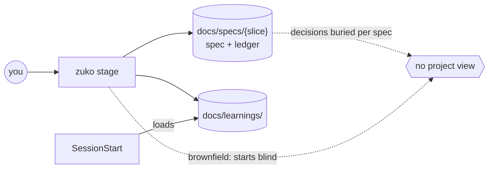
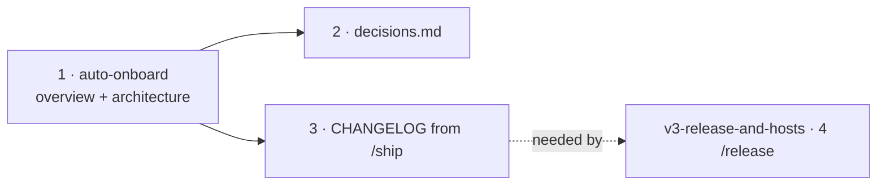

# v3 · Project memory

**Project type:** CLI/Library · **Status:** Shaped · **Release:** zuko 3.0.0 (with `v3-release-and-hosts`)

## Problem

zuko remembers each slice but not the project: nothing says what the product is,
what was decided across slices, or what changed between releases. A new session
— or a person coming back after weeks — rebuilds that picture from code and git
log, and sometimes reopens choices that were already settled.

## Today



Each spec's ledger holds its own decisions (`references/ledger.md`: "a resolved
row is the decision record"). Nothing collects them, nothing describes the whole
product, and there is no changelog. On an existing repo, `/shape` starts with no
map of what is already there.

## Slices



| #   | Slice        | What ships                                                                                                                                                                                                                                                                         | Why this order                                           |
| --- | ------------ | ---------------------------------------------------------------------------------------------------------------------------------------------------------------------------------------------------------------------------------------------------------------------------------- | -------------------------------------------------------- |
| 1   | Auto-onboard | First zuko stage in a repo with no `docs/overview.md` writes `overview.md` and `architecture.md` as Draft, shows them for correction, marks them Active, then carries on. SessionStart loads the overview. `/ship` keeps both current and republishes the hub page.                | Every later slice writes into or links from these files. |
| 2   | Decision log | `docs/decisions.md` in D-entry format, written by `/spec` pause 3, `/poc`, `/design-system`, and ledger rows that resolve into a real choice. `/spec` and `/build` grep active entries before proposing. SessionStart loads titles only. A gate script checks the log's integrity. | Stops later slices re-proposing rejected options.        |
| 3   | Changelog    | `/ship` writes human lines under `[Unreleased]` in `CHANGELOG.md` (Keep a Changelog 1.1.0), grouped from commit types. The ship gate fails a branch with a `feat` or `fix` commit and no new line.                                                                                 | `/release` (other shape, slice 4) cuts versions from it. |

### Slice 1 · auto-onboard

```
any zuko stage ──► docs/overview.md exists? ── yes ──► carry on
                          │ no
                          ▼
        read README, CLAUDE.md, manifests, git log, tags, folder layout
                          ▼
        write overview.md + architecture.md   (Status: Draft)
                          ▼
        show the draft → user corrects → Status: Active → carry on
```

- **Triggers:** `/shape`, `/spec`, `/poc`, `/design`, `/design-system`, `/build`,
  `/review`, `/ship`, `/release`, `/debug`. Read-only stages (`/status`, `/learn`)
  only report "not onboarded".
- **overview.md** (≤150 lines): what it is, who uses it, how to run/test/lint (exact
  commands), folder map as `path/` pointers (no copied code), slices table (status
  and page link), links to architecture, decisions, changelog.
- **architecture.md:** Mermaid context and component diagrams, one line per
  component naming its folder. Separate from the overview so the overview stays
  small enough to load every session.
- **Session load:** a SessionStart script loads `overview.md`; over 150 lines it
  loads the head and prints a warning.
- **Kept live:** `/ship` updates the slices table and any section the slice
  changed, updates `architecture.md` when pause 3 added or changed a component,
  and republishes the hub page. Ship gate fails if the shipped slice is missing
  from the slices table.
- **Hub page:** one HTML page from the four project docs, linking to every slice's
  spec page; each spec page links back. Markdown wins; HTML is gitignored; same
  path, same link, every republish.
- **Greenfield:** same files, marked "nothing shipped yet".

### Slice 2 · decision log

```markdown
## D7 · 2026-09-24 · Use Postgres, not SQLite

Why: two users write at once; SQLite locks the whole file.
Rejected: SQLite (locking), DynamoDB (cost for small data).
Source: specs/team-invites/spec.md O3 · Status: active
```

- A changed decision is a new entry with `Supersedes D7`; D7's status line
  becomes `superseded by D12`. That status line is the only edit ever made to an
  old entry.
- Gate script: IDs unique and ascending; every `Supersedes Dn` matches a
  `superseded by` on Dn; no entry body changed after its first commit (checked
  against git).
- Onboarding seeds entries from existing ADRs if any are found.

### Slice 3 · changelog

| Commit type                           | Changelog section                |
| ------------------------------------- | -------------------------------- |
| `feat`                                | Added                            |
| `fix`                                 | Fixed                            |
| fix touching security                 | Security                         |
| any `!` / `BREAKING CHANGE:`          | Changed, line starts "BREAKING:" |
| `chore` `docs` `test` `refactor` only | no line required                 |

Lines are written for a human reader, not copied commit subjects. Onboarding
seeds past versions from existing git tags as headings only — no invented lines.
The attribution ban in `references/git-naming.md` applies to every changelog line;
the ship gate checks the `[Unreleased]` diff for it.

## Not doing

- `@`-importing the overview into `CLAUDE.md` — it would load in full every
  session with no size control.
- A combined single page for project and slices — buries the review gate, and
  every spec edit republishes everything.
- Full ADR files (`docs/adr/NNNN-*.md`) — more files for a solo repo; the D-entry
  keeps why and rejected options, which are what stop re-litigation.
- Generating the changelog straight from `git log` — Keep a Changelog: "don't let
  your friends dump git logs into changelogs."
- Silent onboarding with no review — agent-written docs drift into guesses
  (HumanLayer, "Writing a good CLAUDE.md").

## Open items

| ID  | What                                         | Type       | Raised at | Owner  | Status   | Answer                                                                             |
| --- | -------------------------------------------- | ---------- | --------- | ------ | -------- | ---------------------------------------------------------------------------------- |
| O1  | Who is the overview for?                     | question   | shape     | user   | Resolved | Both people and Claude — one file, loaded at session start                         |
| O2  | How does a brownfield repo start?            | question   | shape     | user   | Resolved | Automatically, on the first zuko stage run; the draft is shown once for correction |
| O3  | Shape of decisions.md                        | question   | shape     | user   | Resolved | One file, D-entries, supersede never edit                                          |
| O4  | Overview as HTML too? One page or two kinds? | question   | shape     | user   | Resolved | Separate hub page linking to per-slice spec pages                                  |
| O5  | Where does the architecture diagram live?    | question   | shape     | user   | Resolved | `docs/architecture.md`, created at onboarding if missing                           |
| O6  | Which branches need a changelog line?        | assumption | shape     | user   | Resolved | Any with `feat` or `fix`; chore/docs/test/refactor-only exempt — confirmed         |
| O7  | Overview load cost every session             | flag       | shape     | claude | Resolved | 150-line cap; SessionStart hook, not `@` import (code.claude.com/docs/en/memory)   |
| O8  | Which stages trigger onboarding?             | assumption | shape     | claude | Resolved | All writing stages; `/status` and `/learn` only report — see slice 1               |
| O9  | Decisions loaded at session start in full?   | flag       | shape     | claude | Resolved | Titles of active entries only; bodies read on demand by grep                       |

## Glossary

- **Brownfield / greenfield** — an existing codebase / a brand-new one.
- **Hub page** — the one project-level web page; each slice's page hangs off it.
- **Keep a Changelog** — a common changelog format: newest version first, an
  `[Unreleased]` section on top, changes grouped as Added, Changed, Fixed, etc.
- **SessionStart hook** — a script Claude Code runs every time a session opens in
  the repo; its output becomes context.
- **Supersede** — replace an old decision with a new one while keeping the old one
  on record.
