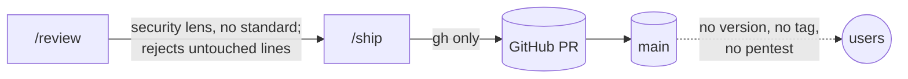
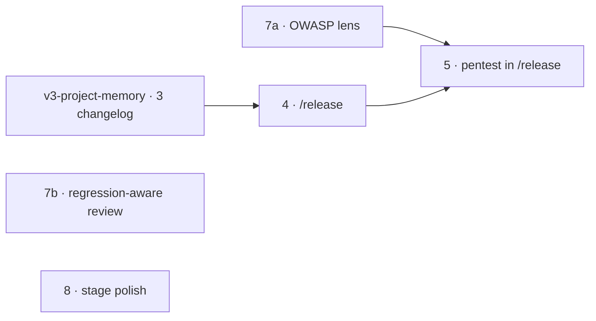

# v3 · Release and hosts

**Project type:** CLI/Library · **Status:** Shaped · **Release:** zuko 3.0.0 (with `v3-project-memory`)

**Depends on:** `v3-project-memory` slice 3 — `/release` cuts versions from its changelog

## Problem

zuko ships slices but has no release: no version number, no tag, no pentest before
users get the code, and it only speaks GitHub. Its security review has no stated
standard behind it, throws away regressions where a guard was deleted, and a few
stage rules (Mermaid in the terminal, `/design system`, open rows at shape) drift
from how the user actually works.

## Today



## Slices



| Order | #   | Slice                   | What ships                                                                                | Why this order                                            |
| ----- | --- | ----------------------- | ----------------------------------------------------------------------------------------- | --------------------------------------------------------- |
| 1     | 4   | `/release`              | Version from commits, changelog cut, tag, GitHub release, hub page                        | First thing you can release with; 5 plugs into it         |
| 2     | 7a  | OWASP lens              | `/review` security pass grounded in OWASP Top 10:2025 with a shared `references/owasp.md` | 5 reuses the reference                                    |
| 3     | 5   | Pentest                 | zuko `pentester` agent runs inside `/release`; critical or high blocks                    | Needs 4's release step and 7a's reference                 |
| 4     | 7b  | Regression-aware review | Deleted guards count, verifier needs a real defense, silent failures under A10            | Independent; after 7a so both touch `/review` in sequence |
| 5     | 8   | Stage polish            | `/design-system`, glossary gate, ASCII terminal, Figma/Jira if connected, shape gate      | Small; last so it blocks nothing                          |

### Slice 4 · `/release`

```
/release
  1. gates: on main, clean tree, CI green on HEAD, [Unreleased] not empty
  2. version from commits since the last tag
       feat → minor · fix → patch · ! or BREAKING CHANGE → major
       0.x: breaking bumps minor (semver §4)
     user sees the proposed version and may override it
  3. pentest                                   ← slice 5 plugs in here
  4. CHANGELOG: [Unreleased] → [X.Y.Z] - YYYY-MM-DD, plus compare link
  5. commit "chore(release): vX.Y.Z" → annotated tag vX.Y.Z → push
  6. GitHub release, notes = that changelog section
  7. overview shows the latest release; republish the hub page
```

- Version maths in zuko's own script; no `git-cliff` dependency.
- First release on a repo with no tags asks: `0.1.0` or `1.0.0`.
- Attribution ban (`references/git-naming.md`) extends to tag messages and release
  notes; `block-attribution.sh` gains `git tag` and `gh release create`.

### Slice 7a · OWASP lens

- `references/owasp.md`: the ten 2025 categories, each with what to check and a
  **not a finding** list (seeded from Anthropic's `security-review` exclusions:
  env vars and CLI flags trusted; SSRF only if the attacker controls host or
  protocol; framework XSS only through raw-HTML escape hatches; no memory-safety
  findings in memory-safe languages; tests and docs skipped).
- Where those exclusions contradict OWASP, OWASP wins, narrowed to the diff:
  A03 reports dependencies added or changed in the lockfile; A09 reports logging
  removed or omitted on an auth or security event; DoS and rate limiting stay
  excluded but A10 fail-open cases stay in.
- **Context first:** before judging, find the repo's own auth, validation,
  parameterised queries and escaping; flag new code that bypasses them. The same
  step decides which categories the diff can touch; only those are checked.
- Finding format adds `CATEGORY`, `SEVERITY`, `SNIPPET` + `SYMBOL`. Severity =
  exploitability × impact; between two tiers pick the lower; the verifier may lower,
  never raise.
- Remove `review/SKILL.md:58` (Trail of Bits plugins are not installed).

### Slice 5 · pentest

```
start the app from OVERVIEW.md "how to run"
        ▼
pentester agent (Claude Code) — target: localhost, or a staging URL the user names
        ▼
walk references/owasp.md category by category, attempt real attacks (curl, browser)
report only what it proved, with the exact request that proves it
        ▼
critical/high → release blocked; each one becomes a ledger row
medium/low    → release notes, Security section
report        → docs/security/vX.Y.Z/report.md
```

- **No running server** (CLI, library, data/LLM app): code-level review instead —
  command and shell injection, path traversal, unsafe file writes, secrets,
  dependencies added in the release (A03), prompt injection for LLM apps. Each
  finding needs a proving input. Critical/high still blocks.
- The report lists categories it could not assess. It never says "secure".
- Skipping the pentest needs a typed reason, written to `DECISIONS.md` and to the
  release notes as "Released without pentest: {reason}".
- Never targets anything other than localhost or the named staging URL.

### Slice 7b · regression-aware review

- Reject rule changes from "on a line the diff touched" to "**introduced by** the
  diff" — a deleted guard or a changed caller counts. Removed security code gets
  `git log -S` / `git blame`; removal from a fix/security commit raises severity.
  `/review` gains `Bash(git blame *)` and `Bash(git show *)`.
- `finding-verifier`: refute only with a defense it located and read; a comment
  claiming safety is not a defense; name who controls the input and what they gain.
- Silent failures become A10 checks: empty catch, catch-log-continue, default
  returned on error, optional chaining skipping a failed call, retries exhausted
  silently, auth or validation failing open.
- Changed auth or validation with unchanged tests, or a new function with no test,
  is a coverage finding.

### Slice 8 · stage polish

| Change            | Detail                                                                                                                                                                         |
| ----------------- | ------------------------------------------------------------------------------------------------------------------------------------------------------------------------------ |
| `/design-system`  | New skill folder; `/design {thing}` stays for screens; `/design system` prints "renamed to /design-system"                                                                     |
| Glossary          | Shape and spec templates end with `## Glossary`; `verify-gates.sh` fails a doc using a term from a short known-jargon list with no glossary entry                              |
| ASCII in terminal | `voice.md`: diagrams printed to the terminal are ASCII; Mermaid stays in files and pages; README's "renders in the terminal" claim fixed                                       |
| Figma / Jira      | `/design-system` accepts a Figma link when the Figma tools are connected; `/shape` accepts a Jira key when the Atlassian MCP is connected; otherwise neither is mentioned      |
| Shape gate        | Ledger gains status `Handed to {slice}`. A shape cannot be `Shaped`, and a spec cannot be `Refined`, with any `Open` row. A handed row is copied into the named spec as `Open` |
| PR body attribution | Attribution ban and `block-attribution.sh` extend to `gh pr create` bodies and titles (a gap today: the hook reads commits, tags and releases only) |
| Release host message | `release.py` remote gate says "origin is {host} — /release supports GitHub only"; the "GitLab releases come in slice 6" text goes |
| Mermaid placeholder fix | `verify-ship-gates.sh` placeholder check stops flagging Mermaid decision nodes (`Q{label}` inside a mermaid fence); a test with a real flowchart proves it |

## Not doing

- **GitLab and `glab`.** Dropped 2026-09-25 to focus on GitHub (O13). `/ship` and
  `/release` stay GitHub-only; any other origin stops and says so.
- **Strix.** Every run mode needs a separate LLM — a key, paid cloud credits, or a
  ~70B local model; Claude Code cannot power it (usestrix/strix
  `skills/penetration-testing-with-strix/SKILL.md`; `docs/llm-providers/local.mdx`).
  Reusing the Claude Code subscription through a proxy breaks its terms.
- Jira and Figma setup flows — used only when already connected.
- `git-cliff` — the version rule is three lines; a dependency is not worth it.
- A `/next` command, story points, parity with the did-workflow plugin.
- From the reference reviewers: type-design ratings, numeric 0–100 scores (the blind
  verifier already filters), SARIF output, reading old PR comments.

## Open items

| ID  | What                                                              | Type     | Raised at | Owner  | Status      | Answer                                                                       |
| --- | ----------------------------------------------------------------- | -------- | --------- | ------ | ----------- | ---------------------------------------------------------------------------- |
| O1  | Is there a release step, or is every ship a release?              | question | shape     | user   | Resolved    | `/release` stage; ships fill `[Unreleased]`                                  |
| O2  | How does the pentest run?                                         | question | shape     | user   | Resolved    | zuko `pentester` agent, Claude Code as the brain, no Strix                   |
| O3  | Can Claude Code power Strix instead of an LLM key?                | unproven | shape     | claude | Resolved    | No — every mode needs its own LLM (Strix skill source, read 2026-09-24)      |
| O4  | Pentest for projects with no running server                       | question | shape     | user   | Resolved    | Code-level review with proving inputs; critical/high blocks                  |
| O5  | What if the pentest can't run or is skipped?                      | question | shape     | user   | Resolved    | Block; skipping needs a typed reason recorded in decisions and release notes |
| O6  | Which hosts?                                                      | question | shape     | user   | Resolved    | GitHub and GitLab, detected from the remote; others stop                     |
| O7  | Jira and Figma                                                    | question | shape     | user   | Resolved    | Used only when already connected; no setup                                   |
| O8  | How does a shape finish when a question belongs to a later slice? | question | shape     | user   | Resolved    | New status `Handed to {slice}`; zero `Open` rows to mark Shaped or Refined   |
| O9  | Attribution on new surfaces                                       | question | shape     | user   | Resolved    | Ban and hook extend to PR/MR bodies, tag messages, release notes, changelog  |
| O10 | Slice 7 over the size rule                                        | flag     | shape     | claude | Resolved    | Split into 7a (OWASP lens) and 7b (regression-aware review)                  |
| O11 | glab flags verified on 1.93 only                                  | flag     | shape     | claude | Resolved    | Moot — GitLab dropped (O13)                                                  |
| O12 | Ship gate flags Mermaid decision nodes as unfilled placeholders | flag | spec p3 (auto-onboard) | user | Resolved | Fixed in slice 8; specs quote node labels until then |
| O13 | Keep GitLab in v3? | question | spec p1 (slice 6) | user | Resolved | No — GitHub only; slice 6 dropped 2026-09-25. Supersedes O6's GitLab half |

## Glossary

- **Annotated tag** — a git tag that carries a message and date, used to mark a release.
- **Blind verifier** — a second agent that re-judges a finding without seeing why the
  first agent thought it was a bug.
- **Fail-open** — on error, the code lets the request through instead of refusing it.
- **OWASP Top 10** — the standard list of the ten most serious web-app security risk
  categories; the 2025 edition is current.
- **Pentest** — penetration test: attacking your own app on purpose to find holes
  before someone else does.
- **Semver** — `MAJOR.MINOR.PATCH` version numbers; MAJOR changes break existing users.
- **Silent failure** — an error the code swallows, so nobody learns it happened.
