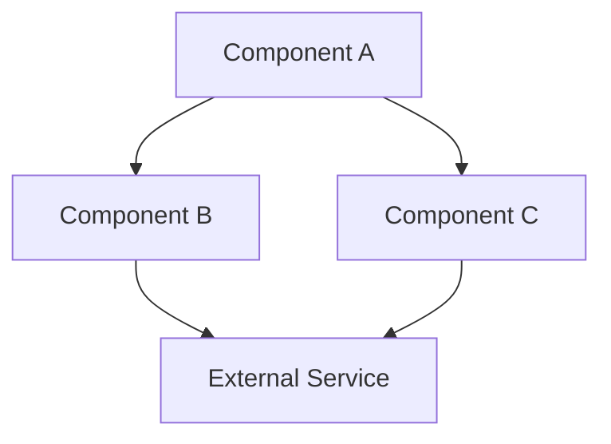
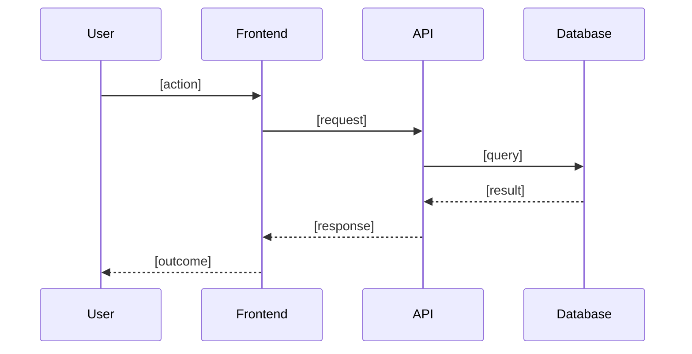
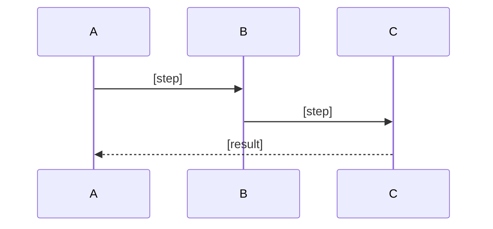
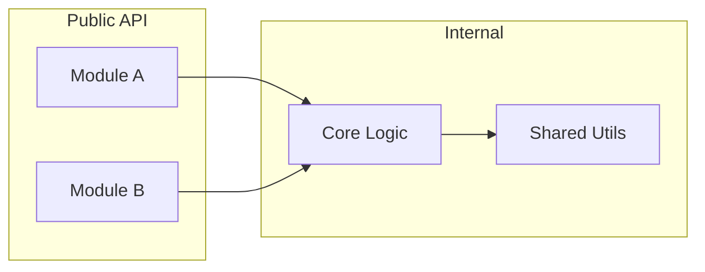
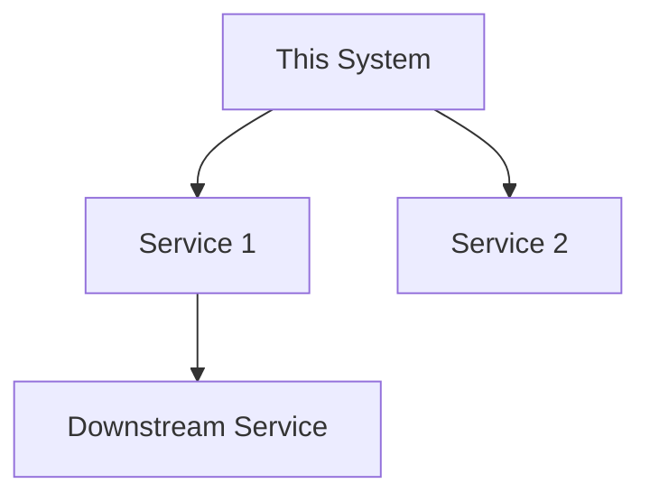

# Architecture Template

Use this template for `docs/architecture.md`. Fill every section with repo-specific
content. Delete optional sections that do not apply. Do not leave placeholders.

````markdown
<!-- last-updated: YYYY-MM-DD -->
# Architecture — [Project Name]

> [2-3 sentences: what the system does, who uses it, primary responsibilities.]

## System Overview

[Narrative description of the system's purpose and high-level design. What problem
does it solve? What are its primary responsibilities?]



## Data Flow

[Describe the primary data paths. What triggers data movement? What are the key
transformations? What enters and exits the system?]

### Primary Flow: [Name of the most important flow]



### Secondary Flow: [Name] (Optional — delete if not needed)



## Directory Structure & Module Boundaries

```
project-root/
├── src/                  # [purpose]
│   ├── module-a/         # [purpose]
│   ├── module-b/         # [purpose]
│   └── shared/           # [purpose]
├── tests/                # [purpose]
├── docs/                 # [purpose]
└── config/               # [purpose]
```



**Dependency rules:**
- [Module A] may depend on [Module B], never vice-versa
- [Shared] has no dependencies on other internal modules

## Tech Stack & Dependencies

| Layer | Technology | Purpose |
|-------|-----------|---------|
| Language | [e.g., TypeScript 5.x] | [primary language] |
| Framework | [e.g., Next.js 14] | [web framework] |
| Database | [e.g., PostgreSQL 16] | [data persistence] |
| Build | [e.g., Vite] | [build tooling] |
| Test | [e.g., Vitest] | [test runner] |

### External Integrations



### Key Dependencies

**Runtime:**
- `[package@version]` — [what it's used for]

**Development:**
- `[package@version]` — [what it's used for]

## Key Patterns & Conventions

### Architecture Pattern
[e.g., Layered architecture (API → Service → Repository), Event-driven with a
message queue, Plugin system with a core + extension points, Monorepo with
independent workspace packages]

### File Naming & Organization
- [Convention 1, e.g., "Components use PascalCase: `UserProfile.tsx`"]
- [Convention 2, e.g., "API routes mirror the URL path: `src/api/users/route.ts`"]
- [Convention 3, e.g., "Tests colocated with source: `src/foo/__tests__/foo.test.ts`"]

### Error Handling
- [Pattern, e.g., "All errors extend `AppError` base class with a `code` field"]
- [Pattern, e.g., "Services throw; controllers catch and map to HTTP status codes"]

### State Management (Optional — delete if not applicable)
- [Pattern, e.g., "Server state via React Query; local UI state via Zustand stores"]

### Testing Patterns
- [Pattern, e.g., "Unit tests use Vitest and mock at the service boundary"]
- [Pattern, e.g., "Integration tests use a real test database seeded per-test"]

## Configuration & Environment

| Variable / File | Required | Purpose |
|----------------|----------|---------|
| `[ENV_VAR_NAME]` | Yes | [what it controls] |
| `[OTHER_VAR]` | No | [what it controls, and its default] |
| `[config-file.json]` | Yes | [what it configures] |

## Companion Doc Candidates

> Sections large enough to warrant extraction into dedicated documents.

- `docs/[name].md` — [rationale: which section is the source and why it warrants splitting]
````
