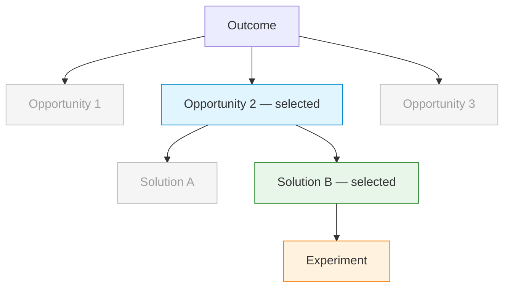

# Discovery Brief: {Name}

## Desired Outcome

{Measurable, time-bound business/product outcome. Example: "Reduce monthly
customer churn from 8% to 4% by end of Q3 2026."}

## Opportunity Map

| #   | Opportunity                     | Evidence                          | Strength | Size             |
| --- | ------------------------------- | --------------------------------- | -------- | ---------------- |
| 1   | {Unmet user need or pain point} | {User quotes, data, observations} | Strong   | {Users affected} |
| 2   | {Another opportunity}           | {Evidence}                        | Moderate | {Users affected} |
| 3   | {Another opportunity}           | {Evidence}                        | Weak     | {Users affected} |

## Selected Opportunity

{Which opportunity was selected and why. Include the selection criteria:
opportunity size, evidence strength, outcome alignment, feasibility.
Note what was deferred — not discarded.}

## Solution Candidates

| #   | Solution                        | Riskiest Assumption                  | PRD |
| --- | ------------------------------- | ------------------------------------ | --- |
| 1   | {Concrete solution description} | {What must be true for this to work} | —   |
| 2   | {Alternative solution}          | {Its riskiest assumption}            | —   |
| 3   | {Another option}                | {Its riskiest assumption}            | —   |

## Opportunity Solution Tree

{Mermaid flowchart TD diagram. Outcome at top, opportunities branching down,
solutions under selected opportunity, experiment at leaf. Selected path
highlighted, deferred branches greyed out.}

## Recommended Experiment

{For the leading solution: what to test, how to test it, how many users,
what timeframe, and what "good" looks like. Example: "Run a concierge test
with 15 trial users — manually send a personalized onboarding checklist on
signup and measure trial-to-paid conversion vs. control group over 2 weeks.
Success: 25%+ conversion in the test group."}

## Recommendation

{Clear next step. Example: "Proceed to `/prd` for Solution #2 (personalized
onboarding checklist) targeting Opportunity #2 (no guided onboarding).
The experiment can be scoped as a single-feature PRD or as Story 1 of a
larger epic."}

## Decision Log

{Key decisions made during discovery, with rationale. Example:

- Selected "no guided onboarding" over "pricing confusion" because evidence
  is stronger (3 user interviews + 40% trial drop-off at day 2) and it's
  more directly tied to the conversion outcome.
- Deferred "trial expires before value" — evidence is moderate but addressing
  onboarding may resolve this indirectly.}

## Action Items

{Only present when status is in-progress.}

| #   | Question to resolve         | Who to consult   | Blocks step |
| --- | --------------------------- | ---------------- | ----------- |
| 1   | {What needs to be answered} | {Person or team} | {Step N}    |

## Open Questions

{Anything unresolved that should carry forward to `/prd`. Example:

- Do we need to support team-level onboarding or just individual users?
- Legal review needed for personalized email sequences (GDPR).}
