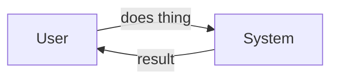

# {Feature name}

**Ticket:** {ID or TBD} · **Type:** {Feature | Bug | Enhancement | Technical} · **Version:** v1 · **Status:** Draft

**Supersedes:** archive/{name}-v{N}.md _(delete line on a first version)_

{Two-sentence summary: what this is and why now.}

**Discovery brief:** docs/discovery/{name}.md _(delete line if none)_

## Problem

{What is wrong, missing, or needed. Who feels it and how often. Real numbers
if known.}

## User story

_(user-facing only — delete for bugs and technical work)_

As a {user}, I want to {action} so that {benefit}.

## Flow



{One or two sentences reading the diagram out loud.}

## Acceptance criteria

```gherkin
Scenario: {happy path}
  Given {realistic starting state}
  When {action with concrete values}
  Then {observable result}

Scenario: {error or edge case}
  Given ...
  When ...
  Then ...
```

{Cover all happy paths, errors, and edge cases. Use real-looking names,
dates, and quantities.}

## Scope

**In:** {…}

**Out:** {…}

## Success metrics

{How we'll know it worked, measurable from the product side.}

## Open questions

{Unresolved items with who can answer them — or delete the section.}
