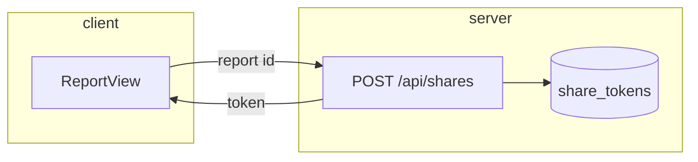

# Diagrams

Every plan carries pictures. This file says which diagram belongs where, how
to draw one that earns its place, and what to do when the diagram is hard to
draw.

## Required per stage

Missing a required diagram is a defect, same as a missing acceptance criterion.

| Stage | Required | Add when it applies |
|---|---|---|
| `/shape` | context diagram (who touches what today) · slice map (slices and their order) | — |
| `/spec` pause 1 | user flow (or caller flow for non-UI) | state diagram, when the thing has distinct states |
| `/spec` pause 2 | screen flow or interface map | — |
| `/spec` pause 3 | architecture (components touched) · one runtime sequence | data flow, when data crosses a trust or system boundary · ER, when the schema changes · deployment, when rollout is non-trivial |
| `/build` | — | only when a chunk boundary is confusing in words |
| `/review` | — | attack path, for a confirmed security finding |
| `/debug` | the traced path from symptom to root cause | — |

## Rules for every diagram

1. **Under ten boxes.** Two diagrams at different zoom levels beat one dense
   one. If it won't fit in ten, you're drawing two things.
2. **Label the arrows.** An unlabelled arrow says "related", which is
   nothing. Say what moves: `POST /shares`, `token`, `on expiry`.
3. **Show the mechanism, not the vocabulary.** A diagram whose boxes are the
   section headings of the doc is decoration. Draw what actually happens.
4. **One sentence underneath**, reading the diagram out loud. If you can't
   write that sentence, the diagram is wrong.
5. **Real names.** `share_tokens`, `ReportView`, `POST /api/shares` — not
   "Database", "Service", "Component A".
6. **If it's hard to draw, the design is unclear.** Don't simplify the
   picture to make it drawable. Go fix the design.

## Which diagram for which question

| The question | The diagram | Mermaid |
|---|---|---|
| Who is involved and what's the boundary? | context | `flowchart` |
| What does a person do, in order? | user flow | `flowchart LR` |
| What states does the thing move through? | state | `stateDiagram-v2` |
| What calls what, at runtime, in time order? | sequence | `sequenceDiagram` |
| What are the pieces and how do they connect? | architecture | `flowchart TB` |
| Where does the data come from and go? | data flow | `flowchart LR` |
| What tables, and how do they relate? | ER | `erDiagram` |
| What runs where, and how does it get there? | deployment | `flowchart TB` with subgraphs |
| What order does the work happen in? | slice map | `flowchart LR` |

## Where they live

- **Mermaid in the Markdown** is the source of truth. It renders in the
  terminal, diffs in git, and survives without any service.
- **The published page** (see `visual-page.md`) renders the same diagrams
  properly for when the user wants to look rather than read.

Never let the two disagree. The page is generated from the Markdown, not
maintained beside it.

## Style

Keep it plain. No colour coding that carries meaning the labels don't already
carry — the user may be reading it in a terminal with a different theme.
Direction: left-to-right for flows and sequences of time, top-to-bottom for
structure and layers.

Subgraphs for grouping, not for decoration:

## Anti-patterns

- A box labelled "Business Logic".
- Arrows in both directions between everything.
- A legend explaining shapes the reader has to hold in their head.
- Fifteen boxes because the system has fifteen files.
- A diagram that would be identical for a completely different feature.
