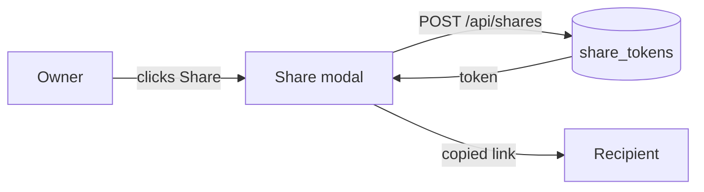
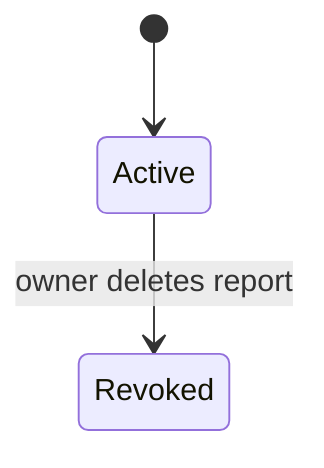
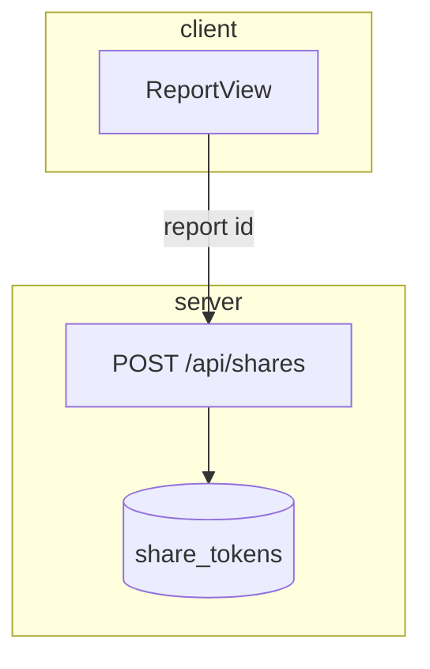
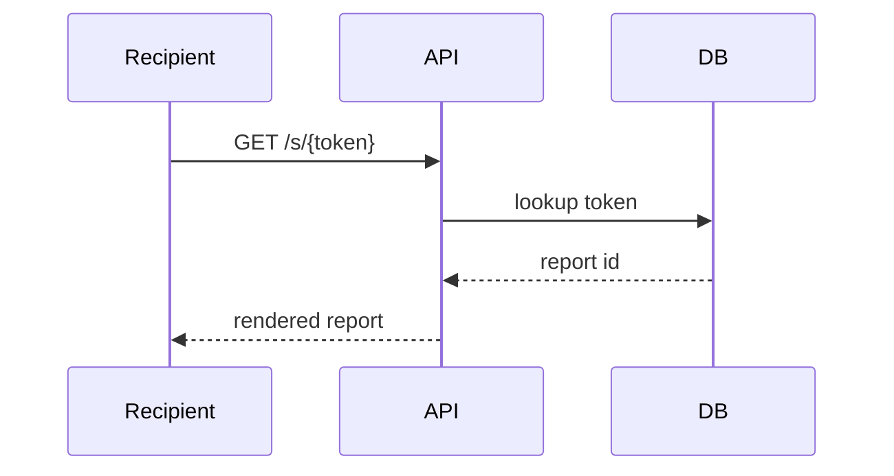
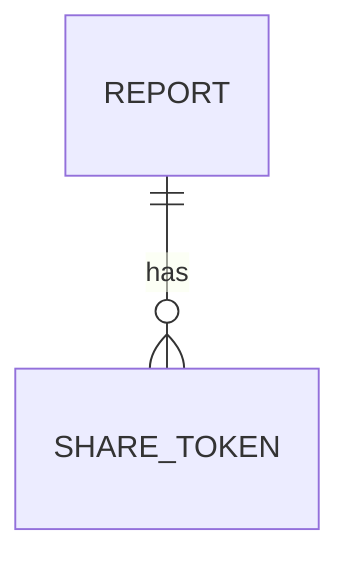

# {Slice name}

**Version:** v1 · **Status:** Draft · **Type:** {Feature | Bug | Enhancement | Technical | Skeleton} · **Project type:** {Web UI | API | CLI/Library | Data/LLM}

**Supersedes:** archive/{name}-v{N}.md _(delete on a first version)_
**Shape doc:** docs/specs/{idea}/shape.md _(delete if none)_
**Depends on:** {slice name, or None}
**Page:** {artifact URL, added at the end of pause 3}

{Two sentences: what ships and why now.}

## Problem

{What is wrong or missing. Who feels it, how often. Real numbers where known.}

## Slice test

| Check | Result |
| ----- | ------ |
| Cuts every layer it needs | {yes — screen, endpoint, table} |
| One e2e test walks it | {yes — the four scenarios below} |
| Worth shipping alone | {yes — a user can share a report} |
| Fits (≤5 scenarios, ≤2 areas) | {yes — 4 scenarios, reports + sharing} |

**Path:** {full | light} — {one line why}

## User story

_(delete for bugs, technical work, and non-user-facing slices)_

As a {user}, I want to {action} so that {benefit}.

## Flow



{One sentence reading the diagram out loud.}

## States

_(delete when the thing has no distinct states)_



## Acceptance criteria

```gherkin
Scenario: {happy path}
  Given {realistic starting state, with real values}
  When {action}
  Then {observable result}

Scenario: {error or edge case}
  Given ...
  When ...
  Then ...
```

## Scope

**In:** {…}

**Out:** {…} — {which later slice picks each one up}

## Interface

_(added at pause 2 — screens, endpoint shape, command surface, or contract)_

**Motion tier:** {0 | 1 | 2 | 3} _(UI only; tier 3 needs the budget below)_

**Components used:** {from the design system — names only, no new ones}

**Preview:** {path or URL}

## Technical plan

_(added at pause 3)_

### Approach

{Two or three sentences.}





### Changes

| File | What changes | Why |
| ---- | ------------ | --- |
| `path/file.ts:42` | {change} | {scenario it serves} |

Reusing: {existing helpers and patterns, by name}

### Data

_(delete when nothing schema-shaped changes)_



**Migration:** {expand → backfill → switch. Contract is slice {N}.}
**Reverse:** {the exact down path, tested}

### Earn-it

| Added | Triggered by |
| ----- | ------------ |
| {new thing} | {the scenario or risk that demands it} |

### Non-functionals

| | |
| --- | --- |
| **Load** | {expected volume today} |
| **Breaks first** | {what fails at 10×, and what you'd do} |
| **Security surface** | {who can call it · what input it trusts · what secrets · what data it stores} |
| **Proof it works** | {the exact log line or metric that says it's alive in prod} |
| **Rollout** | {flag name, default state, and the rollback path} |

### Test plan

| Scenario | Test | Command |
| -------- | ---- | ------- |
| {name} | {file} | {exact command} |

**E2E:** {the one test that walks the whole slice}

### Chunks

_(how /build splits it — files must be disjoint; write `Single chunk` when it doesn't split)_

| Chunk | Scenarios | Files owned |
| ----- | --------- | ----------- |
| A | 1, 2 | `db/`, `models/share_token.ts` |

Shared files (`types/`, barrel exports, lockfiles) are owned by chunk A only.

### Risks

| Risk | Mitigation |
| ---- | ---------- |
| {real one} | {what we do about it} |

## Open items

| ID | What | Type | Raised at | Owner | Status | Answer |
| -- | ---- | ---- | --------- | ----- | ------ | ------ |
| O1 | {…} | question | shape | user | Open | — |

_Never delete this section or its rows. See references/ledger.md._
